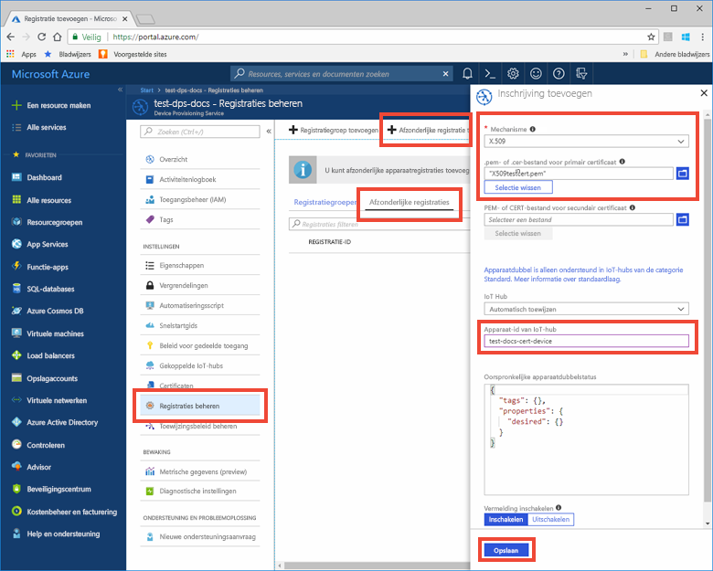

# <a name="create-and-provision-an-x509-simulated-device-using-c-device-sdk-for-iot-hub-device-provisioning-service"></a>Een gesimuleerd X.509-apparaat met de SDK met C maken en inrichten voor Azure IoT Hub Device Provisioning Service
[!INCLUDE [iot-dps-selector-quick-create-simulated-device-x509](../../includes/iot-dps-selector-quick-create-simulated-device-x509.md)]

In deze stappen wordt getoond hoe u een gesimuleerd X.509-apparaat maakt op een ontwikkelcomputer met Windows OS en het codevoorbeeld gebruikt om dit gesimuleerde apparaat te verbinden met de Device Provisioning Service en uw IoT-hub. 

Als u niet bekend bent met het proces van automatische inrichting, bekijk dan ook de [Concepten voor automatische inrichting](concepts-auto-provisioning.md). Controleer ook of u de stappen in [IoT Hub Device Provisioning Service instellen met Azure Portal](./quick-setup-auto-provision.md) hebt voltooid voordat u verdergaat. 

[!INCLUDE [IoT DPS basic](../../includes/iot-dps-basic.md)]

<a id="setupdevbox"></a>

## <a name="prepare-the-development-environment"></a>De ontwikkelomgeving voorbereiden 

1. Op uw computer moet Visual Studio 2015 of [Visual Studio 2017](https://www.visualstudio.com/vs/) zijn geïnstalleerd. De workload ['Desktop development with C++'](https://www.visualstudio.com/vs/support/selecting-workloads-visual-studio-2017/) (Bureaubladontwikkeling met C++) moet zijn ingeschakeld voor uw installatie van Visual Studio.

2. Download en installeer het [CMake-bouwsysteem](https://cmake.org/download/). Het is belangrijk dat Visual Studio met 'Desktop development with C++'-werkbelasting op uw computer **vóór** de `cmake`-installatie wordt geïnstalleerd. 

3. Zorg ervoor dat `git` op de computer wordt geïnstalleerd en toegevoegd aan de omgevingsvariabelen die voor het opdrachtvenster toegankelijk zijn. Zie [Software Freedom Conservancy's Git client tools](https://git-scm.com/download/) (Git-clienthulpprogramma's van Software Freedom Conservancy) om de nieuwste versie van `git`-hulpprogramma's te installeren, waaronder **Git Bash**, de opdrachtregel-app die u kunt gebruiken voor interactie met de lokale Git-opslagplaats. 

4. Open een opdrachtprompt of Git Bash. Kloon het codevoorbeeld voor de GitHub-opslagplaats voor apparaatsimulatie:
    
    ```cmd
    git clone https://github.com/Azure/azure-iot-sdk-c.git --recursive
    ```

5. Maak een map in de lokale kopie van deze GitHub-opslagplaats voor het CMake-bouwproces. 

    ```cmd
    cd azure-iot-sdk-c
    mkdir cmake
    cd cmake
    ```

6. De voorbeeldcode gebruikt een X.509-certificaat voor attestation via x.509-verificatie. Voer de volgende opdracht uit om een versie van de SDK te bouwen die specifiek is voor uw clientplatform voor ontwikkeling en een [attestation-mechanisme](concepts-security.md#attestation-mechanism) (X.509 certificaat). Er wordt ook een Visual Studio-oplossing voor het gesimuleerde apparaat gegenereerd. 

    ```cmd
    cmake -Duse_prov_client:BOOL=ON ..
    ```
    
    Als `cmake` uw C++-compiler niet kan vinden, kunnen er fouten in de build optreden tijdens het uitvoeren van de bovenstaande opdracht. Als dit gebeurt, voert u deze opdracht uit bij de [Visual Studio-opdrachtprompt](https://docs.microsoft.com/dotnet/framework/tools/developer-command-prompt-for-vs). 


<a id="portalenroll"></a>

## <a name="create-a-self-signed-x509-device-certificate-and-individual-enrollment-entry"></a>Een zelfondertekend X.509-certificaat voor apparaten en een vermelding voor afzonderlijke registratie maken

1. Open de in de map *cmake* gemaakt oplossing met de naam `azure_iot_sdks.sln` en bouw deze in Visual Studio.

2. Klik met de rechtermuisknop op het project **dice\_device\_enrollment** onder de map **Provision\_Tools** en selecteer **Set as Startup Project**. Voer de oplossing uit. Voer in het uitvoervenster **i** in voor individuele registratie wanneer hierom wordt gevraagd. In het uitvoervenster wordt een lokaal gegenereerd X.509-certificaat weergegeven voor uw gesimuleerde apparaat. Kopieer de uitvoer naar Klembord vanaf *-----BEGIN CERTIFICATE-----* tot en met de eerste *-----END CERTIFICATE-----*, en zorg ervoor dat deze beide regels ook zijn opgenomen. U hebt alleen het eerste certificaat uit het uitvoervenster nodig.
 
3. Maak een bestand met de naam **_X509testcert.pem_** op uw Windows-computer, open het in een editor naar keuze en kopieer de inhoud van het Klembord naar dit bestand. Sla het bestand op. 

4. Meld u aan bij Azure Portal, klik in het linkermenu op de knop **All resources** en open uw Provisioning-service.

5. Selecteer **Manage enrollments** in de overzichtsblade van Device Provisioning Service. Selecteer het tabblad **Individual Enrollments** en klik bovenaan op de knop **Add**. 

6. Voer in het deelvenster **Registratie toevoegen** de volgende gegevens in:
    - Selecteer **X.509** als *mechanisme* voor identiteitscontrole.
    - Klik onder het *PEM- of CER-bestand van het primaire certificaat* op *Een bestand selecteren* om het certificaatbestand **X509testcert.pem** te selecteren dat in de vorige stappen is gemaakt.
    - Desgewenst kunt u de volgende informatie verstrekken:
      - Selecteer een IoT-hub die is gekoppeld aan uw inrichtingsservice.
      - Voer een unieke apparaat-id in. Vermijd gevoelige gegevens bij het benoemen van uw apparaat. 
      - Werk de **initiële status van de apparaatdubbel** bij met de gewenste beginconfiguratie voor het apparaat.
    - Klik op de knop **Save** als u klaar bent. 

    [](./media/quick-create-simulated-device-x509/individual-enrollment.png#lightbox)

   Als het apparaat is ingeschreven, wordt uw X.509-apparaat weergegeven als **riot-device-cert** onder de kolom *Registratie-id* op het tabblad *Afzonderlijke registraties*. 


<a id="firstbootsequence"></a>

## <a name="simulate-first-boot-sequence-for-the-device"></a>Eerste opstartvolgorde voor het apparaat simuleren

1. Selecteer in Azure Portal de blade **Overzicht** voor uw Device Provisioning-service en noteer de waarde van het **_Id-bereik_**.

     

2. Navigeer op uw computer in Visual Studio naar hetzelfde project met de naam **prov\_dev\_client\_sample** onder de map **Provision\_Samples** en open het bestand **prov\_dev\_client\_sample.c**.

3. Wijs de waarde _ID Scope_ aan de `id_scope`-variabele toe. 

    ```c
    static const char* id_scope = "[ID Scope]";
    ```

4. Zorg ervoor dat in de **main()**-functie in hetzelfde bestand het **SECURE_DEVICE_TYPE** is ingesteld op X.509.

    ```c
    SECURE_DEVICE_TYPE hsm_type;
    hsm_type = SECURE_DEVICE_TYPE_X509;
    ```

   Markeer de mogelijk aanwezige instructie `hsm_type = SECURE_DEVICE_TYPE_TPM;` als commentaar of verwijder deze. 

5. Klik met de rechtermuisknop op het **prov\_dev\_client\_sample**-project en selecteer **Set as Startup Project**. Voet het voorbeeld uit. De gegevens van uw IoT-hub leest u in de berichten die het opstarten van het apparaat en het verbinding maken met Device Provisioning Service simuleren. Zoek naar een bericht dat een succesvolle registratie bij uw hub aangeeft: *Registration Information received from service: yourhuburl!*. Sluit het venster wanneer u daarom wordt gevraagd.

6. Navigeer in de portal naar de IoT-hub die is gekoppeld aan uw Provisioning-service en open de blade **IoT-apparaten**. Wanneer het inrichten van het gesimuleerde X.509-apparaat voor de hub is geslaagd, wordt de apparaat-id weergegeven op de blade **IoT-apparaten** met de *STATUS* **ingeschakeld**. Let op: u moet mogelijk klikken op de knop **Vernieuwen** bovenaan als u de blade vóór het uitvoeren van de voorbeeldapparaattoepassing al hebt geopend. 

     

    Als u de standaardwaarde van de *initiële status van de apparaatdubbel* hebt gewijzigd in de inschrijvingsvermelding voor uw apparaat, kan de gewenste status van de dubbel uit de hub worden gehaald en er dienovereenkomstig naar worden gehandeld. Zie [Apparaatdubbels begrijpen en gebruiken in IoT Hub](../iot-hub/iot-hub-devguide-device-twins.md) voor meer informatie.


> [!IMPORTANT]
> U kunt ook een *Groepsregistratie* van X.509-apparaten uitvoeren door de volgende wijzigingen aan te brengen in de stappen van deze quickstart:
>    1. Configureer uw Windows-computer voor gebruik van de **OpenSSL**-bibliotheek in plaats van de standaard **SChannel** aan de hand van de informatie in de sectie over **WebSockets** in de handleiding [Set up a Windows development environment](https://github.com/Azure/azure-iot-sdk-c/blob/master/doc/devbox_setup.md#windows). Houd er rekening mee dat Linux-computers standaard gebruikmaken van OpenSSL. 
>    2. In stap 2 van de sectie [Een vermelding voor apparaatinschrijving maken in Device Provisioning Service](#portalenroll) hierboven voert u **g** in voor groepsregistratie.
>    3. In stap 4 en 5 van [dezelfde sectie](#portalenroll) selecteert u **Registratiegroepen** en voert u de vereiste informatie voor de groepsvermelding in.  
>

## <a name="clean-up-resources"></a>Resources opschonen

Als u wilt blijven doorwerken met het voorbeeld van de apparaatclient en deze beter wilt leren kennen, wis de resources die in deze Snelstartgids zijn gemaakt dan niet. Als u niet wilt doorgaan, gebruikt u de volgende stappen om alle resources die via deze Snelstartgids zijn gemaakt, te verwijderen.

1. Sluit het uitvoervenster van het voorbeeld van de apparaatclient op de computer.
1. Klik in het linkermenu in de Azure Portal op **Alle resources** en selecteer uw Device Provisioning Service. Open de blade **Inschrijvingen beheren** voor uw service en klik vervolgens op het tabblad **Afzonderlijke inschrijvingen**. Selecteer de *registratie-id* van het apparaat dat u hebt ingeschreven met behulp van deze quickstart. Klik vervolgens bovenaan op de knop **Verwijderen**. 
1. Klik in het linkermenu in de Azure Portal op **Alle resources** en selecteer vervolgens uw IoT-hub. Open de blade **IoT-apparaten** voor uw hub, selecteer de *apparaat-id* van het apparaat dat u hebt geregistreerd in deze quickstart en klik vervolgens bovenaan op de knop **Verwijderen**.

## <a name="next-steps"></a>Volgende stappen

In deze quickstart hebt u een gesimuleerd X.509-apparaat op uw Windows-computer gemaakt en het ingericht voor uw IoT-hub met de Azure IoT Hub Device Provisioning Service in de portal. Als u wilt weten hoe u uw X.509-apparaat programmatisch kunt registreren, gaat u verder met de quickstart voor programmatische registratie van een X.509-apparaat. 

> [!div class="nextstepaction"]
> [Azure-quickstart: X.509-apparaat inschrijven bij Azure IoT Hub Device Provisioning Service](quick-enroll-device-x509-java.md)
