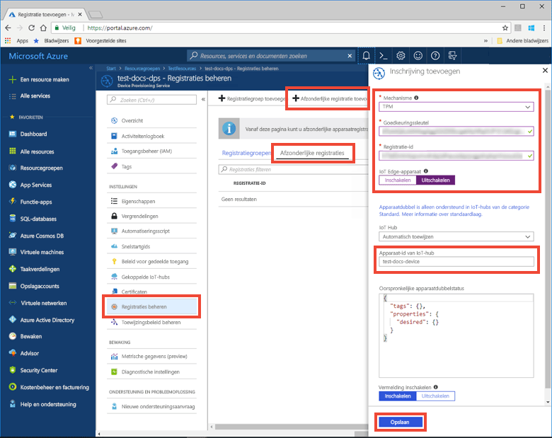
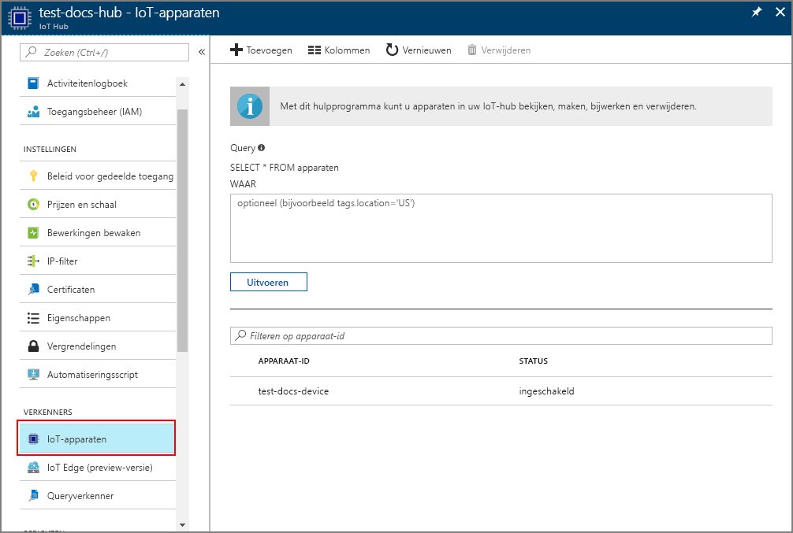

# <a name="create-and-provision-a-simulated-tpm-device-using-c-device-sdk-for-iot-hub-device-provisioning-service"></a>Een gesimuleerd TPM-apparaat met de SDK met C maken en inrichten voor Azure IoT Hub Device Provisioning Service
> [!div class="op_single_selector"]
> * [C](quick-create-simulated-device.md)
> * [Java](quick-create-simulated-device-tpm-java.md)
> * [C#](quick-create-simulated-device-tpm-csharp.md)
> * [Python](quick-create-simulated-device-tpm-python.md)

In deze stappen wordt getoond hoe u een gesimuleerd apparaat maakt op een ontwikkelcomputer met Windows OS, de Windows TPM-simulator uitvoert als de [HSM (Hardware Security Module)](https://azure.microsoft.com/blog/azure-iot-supports-new-security-hardware-to-strengthen-iot-security/) van het apparaat en het codevoorbeeld gebruikt om dit gesimuleerde apparaat te verbinden met Device Provisioning Service en uw IoT-hub. 

Voltooi de stappen in [IoT Hub Device Provisioning Service instellen](./quick-setup-auto-provision.md) voordat u verdergaat.

<a id="setupdevbox"></a>

## <a name="prepare-the-development-environment"></a>De ontwikkelomgeving voorbereiden 

1. Op uw computer moet Visual Studio 2015 of [Visual Studio 2017](https://www.visualstudio.com/vs/) zijn geïnstalleerd. De workload ['Desktop development with C++'](https://www.visualstudio.com/vs/support/selecting-workloads-visual-studio-2017/) (Bureaubladontwikkeling met C++) moet zijn ingeschakeld voor uw installatie van Visual Studio.

2. Download en installeer het [CMake-bouwsysteem](https://cmake.org/download/). Het is belangrijk dat Visual Studio met 'Desktop development with C++'-werkbelasting op uw computer **vóór** de `cmake`-installatie wordt geïnstalleerd.

3. Zorg ervoor dat `git` op de computer wordt geïnstalleerd en toegevoegd aan de omgevingsvariabelen die voor het opdrachtvenster toegankelijk zijn. Zie [Software Freedom Conservancy's Git client tools](https://git-scm.com/download/) (Git-clienthulpprogramma's van Software Freedom Conservancy) om de nieuwste versie van `git`-hulpprogramma's te installeren, waaronder **Git Bash**, de opdrachtregel-app die u kunt gebruiken voor interactie met de lokale Git-opslagplaats. 

4. Open een opdrachtprompt of Git Bash. Kloon het codevoorbeeld voor de GitHub-opslagplaats voor apparaatsimulatie:
    
    ```cmd/sh
    git clone https://github.com/Azure/azure-iot-sdk-c.git --recursive
    ```

5. Maak een map in de lokale kopie van deze GitHub-opslagplaats voor het CMake-bouwproces. 

    ```cmd/sh
    cd azure-iot-sdk-c
    mkdir cmake
    cd cmake
    ```

6. In het codevoorbeeld wordt een Windows TPM-simulator gebruikt. Voer de volgende opdracht uit om SAS-tokenverificatie in te schakelen. Er wordt ook een Visual Studio-oplossing voor het gesimuleerde apparaat gegenereerd.

    ```cmd/sh
    cmake -Duse_prov_client:BOOL=ON -Duse_tpm_simulator:BOOL=ON ..
    ```

    Als `cmake` uw C++-compiler niet kan vinden, kunnen er fouten in de build optreden tijdens het uitvoeren van de bovenstaande opdracht. Als dit gebeurt, voert u deze opdracht uit bij de [Visual Studio-opdrachtprompt](https://docs.microsoft.com/dotnet/framework/tools/developer-command-prompt-for-vs). 

7. Ga door middel van een aparte opdrachtprompt naar de hoofdmap van GitHub en voer de [TPM](https://docs.microsoft.com/windows/device-security/tpm/trusted-platform-module-overview)-simulator uit. Deze luistert via een socket op poorten 2321 en 2322. Sluit dit opdrachtvenster niet; de simulator moet actief blijven tot u deze Snelstartgids hebt voltooid. 

   Als u de map *cmake* hebt geopend, voert u van daaruit de volgende opdrachten uit:

    ```cmd/sh
    cd..
    .\provisioning_client\deps\utpm\tools\tpm_simulator\Simulator.exe
    ```

<a id="simulatetpm"></a>

## <a name="simulate-tpm-device"></a>TPM-apparaat simuleren

1. Open de in de map *cmake* gemaakt oplossing met de naam `azure_iot_sdks.sln` en bouw deze in Visual Studio.

2. In het deelvenster *Solution Explorer* van Visual Studio gaat u naar de map **Inrichten\_Extra**. Klik met de rechtermuisknop op het **tpm_device_provision**-project en selecteer **Set as Startup Project**. 

3. Voer de oplossing uit. In het uitvoervenster worden de voor apparaatregistratie vereiste **_registratie-id_** en **_goedkeuringssleutel_** weergegeven. Noteer deze waarden. 


<a id="portalenrollment"></a>

## <a name="create-a-device-enrollment-entry-in-the-portal"></a>Een vermelding voor apparaatregistratie maken in de portal

1. Meld u aan bij Azure Portal, klik in het linkermenu op de knop **All resources** en open uw Device Provisioning-service.

2. Selecteer **Manage enrollments** in de overzichtsblade van Device Provisioning Service. Selecteer het tabblad **Individual Enrollments** en klik bovenaan op de knop **Add**. 

3. Voer onder bij **Registratielijstitem toevoegen** de volgende gegevens in:
    - Selecteer **TPM** als *mechanisme* voor identiteitscontrole.
    - Voer de *registratie-id* en *goedkeuringssleutel* voor het TPM-apparaat in.
    - Desgewenst kunt u de volgende informatie verstrekken:
        - Selecteer een IoT-hub die is gekoppeld aan uw inrichtingsservice.
        - Voer een unieke apparaat-id in. Vermijd gevoelige gegevens bij het benoemen van uw apparaat.
        - Werk de **initiële status van de apparaatdubbel** bij met de gewenste beginconfiguratie voor het apparaat.
    - Klik op de knop **Save** als u klaar bent. 

      

   Als het apparaat is ingeschreven, wordt de *Registration ID* ervan weergegeven in de lijst onder het tabblad *Individual Enrollments*. 


<a id="firstbootsequence"></a>

## <a name="simulate-first-boot-sequence-for-the-device"></a>Eerste opstartvolgorde voor het apparaat simuleren

1. Selecteer in Azure Portal de blade **Overzicht** voor uw Device Provisioning-service en noteer de waarde van het **_Id-bereik_**.

     

2. In *Solution Explorer* van Visual Studio op uw computer gaat u naar de map **Inrichten\_Voorbeelden**. Selecteer het voorbeeldproject met de naam **prov\_dev\_client\_sample** en open het bestand **prov\_dev\_client\_sample.c**.

3. Wijs de waarde _ID Scope_ aan de `id_scope`-variabele toe. 

    ```c
    static const char* id_scope = "[ID Scope]";
    ```

4. Zorg ervoor dat in de **main()**-functie in hetzelfde bestand het **SECURE_DEVICE_TYPE** is ingesteld op TPM.

    ```c
    SECURE_DEVICE_TYPE hsm_type;
    hsm_type = SECURE_DEVICE_TYPE_TPM;
    ```

   Markeer de instructie `hsm_type = SECURE_DEVICE_TYPE_X509;`, die standaard aanwezig is, als commentaar of verwijder deze. 

5. Klik met de rechtermuisknop op het **prov\_dev\_client\_sample**-project en selecteer **Set as Startup Project**. Voer de oplossing uit. 

6. De gegevens van uw IoT-hub leest u in de berichten die het opstarten van het apparaat en het verbinding maken met Device Provisioning Service simuleren. Als het gesimuleerde apparaat is ingericht met de IoT-hub die is gekoppeld met de provisioning-service, wordt de apparaat-id weergegeven op de blade **IoT-apparaten** van de hub. 

     

    Als u de standaardwaarde van de *initiële status van de apparaatdubbel* hebt gewijzigd in de inschrijvingsvermelding voor uw apparaat, kan de gewenste status van de dubbel uit de hub worden gehaald en er dienovereenkomstig naar worden gehandeld. Zie [Understand and use device twins in IoT Hub](../iot-hub/iot-hub-devguide-device-twins.md) (Apparaatdubbelen begrijpen en gebruiken in IoT Hub) voor meer informatie


## <a name="clean-up-resources"></a>Resources opschonen

Als u wilt blijven doorwerken met het voorbeeld van de apparaatclient en deze beter wilt leren kennen, wis de resources die in deze Snelstartgids zijn gemaakt dan niet. Als u niet wilt doorgaan, gebruikt u de volgende stappen om alle resources die via deze Snelstartgids zijn gemaakt, te verwijderen.

1. Sluit het uitvoervenster van het voorbeeld van de apparaatclient op de computer.
1. Sluit het TPM-simulatorvenster op de computer.
1. Klik in het linkermenu in de Azure Portal op **Alle resources** en selecteer uw Device Provisioning Service. Open de blade **Registraties beheren** voor uw service en klik op het tabblad **Afzonderlijke registraties**. Selecteer de *registratie-id* van het apparaat dat u hebt geregistreerd met behulp van deze quickstart. Klik vervolgens op de knop **Verwijderen** bovenaan. 
1. Klik in het linkermenu in de Azure Portal op **Alle resources** en selecteer vervolgens uw IoT-hub. Open de blade **IoT-apparaten** voor uw hub, selecteer de *apparaat-id* van het apparaat dat u hebt geregistreerd in deze quickstart en klik vervolgens op de knop **Verwijderen** bovenaan.

## <a name="next-steps"></a>Volgende stappen

In deze quickstart hebt u een gesimuleerd TPM-apparaat op de computer gemaakt en dit ingericht voor uw IoT-hub met IoT Hub Device Provisioning Service. Als u wilt weten hoe u uw TPM-apparaat programmatisch kunt registreren, gaat u verder met de quickstart voor programmatische registratie van een TPM-apparaat. 

> [!div class="nextstepaction"]
> [Azure-quickstart: TPM-apparaat registreren bij Azure IoT Hub Device Provisioning Service](quick-enroll-device-tpm-java.md)

