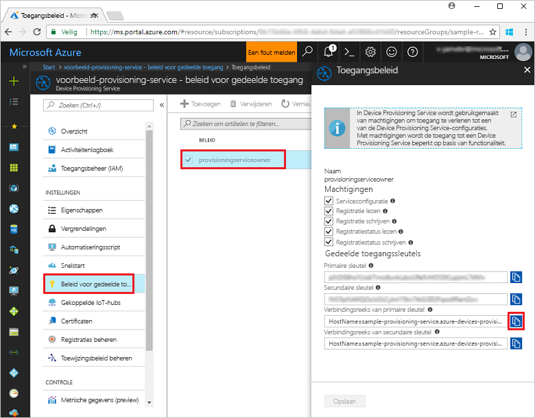
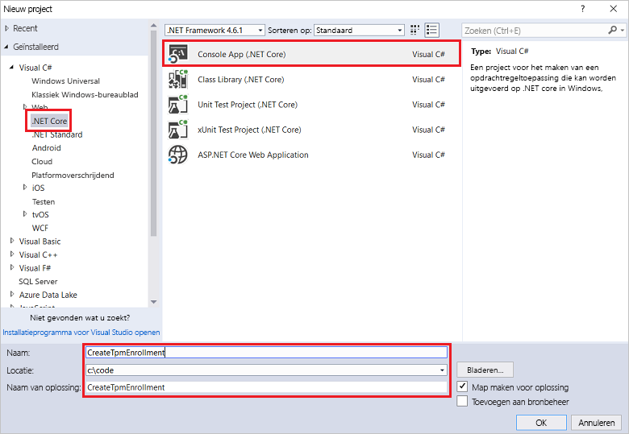
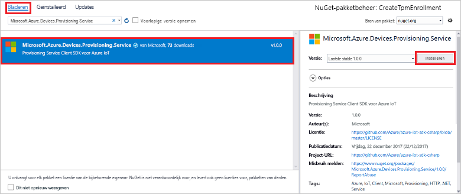
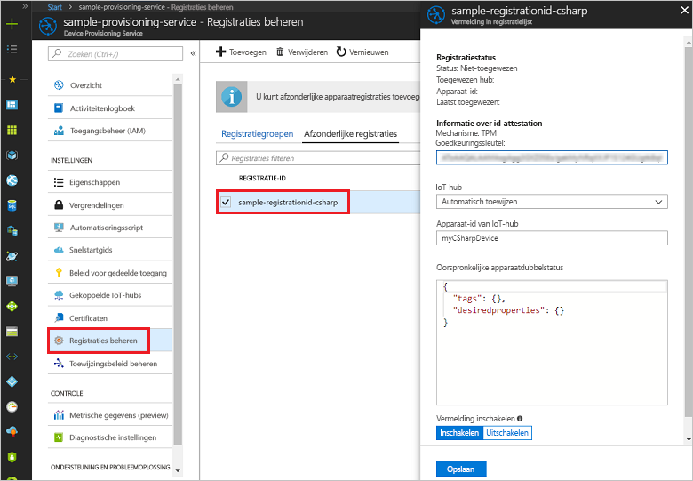

# <a name="enroll-tpm-device-to-iot-hub-device-provisioning-service-using-c-service-sdk"></a>TPM-apparaat inschrijven bij IoT Hub Device Provisioning Service met behulp van de C# service-SDK

[!INCLUDE [iot-dps-selector-quick-enroll-device-tpm](../../includes/iot-dps-selector-quick-enroll-device-tpm.md)]


In deze stappen ziet u hoe u programmatisch een afzonderlijke inschrijving voor een TPM-apparaat in Azure IoT Hub Device Provisioning Service kunt maken met behulp van de [C# service-SDK](https://github.com/Azure/azure-iot-sdk-csharp) en een C#-voorbeeldtoepassing. U kunt desgewenst ook een gesimuleerd TPM-apparaat bij de inrichtingsservice inschrijven met behulp van deze vermelding voor een afzonderlijke inschrijving. Hoewel deze stappen zowel op Windows- als op Linux-computers werken, gebruiken we in dit artikel een Windows-ontwikkelcomputer.

## <a name="prepare-the-development-environment"></a>De ontwikkelomgeving voorbereiden

1. Op uw computer moet [Visual Studio 2017](https://www.visualstudio.com/vs/) zijn geïnstalleerd. 
2. Zorg ervoor dat de [core-SDK voor .NET](https://www.microsoft.com/net/download/windows) op uw computer geïnstalleerd. 
3. Voltooi de stappen in [Set up the IoT Hub Device Provisioning Service with the Azure portal](./quick-setup-auto-provision.md) (IoT Hub Device Provisioning Service instellen met Azure Portal) voordat u verdergaat.
4. (Optioneel) Als u aan het eind van deze quickstart een gesimuleerd apparaat wilt inschrijven, volgt u de stappen in [Een gesimuleerd TPM-apparaat maken en inrichten met behulp van C# apparaat-SDK](quick-create-simulated-device-tpm-csharp.md) tot de stap waarin u een goedkeuringssleutel ontvangt voor het apparaat. Noteer de goedkeuringssleutel, registratie-ID en, desgewenst, de apparaat-ID. U hebt deze later in deze quickstart weer nodig. **Volg niet de stappen voor het maken van een afzonderlijke inschrijving via Azure Portal.**

## <a name="get-the-connection-string-for-your-provisioning-service"></a>De verbindingsreeks voor de inrichtingsservice ophalen

Voor het voorbeeld in deze quickstart hebt u de verbindingsreeks voor de inrichtingsservice nodig.
1. Meld u aan bij Azure Portal, klik in het linkermenu op de knop **Alle bronnen** en open uw Device Provisioning Service. 
2. Klik op **Gedeeld toegangsbeleid**. Klik vervolgens op het toegangsbeleid dat u wilt gebruiken om de eigenschappen te openen. Kopieer of noteer de verbindingsreeks van de primaire sleutel uit het venster **Toegangsbeleid**. 

    

## <a name="create-the-individual-enrollment-sample"></a>Het voorbeeld van de afzonderlijke inschrijving maken 

De stappen in deze sectie laten zien hoe u een .NET Core-console-app maakt waarmee een afzonderlijke registratiegroep voor een TPM-apparaat aan uw inrichtingsservice wordt toegevoegd. Met enkele aanpassingen kunt u deze stappen ook volgen om een [Windows IoT Core](https://developer.microsoft.com/en-us/windows/iot) console-app te maken om aan de afzonderlijke registratie toe te voegen. Zie de [Windows IoT Core-documentatie voor ontwikkelaars](https://docs.microsoft.com/windows/iot-core/) voor meer informatie over ontwikkelen met IoT-Core.
1. Voeg in Visual Studio een Visual C# NET Core Console App-project toe aan de nieuwe oplossing met behulp van de projectsjabloon **Console App (.NET Core)**. Zorg ervoor dat de versie van .NET Framework minimaal 4.5.1 is. Noem het project **CreateTpmEnrollment**.

    

2. Klik in Solution Explorer met de rechtermuisknop op het project **CreateTpmEnrollment** en klik op **NuGet-pakketten beheren**.
3. Klik in het venster **NuGet-pakketbeheer** op **Bladeren** en zoek naar **Microsoft.Azure.Devices.Provisioning.Service**. Accepteer de gebruiksvoorwaarden en klik op **Installeren** om het **Microsoft.Azure.Devices.Provisioning.Service**-pakket te installeren. Met deze procedure worden het [Azure IoT Provisioning Service Client-SDK](https://www.nuget.org/packages/Microsoft.Azure.Devices.Provisioning.Service/) NuGet-pakket en de bijbehorende afhankelijkheden gedownload en geïnstalleerd. Ook worden verwijzingen hiernaar toegevoegd.

    

4. Voeg aan het begin van het bestand **Program.cs** de volgende `using`-instructies na de andere `using`-instructies toe:
   
   ```csharp
   using System.Threading.Tasks;
   using Microsoft.Azure.Devices.Provisioning.Service;
   ```
    
5. Voeg de volgende velden toe aan de klasse **Program**:  
   - Vervang de tijdelijke aanduiding **ProvisioningConnectionString** door de verbindingsreeks van de inrichtingsservice waarvoor u de registratie wilt maken.
   - U kunt desgewenst de registratie-ID, goedkeuringssleutel, apparaat-ID en inrichtingsstatus wijzigen. 
   - Als u deze quickstart samen met de quickstart [Een gesimuleerd TPM-apparaat met de SDK met de C# Device SDK maken en inrichten](quick-create-simulated-device-tpm-csharp.md) gebruikt om een gesimuleerd apparaat in te richten, vervangt u de goedkeuringssleutel en registratie-ID door de waarden die u hebt in deze quickstart hebt genoteerd. U kunt de apparaat-ID vervangen door de waarde die wordt voorgesteld in die quickstart, uw eigen waarde gebruiken of de standaardwaarde in dit voorbeeld gebruiken.
        
   ```csharp
   private static string ProvisioningConnectionString = "{Your provisioning service connection string}";
   private const string RegistrationId = "sample-registrationid-csharp";
   private const string TpmEndorsementKey =
       "AToAAQALAAMAsgAgg3GXZ0SEs/gakMyNRqXXJP1S124GUgtk8qHaGzMUaaoABgCAAEMAEAgAAAAAAAEAxsj2gUS" +
       "cTk1UjuioeTlfGYZrrimExB+bScH75adUMRIi2UOMxG1kw4y+9RW/IVoMl4e620VxZad0ARX2gUqVjYO7KPVt3d" +
       "yKhZS3dkcvfBisBhP1XH9B33VqHG9SHnbnQXdBUaCgKAfxome8UmBKfe+naTsE5fkvjb/do3/dD6l4sGBwFCnKR" +
       "dln4XpM03zLpoHFao8zOwt8l/uP3qUIxmCYv9A7m69Ms+5/pCkTu/rK4mRDsfhZ0QLfbzVI6zQFOKF/rwsfBtFe" +
       "WlWtcuJMKlXdD8TXWElTzgh7JS4qhFzreL0c1mI0GCj+Aws0usZh7dLIVPnlgZcBhgy1SSDQMQ==";
       
   // Optional parameters
   private const string OptionalDeviceId = "myCSharpDevice";
   private const ProvisioningStatus OptionalProvisioningStatus = ProvisioningStatus.Enabled;
   ```
    
6. Voeg de volgende methode toe aan de klasse **Program**.  Met deze code wordt een afzonderlijke registatiegroepvermelding gemaakt en vervolgens de methode **CreateOrUpdateIndividualEnrollmentAsync** in de  **ProvisioningServiceClient** aangeroepen om de afzonderlijke registratie toe te voegen aan de inrichtingsservice.
   
   ```csharp
   public static async Task RunSample()
   {
       Console.WriteLine("Starting sample...");

       using (ProvisioningServiceClient provisioningServiceClient =
               ProvisioningServiceClient.CreateFromConnectionString(ProvisioningConnectionString))
       {
           #region Create a new individualEnrollment config
           Console.WriteLine("\nCreating a new individualEnrollment...");
           Attestation attestation = new TpmAttestation(TpmEndorsementKey);
           IndividualEnrollment individualEnrollment =
                   new IndividualEnrollment(
                           RegistrationId,
                           attestation);

           // The following parameters are optional. Remove them if you don't need them.
           individualEnrollment.DeviceId = OptionalDeviceId;
           individualEnrollment.ProvisioningStatus = OptionalProvisioningStatus;
           #endregion

           #region Create the individualEnrollment
           Console.WriteLine("\nAdding new individualEnrollment...");
           IndividualEnrollment individualEnrollmentResult =
               await provisioningServiceClient.CreateOrUpdateIndividualEnrollmentAsync(individualEnrollment).ConfigureAwait(false);
           Console.WriteLine("\nIndividualEnrollment created with success.");
           Console.WriteLine(individualEnrollmentResult);
           #endregion
        
       }
   }
   ```
       
7. Vervang tot slot de hoofdtekst van de methode **Main** door de volgende regels:
   
   ```csharp
   RunSample().GetAwaiter().GetResult();
   Console.WriteLine("\nHit <Enter> to exit ...");
   Console.ReadLine();
   ```
        
8. Bouw de oplossing.

## <a name="run-the-individual-enrollment-sample"></a>Het voorbeeld van de afzonderlijke inschrijving uitvoeren
  
1. Voer het voorbeeld uit in Visual Studio om de afzonderlijke registratie voor uw TPM-apparaat te maken.
 
2. Als de inschrijving is gemaakt, worden in het opdrachtvenster de eigenschappen weergegeven van de nieuwe afzonderlijke inschrijving.

    

3. Om te controleren of de afzonderlijke registratie is gemaakt, selecteert u op de overzichtsblade Device Provisioning Service in Azure Portal **Registraties beheren** en selecteert u vervolgens het tabblad **Afzonderlijke registraties**. U ziet nu een nieuwe registratievermelding die overeenkomt met de registratie-ID die u in het voorbeeld hebt gebruikt. Klik op de vermelding om de goedkeuringssleutel en andere eigenschappen van de vermelding te controleren.

    
 
4. (Optioneel) Als u de stappen hebt gevolgd in de quickstart[ Een gesimuleerd TPM-apparaat met de SDK met de C# Device SDK maken en inrichten](quick-create-simulated-device-tpm-csharp.md), kunt u doorgaan met de overige stappen in deze quickstart om uw gesimuleerde apparaat te registreren. Volg niet de stappen voor het maken van een afzonderlijke inschrijving via Azure Portal.

## <a name="clean-up-resources"></a>Resources opschonen
Als u van plan bent om het voorbeeld van de C#-service te verkennen, verwijdert u de resources die u in deze quickstart hebt gemaakt, niet. Als u niet wilt doorgaan, gebruikt u de volgende stappen om alle resources die via deze Snelstartgids zijn gemaakt, te verwijderen.

1. Sluit het uitvoervenster van het C#-voorbeeld op de computer.
2. Navigeer naar Device Provisioning Service in Azure Portal, klik op **Inschrijvingen beheren** en selecteer vervolgens het tabblad **Afzonderlijke inschrijvingen**. Selecteer de *Registratie-id* voor de inschrijvingsvermelding die u hebt gemaakt met behulp van deze quickstart. Klik vervolgens op de knop **Verwijderen** boven aan de blade. 
3. Als u de stappen in de quickstart [Een gesimuleerd TPM-apparaat met de SDK met de C# Device SDK maken en inrichten](quick-create-simulated-device-tpm-csharp.md) hebt gevolgd om een gesimuleerd TPM-apparaat te maken: 

    1. Sluit het venster van de TPM-simulator en het voorbeelduitvoervenster voor het gesimuleerde apparaat.
    2. Navigeer in Azure Portal naar de IoT Hub waar het apparaat is ingericht. Klik in het linkermenu onder **Verkenners** op **IoT-apparaten**, selecteer het selectievakje naast uw apparaat en klik vervolgens op **Verwijderen** boven aan het venster.
 
## <a name="next-steps"></a>Volgende stappen
In deze quickstart hebt u programmatisch een afzonderlijke inschrijvingsvermelding gemaakt voor een TPM-apparaat. Ook hebt u desgewenst een gesimuleerd TPM-apparaat op de computer gemaakt en dit apparaat ingericht voor uw IoT-hub met Azure IoT Hub Device Provisioning Service. Voor meer informatie over device provisioning, gaat u verder met de zelfstudie voor het instellen van Device Provisioning Service in Azure Portal. 
 
> [!div class="nextstepaction"]
> [Zelfstudies over Azure IoT Hub Device Provisioning Service](./tutorial-set-up-cloud.md)

