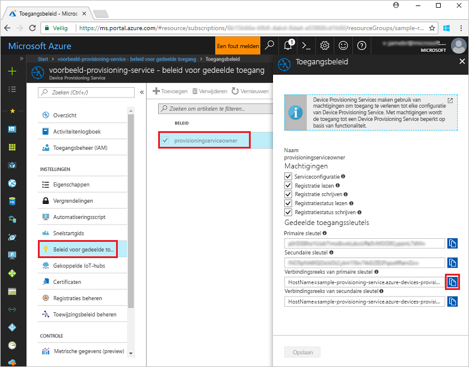
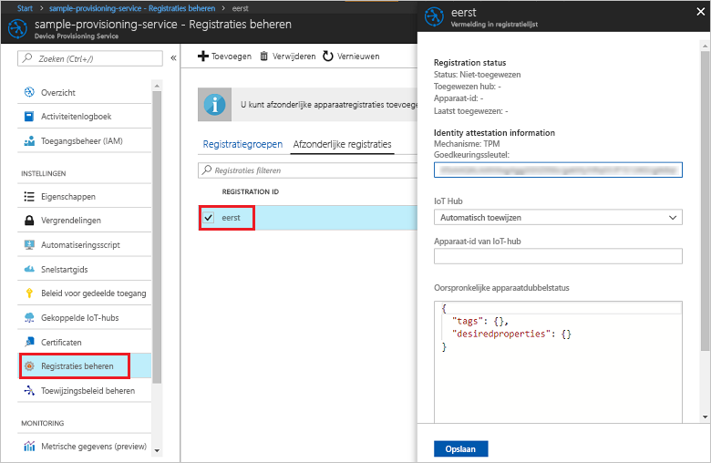

# <a name="enroll-tpm-device-to-iot-hub-device-provisioning-service-using-nodejs-service-sdk"></a>TPM-apparaat inschrijven bij IoT Hub Device Provisioning Service met behulp van de Node.js service-SDK
> [!div class="op_single_selector"]
> * [Java](quick-enroll-device-tpm-java.md)
> * [Node.js](quick-enroll-device-tpm-node.md)

In deze stappen ziet u hoe u programmatisch een afzonderlijke inschrijving voor een TPM-apparaat in Azure IoT Hub Device Provisioning Service kunt maken met behulp van de [Node.js service-SDK](https://github.com/Azure/azure-iot-sdk-node) en een Node.js-voorbeeldtoepassing. U kunt desgewenst ook een gesimuleerd TPM-apparaat bij de inrichtingsservice inschrijven met behulp van deze vermelding voor een afzonderlijke inschrijving. Hoewel deze stappen werken op Windows- en Linux-computers, gebruiken we in dit artikel een Windows-ontwikkelcomputer.

## <a name="prerequisites"></a>Vereisten

- Voltooi de stappen in [Set up the IoT Hub Device Provisioning Service with the Azure portal](./quick-setup-auto-provision.md) (IoT Hub Device Provisioning Service instellen met Azure Portal) voordat u verdergaat. 
-  Zorg ervoor dat [Node.js v4.0 of hoger](https://nodejs.org) is geïnstalleerd op de computer.
- Als u aan het eind van deze quickstart een gesimuleerd apparaat wilt inschrijven, volgt u de stappen in [Create and provision a simulated device](quick-create-simulated-device.md) (Een gesimuleerd apparaat maken en inrichten) tot de stap waarin u een goedkeuringssleutel ontvangt voor het apparaat. Noteer de goedkeuringssleutel. U gebruikt deze verderop in deze quickstart. **Volg niet de stappen voor het maken van een afzonderlijke inschrijving via Azure Portal.**
 
## <a name="create-the-individual-enrollment-sample"></a>Het voorbeeld van de afzonderlijke inschrijving maken 

 
1. Voer vanuit een opdrachtvenster in de werkmap het volgende uit:
  
    ```cmd\sh
    npm install azure-iot-provisioning-service
    ```  

2. Maak met behulp van een teksteditor een bestand **create_individual_enrollment.js** in de werkmap. Voeg de volgende code toe aan het bestand en sla het op:

    ```
    'use strict';

    var provisioningServiceClient = require('azure-iot-provisioning-service').ProvisioningServiceClient;

    var serviceClient = provisioningServiceClient.fromConnectionString(process.argv[2]);
    var endorsementKey = process.argv[3];

    var enrollment = {
      registrationId: 'first',
      attestation: {
        type: 'tpm',
        tpm: {
          endorsementKey: endorsementKey
        }
      }
    };

    serviceClient.createOrUpdateIndividualEnrollment(enrollment, function(err, enrollmentResponse) {
      if (err) {
        console.log('error creating the individual enrollment: ' + err);
      } else {
        console.log("enrollment record returned: " + JSON.stringify(enrollmentResponse, null, 2));
      }
    });
    ````

## <a name="run-the-individual-enrollment-sample"></a>Het voorbeeld van de afzonderlijke inschrijving uitvoeren
  
1. Als u het voorbeeld wilt uitvoeren, hebt u de verbindingsreeks voor de inrichtingsservice nodig. 
    1. Meld u aan bij Azure Portal, klik in het linkermenu op de knop **All resources** en open uw Device Provisioning-service. 
    2. Klik op **Gedeeld toegangsbeleid**. Klik vervolgens op het toegangsbeleid dat u wilt gebruiken om de eigenschappen te openen. Kopieer of noteer de verbindingsreeks van de primaire sleutel uit het venster **Toegangsbeleid**. 

     


2. U hebt de goedkeuringssleutel ook nodig voor uw apparaat. Als u de stappen in de quickstart [Create and provision a simulated device](quick-create-simulated-device.md) (Een gesimuleerd apparaat maken en inrichten) voor het maken van een gesimuleerd TPM-apparaat hebt gevolgd, gebruikt u de sleutel voor dit apparaat. U kunt anders de volgende goedkeuringssleutel gebruiken die is opgegeven met de SDK, om een voorbeeld te maken van een afzonderlijke inschrijving:

    ```
    AToAAQALAAMAsgAgg3GXZ0SEs/gakMyNRqXXJP1S124GUgtk8qHaGzMUaaoABgCAAEMAEAgAAAAAAAEAxsj2gUScTk1UjuioeTlfGYZrrimExB+bScH75adUMRIi2UOMxG1kw4y+9RW/IVoMl4e620VxZad0ARX2gUqVjYO7KPVt3dyKhZS3dkcvfBisBhP1XH9B33VqHG9SHnbnQXdBUaCgKAfxome8UmBKfe+naTsE5fkvjb/do3/dD6l4sGBwFCnKRdln4XpM03zLpoHFao8zOwt8l/uP3qUIxmCYv9A7m69Ms+5/pCkTu/rK4mRDsfhZ0QLfbzVI6zQFOKF/rwsfBtFeWlWtcuJMKlXdD8TXWElTzgh7JS4qhFzreL0c1mI0GCj+Aws0usZh7dLIVPnlgZcBhgy1SSDQMQ==
    ```

3. Voer de volgende opdracht uit om een afzonderlijke inschrijving te maken voor uw TPM-apparaat (inclusief de aanhalingstekens rond het opdrachtargumenten):
 
     ```cmd\sh
     node create_individual_enrollment.js "<the connection string for your provisioning service>" "<endorsement key>"
     ```
 
3. Als de inschrijving is gemaakt, worden in het opdrachtvenster de eigenschappen weergegeven van de nieuwe afzonderlijke inschrijving.

     

4. Controleer of er een afzonderlijke inschrijving is gemaakt. Selecteer in Azure Portal **Inschrijvingen beheren** in de overzichtsblade van Device Provisioning Service. Selecteer het tabblad **Afzonderlijke inschrijvingen** en klik op de vermelding voor de nieuwe inschrijving (*eerste*) om de goedkeuringssleutel en andere eigenschappen voor de vermelding te controleren.

     
 
Nu u een afzonderlijke inschrijving hebt gemaakt voor een TPM-apparaat, kunt u doorgaan met de resterende stappen in [Create and provision a simulated device](quick-create-simulated-device.md) (Een gesimuleerd apparaat maken en inrichten) als u een gesimuleerd apparaat wilt inschrijven. Sla de stappen voor het maken van een afzonderlijke inschrijving via Azure Portal in de desbetreffende quickstart over.

## <a name="clean-up-resources"></a>Resources opschonen
Als u van plan bent om de voorbeelden van de Node.js-service te verkennen, verwijdert u de resources die u in deze quickstart hebt gemaakt, niet. Als u niet wilt doorgaan, gebruikt u de volgende stappen om alle resources die via deze quickstart zijn gemaakt, te verwijderen.

1. Sluit het uitvoervenster van het Node.js-voorbeeld op de computer.
1. Als u een gesimuleerd TPM-apparaat hebt gemaakt, sluit u het venster van de TPM-simulator.
2. Navigeer naar Device Provisioning Service in Azure Portal, klik op **Inschrijvingen beheren** en selecteer vervolgens het tabblad **Afzonderlijke inschrijvingen**. Selecteer de *Registratie-id* voor de inschrijvingsvermelding die u hebt gemaakt met behulp van deze quickstart. Klik vervolgens op de knop **Verwijderen** boven aan de blade. 
 
## <a name="next-steps"></a>Volgende stappen
In deze quickstart hebt u programmatisch een afzonderlijke inschrijvingsvermelding gemaakt voor een TPM-apparaat. Ook hebt u desgewenst een gesimuleerd TPM-apparaat op de computer gemaakt en dit apparaat ingericht voor uw IoT-hub met Azure IoT Hub Device Provisioning Service. Voor meer informatie over device provisioning, gaat u verder met de zelfstudie voor het instellen van Device Provisioning Service in Azure Portal. 
 
> [!div class="nextstepaction"]
> [Zelfstudies over Azure IoT Hub Device Provisioning Service](./tutorial-set-up-cloud.md)