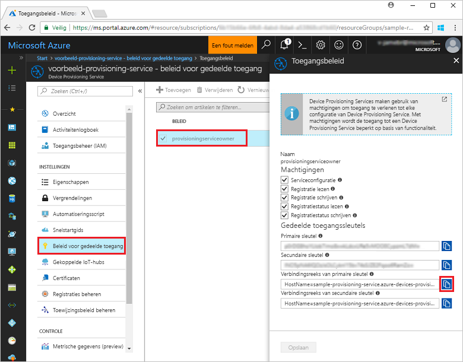
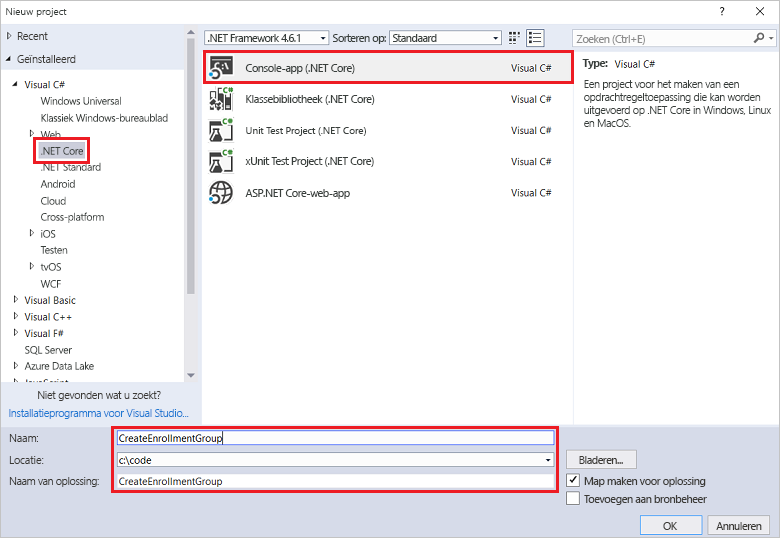
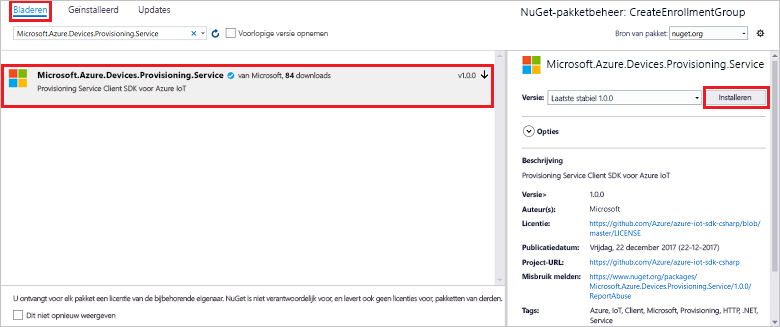
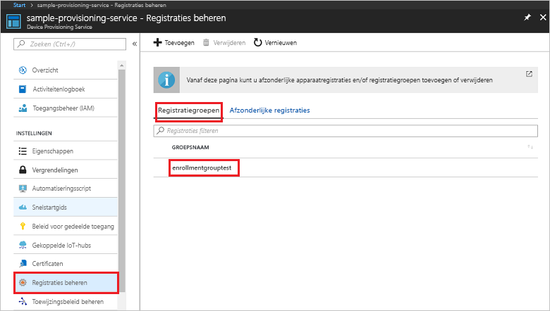

# <a name="quickstart-enroll-x509-devices-to-the-device-provisioning-service-using-c"></a>Snelstart: X.509-apparaten registreren bij Device Provisioning Service met behulp van C#

[!INCLUDE [iot-dps-selector-quick-enroll-device-x509](../../includes/iot-dps-selector-quick-enroll-device-x509.md)]


In deze snelstart wordt uitgelegd hoe u met C# programmatisch een [registratiegroep](concepts-service.md#enrollment-group) kunt maken die gebruikmaakt van tussenliggende of hoofd-CA X.509-certificaten. De registratiegroep is gemaakt met behulp van de [Microsoft Azure IoT-SDK voor .NET](https://github.com/Azure/azure-iot-sdk-csharp) en een C# .NET Core-voorbeeldtoepassing. Een registratiegroep beheert de toegang tot de inrichtingsservice voor apparaten die een gemeenschappelijk handtekeningcertificaat in hun certificaatketen delen. Zie [Apparaattoegang tot de inrichtingsservice beheren met X.509-certificaten](./concepts-security.md#controlling-device-access-to-the-provisioning-service-with-x509-certificates) voor meer informatie. Zie [Overzicht van beveiliging op basis van X.509-CA-certificaten](https://docs.microsoft.com/azure/iot-hub/iot-hub-x509ca-overview) voor meer informatie over het gebruik vanop X.509-certificaten gebaseerde Public Key Infrastructure (PKI) met Azure IoT Hub en Device Provisioning Service. 

Voor deze snelstart wordt aangenomen dat u al een IoT-hub en Device Provisioning Service-exemplaar hebt gemaakt. Als u deze resources niet al hebt gemaakt, voert u de snelstart [IoT Hub Device Provisioning Service instellen met Azure Portal](./quick-setup-auto-provision.md) uit voordat u verdergaat met dit artikel.

Hoewel de stappen in dit artikel zowel op Windows- als op Linux-computers werken, is dit artikel ontwikkeld voor een Windows-ontwikkelcomputer.

[!INCLUDE [quickstarts-free-trial-note](../../includes/quickstarts-free-trial-note.md)]


## <a name="prerequisites"></a>Vereisten

* Installeer [Visual Studio 2017](https://www.visualstudio.com/vs/).
* Installeer [.NET Core SDK](https://www.microsoft.com/net/download/windows).
* Installeer [Git](https://git-scm.com/download/).


## <a name="prepare-test-certificates"></a>Testcertificaten voorbereiden

Voor deze snelstart hebt u een .pem- of een .cer-bestand met het openbare gedeelte van een tussenliggend of hoofd-CA x.509-certificaat nodig. Dit certificaat moet worden geüpload naar uw inrichtingsservice en door de service worden geverifieerd. 

De [Azure IoT C-SDK](https://github.com/Azure/azure-iot-sdk-c) bevat testhulpmiddelen waarmee u een X.509-certificaatketen kunt maken, een basis- of tussencertificaat kunt uploaden vanuit die keten en een bewijs van eigendom kunt uitvoeren met de service om het certificaat te verifiëren. Certificaten die zijn gemaakt met de SDK-hulpmiddelen, zijn alleen ontworpen voor **ontwikkeltesten**. Deze certificaten **mogen niet in productie worden gebruikt**. Ze bevatten in code vastgelegde wachtwoorden ('1234') die na 30 dagen verlopen. Zie [Een x.509-CA-certificaat ophalen](https://docs.microsoft.com/azure/iot-hub/iot-hub-x509ca-overview#how-to-get-an-x509-ca-certificate) in de documentatie van Azure IoT Hub voor meer informatie over het verkrijgen van certificaten die geschikt zijn voor productiegebruik.

Voer de volgende stappen uit om deze testhulpmiddelen te gebruiken om certificaten te genereren: 
 
1. Open een opdrachtprompt of Git Bash-shell en wijzig deze in een werkmap op uw computer. Voer de volgende opdracht uit voor het klonen van de [Azure IoT C SDK](https://github.com/Azure/azure-iot-sdk-c) GitHub-opslagplaats:
    
   ```cmd/sh
   git clone https://github.com/Azure/azure-iot-sdk-c.git --recursive
   ```

   De grootte van deze opslagplaats is momenteel ongeveer 220 MB. Deze bewerking kan enkele minuten in beslag nemen.

   De testhulpmiddelen bevinden zich in de *azure-iot-sdk-c/tools/CACertificates* van de opslagplaats die u hebt gekloond.    

2. Volg de stappen in [Managing test CA certificates for samples and tutorials](https://github.com/Azure/azure-iot-sdk-c/blob/master/tools/CACertificates/CACertificateOverview.md) (CA-testcertificaten voor voorbeelden en zelfstudies beheren). 

Naast de hulpmiddelen in de C-SDK geeft het [voorbeeld van verificatie door een groepscertificaat](https://github.com/Azure-Samples/azure-iot-samples-csharp/tree/master/provisioning/Samples/service/GroupCertificateVerificationSample) in de *Microsoft Azure IoT SDK voor .NET* weer hoe u een bewijs van eigendom kunt uitvoeren in C# met een bestaand X.509-tussencertificaat of -basis-CA-certificaat. 


## <a name="get-the-connection-string-for-your-provisioning-service"></a>De verbindingsreeks voor de inrichtingsservice ophalen

Voor het voorbeeld in deze snelstart hebt u de verbindingsreeks voor de inrichtingsservice nodig.
1. Meld u aan bij Azure Portal, klik in het linkermenu op de knop **Alle bronnen** en open Device Provisioning Service. 
2. Klik op **Gedeeld toegangsbeleid**. Klik vervolgens op het toegangsbeleid dat u wilt gebruiken om de eigenschappen te openen. Kopieer of noteer de verbindingsreeks van de primaire sleutel uit het venster **Toegangsbeleid**. 

    

## <a name="create-the-enrollment-group-sample"></a>Een voorbeeld van een registratiegroep maken 

De stappen in deze sectie laten zien hoe u een .NET Core-console-app maakt waarmee een registratiegroep aan uw inrichtingsservice wordt toegevoegd. Met enkele aanpassingen kunt u deze stappen ook volgen om een [Windows IoT Core](https://developer.microsoft.com/en-us/windows/iot) console-app te maken om aan de registratiegroep toe te voegen. Zie de [Windows IoT Core-documentatie voor ontwikkelaars](https://docs.microsoft.com/windows/iot-core/) voor meer informatie over ontwikkelen met IoT-Core.
1. Voeg in Visual Studio een Visual C# NET Core Console App-project toe aan de nieuwe oplossing met behulp van de projectsjabloon **Console App (.NET Core)**. Zorg ervoor dat de versie van .NET Framework minimaal 4.5.1 is. Noem het project **CreateEnrollmentGroup**.

    

2. Klik in Solution Explorer met de rechtermuisknop op het project **CreateEnrollmentGroup** en klik op **Manage NuGet Packages**.
3. Klik in het venster **NuGet Package Manager** op **Browse** en zoek naar **Microsoft.Azure.Devices.Provisioning.Service**. Accepteer de gebruiksvoorwaarden en klik op **Install** om het **Microsoft.Azure.Devices.Provisioning.Service**-pakket te installeren. Met deze procedure worden het [Azure IoT Provisioning Service Client-SDK](https://www.nuget.org/packages/Microsoft.Azure.Devices.Provisioning.Service/) NuGet-pakket en de bijbehorende afhankelijkheden gedownload en geïnstalleerd. Ook worden verwijzingen hiernaar toegevoegd.

    

4. Voeg aan het begin van het bestand **Program.cs** de volgende `using`-instructies na de andere `using`-instructies toe:
   
   ```csharp
   using System.Security.Cryptography.X509Certificates;
   using System.Threading.Tasks;
   using Microsoft.Azure.Devices.Provisioning.Service;
   ```
    
5. Voeg de volgende velden toe aan de klasse **Program**:  
   - Vervang de tijdelijke aanduiding **ProvisioningConnectionString** door de verbindingsreeks van de inrichtingsservice waarvoor u de registratie wilt maken.
   - Vervang de tijdelijke aanduiding **X509RootCertPath** door het pad naar een .pem- of .cer-bestand dat het openbare deel vertegenwoordigt van een tussenliggend of CA X.509- basiscertificaat dat eerder is geüpload en geverifieerd bij de inrichtingsservice.
   - U kunt de waarde voor **EnrollmentGroupId** desgewenst wijzigen. De tekenreeks mag alleen kleine letters en afbreekstreepjes bevatten. 

   > [!IMPORTANT]
   > Voor productiecode dient u op de hoogte te zijn van de volgende beveiligingsoverwegingen:
   >
   > - Hard-coding van de verbindingsreeks voor de inrichtingsservicebeheerder is in strijd met de aanbevolen beveiligingsprocedures. In plaats daarvan moet de verbindingsreeks op een veilige manier worden ondergebracht, zoals in een beveiligd configuratiebestand of in het register.
   > - Upload alleen het openbare deel van het handtekeningcertificaat. Upload nooit .pfx- (PKCS12) of .pem-bestanden met persoonlijke sleutels naar de inrichtingsservice.
        
   ```csharp
   private static string ProvisioningConnectionString = "{Your provisioning service connection string}";
   private static string EnrollmentGroupId = "enrollmentgrouptest";
   private static string X509RootCertPath = @"{Path to a .cer or .pem file for a verified root CA or intermediate CA X.509 certificate}";
   ```
    
6. Voeg de volgende methode toe aan de klasse **Program**. Met deze code wordt een registatiegroepvermelding gemaakt en vervolgens de methode **CreateOrUpdateEnrollmentGroupAsync** in de  **ProvisioningServiceClient** aangeroepen om de registratiegroep toe te voegen aan de inrichtingsservice.
   
   ```csharp
   public static async Task RunSample()
   {
       Console.WriteLine("Starting sample...");
 
       using (ProvisioningServiceClient provisioningServiceClient =
               ProvisioningServiceClient.CreateFromConnectionString(ProvisioningConnectionString))
       {
           #region Create a new enrollmentGroup config
           Console.WriteLine("\nCreating a new enrollmentGroup...");
           var certificate = new X509Certificate2(X509RootCertPath);
           Attestation attestation = X509Attestation.CreateFromRootCertificates(certificate);
           EnrollmentGroup enrollmentGroup =
                   new EnrollmentGroup(
                           EnrollmentGroupId,
                           attestation)
                   {
                       ProvisioningStatus = ProvisioningStatus.Enabled
                   };
           Console.WriteLine(enrollmentGroup);
           #endregion
 
           #region Create the enrollmentGroup
           Console.WriteLine("\nAdding new enrollmentGroup...");
           EnrollmentGroup enrollmentGroupResult =
               await provisioningServiceClient.CreateOrUpdateEnrollmentGroupAsync(enrollmentGroup).ConfigureAwait(false);
           Console.WriteLine("\nEnrollmentGroup created with success.");
           Console.WriteLine(enrollmentGroupResult);
           #endregion
 
       }
   }
   ```

7. Vervang tot slot de hoofdtekst van de methode **Main** door de volgende regels:
   
   ```csharp
   RunSample().GetAwaiter().GetResult();
   Console.WriteLine("\nHit <Enter> to exit ...");
   Console.ReadLine();
   ```
        
8. Bouw de oplossing.

## <a name="run-the-enrollment-group-sample"></a>Het voorbeeld van de registratiegroep uitvoeren
  
1. Voer het voorbeeld uit in Visual Studio om de registratiegroep te maken.
 
2. Als de inschrijving is gemaakt, worden in het opdrachtvenster de eigenschappen van de nieuwe registratiegroep weergegeven.

    

3. Om te controleren of de registratiegroep is gemaakt, selecteert u op de overzichtsblade Device Provisioning Service in Azure Portal de optie **Registraties beheren** en selecteert u vervolgens het tabblad **Registratiegroepen**. U ziet nu een nieuwe registratievermelding die overeenkomt met de registratie-ID die u in het voorbeeld hebt gebruikt. Klik op de vermelding om de vingerafdruk van het certificaat en andere eigenschappen van de vermelding te controleren.

    
 
## <a name="clean-up-resources"></a>Resources opschonen
Als u van plan bent om het voorbeeld van de C#-service te verkennen, verwijdert u de resources die u in deze quickstart hebt gemaakt, niet. Als u niet wilt doorgaan, gebruikt u de volgende stappen om alle resources die via deze Snelstartgids zijn gemaakt, te verwijderen.

1. Sluit het uitvoervenster van het C#-voorbeeld op de computer.
2. Navigeer naar Device Provisioning Service in Azure Portal, klik op **Registraties beheren** en selecteer vervolgens het tabblad **Registratiegroepen**. Selecteer de *Registratie-id* voor de inschrijving die u hebt gemaakt met behulp van deze quickstart. Klik vervolgens op de knop **Verwijderen** boven aan de blade.  
3. Klik bij Device Provisioning Service in Azure Portal op **Certificaten**, klik op het certificaat dat u hebt geüpload voor deze quickstart en klik op de knop **Verwijderen** bovenaan in het venster **Certificaatgegevens**.  
 
## <a name="next-steps"></a>Volgende stappen
In deze quickstart hebt u een registratiegroep voor een X.509 CA-tussen- of -basiscertificaat gemaakt met Azure IoT Hub Device Provisioning Service. Voor meer informatie over device provisioning, gaat u verder met de zelfstudie voor het instellen van Device Provisioning Service in Azure Portal. 
 
> [!div class="nextstepaction"]
> [Zelfstudies over Azure IoT Hub Device Provisioning Service](./tutorial-set-up-cloud.md)
