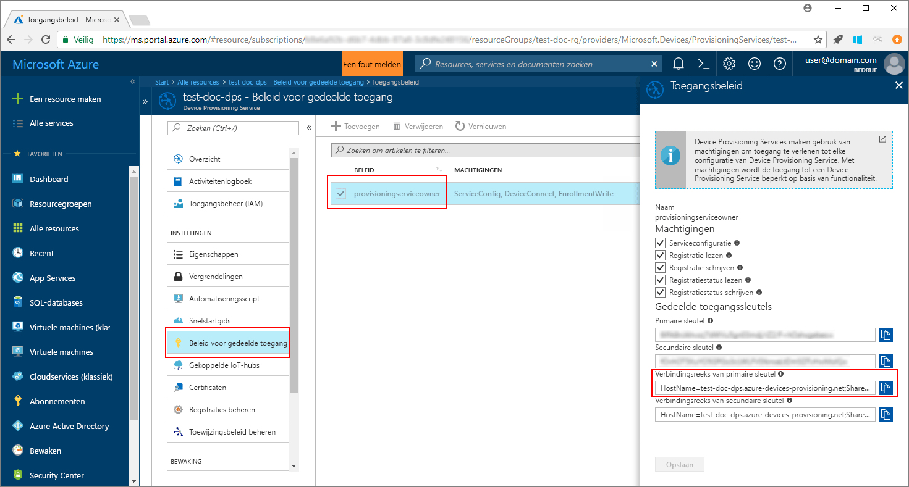
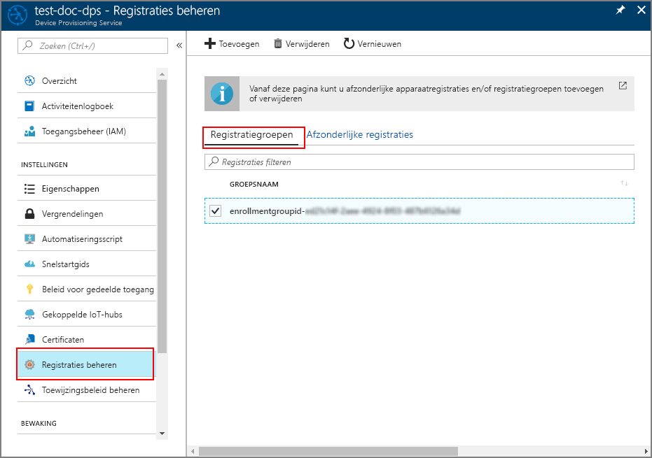

# <a name="enroll-x509-devices-to-iot-hub-device-provisioning-service-using-java-service-sdk"></a>X.509-apparaten inschrijven bij IoT Hub Device Provisioning Service met behulp van de Java service-SDK
> [!div class="op_single_selector"]
> * [Java](quick-enroll-device-x509-java.md)
> * [Node.js](quick-enroll-device-x509-node.md)

In deze stappen ziet u hoe u een groep gesimuleerde X.509-apparaten programmatisch inschrijft bij Azure IoT Hub Device Provisioning Service, met de [Java service-SDK](https://azure.github.io/azure-iot-sdk-java/service/) met behulp van een Java-voorbeeldtoepassing. Hoewel de Java service-SDK werkt op Windows- en Linux-computers, gebruiken we in dit artikel een Windows-ontwikkelcomputer om stapsgewijs het inschrijvingsproces te doorlopen.

Zorg ervoor dat u [IoT Hub Device Provisioning Service instelt met Azure Portal](./quick-setup-auto-provision.md) voordat u verdergaat.

<a id="setupdevbox"></a>

## <a name="prepare-the-development-environment"></a>De ontwikkelomgeving voorbereiden 

1. Zorg ervoor dat [Java SE Development Kit 8](http://www.oracle.com/technetwork/java/javase/downloads/jdk8-downloads-2133151.html) is geïnstalleerd op de computer. 

2. Stel omgevingsvariabelen in voor de Java-installatie. De `PATH`-variabele moet het volledige pad naar de map *jdk1.8.x\bin* bevatten. Als dit de eerste Java-installatie op de computer is, maakt u een nieuwe omgevingsvariabele met de naam `JAVA_HOME`, en laat u deze naar het volledige pad naar de map *jdk1.8.x* verwijzen. Op Windows-computer vindt u deze map meestal in de map *C:\\Program Files\\Java\\*. U kunt omgevingsvariabelen maken of bewerken door te zoeken naar **De omgevingsvariabelen van het systeem bewerken** in het **Configuratiescherm** van de Windows-computer. 

  U kunt controleren of Java goed is ingesteld op de computer door de volgende opdracht uit te voeren in het opdrachtvenster:

    ```cmd\sh
    java -version
    ```

3. [Maven 3](https://maven.apache.org/download.cgi) downloaden en uitpakken op de computer. 

4. Bewerk omgevingsvariabele `PATH` zodat deze naar de map *apache-maven-3.x.x\\bin* verwijst binnen de map waarin Maven is uitgepakt. U kunt bevestigen dat Maven juist is geïnstalleerd door deze opdracht uit te voeren in het opdrachtvenster:

    ```cmd\sh
    mvn --version
    ```

5. Zorg ervoor dat [git](https://git-scm.com/download/) is geïnstalleerd op de computer en is toegevoegd aan de omgevingsvariabele `PATH`. 


<a id="javasample"></a>

## <a name="download-and-modify-the-java-sample-code"></a>De Java-voorbeeldcode downloaden en wijzigen

In deze sectie ziet u hoe u de inrichtingsgegevens van het X.509-apparaat toevoegt aan de voorbeeldcode. 

1. Open een opdrachtprompt. Kloon de GitHub-opslagplaats voor het codevoorbeeld van de apparaatinschrijving met behulp van de Java service-SDK:
    
    ```cmd\sh
    git clone https://github.com/Azure/azure-iot-sdk-java.git --recursive
    ```

2. Navigeer in de gedownloade broncode naar de voorbeeldmap **_azure-iot-sdk-java/provisioning/provisioning-samples/service-enrollment-group-sample_**. Open het bestand **_/src/main/java/samples/com/microsoft/azure/sdk/iot/ServiceEnrollmentGroupSample.java_** in een editor naar keuze, en voeg de volgende gegevens toe:

    1. Voeg de `[Provisioning Connection String]` voor de inrichtingsservice als volgt toe vanuit de portal:
        1. Navigeer naar de inrichtingsservice in [Azure Portal](https://portal.azure.com). 
        2. Open **Gedeeld toegangsbeleid** en selecteer een beleid met de machtiging *EnrollmentWrite*.
        3. Kopieer de **Verbindingsreeks van de primaire sleutel**. 

              

        4. Vervang `[Provisioning Connection String]` in het voorbeeldcodebestand **_ServiceEnrollmentGroupSample.java_** door de **Verbindingsreeks van de primaire sleutel**.

            ```Java
            private static final String PROVISIONING_CONNECTION_STRING = "[Provisioning Connection String]";
            ```

    2. Voeg het basiscertificaat voor de groep apparaten toe. Als u een voorbeeldbasiscertificaat nodig hebt, gebruikt u het hulpprogramma _X.509-certificaatgenerator_ als volgt:
        1. Navigeer in een opdrachtvenster naar de map **_azure-iot-sdk-java/provisioning/provisioning-tools/provisioning-x509-cert-generator_**.
        2. Bouw het hulpprogramma met behulp van de volgende opdracht:

                ```cmd\sh
                mvn clean install
                ```

        4. Voer het hulpprogramma uit met behulp van de volgende opdrachten:

                ```cmd\sh
                cd target
                java -jar ./provisioning-x509-cert-generator-{version}-with-deps.jar
                ```

        5. Wanneer u hierom wordt gevraagd, kunt u ook een _algemene naam_ invoeren voor de certificaten.
        6. Het hulpprogramma genereert lokaal een **Clientcertificaat**, de **Persoonlijke sleutel van clientcertificaat** en het **Basiscertificaat**.
        7. Kopieer het **Basiscertificaat**, inclusief de regels **_-----BEGIN CERTIFICATE-----_** and **_-----END CERTIFICATE-----_**. 
        8. Wijs de waarde van het **Basiscertificaat** toe aan de parameter **PUBLIC_KEY_CERTIFICATE_STRING** zoals hieronder wordt weergegeven:

                ```Java
                private static final String PUBLIC_KEY_CERTIFICATE_STRING =
                        "-----BEGIN CERTIFICATE-----\n" +
                        "XXXXXXXXXXXXXXXXXXXXXXXXXXXXXXXXXXXXXXXXXXXXXXXXXXXXXXXXXXXXXXXX\n" +
                        "XXXXXXXXXXXXXXXXXXXXXXXXXXXXXXXXXXXXXXXXXXXXXXXXXXXXXXXXXXXXXXXX\n" +
                        "XXXXXXXXXXXXXXXXXXXXXXXXXXXXXXXXXXXXXXXXXXXXXXXXXXXXXXXXXXXXXXXX\n" +
                        "XXXXXXXXXXXXXXXXXXXXXXXXXXXXXXXXXXXXXXXXXXXXXXXXXXXXXXXXXXXXXXXX\n" +
                        "XXXXXXXXXXXXXXXXXXXXXXXXXXXXXXXXXXXXXXXXXXXXXXXXXXXXXXXXXXXXXXXX\n" +
                        "XXXXXXXXXXXXXXXXXXXXXXXXXXXXXXXXXXXXXXXXXXXXXXXXXXXXXXXXXXXXXXXX\n" +
                        "XXXXXXXXXXXXXXXXXXXXXXXXXXXXXXXXXXXXXXXXXXXXXXXXXXXXXXXXXXXXXXXX\n" +
                        "XXXXXXXXXXXXXXXXXXXXXXXXXXXXXXXXXXXXXXXXXXXXXXXXXXXXXXXXXXXXXXXX\n" +
                        "XXXXXXXXXXXXXXXXXXXXXXXXXXXXXXXXXXXXXXXXXXXXXXXXXXXXXXXXXXXXXXXX\n" +
                        "XXXXXXXXXXXXXXXXXXXXXXXXXXXXXXXXXXXXXXXXXXXXXXXXXXXXXXXXXXXXXXXX\n" +
                        "-----END CERTIFICATE-----\n";
                ```

        9. Sluit het opdrachtvenster of voer **n** in wanneer u wordt gevraagd om een *Verificatiecode*. 
 
    3. Desgewenst kunt u de inrichtingsservice configureren via de voorbeeldcode:
        - Volg deze stappen om deze configuratie toe te voegen aan het voorbeeld:
            1. Navigeer naar de IoT-hub die is gekoppeld aan de inrichtingsservice in [Azure Portal](https://portal.azure.com). Open het tabblad **Overzicht** voor de hub en kopieer de **Hostnaam**. Wijs deze **Hostnaam** toe aan de parameter *IOTHUB_HOST_NAME*.

                ```Java
                private static final String IOTHUB_HOST_NAME = "[Host name].azure-devices.net";
                ```
            2. Wijs een beschrijvende naam toe aan de parameter *DEVICE_ID* en houd *PROVISIONING_STATUS* aan als standaardwaarde *ENABLED*. 

        - OF, als u de inrichtingsservice niet wilt configureren, zorgt u ervoor dat u de volgende instructies in het bestand _ServiceEnrollmentGroupSample.java_ als commentaar markeert of verwijdert:

            ```Java
            enrollmentGroup.setIotHubHostName(IOTHUB_HOST_NAME);                // Optional parameter.
            enrollmentGroup.setProvisioningStatus(ProvisioningStatus.ENABLED);  // Optional parameter.
            ```

    4. Bestudeer de voorbeeldcode. Hiermee wordt een groepsinschrijving voor X.509-apparaten gemaakt, bijgewerkt, en verwijderd, en wordt voor deze inschrijving een query uitgevoerd. Markeer de volgende coderegels aan het einde van het bestand _ServiceEnrollmentGroupSample.java_ tijdelijk als commentaar voor een geslaagde inschrijving via de portal:

        ```Java
        // ************************************** Delete info of enrollmentGroup ***************************************
        System.out.println("\nDelete the enrollmentGroup...");
        provisioningServiceClient.deleteEnrollmentGroup(enrollmentGroupId);
        ```

    5. Sla het bestand _ServiceEnrollmentGroupSample.java_ op. 
 

<a id="runjavasample"></a>

## <a name="build-and-run-sample-group-enrollment"></a>Een voorbeeldgroepsinschrijving bouwen en uitvoeren

1. Open een opdrachtvenster en navigeer naar de map **_azure-iot-sdk-java/provisioning/provisioning-samples/service-enrollment-group-sample_**.

2. Bouw de voorbeeldcode met behulp van deze opdracht:

    ```cmd\sh
    mvn install -DskipTests
    ```

   Met deze opdracht wordt het Maven-pakket [`com.microsoft.azure.sdk.iot.provisioning.service`](https://www.mvnrepository.com/artifact/com.microsoft.azure.sdk.iot.provisioning/provisioning-service-client) gedownload naar de computer. Dit pakket bevat de binaire bestanden voor de Java service-SDK, die de voorbeeldcode nodig heeft voor het bouwen. Als u het hulpprogramma _X.509-certificaatgenerator_ hebt uitgevoerd in de vorige sectie, is dit pakket al gedownload op de computer. 

3. Voer het voorbeeld uit met behulp van deze opdrachten in het opdrachtvenster:

    ```cmd\sh
    cd target
    java -jar ./service-enrollment-group-sample-{version}-with-deps.jar
    ```

4. Houd het uitvoervenster in de gaten voor een geslaagde inschrijving.

5. Navigeer naar de inrichtingsservice in Azure Portal. Klik op **Inschrijvingen beheren**. U ziet dat de groep X.509-apparaten wordt weergegeven op het tabblad **Inschrijvingsgroepen** met een automatisch gegenereerde *GROEPSNAAM*. 

      

## <a name="modifications-to-enroll-a-single-x509-device"></a>Wijzigingen voor het inschrijven van een enkel X.509-apparaat

Als u een enkel X.509-apparaat wilt inschrijven, wijzigt u als volgt de voorbeeldcode voor *afzonderlijke inschrijving* die wordt gebruikt in [TPM-apparaat inschrijven bij IoT Hub Device Provisioning Service met behulp van de Java service-SDK](quick-enroll-device-tpm-java.md#javasample):

1. Kopieer de *Algemene naam* van het X.509-clientcertificaat naar het klembord. Als u het hulpprogramma _X.509-certificaatgenerator_ wilt gebruiken zoals wordt weergegeven in de [vorige voorbeeldcodesectie](#javasample), voert u een _Algemene naam_ in voor uw certificaat, of gebruikt u de standaardwaarde **microsoftriotcore**. Gebruik deze **Algemene naam** als de waarde voor de variabele *REGISTRATION_ID*. 

    ```Java
    // Use common name of your X.509 client certificate
    private static final String REGISTRATION_ID = "[RegistrationId]";
    ```

2. Wijzig de naam van de variabele *TPM_ENDORSEMENT_KEY* in *PUBLIC_KEY_CERTIFICATE_STRING*. Kopieer **Clientcertificaat** uit de uitvoer van het hulpprogramma _X.509-certificaatgenerator_ als de waarde voor de variabele *PUBLIC_KEY_CERTIFICATE_STRING*. 

    ```Java
    // Rename the variable *TPM_ENDORSEMENT_KEY* as *PUBLIC_KEY_CERTIFICATE_STRING*
    private static final String PUBLIC_KEY_CERTIFICATE_STRING =
            "-----BEGIN CERTIFICATE-----\n" +
            "XXXXXXXXXXXXXXXXXXXXXXXXXXXXXXXXXXXXXXXXXXXXXXXXXXXXXXXXXXXXXXXX\n" +
            "XXXXXXXXXXXXXXXXXXXXXXXXXXXXXXXXXXXXXXXXXXXXXXXXXXXXXXXXXXXXXXXX\n" +
            "XXXXXXXXXXXXXXXXXXXXXXXXXXXXXXXXXXXXXXXXXXXXXXXXXXXXXXXXXXXXXXXX\n" +
            "XXXXXXXXXXXXXXXXXXXXXXXXXXXXXXXXXXXXXXXXXXXXXXXXXXXXXXXXXXXXXXXX\n" +
            "XXXXXXXXXXXXXXXXXXXXXXXXXXXXXXXXXXXXXXXXXXXXXXXXXXXXXXXXXXXXXXXX\n" +
            "XXXXXXXXXXXXXXXXXXXXXXXXXXXXXXXXXXXXXXXXXXXXXXXXXXXXXXXXXXXXXXXX\n" +
            "XXXXXXXXXXXXXXXXXXXXXXXXXXXXXXXXXXXXXXXXXXXXXXXXXXXXXXXXXXXXXXXX\n" +
            "XXXXXXXXXXXXXXXXXXXXXXXXXXXXXXXXXXXXXXXXXXXXXXXXXXXXXXXXXXXXXXXX\n" +
            "XXXXXXXXXXXXXXXXXXXXXXXXXXXXXXXXXXXXXXXXXXXXXXXXXXXXXXXXXXXXXXXX\n" +
            "XXXXXXXXXXXXXXXXXXXXXXXXXXXXXXXXXXXXXXXXXXXXXXXXXXXXXXXXXXXXXXXX\n" +
            "-----END CERTIFICATE-----\n";
    ```
3. Vervang in de **hoofdfunctie** de regel `Attestation attestation = new TpmAttestation(TPM_ENDORSEMENT_KEY);` door het volgende om het X.509-clientcertificaat te gebruiken:
    ```Java
    Attestation attestation = X509Attestation.createFromClientCertificates(PUBLIC_KEY_CERTIFICATE_STRING);
    ```

4. Sla het voorbeeldbestand voor de *afzonderlijke inschrijving* op, bouw het bestand en voer het uit. Gebruik hiervoor de stappen in de sectie [Build and run the sample code for individual enrollment](quick-enroll-device-tpm-java.md#runjavasample) (De voorbeeldcode voor afzonderlijke inschrijvingen bouwen en uitvoeren).


## <a name="clean-up-resources"></a>Resources opschonen
Als u van plan bent om het voorbeeld van de Java.js-service te verkennen, verwijdert u de resources die u in deze quickstart hebt gemaakt, niet. Als u niet wilt doorgaan, gebruikt u de volgende stappen om alle resources die via deze quickstart zijn gemaakt, te verwijderen.

1. Sluit het uitvoervenster van het Java-voorbeeld op de computer.
1. Sluit het venster voor de _X.509-certificaatgenerator_ op de computer.
1. Navigeer naar Device Provisioning Service in Azure Portal, klik op **Inschrijvingen beheren** en selecteer vervolgens het tabblad **Inschrijvingsgroepen**. Selecteer de *GROEPSNAAM* van de X.509-apparaten die u hebt ingeschreven met behulp van deze quickstart. Klik vervolgens op de knop **Verwijderen** boven aan de blade.  

## <a name="next-steps"></a>Volgende stappen
In deze quickstart hebt u een gesimuleerde groep met X.509-apparaten ingeschreven met Device Provisioning Service. Voor meer informatie over device provisioning, gaat u verder met de zelfstudie voor het instellen van Device Provisioning Service in Azure Portal. 

> [!div class="nextstepaction"]
> [Zelfstudies over Azure IoT Hub Device Provisioning Service](./tutorial-set-up-cloud.md)
