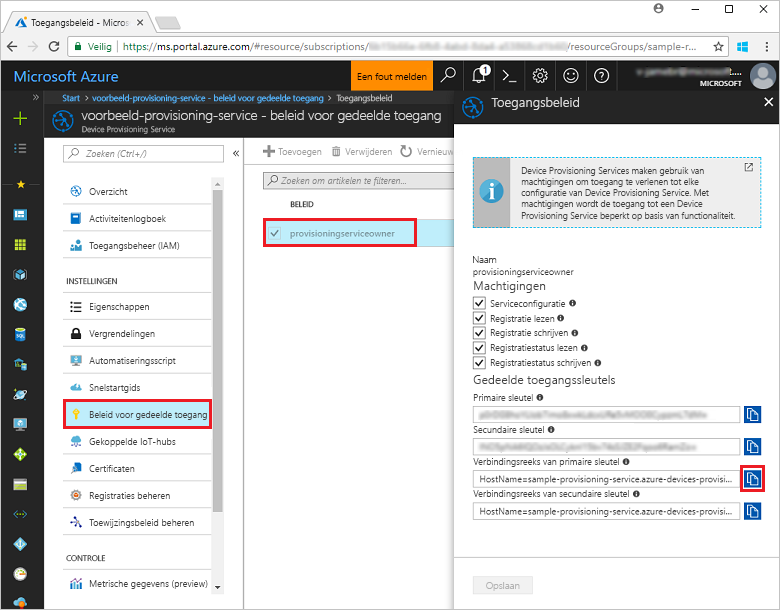
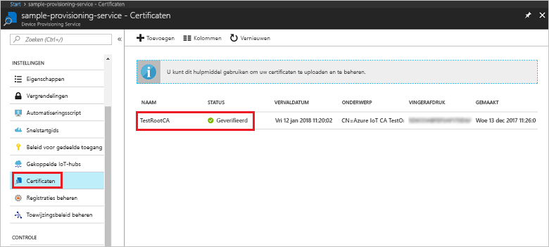
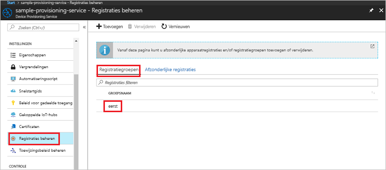

# <a name="enroll-x509-devices-to-iot-hub-device-provisioning-service-using-nodejs-service-sdk"></a>X.509-apparaten inschrijven bij IoT Hub Device Provisioning Service met behulp van de Node.js service-SDK
> [!div class="op_single_selector"]
> * [Java](quick-enroll-device-x509-java.md)
> * [Node.js](quick-enroll-device-x509-node.md)

In deze stappen wordt uitgelegd hoe u via programmacode een registratiegroep voor een X.509 CA-tussen- of -basiscertificaat maakt met de [Node.js service-SDK](https://github.com/Azure/azure-iot-sdk-node) en een Node.js-voorbeeld. Hoewel deze stappen zowel op Windows- als op Linux-computers werken, gebruiken we in dit artikel een Windows-ontwikkelcomputer.
 

## <a name="prerequisites"></a>Vereisten

- Voltooi de stappen in [IoT Hub Device Provisioning Service instellen met Azure Portal](./quick-setup-auto-provision.md). 

 
- Zorg ervoor dat [Node.js v4.0 of hoger](https://nodejs.org) is geïnstalleerd op de computer.


- U hebt een .pem-bestand nodig dat een X.509 CA-tussen- of -basiscertificaat bevat dat is geüpload naar en geverifieerd met uw inrichtingsservice. De **Azure IoT c-SDK** bevat hulpmiddelen waarmee u een X.509-certificaatketen kunt maken, een basis- of tussencertificaat kunt uploaden vanuit die keten en een bewijs van eigendom kunt uitvoeren met de service om het certificaat te verifiëren. Voor het gebruik van dit hulpmiddel kloont u de [Azure IoT c-SDK](https://github.com/Azure/azure-iot-sdk-c) en volgt u de stappen in [azure-iot-sdk-c\tools\CACertificates\CACertificateOverview.md](https://github.com/Azure/azure-iot-sdk-c/blob/master/tools/CACertificates/CACertificateOverview.md) op uw computer.

## <a name="create-the-enrollment-group-sample"></a>Een voorbeeld van een registratiegroep maken 

 
1. Voer vanuit een opdrachtvenster in de werkmap het volgende uit:
  
     ```cmd\sh
     npm install azure-iot-provisioning-service
     ```  

2. Maak met behulp van een teksteditor het bestand **create_enrollment_group.js** in de werkmap. Voeg de volgende code toe aan het bestand en sla het op:

    ```
    'use strict';
    var fs = require('fs');

    var provisioningServiceClient = require('azure-iot-provisioning-service').ProvisioningServiceClient;

    var serviceClient = provisioningServiceClient.fromConnectionString(process.argv[2]);

    var enrollment = {
      enrollmentGroupId: 'first',
      attestation: {
        type: 'x509',
        x509: {
          signingCertificates: {
            primary: {
              certificate: fs.readFileSync(process.argv[3], 'utf-8').toString()
            }
          }
        }
      },
      provisioningStatus: 'disabled'
    };

    serviceClient.createOrUpdateEnrollmentGroup(enrollment, function(err, enrollmentResponse) {
      if (err) {
        console.log('error creating the group enrollment: ' + err);
      } else {
        console.log("enrollment record returned: " + JSON.stringify(enrollmentResponse, null, 2));
        enrollmentResponse.provisioningStatus = 'enabled';
        serviceClient.createOrUpdateEnrollmentGroup(enrollmentResponse, function(err, enrollmentResponse) {
          if (err) {
            console.log('error updating the group enrollment: ' + err);
          } else {
            console.log("updated enrollment record returned: " + JSON.stringify(enrollmentResponse, null, 2));
          }
        });
      }
    });
    ````

## <a name="run-the-enrollment-group-sample"></a>Het voorbeeld van de registratiegroep uitvoeren
 
1. Als u het voorbeeld wilt uitvoeren, hebt u de verbindingsreeks voor de inrichtingsservice nodig. 
    1. Meld u aan bij Azure Portal, klik in het linkermenu op de knop **All resources** en open uw Device Provisioning-service. 
    2. Klik op **Gedeeld toegangsbeleid**. Klik vervolgens op het toegangsbeleid dat u wilt gebruiken om de eigenschappen te openen. Kopieer of noteer de verbindingsreeks van de primaire sleutel uit het venster **Toegangsbeleid**. 

     


3. Zoals vermeld in [Vereisten](#prerequisites) hebt u ook een .pem-bestand nodig dat een X.509 CA-tussen- of -basiscertificaat bevat dat eerder is geüpload naar en geverifieerd met uw inrichtingsservice. Als u wilt controleren of uw certificaat is geüpload en geverifieerd, klikt u op **Certificaten** op de overzichtspagina van Device Provisioning Service in Azure Portal. Zoek het certificaat dat u wilt gebruiken voor de groepsregistratie en zorg ervoor dat de statuswaarde *geverifieerd* is.

     

1. Maak een registratiegroep voor uw certificaat door de volgende opdracht uit te voeren (inclusief de aanhalingstekens rond de opdrachtargumenten):
 
     ```cmd\sh
     node create_enrollment_group.js "<the connection string for your provisioning service>" "<your certificate's .pem file>"
     ```
 
3. Als de inschrijving is gemaakt, worden in het opdrachtvenster de eigenschappen van de nieuwe registratiegroep weergegeven.

     

4. Controleer of de registratiegroep is gemaakt. Selecteer in Azure Portal **Inschrijvingen beheren** in de overzichtsblade van Device Provisioning Service. Selecteer het tabblad **Registratiegroepen** en controleer of de nieuwe inschrijving (*eerste*) aanwezig is.

     
 
## <a name="clean-up-resources"></a>Resources opschonen
Als u van plan bent om de voorbeelden van de Node.js-service te verkennen, verwijdert u de resources die u in deze quickstart hebt gemaakt, niet. Als u niet wilt doorgaan, gebruikt u de volgende stappen om alle Azure-resources die via deze quickstart zijn gemaakt, te verwijderen.
 
1. Sluit het uitvoervenster van het Node.js-voorbeeld op de computer.
2. Navigeer naar Device Provisioning Service in Azure Portal, klik op **Registraties beheren** en selecteer vervolgens het tabblad **Registratiegroepen**. Selecteer de *Registratie-id* voor de inschrijving die u hebt gemaakt met behulp van deze quickstart. Klik vervolgens op de knop **Verwijderen** boven aan de blade.  
3. Klik bij Device Provisioning Service in Azure Portal op **Certificaten**, klik op het certificaat dat u hebt geüpload voor deze quickstart en klik op de knop **Verwijderen** bovenaan in het venster **Certificaatgegevens**.  
 
## <a name="next-steps"></a>Volgende stappen
In deze quickstart hebt u een groepsregistratie voor een X.509 CA-tussen- of -basiscertificaat gemaakt met Azure IoT Hub Device Provisioning Service. Voor meer informatie over device provisioning, gaat u verder met de zelfstudie voor het instellen van Device Provisioning Service in Azure Portal. 
 
> [!div class="nextstepaction"]
> [Zelfstudies over Azure IoT Hub Device Provisioning Service](./tutorial-set-up-cloud.md)