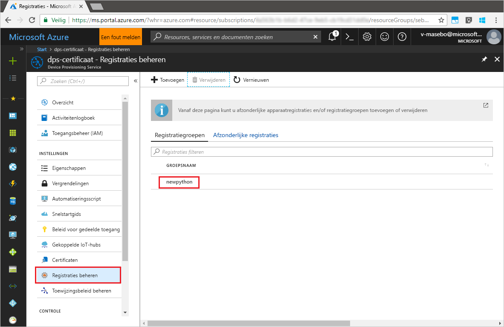

# <a name="enroll-x509-devices-to-iot-hub-device-provisioning-service-using-python-provisioning-service-sdk"></a>X.509 -apparaten inschrijven bij IoT Hub Device Provisioning Service met behulp van de Python inrichtingsservice-SDK
[!INCLUDE [iot-dps-selector-quick-enroll-device-x509](../../includes/iot-dps-selector-quick-enroll-device-x509.md)]

In deze stappen ziet u hoe u een groep gesimuleerde X.509-apparaten programmatisch inschrijft bij Azure IoT Hub Device Provisioning Service, met de [Python inrichtingsservice-SDK](https://github.com/Azure/azure-iot-sdk-python/tree/master/provisioning_service_client) met behulp van een Python-voorbeeldtoepassing. Hoewel de Java service-SDK werkt op Windows- en Linux-computers, gebruiken we in dit artikel een Windows-ontwikkelcomputer om stapsgewijs het inschrijvingsproces te doorlopen.

Zorg ervoor dat u [IoT Hub Device Provisioning Service instelt met Azure Portal](./quick-setup-auto-provision.md) voordat u verdergaat.

> [!NOTE]
> Deze snelstartgids ondersteunt alleen **Inschrijvingsgroep**. Aan **Afzonderlijke inschrijving** via de _Python inrichtingsservice-SDK_ wordt gewerkt.
> 

<a id="prepareenvironment"></a>

## <a name="prepare-the-environment"></a>De omgeving voorbereiden 

1. [Download en installeer Python 2.x of 3.x](https://www.python.org/downloads/). Zorg ervoor dat u de 32-bits of 64-bits installatie gebruikt, zoals vereist door uw configuratie. Zorg ervoor dat u Python toevoegt aan uw platformspecifieke omgevingsvariabelen als u hierom wordt gevraagd tijdens de installatie. 

1. Kies een van de volgende opties:

    - Bouw en compileer de **Azure IoT Python SDK**. Volg [deze instructies](https://github.com/Azure/azure-iot-sdk-python/blob/master/doc/python-devbox-setup.md) voor het bouwen van de Python-pakketten. Als u een Windows-besturingssysteem hebt, gebruikt dan ook het [herdistribueerbare pakket van Visual C++](http://www.microsoft.com/download/confirmation.aspx?id=48145) om het gebruik van systeemeigen DLL's van Python mogelijk te maken.

    - [Installeer of upgrade *pip*, het Python pakketbeheersysteem](https://pip.pypa.io/en/stable/installing/) en installeer het pakket met behulp van de volgende opdracht:

        ```cmd/sh
        pip install azure-iothub-provisioningserviceclient
        ```

1. U hebt een .pem-bestand nodig dat een X.509 CA-tussen- of -basiscertificaat bevat dat is geüpload naar en geverifieerd met uw inrichtingsservice. De **Azure IoT C-SDK** bevat hulpmiddelen waarmee u een X.509-certificaatketen kunt maken, een basis- of tussencertificaat kunt uploaden vanuit die keten en een bewijs van eigendom kunt uitvoeren met de service om het certificaat te verifiëren. Voor het gebruik van dit hulpmiddel kloont u de [Azure IoT C SDK](https://github.com/Azure/azure-iot-sdk-c) en volgt u de stappen in [azure-iot-sdk-c\tools\CACertificates\CACertificateOverview.md](https://github.com/Azure/azure-iot-sdk-c/blob/master/tools/CACertificates/CACertificateOverview.md) op uw computer.


## <a name="modify-the-python-sample-code"></a>De Python-voorbeeldcode wijzigen

In deze sectie ziet u hoe u de inrichtingsgegevens van het X.509-apparaat toevoegt aan de voorbeeldcode. 

1. Start een teksteditor en maak een nieuw bestand **EnrollmentGroup.py**.

1. Voeg de volgende `import`-instructies en -variabelen aan het begin van het bestand **EnrollmentGroup.py** toe. Vervang vervolgens `dpsConnectionString` door uw verbindingsreeks die is te vinden onder **Gedeeld toegangsbeleid** in **Device Provisioning Service** op **Azure Portal**. Vervang de tijdelijke aanduiding voor het certificaat door het certificaat dat u eerder hebt gemaakt in [De omgeving voorbereiden](quick-enroll-device-x509-python.md#prepareenvironment). Maak ten slotte een unieke `registrationid` en zorg dat deze alleen bestaat uit kleine letters en afbreekstreepjes.  
   
    ```python
    from provisioningserviceclient import ProvisioningServiceClient
    from provisioningserviceclient.models import EnrollmentGroup, AttestationMechanism

    CONNECTION_STRING = "{dpsConnectionString}"

    SIGNING_CERT = """-----BEGIN CERTIFICATE-----
    XXXXXXXXXXXXXXXXXXXXXXXXXXXXXXXXXXXXXXXXXXXXXXXXXXXXXXXXXXXXXXXX
    XXXXXXXXXXXXXXXXXXXXXXXXXXXXXXXXXXXXXXXXXXXXXXXXXXXXXXXXXXXXXXXX
    XXXXXXXXXXXXXXXXXXXXXXXXXXXXXXXXXXXXXXXXXXXXXXXXXXXXXXXXXXXXXXXX
    XXXXXXXXXXXXXXXXXXXXXXXXXXXXXXXXXXXXXXXXXXXXXXXXXXXXXXXXXXXXXXXX
    XXXXXXXXXXXXXXXXXXXXXXXXXXXXXXXXXXXXXXXXXXXXXXXXXXXXXXXXXXXXXXXX
    XXXXXXXXXXXXXXXXXXXXXXXXXXXXXXXXXXXXXXXXXXXXXXXXXXXXXXXXXXXXXXXX
    XXXXXXXXXXXXXXXXXXXXXXXXXXXXXXXXXXXXXXXXXXXXXXXXXXXXXXXXXXXXXXXX
    XXXXXXXXXXXXXXXXXXXXXXXXXXXXXXXXXXXXXXXXXXXXXXXXXXXXXXXXXXXXXXXX
    XXXXXXXXXXXXXXXXXXXXXXXXXXXXXXXXXXXXXXXXXXXXXXXXXXXXXXXXXXXXXXXX
    XXXXXXXXXXXXXXXXXXXXXXXXXXXXXXXXXXXXXXXXXXXXXXXXXXXXXXXXXXXXXXXX
    XXXXXXXXXXXXXXXXXXXXXXXXXXXXXXXXXXXXXXXXXXXXXXXXXXXXXXXXXXXXXXXX
    XXXXXXXXXXXXXXXXXXXXXXXXXXXXXXXXXXXXXXXXXXXXXXXXXXXXXXXXXXXXXXXX
    XXXXXXXXXXXXXXXXXXXXXXXXXXXXXXXXXXXXXXXXXXXXXXXXXXXXXXXXXXXXXXXX
    XXXXXXXXXXXXXXXXXXXXXXXXXXXXXXXXXXXXXXXXXXXXXXXXXXXXXXXXXXXXXXXX
    XXXXXXXXXXXXXXXXXXXXXXXXXXXXXXXXXXXXXXXXXXXXXXXXXXXXXXXX
    -----END CERTIFICATE-----"""

    GROUP_ID = "{registrationid}"
    ```

1. Voeg de volgende functie en functieaanroep toe om het aanmaken van de groepsinschrijving te implementeren:
   
    ```python
    def main():
        print ( "Initiating enrollment group creation..." )

        psc = ProvisioningServiceClient.create_from_connection_string(CONNECTION_STRING)
        att = AttestationMechanism.create_with_x509_signing_certs(SIGNING_CERT)
        eg = EnrollmentGroup.create(GROUP_ID, att)

        eg = psc.create_or_update(eg)
    
        print ( "Enrollment group created." )

    if __name__ == '__main__':
        main()
    ```

1. Sla het bestand **EnrollmentGroup.py** op en sluit het.
 

## <a name="run-the-sample-group-enrollment"></a>De voorbeeldgroepsinschrijving uitvoeren

1. Open een opdrachtprompt en voer het script uit.

    ```cmd/sh
    python EnrollmentGroup.py
    ```

1. Houd de uitvoer in de gaten voor een geslaagde inschrijving.

1. Navigeer naar de inrichtingsservice in Azure Portal. Klik op **Inschrijvingen beheren**. U ziet dat de groep X.509-apparaten wordt weergegeven op het tabblad **Inschrijvingsgroepen** met de naam `registrationid` die u eerder hebt gemaakt. 

      


## <a name="clean-up-resources"></a>Resources opschonen
Als u van plan bent om het voorbeeld van de Java.js-service te verkennen, verwijdert u de resources die u in deze quickstart hebt gemaakt, niet. Als u niet wilt doorgaan, gebruikt u de volgende stappen om alle resources die via deze Snelstartgids zijn gemaakt, te verwijderen.

1. Sluit het uitvoervenster van het Java-voorbeeld op de computer.
1. Sluit het venster voor de _X.509-certificaatgenerator_ op de computer.
1. Navigeer naar Device Provisioning Service in Azure Portal, klik op **Registraties beheren** en selecteer vervolgens het tabblad **Registratiegroepen**. Selecteer de *GROEPSNAAM* van de X.509-apparaten die u hebt ingeschreven met behulp van deze quickstart. Klik vervolgens op de knop **Verwijderen** boven aan de blade.  


## <a name="next-steps"></a>Volgende stappen
In deze quickstart hebt u een gesimuleerde groep met X.509-apparaten ingeschreven met Device Provisioning Service. Voor meer informatie over device provisioning, gaat u verder met de zelfstudie voor het instellen van Device Provisioning Service in Azure Portal. 

> [!div class="nextstepaction"]
> [Zelfstudies over Azure IoT Hub Device Provisioning Service](./tutorial-set-up-cloud.md)
