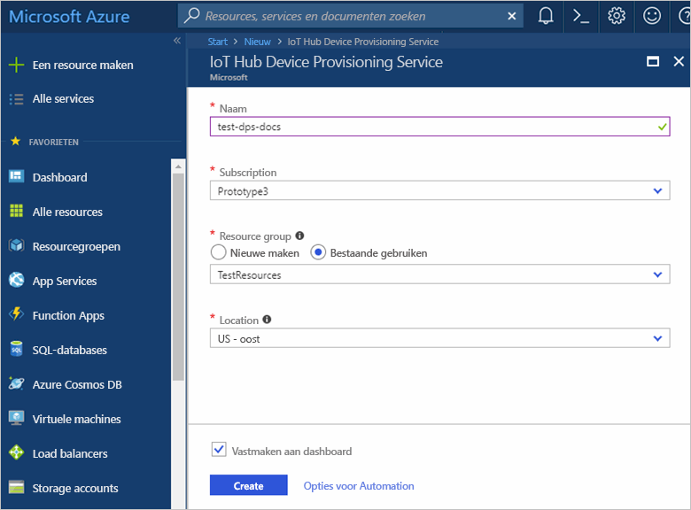
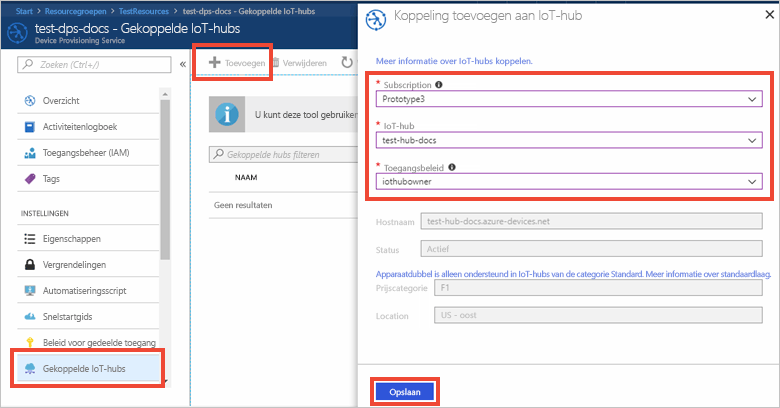

# IoT Hub Device Provisioning Service instellen met Azure Portal

Deze stappen laten zien hoe u de Azure-cloudresources in de portal instelt voor het inrichten van uw apparaten. Dit omvat het maken van uw IoT-hub, het maken van een nieuwe IoT Hub Device Provisioning Service en het aan elkaar koppelen van de twee services. 

Als u nog geen abonnement op Azure hebt, maak dan een [gratis account](https://azure.microsoft.com/free/?WT.mc_id=A261C142F) aan voordat u begint.

## Aanmelden bij Azure Portal

Meld u aan bij [Azure Portal](https://portal.azure.com/).

## Een IoT Hub maken

1. Klik op de knop **Nieuw** in de linkerbovenhoek van Azure Portal.

2. Selecteer **Internet of Things**, selecteer **IoT Hub** en klik op de knop **Maken**. 

3. Geef uw IoT-hub een **Naam**. Selecteer een van de beschikbare prijsopties, voer de [IoT Hub-eenheden](https://azure.microsoft.com/pricing/details/iot-hub/) in, selecteer het aantal partities voor apparaat-naar-cloud-berichten en het abonnement dat wordt gebruikt voor deze resource. Voer de naam in van een nieuwe of bestaande resourcegroep en selecteer de locatie. Klik op **Maken** wanneer u klaar bent.

      

4. Zodra de IoT-hub is geïmplementeerd, wordt de blade samenvatting van de hub automatisch geopend.

## Een nieuw exemplaar van de IoT Hub Device Provisioning Service maken

1. Klik op de knop **Nieuw** in de linkerbovenhoek van Azure Portal.

2. *Zoek op de marketplace* naar de **Device Provisioning Service**. Selecteer **IoT Device Provisioning Service** en klik op de knop **Maken**. 

3. Geef uw Device Provisioning Service-exemplaar een **naam**. Selecteer het abonnement dat moet worden gebruikt voor dit exemplaar en de naam van een nieuwe of bestaande resourcegroep. Selecteer de locatie. Klik op **Maken** wanneer u klaar bent.

      

4. Zodra de service is geïmplementeerd, wordt de blade samenvatting automatisch geopend.

## De IoT-hub en uw Device Provisioning Service koppelen

1. Klik op de knop **Alle resources** in het menu links in de Azure Portal. Selecteer het Device Provisioning Service-exemplaar dat u in de voorgaande sectie hebt gemaakt.  

2. Selecteer **Gekoppelde IoT-hubs** in de overzichtsblade van de Device Provisioning Service. Klik op de knop **+ Toevoegen** bovenaan. 

3. In de portalblade **Koppeling naar IoT-hub toevoegen** selecteert u het huidige abonnement of voert u de naam en de verbindingsreeks in voor een ander abonnement. Selecteer de naam van de hub in de vervolgkeuzelijst. Na het voltooien klikt u op **Opslaan**. 

      

3. Nu ziet u de geselecteerde hub onder de blade **Gekoppelde IoT-hubs**. Mogelijk moet u op **Vernieuwen** klikken om **Gekoppelde IoT-hubs** weer te geven.

## Resources opschonen

Andere Quick Starts in deze verzameling zijn op deze Quick Start gebaseerd. Als u van plan bent om door te gaan met andere snelstartgidsen of met de zelfstudies, verwijdert u de resources die u in deze snelstartgids hebt gemaakt niet. Als u niet wilt doorgaan, gebruikt u de volgende stappen om alle resources te verwijderen die tijdens deze snelstartgids in de Azure Portal zijn gemaakt.

1. Klik in het linkermenu in de Azure Portal op **Alle resources** en selecteer uw Device Provisioning Service. Klik bovenaan de blade **Alle resources** op **Verwijderen**.  
2. Klik in het linkermenu in de Azure Portal op **Alle resources** en selecteer vervolgens uw IoT-hub. Klik bovenaan de blade **Alle resources** op **Verwijderen**.  

## Volgende stappen

In deze snelstartgids hebt u een IoT-hub en een Device Provisioning Service-exemplaar geïmplementeerd en de twee resources gekoppeld. Als u wilt weten hoe u deze instellingen gebruikt voor het inrichten van een gesimuleerd apparaat, gaat u verder met de rest van de snelstartgids voor het maken van een gesimuleerd apparaat.

> [!div class="nextstepaction"]
> [Snelstartgids voor het maken van een gesimuleerd apparaat](./quick-create-simulated-device.md)
