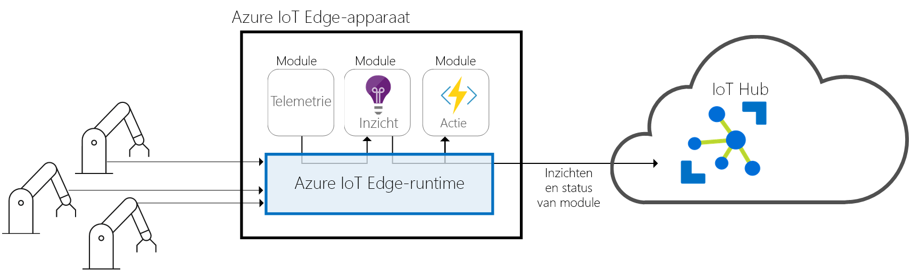
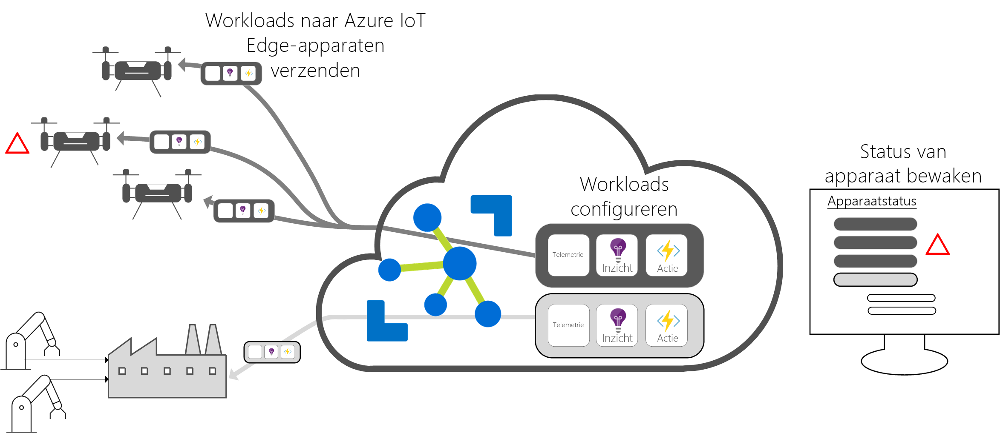

# Wat is Azure IoT Edge?

Azure IoT Edge verplaatst cloud-analyse en aangepaste bedrijfslogica naar apparaten, zodat uw organisatie zich kan richten op zakelijke inzichten in plaats van gegevensbeheer. Stel uw oplossing in staat om echt te schalen door uw IoT-software te configureren, dit op apparaten te implementeren via standaardcontainers en toezicht op alles te houden vanuit de cloud.

>[!NOTE]
>Azure IoT Edge is alleen beschikbaar in de prijscategorieën gratis en standaard van IoT Hub. De gratis optie is alleen bedoeld voor testen en evalueren. Raadpleeg [How to choose the right IoT Hub tier](../iot-hub/iot-hub-scaling.md) (De juiste IoT Hub-prijscategorie kiezen) voor meer informatie over de Basic- en Standard-prijscategorieën.

Analyses stimuleren bedrijfswaarde in IoT-oplossingen, maar niet alle analyses hoeven zich in de cloud te bevinden. Als u wilt dat een apparaat zo snel mogelijk op noodsituaties reageert, kunt u anomaliedetectie uitvoeren op het apparaat zelf. Op dezelfde manier kunt u bandbreedtekosten verlagen en de overdracht van terabytes van onbewerkte gegevens voorkomen door lokaal gegevensopschoning en aggregatie uit te voeren. Verzend de inzichten vervolgens naar de cloud. 

Azure IoT Edge bestaat uit drie onderdelen:
* IoT Edge-modules zijn containers die Azure-services, services van derden of uw eigen code uitvoeren. Ze zijn geïmplementeerd op IoT Edge-apparaten en voeren lokaal uit op deze apparaten. 
* De IoT Edge-runtime wordt op elk IoT Edge-apparaat uitgevoerd en beheert de modules die op elk apparaat zijn geïmplementeerd. 
* Met een cloudinterface kunt u op afstand de IoT Edge-apparaten controleren en beheren.

## IoT Edge-modules

IoT Edge-modules zijn eenheden van uitvoerbewerking die momenteel als compatibele Docker-containers zijn geïmplementeerd, die uw bedrijfslogica aan de rand uitvoeren. Er kunnen meerdere modules worden geconfigureerd om met elkaar te communiceren, waardoor er een pijplijn van gegevensverwerking ontstaat. U kunt aangepaste modules ontwikkelen of bepaalde Azure-services ordenen in modules die offline en aan de rand inzichten geven. 

### Kunstmatige intelligentie aan de rand

Met Azure IoT Edge kunt u verwerking van complexe gebeurtenissen, machine learning, afbeeldingsherkenning en andere vormen van kunstmatige intelligentie (AI) van hoge waarde implementeren zonder deze intern te schrijven. Azure-services zoals Azure Functions, Azure Stream Analytics en Azure Machine Learning kunnen allemaal on-premises worden uitgevoerd via Azure IoT Edge. U bent echter niet beperkt tot Azure-services. Iedereen kan AI-modules maken en deze beschikbaar stellen aan de community voor gebruik. 

### Uw eigen code gebruiken

Als u uw eigen code op uw apparaten wilt implementeren, ondersteunt Azure IoT Edge deze ook. Azure IoT Edge bevat hetzelfde programmeermodel als de andere Azure IoT-services. Dezelfde code kan worden uitgevoerd op een apparaat of in de cloud. Azure IoT Edge ondersteunt Linux en Windows, dus u kunt coderen voor het platform van uw keuze. Het programma biedt ondersteuning voor Java, .NET Core 2.0, Node.js, C en Python. Uw ontwikkelaars kunnen dus in een taal coderen die ze al kennen en bestaande bedrijfslogica gebruiken zonder deze helemaal zelf te schrijven.

## IoT Edge-runtime

De Azure IoT Edge-runtime maakt aangepaste en cloudlogica op IoT Edge-apparaten mogelijk. Deze bevindt zich op het IoT Edge-apparaat en voert beheer- en communicatiebewerkingen uit. De runtime voert verschillende functies uit:

* Installeert workloads op het apparaat en werkt deze bij.
* Onderhoudt de Azure IoT Edge-beveiligingsstandaarden op het apparaat.
* Zorgt ervoor dat de IoT Edge-modules altijd worden uitgevoerd.
* Rapporteert de status van de module aan de cloud voor externe bewaking.
* Vergemakkelijkt de communicatie tussen downstream leaf-apparaten en het IoT Edge-apparaat.
* Vergemakkelijkt de communicatie tussen modules op het IoT Edge-apparaat.
* Vergemakkelijkt de communicatie tussen het IoT Edge-apparaat en de cloud.

Hoe u een Azure IoT Edge-apparaat gebruikt, is volledig aan u. De runtime wordt vaak gebruikt voor de implementatie van AI in gateways die gegevens van meerdere andere lokale apparaten aggregeren en verwerken. Dit is echter slechts één optie. Leaf-apparaten kunnen ook Azure IoT Edge-apparaten zijn, ongeacht of ze zijn aangesloten op een gateway of rechtstreeks verbonden zijn met de cloud.

De Azure IoT Edge-runtime wordt uitgevoerd op een groot aantal IoT-apparaten, zodat u de runtime op tal van manieren kunt gebruiken. Deze biedt ondersteuning voor Linux- en Windows-besturingssystemen en abstraheert hardwaregegevens. Gebruik een apparaat dat kleiner is dan een Raspberry Pi 3 als u niet veel gegevens verwerkt of schaal omhoog tot een geïndustrialiseerde server om resource-intensieve workloads uit te voeren.

## Cloudinterface van IoT Edge

Het beheer van de softwarelevenscyclus voor bedrijfsapparaten is ingewikkeld. Het beheer van de softwarelevenscyclus voor miljoenen heterogene IoT-apparaten is nog moeilijker. Workloads moeten voor een bepaald type apparaat worden gemaakt en geconfigureerd, moeten op schaal op miljoenen apparaten in uw oplossing worden geïmplementeerd en moeten worden gecontroleerd om apparaten die zich niet normaal gedragen eruit te halen. Deze activiteiten kunnen niet per apparaat worden uitgevoerd, maar moeten op schaal worden uitgevoerd.

Azure IoT Edge integreert naadloos met Azure IoT-oplossingsversnellers en biedt één controlelaag voor de behoeften van uw oplossing. Met cloudservices kunnen gebruikers het volgende doen:

* een workload maken en configureren die op een specifiek type apparaat wordt uitgevoerd;
* een workload verzenden naar een reeks apparaten;
* workloads bewaken die worden uitgevoerd op apparaten in het veld.

## Volgende stappen

Probeer deze concepten uit door [IoT Edge te implementeren op een gesimuleerd apparaat](quickstart.md).

 
