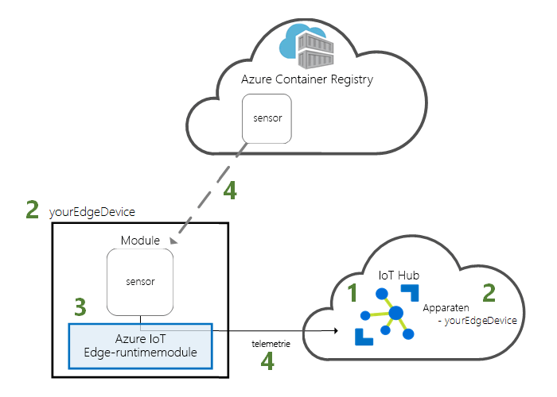
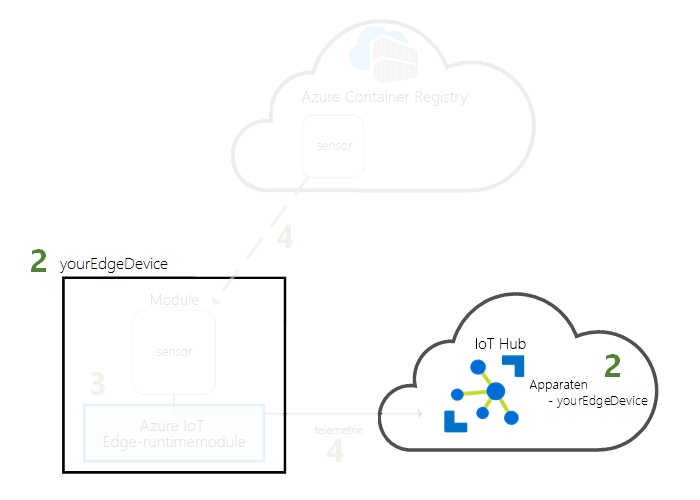
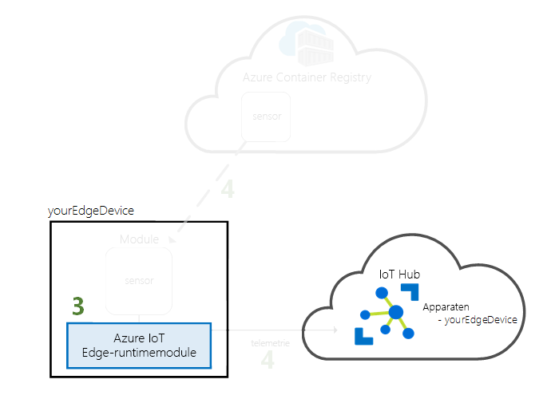
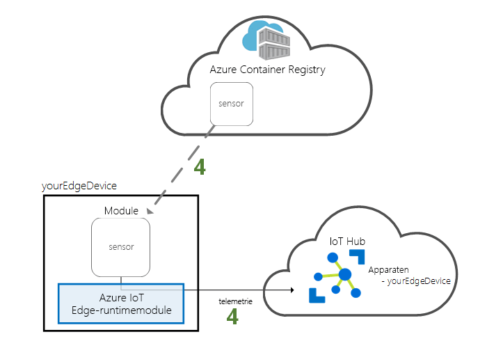

# <a name="quickstart-deploy-your-first-iot-edge-module-to-a-linux-x64-device"></a>Snelstart: uw eerste IoT Edge-module implementeren op een Linux x64-apparaat

Met Azure IoT Edge kunt u profiteren van de kracht van de cloud op uw Internet of Things-apparaten. In deze snelstart gebruikt u de cloudinterface om vooraf geschreven code op afstand te implementeren op een IoT Edge-apparaat.

In deze snelstart leert u de volgende zaken:

1. Een IoT Hub maken.
2. Een IoT Edge-apparaat registreren in uw IoT-hub.
3. De IoT Edge-runtime op uw apparaat installeren en starten.
4. Op afstand een module implementeren op een IoT Edge-apparaat.



In deze snelstart verandert u uw Linux-computer of virtuele machine in een IoT Edge-apparaat. Vervolgens implementeert u een module vanuit Azure Portal op uw apparaat. De module die u in deze snelstart implementeert, is een gesimuleerde sensor waarmee temperatuur-, luchtvochtigheids- en drukgegevens worden gegenereerd. De andere Azure IoT Edge-zelfstudies bouwen voort op het werk dat u hier doet door modules te implementeren waarmee de gesimuleerde gegevens worden geanalyseerd voor zakelijke inzichten.

Als u nog geen actief abonnement op Azure hebt, maakt u een [gratis Azure-account](https://azure.microsoft.com/free) aan voordat u begint.

[!INCLUDE [cloud-shell-try-it.md](../../includes/cloud-shell-try-it.md)]

U gebruikt de Azure CLI om veel van de stappen in deze snelstart uit te voeren, en Azure IoT heeft een extensie om extra functionaliteit in te schakelen. 

Voeg de Azure IoT-extensie toe aan het exemplaar van Cloud Shell.

   ```azurecli-interactive
   az extension add --name azure-cli-iot-ext
   ```

## <a name="prerequisites"></a>Vereisten

Cloudresources: 

* Een resourcegroep voor het beheren van alle resources die u in deze snelstart maakt. 

   ```azurecli-interactive
   az group create --name IoTEdgeResources --location westus2
   ```

IoT Edge-apparaat:

* Een virtueel Linux-apparaat of een virtuele Linux-computer die fungeert als uw IoT Edge-apparaat. Als u een virtuele machine in Azure wilt maken, gebruikt u de volgende opdracht om snel aan de slag te gaan:

   ```azurecli-interactive
   az vm create --resource-group IoTEdgeResources --name EdgeVM --image Canonical:UbuntuServer:16.04-LTS:latest --admin-username azureuser --generate-ssh-keys --size Standard_B1ms
   ```

## <a name="create-an-iot-hub"></a>Een IoT Hub maken

Begin met de snelstart door uw IoT Hub met Azure CLI te maken.


Het gratis niveau van IoT Hub werkt voor deze snelstart. Als u in het verleden IoT Hub hebt gebruikt en al een gratis hub hebt gemaakt, kunt u die IoT-hub gebruiken. Elk abonnement biedt toegang tot slechts één gratis IoT-hub. 

Met de volgende code wordt een gratis **F1**-hub gemaakt in de resourcegroep **IoTEdgeResources**. Vervang *{hub_name}* door een unieke naam voor uw IoT-hub.

   ```azurecli-interactive
   az iot hub create --resource-group IoTEdgeResources --name {hub_name} --sku F1 
   ```

   Als er een fout optreedt omdat er al één gratis hub in uw abonnement is, wijzigt u de SKU in **S1**.

## <a name="register-an-iot-edge-device"></a>Een IoT Edge-apparaat registreren

Registreer een IoT Edge-apparaat bij uw net gemaakte IoT Hub.


Maak een apparaat-id voor uw gesimuleerde apparaat, zodat het met uw IoT-hub kan communiceren. De apparaat-id is opgeslagen in de cloud, en u gebruikt een unieke apparaatverbindingsreeks om een fysiek apparaat te koppelen aan een apparaat-id. 

Omdat IoT Edge-apparaten zich anders gedragen en anders kunnen worden beheerd dan typische IoT-apparaten, geeft u vanaf het begin aan dat dit een IoT Edge-apparaat is. 

1. Voer in Azure Cloud Shell de volgende opdracht in om een ​​apparaat met de naam **myEdgeDevice** in uw hub te maken.

   ```azurecli-interactive
   az iot hub device-identity create --hub-name {hub_name} --device-id myEdgeDevice --edge-enabled
   ```

1. Haal de verbindingsreeks voor uw apparaat op, zodat uw fysieke apparaat aan de bijbehorende identiteit in IoT Hub wordt gekoppeld. 

   ```azurecli-interactive
   az iot hub device-identity show-connection-string --device-id myEdgeDevice --hub-name {hub_name}
   ```

1. Kopieer de verbindingsreeks en sla deze op. U gebruikt deze waarde voor het configureren van de IoT Edge-runtime in de volgende sectie. 

## <a name="install-and-start-the-iot-edge-runtime"></a>De IoT Edge-runtime installeren en starten

Installeer en start de Azure IoT Edge-runtime op uw IoT Edge-apparaat. 


De IoT Edge-runtime wordt op alle IoT Edge-apparaten geïmplementeerd. Deze bevat drie onderdelen. De **IoT Edge-beveiligingsdaemon** wordt telkens gestart wanneer een Edge-apparaat wordt opgestart en start het apparaat op door de IoT Edge-agent te starten. De **IoT Edge-agent** faciliteert de implementatie en bewaking van modules op het IoT Edge-apparaat, inclusief de IoT Edge-hub. Met de **IoT Edge-hub** wordt de communicatie tussen modules op het IoT Edge-apparaat en tussen het apparaat en IoT Hub beheerd. 

Tijdens de installatie van de runtime geeft u een apparaatverbindingsreeks op. Gebruik de tekenreeks die u hebt opgehaald via de Azure CLI. Deze tekenreeks koppelt uw fysieke apparaat aan de IoT Edge-apparaat-id in Azure. 

Voer de volgende stappen uit op de Linux-computer of virtuele Linux-computer die u hebt voorbereid om te fungeren als een IoT Edge-apparaat. 

### <a name="register-your-device-to-use-the-software-repository"></a>Uw apparaat registreren voor gebruik van de softwareopslagplaats

De pakketten die u nodig hebt voor het uitvoeren van de IoT Edge-runtime worden beheerd in een softwareopslagplaats. Configureer uw IoT Edge-apparaat voor toegang tot deze opslagplaats. 

De stappen in deze sectie zijn bestemd voor x64-apparaten met **Ubuntu 16.04**. Raadpleeg [Azure IoT Edge-runtime installeren in Linux (x64)](how-to-install-iot-edge-linux.md) of [Azure IoT Edge-runtime installeren in Linux (ARM32v7/armhf)](how-to-install-iot-edge-linux-arm.md) voor toegang tot de softwareopslagplaats in andere versies van Linux of apparaatarchitecturen.

1. Installeer de opslagplaatsconfiguratie op de computer die u als een IoT Edge-apparaat gebruikt.

   ```bash
   curl https://packages.microsoft.com/config/ubuntu/16.04/prod.list > ./microsoft-prod.list
   sudo cp ./microsoft-prod.list /etc/apt/sources.list.d/
   ```

2. Installeer een openbare sleutel voor toegang tot de opslagplaats.

   ```bash
   curl https://packages.microsoft.com/keys/microsoft.asc | gpg --dearmor > microsoft.gpg
   sudo cp ./microsoft.gpg /etc/apt/trusted.gpg.d/
   ```

### <a name="install-a-container-runtime"></a>Een container-runtime installeren

De IoT Edge-runtime is een set van containers, en de logica die u op uw IoT Edge-apparaat implementeert, wordt geleverd als containers. Bereid uw apparaat voor op deze onderdelen door een container-runtime te installeren.

1. Werk **apt get-** bij.

   ```bash
   sudo apt-get update
   ```

2. Installeer **Moby**, een container-runtime.

   ```bash
   sudo apt-get install moby-engine
   ```

3. Installeer de CLI-opdrachten voor Moby. 

   ```bash
   sudo apt-get install moby-cli
   ```

### <a name="install-and-configure-the-iot-edge-security-daemon"></a>De IoT Edge-beveiligingsdeamon installeren en configureren

De beveiligingsdeamon wordt geïnstalleerd als een systeemservice, zodat de IoT Edge-runtime elke keer wordt gestart wanneer uw apparaat wordt opgestart. De installatie bevat ook een versie van **hsmlib** waarmee de beveiligingsdeamon kan communiceren met de hardwarebeveiliging van het apparaat. 

1. Download en installeer de IoT Edge-beveiligingsdaemon. 

   ```bash
   sudo apt-get update
   sudo apt-get install iotedge
   ```

2. Open het IoT Edge-configuratiebestand. Het is een beveiligd bestand, dus mogelijk moet u verhoogde bevoegdheden gebruiken om het te openen.
   
   ```bash
   sudo nano /etc/iotedge/config.yaml
   ```

3. Voeg de verbindingsreeks van het IoT Edge-apparaat toe. Zoek de variabele **device_connection_string** en werk de waarde bij met de tekenreeks die u hebt gekopieerd na de registratie van uw apparaat. Deze verbindingsreeks koppelt uw fysieke apparaat aan de apparaat-id die u in Azure hebt gemaakt.

4. Sla het bestand op en sluit het. 

   `CTRL + X`, `Y`, `Enter`

5. Start de IoT Edge-beveiligingsdaemon opnieuw op om uw wijzigingen toe te passen.

   ```bash
   sudo systemctl restart iotedge
   ```

>[!TIP]
>U hebt verhoogde bevoegdheden nodig om `iotedge`-opdrachten uit te voeren. Nadat u zich de eerste keer na de installatie van de IoT Edge-runtime hebt afgemeld en opnieuw hebt aangemeld, worden uw machtigingen automatisch bijgewerkt. Gebruik tot die tijd **sudo** voorafgaand aan de opdrachten. 

### <a name="view-the-iot-edge-runtime-status"></a>De IoT Edge runtime-status bekijken

Controleer of de runtime goed is geïnstalleerd en geconfigureerd.

1. Controleer of de Edge-beveiligingsdaemon wordt uitgevoerd als een systeemservice.

   ```bash
   sudo systemctl status iotedge
   ```

   

2. Als u problemen met de service moet oplossen, haalt u de servicelogboeken op. 

   ```bash
   journalctl -u iotedge
   ```

3. Bekijk de modules die op uw apparaat worden uitgevoerd. 

   ```bash
   sudo iotedge list
   ```

   

Uw IoT Edge-apparaat is nu geconfigureerd. Het is gereed voor de uitvoering van modules die in de cloud zijn geïmplementeerd. 

## <a name="deploy-a-module"></a>Een module implementeren

Beheer uw Azure IoT Edge-apparaat vanuit de cloud om een module te implementeren waarmee telemetriegegevens worden verzonden naar IoT Hub.


[!INCLUDE [iot-edge-deploy-module](../../includes/iot-edge-deploy-module.md)]

## <a name="view-generated-data"></a>Gegenereerde gegevens weergeven

In deze snelstart hebt u een nieuw IoT Edge-apparaat gemaakt en de IoT Edge-runtime erop geïnstalleerd. Vervolgens hebt u Azure Portal gebruikt om een IoT Edge-module te pushen om te worden uitgevoerd op het apparaat zonder dat er wijzigingen in het apparaat zelf aangebracht hoefden te worden. In dit geval worden met de module die u hebt gepusht, omgevingsgegevens gemaakt die u voor de zelfstudies kunt gebruiken.

Open de opdrachtprompt op uw IoT Edge-apparaat opnieuw. Bevestig dat de module die vanuit de cloud is geïmplementeerd, op uw IoT Edge -apparaat wordt uitgevoerd:

   ```bash
   sudo iotedge list
   ```

   

De berichten bekijken die vanuit de module tempSensor worden verzonden:

   ```bash
   sudo iotedge logs tempSensor -f
   ```


De temperatuursensormodule wacht mogelijk op verbinding met Edge Hub als de laatste regel die u in het logboek ziet `Using transport Mqtt_Tcp_Only` is. Probeer de module te beëindigen en opnieuw te laten starten door de Edge-agent. U kunt de module beëindigen met de opdracht `sudo docker stop tempSensor`.

U kunt de telemetrie als deze door uw IoT Hub wordt ontvangen, ook bekijken met behulp van de [Azure IoT Toolkit-extensie voor Visual Studio Code](https://marketplace.visualstudio.com/items?itemName=vsciot-vscode.azure-iot-toolkit). 

## <a name="clean-up-resources"></a>Resources opschonen

Als u wilt doorgaan met de IoT Edge-zelfstudies, kunt u het apparaat gebruiken dat u hebt geregistreerd en ingesteld in deze snelstart. Anders kunt u de Azure-resources die u hebt gemaakt en de IoT Edge-runtime van uw apparaat verwijderen.

### <a name="delete-azure-resources"></a>Azure-resources verwijderen

Als u uw virtuele machine en IoT-hub in een nieuwe resourcegroep hebt gemaakt, kunt u die groep en alle bijbehorende resources verwijderen. Als er iets in die resourcegroep staat dat u wilt behouden, verwijder dan alleen de afzonderlijke resources die u wilt opschonen. 

Verwijder de groep **IoTEdgeResources**.

   ```azurecli-interactive
   az group delete --name IoTEdgeResources 
   ```

### <a name="remove-the-iot-edge-runtime"></a>De IoT Edge-runtime verwijderen

Als u de installaties van uw apparaat wilt verwijderen, gebruikt u de volgende opdrachten.  

Verwijder de IoT Edge-runtime.

   ```bash
   sudo apt-get remove --purge iotedge
   ```

Wanneer de IoT Edge-runtime is verwijderd, worden de containers die deze heeft gemaakt gestopt. Ze worden echter niet van uw apparaat verwijderd. Geef alle containers weer.

   ```bash
   sudo docker ps -a
   ```

Verwijder de containers die door de IoT Edge-runtime op uw apparaat zijn gemaakt. Verander de naam van de container tempSensor als u die anders had genoemd. 

   ```bash
   sudo docker rm -f tempSensor
   sudo docker rm -f edgeHub
   sudo docker rm -f edgeAgent
   ```

Verwijder de container-runtime.

   ```bash
   sudo apt-get remove --purge moby-cli
   sudo apt-get remove --purge moby-engine
   ```

## <a name="next-steps"></a>Volgende stappen

Deze snelstart is vereist voor alle IoT Edge-zelfstudies. U kunt doorgaan met elke andere zelfstudie om te leren hoe Azure IoT Edge u verder kan helpen bij het omzetten van uw gegevens in bedrijfsinzichten.

> [!div class="nextstepaction"]
> [Sensorgegevens filteren met behulp van een Azure-functie](tutorial-deploy-function.md)
