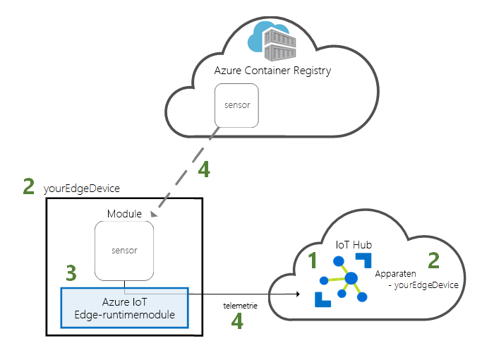
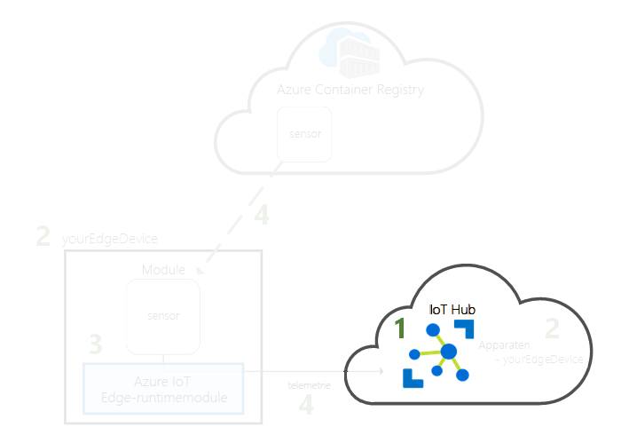
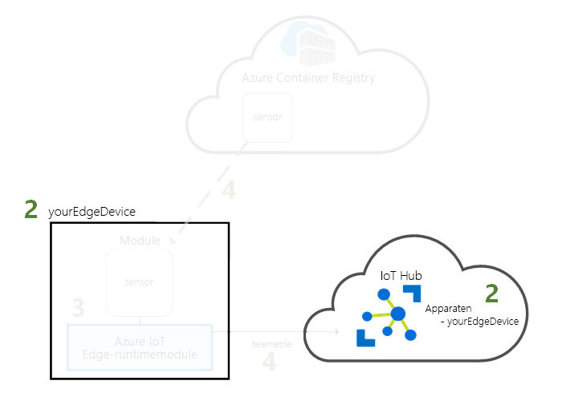
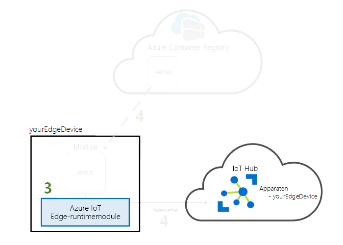
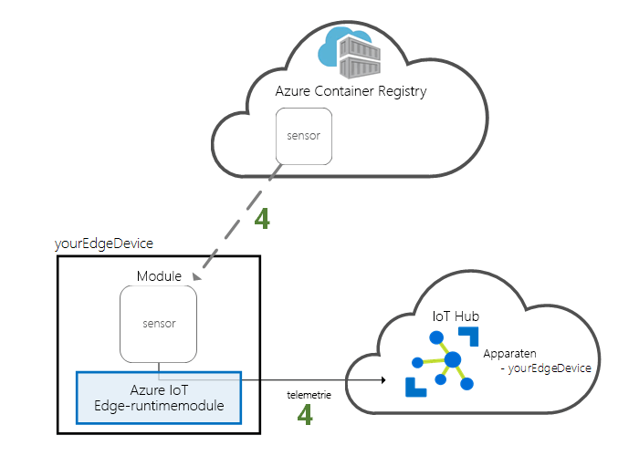

# <a name="quickstart-deploy-your-first-iot-edge-module-from-the-azure-portal-to-a-windows-device---preview"></a>Snelstart: Uw eerste IoT Edge-module van Azure Portal naar een Windows-apparaat implementeren - preview

In deze snelstart gebruikt u de cloudinterface van Azure IoT Edge om vooraf geschreven code op afstand naar een IoT Edge-apparaat te implementeren. Om dit te bereiken, moet u eerst uw Windows-apparaat gebruiken om een IoT Edge-apparaat te simuleren, waarna u er een module naar kunt implementeren.

In deze snelstart leert u de volgende zaken:

1. Een IoT Hub maken.
2. Een IoT Edge-apparaat registreren in uw IoT-hub.
3. De IoT Edge-runtime op uw apparaat installeren en starten.
4. Op afstand een module op een IoT Edge-apparaat implementeren en telemetrie naar IoT Hub verzenden.



De module die u in deze snelstart implementeert, is een gesimuleerde sensor waarmee temperatuur-, luchtvochtigheids- en drukgegevens worden gegenereerd. De andere Azure IoT Edge-zelfstudies bouwen voort op het werk dat u hier doet door modules te implementeren waarmee de gesimuleerde gegevens worden geanalyseerd voor zakelijke inzichten.

>[!NOTE]
>De IoT Edge-runtime op Windows bevindt zich in [openbare preview](https://azure.microsoft.com/support/legal/preview-supplemental-terms/).

Als u nog geen actief abonnement op Azure hebt, maakt u een [gratis Azure-account](https://azure.microsoft.com/free) aan voordat u begint.

[!INCLUDE [cloud-shell-try-it.md](../../includes/cloud-shell-try-it.md)]

U gebruikt de Azure CLI om veel van de stappen in deze snelstart uit te voeren, en Azure IoT heeft een extensie om extra functionaliteit in te schakelen.

Voeg de Azure IoT-extensie toe aan het exemplaar van Cloud Shell.

   ```azurecli-interactive
   az extension add --name azure-cli-iot-ext
   ```

## <a name="prerequisites"></a>Vereisten

Cloudresources:

* Een resourcegroep voor het beheren van alle resources die u in deze snelstart maakt.

   ```azurecli-interactive
   az group create --name IoTEdgeResources --location westus
   ```

IoT Edge-apparaat:

* Een Windows-computer of virtuele machine die fungeert als uw IoT Edge-apparaat. Gebruik een ondersteunde Windows-versie:
  * Windows 10 of hoger
  * Windows Server 2016 of hoger
* Als dit een Windows-computer is, controleert u of deze voldoet aan de [systeemvereisten](https://docs.microsoft.com/virtualization/hyper-v-on-windows/reference/hyper-v-requirements) voor Hyper-V.
* Als u een virtuele machine gebruikt, schakelt u [geneste virtualisatie](https://docs.microsoft.com/virtualization/hyper-v-on-windows/user-guide/nested-virtualization) in en wijst u ten minste 2 GB geheugen toe.
* Installeer [Docker voor Windows](https://docs.docker.com/docker-for-windows/install/) en contoleer of dit wordt uitgevoerd.

> [!TIP]
> Tijdens de installatie van Docker is er een optie voor het gebruik van Windows-containers of Linux-containers. In deze snelstart wordt beschreven hoe u de IoT Edge-runtime configureert voor gebruik met Linux-containers.

## <a name="create-an-iot-hub"></a>Een IoT Hub maken

Begin met de snelstart door uw IoT Hub met Azure CLI te maken.



Het gratis niveau van IoT Hub werkt voor deze snelstart. Als u in het verleden IoT Hub hebt gebruikt en al een gratis hub hebt gemaakt, kunt u die IoT-hub gebruiken. Elk abonnement biedt toegang tot slechts één gratis IoT-hub.

Met de volgende code wordt een gratis **F1**-hub gemaakt in de resourcegroep **IoTEdgeResources**. Vervang *{hub_name}* door een unieke naam voor uw IoT-hub.

   ```azurecli-interactive
   az iot hub create --resource-group IoTEdgeResources --name {hub_name} --sku F1
   ```

   Als er een fout optreedt omdat er al één gratis hub in uw abonnement is, wijzigt u de SKU in **S1**. Als u het foutbericht ontvangt dat de naam van de IoT Hub niet beschikbaar is, betekent dit dat iemand anders al een hub met die naam heeft. Probeer een andere naam. 

## <a name="register-an-iot-edge-device"></a>Een IoT Edge-apparaat registreren

Registreer een IoT Edge-apparaat bij uw net gemaakte IoT Hub.


Maak een apparaat-id voor uw gesimuleerde apparaat, zodat het met uw IoT-hub kan communiceren. De apparaat-id is opgeslagen in de cloud, en u gebruikt een unieke apparaatverbindingsreeks om een fysiek apparaat te koppelen aan een apparaat-id.

Omdat IoT Edge-apparaten zich anders gedragen en anders kunnen worden beheerd dan gewone IoT-apparaten, declareert u deze identiteit met een `--edge-enabled`-vlag als een identiteit van een IoT Edge-apparaat. 

1. Voer in Azure Cloud Shell de volgende opdracht in om een ​​apparaat met de naam **myEdgeDevice** in uw hub te maken.

   ```azurecli-interactive
   az iot hub device-identity create --device-id myEdgeDevice --hub-name {hub_name} --edge-enabled
   ```

   Als u een foutbericht over iothubowner-beleidssleutels ontvangt, controleer dan of in de cloudshell de meest recente versie van de azure-cli-iot-ext-extensie wordt uitgevoerd. 

2. Haal de verbindingsreeks voor uw apparaat op, zodat uw fysieke apparaat aan de bijbehorende identiteit in IoT Hub wordt gekoppeld.

   ```azurecli-interactive
   az iot hub device-identity show-connection-string --device-id myEdgeDevice --hub-name {hub_name}
   ```

3. Kopieer de verbindingsreeks en sla deze op. U gebruikt deze waarde voor het configureren van de IoT Edge-runtime in de volgende sectie.

## <a name="install-and-start-the-iot-edge-runtime"></a>De IoT Edge-runtime installeren en starten

Installeer de Azure IoT Edge-runtime op uw IoT Edge-apparaat en configureer deze met een apparaatverbindingsreeks.


De IoT Edge-runtime wordt op alle IoT Edge-apparaten geïmplementeerd. Deze bevat drie onderdelen. De **IoT Edge-beveiligingsdaemon** wordt telkens gestart wanneer een Edge-apparaat wordt opgestart en start het apparaat op door de IoT Edge-agent te starten. De **IoT Edge-agent** faciliteert de implementatie en bewaking van modules op het IoT Edge-apparaat, inclusief de IoT Edge-hub. Met de **IoT Edge-hub** wordt de communicatie tussen modules op het IoT Edge-apparaat en tussen het apparaat en IoT Hub beheerd.

Tijdens de installatie van de runtime wordt u naar de apparaatverbindingsreeks gevraagd. Gebruik de tekenreeks die u hebt opgehaald via de Azure CLI. Deze tekenreeks koppelt uw fysieke apparaat aan de IoT Edge-apparaat-id in Azure.

Met de instructies in dit gedeelte wordt de IoT Edge-runtime met Linux-containers geconfigureerd. Als u Windows-containers wilt gebruiken, raadpleegt u [Azure IoT Edge-runtime installeren onder Windows voor gebruik met Windows-containers](how-to-install-iot-edge-windows-with-windows.md).

### <a name="connect-to-your-iot-edge-device"></a>Verbinding maken met uw IoT Edge-apparaat

De stappen in deze sectie worden allemaal uitgevoerd op uw IoT Edge-apparaat. Als u uw eigen computer als IoT Edge-apparaat gebruikt, kunt u dit gedeelte overslaan. Als u een virtuele machine of secundaire hardware gebruikt, wilt u nu verbinding maken met die computer. 

### <a name="download-and-install-the-iot-edge-service"></a>De IoT Edge-service downloaden en installeren

Gebruik PowerShell om de IoT Edge-runtime te downloaden en te installeren. Gebruik de apparaatverbindingsreeks die u hebt opgehaald via IoT Hub om uw apparaat te configureren.

1. Voer PowerShell op uw IoT Edge-apparaat uit als administrator.

2. Download en installeer de IoT Edge-service op uw apparaat.

   ```powershell
   . {Invoke-WebRequest -useb aka.ms/iotedge-win} | Invoke-Expression; `
   Install-SecurityDaemon -Manual -ContainerOs Linux
   ```

3. Als u wordt gevraagd naar een **DeviceConnectionString**, geeft u de tekenreeks op die u in de vorige sectie hebt gekopieerd. Plaats geen aanhalingstekens rond de verbindingsreeks.

### <a name="view-the-iot-edge-runtime-status"></a>De IoT Edge runtime-status bekijken

Controleer of de runtime goed is geïnstalleerd en geconfigureerd.

1. Controleer de status van de IoT Edge-service.

   ```powershell
   Get-Service iotedge
   ```

2. Als u problemen met de service moet oplossen, haalt u de servicelogboeken op.

   ```powershell
   # Displays logs from today, newest at the bottom.

   Get-WinEvent -ea SilentlyContinue `
    -FilterHashtable @{ProviderName= "iotedged";
      LogName = "application"; StartTime = [datetime]::Today} |
    select TimeCreated, Message |
    sort-object @{Expression="TimeCreated";Descending=$false} |
    format-table -autosize -wrap
   ```

3. Bekijk alle modules die op uw IoT Edge-apparaat worden uitgevoerd. Aangezien de service net voor het eerst is gestart, zou u moeten zien dat alleen de **edgeAgent**-module actief is. De edgeAgent-module wordt standaard uitgevoerd en helpt bij het installeren en starten van aanvullende modules die u op uw apparaat implementeert.

   ```powershell
   iotedge list
   ```

   

Uw IoT Edge-apparaat is nu geconfigureerd. Het is gereed voor de uitvoering van modules die in de cloud zijn geïmplementeerd.

## <a name="deploy-a-module"></a>Een module implementeren

Beheer uw Azure IoT Edge-apparaat vanuit de cloud om een module te implementeren waarmee telemetriegegevens worden verzonden naar IoT Hub.


[!INCLUDE [iot-edge-deploy-module](../../includes/iot-edge-deploy-module.md)]

## <a name="view-generated-data"></a>Gegenereerde gegevens weergeven

In deze snelstart hebt u een nieuw IoT Edge-apparaat gemaakt en de IoT Edge-runtime erop geïnstalleerd. Vervolgens hebt u Azure Portal gebruikt om een IoT Edge-module te pushen om te worden uitgevoerd op het apparaat zonder dat er wijzigingen in het apparaat zelf aangebracht hoefden te worden. In dit geval worden met de module die u hebt gepusht, omgevingsgegevens gemaakt die u voor de zelfstudies kunt gebruiken.

Bevestig dat de module die vanuit de cloud is geïmplementeerd, op uw IoT Edge -apparaat wordt uitgevoerd.

```powershell
iotedge list
```

   

Bekijk de berichten die vanaf de module tempSensor naar de cloud worden verzonden.

```powershell
iotedge logs tempSensor -f
```

  

U kunt de berichten ook zien binnenkomen bij uw IoT Hub door de [Azure IoT Toolkit-extensie voor Visual Studio Code](https://marketplace.visualstudio.com/items?itemName=vsciot-vscode.azure-iot-toolkit) te gebruiken. 

## <a name="clean-up-resources"></a>Resources opschonen

Als u wilt doorgaan met de IoT Edge-zelfstudies, kunt u het apparaat gebruiken dat u hebt geregistreerd en ingesteld in deze snelstart. Anders kunt u de Azure-resources die u hebt gemaakt en de IoT Edge-runtime van uw apparaat verwijderen.

### <a name="delete-azure-resources"></a>Azure-resources verwijderen

Als u uw virtuele machine en IoT-hub in een nieuwe resourcegroep hebt gemaakt, kunt u die groep en alle bijbehorende resources verwijderen. Controleer de inhoud van de resourcegroep zorgvuldig om te na te gaan of er niets is dat u wilt behouden. Als u niet de hele groep wilt verwijderen, kunt u in plaats daarvan afzonderlijke resources verwijderen.

Verwijder de groep **IoTEdgeResources**.

   ```azurecli-interactive
   az group delete --name IoTEdgeResources
   ```

### <a name="remove-the-iot-edge-runtime"></a>De IoT Edge-runtime verwijderen

Als u van plan bent om het IoT Edge-apparaat in de toekomst voor testdoeleinden te gebruiken, maar niet wilt dat de module tempSensor gegevens naar uw IoT-hub verzendt als die niet wordt gebruikt, gebruikt u de volgende opdracht om de IoT Edge-service te beëindigen.

   ```powershell
   Stop-Service iotedge -NoWait
   ```

U kunt de service opnieuw starten wanneer u klaar om weer te gaan testen.

   ```powershell
   Start-Service iotedge
   ```

Als u de installaties van uw apparaat wilt verwijderen, gebruikt u de volgende opdrachten.  

Verwijder de IoT Edge-runtime.

   ```powershell
   . {Invoke-WebRequest -useb aka.ms/iotedge-win} | Invoke-Expression; `
   Uninstall-SecurityDaemon
   ```

Wanneer de IoT Edge-runtime is verwijderd, worden de containers die deze heeft gemaakt gestopt. Ze worden echter niet van uw apparaat verwijderd. Geef alle containers weer.

   ```powershell
   docker ps -a
   ```

Verwijder de containers die door de IoT Edge-runtime op uw apparaat zijn gemaakt. Verander de naam van de container tempSensor als u die anders had genoemd.

   ```powershell
   docker rm -f tempSensor
   docker rm -f edgeHub
   docker rm -f edgeAgent
   ```
   
## <a name="next-steps"></a>Volgende stappen

In deze snelstart hebt u een nieuw IoT Edge-apparaat gemaakt en de Azure IoT Edge-cloudinterface gebruikt om code te implementeren op het apparaat. U hebt nu een testapparaat waarmee ruwe gegevens over de omgeving worden gegenereerd.

U kunt nu doorgaan met elke andere zelfstudie om te leren hoe Azure IoT Edge u verder kan helpen bij het omzetten van uw gegevens in bedrijfsinzichten.

> [!div class="nextstepaction"]
> [Sensorgegevens filteren met behulp van een Azure-functie](tutorial-deploy-function.md)
