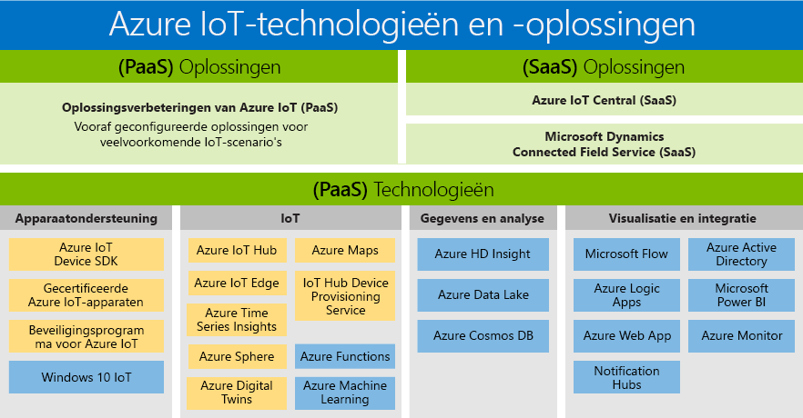

# Technologieën en oplossingen voor IoT (Internet of Things): PaaS en SaaS

Microsoft heeft een portfolio gebouwd die ondersteuning biedt voor de behoeften van alle klanten, waardoor iedereen toegang heeft tot de voordelen van digitale transformatie. De Azure IoT-productportofolio is een overzicht van de beschikbare PaaS-/SaaS-technologieën en -oplossingen. Het geeft twee beschikbare paden weer voor het bouwen van uw eigen oplossing:

- Platform as a Service (PaaS): uw toepassing ontwikkelen met een van de volgende services.
    - [Azure IoT-oplossingsverbeteringen](https://www.azureiotsolutions.com/), een verzameling van vooraf geconfigureerde oplossingen van ondernemingsklasse, stellen u in staat om de ontwikkeling van aangepaste IoT-oplossingen te versnellen, of 
    - [Azure Digital Twins](https://azure.microsoft.com/services/digital-twins/), een service waarmee u de fysieke omgeving kunt gebruiken om contextbewuste IoT-oplossingen te maken aan de hand van een grafiek op basis van ruimtelijke intelligence en domeinspecifieke objectmodellen.

- SaaS (Software as a Service): ga snel aan de slag met [Azure IoT Central](https://azure.microsoft.com/services/iot-central/), de nieuwe SaaS-oplossing voor het ontwikkelen van IoT-toepassingen, zonder de complexiteit van de IoT-oplossing. Als uw organisatie niet beschikt over de resources voor het bouwen van uw eigen IoT-oplossing, is Azure IoT Central de beste keuze. Dit is een IoT-oplossing zonder code waarmee u in enkele minuten modellen, dashboards en regels kunt maken.

## Oplossingen

Snel aan de slag met oplossingsversnellers en SaaS-aanbiedingen. Kies uit vooraf geconfigureerde oplossingen die algemene IoT-scenario’s mogelijk maken, zoals extern beheren, voorspeld onderhoud en verbonden factory, om een volledig aanpasbare oplossing te maken. Of gebruik Azure IoT Central, een volledig beheerde end-to-endoplossing die krachtige IoT-scenario’s mogelijk maakt, zonder dat kennis op het gebied van cloudoplossingen is vereist.

### Azure IoT-oplossingsversnellers (PaaS)

Azure IoT-oplossingsversnellers zijn aanpasbare PaaS-oplossingen die een hoge mate van beheer van de IoT-oplossing bieden. Als IoT in uw bedrijf wordt geïmplementeerd voor verbonden bewerkingen of als er aanpasbare vereisten zijn voor verbonden producten, bieden Azure IoT-oplossingsversnellers het beheer dat u nodig hebt. 

Organisaties met een groot aantal apparaten of apparaatmodellen, en fabrikanten die op zoek zijn naar verbonden factory-oplossingen, zijn voorbeelden van bedrijven die hun voordeel kunnen doen met IoT-oplossingsversnellers. Door het maken van zeer aanpasbare oplossingen die op maat zijn gemaakt voor complexe behoeften, bieden IoT-oplossingsversnellers: 

- Vooraf gemaakte oplossingen
    - Externe bewaking
    - Verbonden factory
    - Voorspellend onderhoud
    - Apparaatsimulatie
- De mogelijkheid om te implementeren in slechts enkele minuten
- Een versnelde tijd-tot-waarde
- Oplossingen die een hoge mate van beheer bieden 
 
### Azure IoT Central (SaaS)

Azure IoT Central is een volledig beheerde SaaS-oplossing, waarmee u snel aan de slag kunt gaan met minimale IoT-ervaring. Als uw bedrijf snelheid boven aanpassing stelt, zijn SaaS-modellen waarschijnlijk zeer geschikt voor uw IoT-implementatiebehoeften. 

Organisaties met minder apparaatmodellen, meer voorspelbare modellen, en beperkte IoT-/IT-mogelijkheden, kunnen nu hun voordeel doen met IoT via een SaaS-methode. Bedrijven die voorheen de tijd, het geld en de kennis misten om verbonden producten te ontwikkelen, kunnen nu snel aan de slag gaan met Azure IoT Central. Microsoft is toonaangevend in het leveren van een volledig ontwikkelde SaaS-oplossing die voldoet aan de algemene vereisten voor IoT-implementaties. 

- Volledig beheerde IoT SaaS
- Geen kennis op het gebied van cloudoplossing vereist
- Configureerbaar aan uw behoeften
- Ideaal voor eenvoudige IoT-behoeften

### Azure IoT-oplossingsversnellers en Azure IoT Central vergelijken

Azure IoT biedt verschillende opties als u een typische [IoT-oplossingsarchitectuur](/azure/iot-fundamentals/iot-introduction#iot-solution-architecture) wilt implementeren, [Azure IoT-oplossingsversnellers](/azure/iot-suite) en [Azure IoT Central](https://www.microsoft.com/internet-of-things/iot-central-saas-solutions). Beide zijn geschikt voor verschillende sets vereisten van klanten.

[Azure IoT Hub](https://azure.microsoft.com/services/iot-hub/) is de kern-PaaS van Azure waarvan zowel Azure IoT Central als Azure IoT-oplossingsversnellers gebruikmaken. IoT Hub maakt stabiele en veilige tweerichtingscommunicatie tussen miljoenen IoT-apparaten en een cloudoplossing mogelijk. Met IoT Hub kunt u de uitdagingen van IoT-implementatie aan, zoals:

* Connectiviteit en beheer van grote volumes aan apparaten.
* Telemetrieopname van groot volume.
* Opdracht en besturing van apparaten.
* Afdwinging van apparaatbeveiliging.

Het kiezen van uw Azure IoT-product is een belangrijk onderdeel van het plannen van uw IoT-oplossing. IoT Hub is een afzonderlijke Azure-service die zelfstandig geen volledige IoT-oplossing biedt. IoT Hub kan worden gebruikt als uitgangspunt voor elke IoT-oplossing. U hoeft hiervoor niet Azure IoT-oplossingsversnellers of Azure IoT Central te gebruiken. Zowel Azure IoT-oplossingsversnellers als Azure IoT Central maken gebruik van IoT Hub, samen met andere Azure-services. De volgende tabel geeft een overzicht van de belangrijkste verschillen tussen Azure IoT-oplossingsversnellers en Azure IoT Central, om u te helpen de juiste oplossing voor uw vereisten te kiezen:

|                        | Azure IoT-oplossingsversnellers | Azure IoT Central |
| ---------------------- | --------- | ----------- |
| Primair gebruik | Snellere ontwikkeling van een aangepaste IoT-oplossing die maximale flexibiliteit nodig heeft. | Kortere time-to-market voor eenvoudige IoT-oplossingen waarvoor geen uitgebreide serviceaanpassing is vereist. |
| Toegang tot onderliggende PaaS-services          | U hebt toegang tot de onderliggende Azure-services om deze te beheren of indien nodig te vervangen. | SaaS. Volledig beheerde oplossing; de onderliggende services worden niet weergegeven. |
| Flexibiliteit            | Hoog. De code voor de microservices is open-source en u kunt deze op elke gewenste manier wijzigen. Daarnaast kunt u de implementatie-infrastructuur aanpassen.| Gemiddeld. U kunt de ingebouwde browsergebaseerde gebruikerservaring gebruiken om het oplossingsmodel en aspecten van de gebruikersinterface aan te passen. De infrastructuur kan niet worden aangepast, omdat de verschillende onderdelen niet worden weergegeven.|
| Kennisniveau                 | Gemiddeld-hoog. U heeft ervaring met Java of .NET nodig om de back-end van de oplossing aan te passen. U heeft ervaring met JavaScript nodig om de visualisatie aan te passen. | Laag. U heeft modelleerervaring nodig om de oplossing aan te passen. Ervaring met codering is niet vereist. |
| Opstartervaring | Oplossingsversnellers implementeren algemene IoT-scenario's. Kan in enkele minuten worden geïmplementeerd. | Toepassingssjablonen en apparaatsjablonen bieden vooraf gebouwde modellen. Kan in enkele minuten worden geïmplementeerd. |
| Prijzen                | U kunt de services afstellen om de kosten te beperken. | Eenvoudige, voorspelbare prijsstructuur. |

Uw keuze voor welk product u wilt gebruiken om uw IoT-oplossing te maken, wordt uiteindelijk bepaald door:

* Uw zakelijke vereisten
* Het type oplossing dat u wilt maken.
* De kwalificaties van uw organisatie voor het maken en op de lange termijn onderhouden van de oplossing

## Technologieën (PaaS)

PaaS-technologieën (Platform-as-as-Service) bieden de meest uitgebreide IoT-portfolio met platformservices die het hele Azure-platform beslaan en u in staat stellen om eenvoudig alle aspecten van uw IoT-oplossing te maken, aan te passen en te beheren. Breng bidirectionele communicaties tot stand met miljarden IoT-apparaten en beheer uw IoT-apparaten op schaal. Integreer vervolgens uw IoT-apparaatgegevens met andere platformservices, zoals Azure Cosmos DB en Azure Time Series Insights, om inzicht in uw oplossing te verbeteren. 

### Ondersteuning voor apparaten

Ga vol vertrouwen aan de slag met uw IoT-projecten met behulp van [Azure IoT Starter Kits](https://catalog.azureiotsuite.com/kits) of kies uit honderden gecertificeerde IoT-apparaten in de [apparaatcatalogus](http://catalog.azureiotsuite.com/). Alle apparaten zijn platformneutraal en getest om naadloos verbinding te maken met IoT Hub.
Verbind al uw apparaten met Azure IoT met behulp van de open-source [apparaat-SDK’s](/azure/iot-hub/iot-hub-devguide-sdks). De SDK’s bieden ondersteuning voor meerdere besturingssystemen, zoals Linux Windows en besturingssystemen in realtime, alsook voor meerdere programmeertalen, zoals [C](https://github.com/Azure/azure-iot-sdk-c), [Node.js](https://github.com/Azure/azure-iot-sdk-node), [Java](https://github.com/Azure/azure-iot-sdk-java), [.NET](https://github.com/Azure/azure-iot-sdk-csharp) en [Python](https://github.com/Azure/azure-iot-sdk-python).

### IoT 
[Azure IoT Hub](https://azure.microsoft.com/services/iot-hub/) is een volledig beheerde service die betrouwbare en beveiligde bidirectionele communicatie mogelijk maakt tussen miljoenen IoT-apparaten en een oplossings-back-end. De Azure IoT Hub Device Provisioning Service is een Helper-service voor IoT Hub die Just-In-Time-inrichting naar de juiste IoT-hub mogelijk maakt zonder tussenkomst van de gebruiker, zodat klanten miljoenen apparaten op een veilige en schaalbare manier kunnen inrichten.

### Edge
[Azure IoT Edge](https://azure.microsoft.com/services/iot-edge/) is een IoT-service. Deze service is bedoeld voor klanten die ook gegevens willen analyseren op apparaten, oftewel ‘naar de marge’. Door delen van uw werkbelasting naar de marge te verplaatsen, is er sprake van een verminderde redundantie en kunt u offlinescenario’s gebruiken.

### Ruimtelijke intelligentie
[Azure Digital Twins](https://azure.microsoft.com/services/digital-twins/) is een IoT-service waarmee u een model van een fysieke omgeving kunt maken. U krijgt toegang tot een grafiek op basis van ruimtelijke intelligence om de relaties tussen mensen, ruimten en apparaten te modelleren. Door gegevens uit de digitale en fysieke wereld te correleren, kunt u contextbewuste oplossingen maken.  

### Gegevens en analyse
Maak gebruik van een breed scala aan PaaS-voordelen voor Azure-gegevens en -analyses in uw IoT-oplossing: van slimme cloudfuncties in de marge met Azure Machine Learning, tot het op een kostenbesparende manier opslaan van IoT-apparaatgegevens met Azure Data lake, en het visualiseren van een groot aantal gegevens van IoT-apparaten met [Azure Time Series Insights](https://azure.microsoft.com/services/time-series-insights/).

### Visualisatie en integratie
Microsoft Azure biedt een volledige cloudoplossing die een constant groeiende verzameling geïntegreerde cloudservices combineert met een toonaangevende toezegging voor de beveiliging en privacy van uw gegevens. Meer informatie over [Microsoft Azure](https://azure.microsoft.com/).

## Volgende stappen

Ga naar de sectie [Aan de slag in de IoT Hub-documentatie](/azure/iot-hub/iot-hub-get-started) voor snelle en eenvoudige informatie over IoT-functies. Of volg een van de [IoT Edge-zelfstudies](/azure/iot-edge/tutorial-simulate-device-windows) voor een uitgebreidere praktische uitleg.
