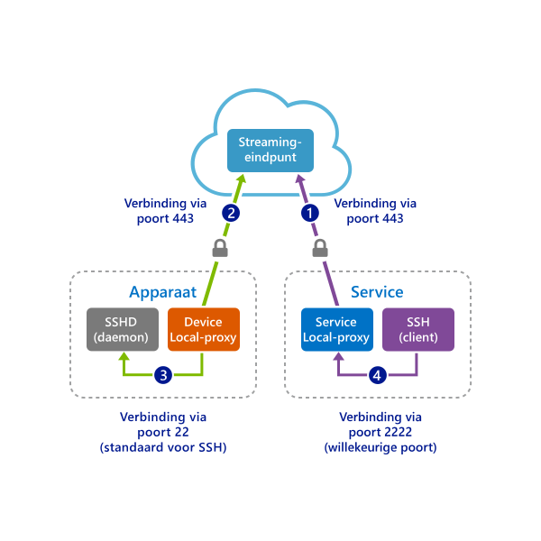

# <a name="quickstart-sshrdp-over-iot-hub-device-streams-using-c-proxy-application-preview"></a>Quickstart: SSH/RDP via IoT Hub-apparaatstreams met behulp van C#-proxytoepassingen (preview)

[!INCLUDE [iot-hub-quickstarts-4-selector](../../includes/iot-hub-quickstarts-4-selector.md)]

[IoT Hub-apparaatstreams](./iot-hub-device-streams-overview.md) zorgen ervoor dat service- en apparaattoepassingen kunnen communiceren op een beveiligde manier die de firewall toestaat. Bekijk [deze pagina](./iot-hub-device-streams-overview.md#local-proxy-sample-for-ssh-or-rdp) voor een overzicht van de instellingen.

In dit document wordt beschreven hoe u tunneling van SSH-verkeer instelt (met behulp van poort 22) via apparaatstreams. De configuratie voor RDP-verkeer is vergelijkbaar en vereist een eenvoudige wijziging in de configuratie. Omdat apparaatstreams toepassings- en protocolneutraal zijn, kan de bestaande quickstart zo worden bewerkt (door de communicatiepoorten te wijzigen) dat er andere soorten toepassingsverkeer mogelijk zijn.

## <a name="how-it-works"></a>Hoe werkt het?
In de onderstaande afbeelding ziet u hoe het apparaat en de proxyprogramma's in de service end-to-end-connectiviteit mogelijk maken tussen de SSH-client- en SSH-daemonprocessen. Gedurende de openbare preview biedt de C SDK alleen ondersteuning voor apparaatstreams aan de apparaatzijde. Daarom bevat deze quickstart alleen instructies voor het uitvoeren van de proxytoepassing in het apparaat. Voer een bijbehorende proxytoepassing in de service uit. Deze is beschikbaar in de handleidingen [Quickstart voor C#](./quickstart-device-streams-proxy-csharp.md) of [Quickstart voor Node.js](./quickstart-device-streams-proxy-nodejs.md).




1. De proxy in de service maakt verbinding met IoT Hub en begint een apparaatstream naar het doelapparaat.

2. De proxy in het apparaat voltooit de stream-handshake en zet een end-to-end-streaming-tunnel op van het streaming-eindpunt van IoT Hub naar de servicezijde.

3. De proxy in het apparaat maakt verbinding met de SSH-daemon (SSHD) die naar poort 22 van het apparaat luistert (dit kan worden geconfigureerd, zoals [hieronder](#run-the device-local-proxy-application) is beschreven).

4. De proxy in de service wacht op nieuwe SSH-verbindingen van de gebruiker door te luisteren naar een opgegeven poort, in dit geval poort 2222 (dit kan eveneens worden geconfigureerd, zoals [hieronder](#run-the-device-local-proxy-application) is beschreven). Wanneer een gebruiker verbinding maakt via een SSH-client, zorgt de tunnel ervoor dat SSH-toepassingsverkeer kan worden overgebracht tussen de SSH-client en serverprogramma's.

> [!NOTE]
> SSH-verkeer dat via een apparaatstream wordt verstuurd, gaat via een tunnel van het streaming-eindpunt van IoT Hub in plaats van dat het rechtstreeks tussen de service en het apparaat wordt verzonden. Dit heeft [deze voordelen](./iot-hub-device-streams-overview.md#benefits). In de afbeelding ziet u bovendien hoe de SSH-daemon wordt uitgevoerd op hetzelfde apparaat (of machine) als de proxy in het apparaat. In deze quickstart zorgt de verstrekking van het IP-adres van de SSH-daemon ervoor dat de proxy in het apparaat en daemon ook op verschillende computers worden uitgevoerd.

[!INCLUDE [cloud-shell-try-it.md](../../includes/cloud-shell-try-it.md)]

Als u nog geen abonnement op Azure hebt, maakt u een [gratis account](https://azure.microsoft.com/free/?WT.mc_id=A261C142F) aan voordat u begint.

## <a name="prerequisites"></a>Vereisten

* [Visual Studio 2017](https://www.visualstudio.com/vs/) installeren met de workload ['Desktopontwikkeling met C++'](https://www.visualstudio.com/vs/support/selecting-workloads-visual-studio-2017/) ingeschakeld.
* Installeer de meest recente versie van [Git](https://git-scm.com/download/).

## <a name="prepare-the-development-environment"></a>De ontwikkelomgeving voorbereiden

Voor deze quickstart gebruikt u de [Azure IoT device-SDK voor C](iot-hub-device-sdk-c-intro.md). U bereidt een ontwikkelomgeving voor die wordt gebruikt om de [Azure IoT C SDK](https://github.com/Azure/azure-iot-sdk-c) van GitHub te klonen en te bouwen. De SDK op GitHub bevat de voorbeeldcode gebruikt in deze quickstart. 


1. Download versie 3.11.4 van het [CMake-buildsysteem](https://cmake.org/download/). Controleer het gedownloade binaire bestand met behulp van de bijbehorende cryptografische hash-waarde. In het volgende voorbeeld is Windows PowerShell gebruikt om de cryptografische hash te controleren voor versie 3.11.4 van de x64 MSI-distributie:

    ```PowerShell
    PS C:\Downloads> $hash = get-filehash .\cmake-3.11.4-win64-x64.msi
    PS C:\Downloads> $hash.Hash -eq "56e3605b8e49cd446f3487da88fcc38cb9c3e9e99a20f5d4bd63e54b7a35f869"
    True
    ```
    
    De volgende hash-waarden voor versie 3.11.4 werden vermeld op de CMake-site ten tijde van dit schrijven:

    ```
    6dab016a6b82082b8bcd0f4d1e53418d6372015dd983d29367b9153f1a376435  cmake-3.11.4-Linux-x86_64.tar.gz
    72b3b82b6d2c2f3a375c0d2799c01819df8669dc55694c8b8daaf6232e873725  cmake-3.11.4-win32-x86.msi
    56e3605b8e49cd446f3487da88fcc38cb9c3e9e99a20f5d4bd63e54b7a35f869  cmake-3.11.4-win64-x64.msi
    ```

    Het is belangrijk dat de vereisten voor Visual Studio met (Visual Studio en de workload Desktopontwikkeling met C++) op uw computer zijn geïnstalleerd **voordat** de `CMake`-installatie wordt gestart. Zodra aan de vereisten is voldaan en de download is geverifieerd, installeert u het CMake-bouwsysteem.

2. Open een opdrachtprompt of Git Bash-shell. Voer de volgende opdracht uit voor het klonen van de [Azure IoT C SDK](https://github.com/Azure/azure-iot-sdk-c) GitHub-opslagplaats:
    
    ```
    git clone https://github.com/Azure/azure-iot-sdk-c.git --recursive
    ```
    De grootte van deze opslagplaats is momenteel ongeveer 220 MB. Deze bewerking kan enkele minuten in beslag nemen.


3. Maak de submap `cmake` in de hoofdmap van de Git-opslagplaats en navigeer naar die map. 

    ```
    cd azure-iot-sdk-c
    git checkout public-preview
    mkdir cmake
    cd cmake
    ```

4. Voer de volgende opdracht uit om een versie van de SDK te compileren die specifiek is voor uw clientplatform voor ontwikkeling. Er wordt in Windows een Visual Studio-oplossing voor het gesimuleerde apparaat gegenereerd in de map `cmake`. 

```
    # In Linux
    cmake ..
    make -j
```

Voer in Windows de volgende opdrachten uit in Developer Command Prompt voor uw Visual Studio 2015- of 2017-prompt:

```
    # In Windows
    # For VS2015
    $ cmake .. -G "Visual Studio 15 2015"
    
    # Or for VS2017
    $ cmake .. -G "Visual Studio 15 2017

    # Then build the project
    cmake --build . -- /m /p:Configuration=Release
```
    

## <a name="create-an-iot-hub"></a>Een IoT Hub maken

[!INCLUDE [iot-hub-include-create-hub](../../includes/iot-hub-include-create-hub-device-streams.md)]

## <a name="register-a-device"></a>Een apparaat registreren

Een apparaat moet zijn geregistreerd bij uw IoT-hub voordat het verbinding kan maken. In deze sectie gebruikt u Azure Cloud Shell met de [IoT-extensie](https://docs.microsoft.com/cli/azure/ext/azure-cli-iot-ext/iot?view=azure-cli-latest) om een gesimuleerd apparaat te registreren.

1. Voer de volgende opdrachten uit in Azure Cloud Shell om de IoT Hub CLI-extensie toe te voegen en de apparaat-id te maken. 

   **YourIoTHubName**: vervang deze tijdelijke aanduiding door een door u gekozen naam voor de IoT-hub.

   **MyDevice**: dit is de naam van het geregistreerde apparaat. Gebruik MyDevice, zoals wordt weergegeven. Als u een andere naam voor het apparaat kiest, moet u deze naam ook in de rest van dit artikel gebruiken, en moet u de apparaatnaam bijwerken in de voorbeeldtoepassingen voordat u ze uitvoert.

    ```azurecli-interactive
    az extension add --name azure-cli-iot-ext
    az iot hub device-identity create --hub-name YourIoTHubName --device-id MyDevice
    ```

2. Voer de volgende opdrachten uit in Azure Cloud Shell om de _apparaatverbindingsreeks_ op te halen voor het apparaat dat u zojuist hebt geregistreerd:

   **YourIoTHubName**: vervang deze tijdelijke aanduiding door een door u gekozen naam voor de IoT-hub.

    ```azurecli-interactive
    az iot hub device-identity show-connection-string --hub-name YourIoTHubName --device-id MyDevice --output table
    ```

    Noteer de apparaatverbindingsreeks. Deze ziet eruit zoals in het volgende voorbeeld:

   `HostName={YourIoTHubName}.azure-devices.net;DeviceId=MyDevice;SharedAccessKey={YourSharedAccessKey}`

    U gebruikt deze waarde verderop in de quickstart.


## <a name="ssh-to-a-device-via-device-streams"></a>SSH naar een apparaat via apparaatstreams

### <a name="run-the-device-local-proxy-application"></a>Voer de proxytoepassing in het apparaat uit

- Bewerk het bronbestand `iothub_client/samples/iothub_client_c2d_streaming_proxy_sample/iothub_client_c2d_streaming_proxy_sample.c` en geef de apparaatverbindingsreeks, de IP/ hostnaam van het doelapparaat en de RDP-poort 22 op:
```C
  /* Paste in the your iothub connection string  */
  static const char* connectionString = "[Connection string of IoT Hub]";
  static const char* localHost = "[IP/Host of your target machine]"; // Address of the local server to connect to.
  static const size_t localPort = 22; // Port of the local server to connect to.
```

- Compileer de code als volgt:

```
    # In Linux
    # Go to the sample's folder cmake/iothub_client/samples/iothub_client_c2d_streaming_proxy_sample
    $ make -j


    # In Windows
    # Go to cmake at root of repository
    cmake --build . -- /m /p:Configuration=Release
```

- Voer het gecompileerde programma uit op het apparaat:
```
    # In Linux
    # Go to sample's folder cmake/iothub_client/samples/iothub_client_c2d_streaming_proxy_sample
    $ ./iothub_client_c2d_streaming_proxy_sample

    # In Windows
    # Go to sample's release folder cmake\iothub_client\samples\iothub_client_c2d_streaming_proxy_sample\Release
    iothub_client_c2d_streaming_proxy_sample.exe
```

### <a name="run-the-service-local-proxy-application"></a>Voer de proxytoepassing in de service uit

Zoals [hierboven](#how-it-works) is gezegd, is voor het tot stand brengen van een end-to-end-stream voor tunneling van SSH-verkeer een lokale proxy aan elk zijde nodig (dus bij de service en het apparaat). Gedurende de openbare preview biedt de IoT Hub C# SDK Hub echter alleen ondersteuning voor apparaatstreams aan de apparaatzijde. Gebruik voor de proxy in de service in plaats daarvan de bijbehorende handleidingen in [C#-quickstart](./quickstart-device-streams-proxy-csharp.md) of [Node.js-quickstart](./quickstart-device-streams-proxy-nodejs.md).


### <a name="establish-an-ssh-session"></a>Een SSH-sessie tot stand brengen

Ervan uitgaande dat de proxy's zowel in het apparaat als in de service worden uitgevoerd, gebruikt u nu uw SSH-clientprogramma en maakt u verbinding met de proxy in de service op poort 2222 (in plaats van rechtstreeks verbinding te maken met de SSH-daemon). 

```
ssh <username>@localhost -p 2222
```

U wordt nu gevraagd om uw referenties in te voeren in het SSH-aanmeldingsprompt.


Console-uitvoer in de proxy in het apparaat die verbinding maakt met de SSH-daemon via `IP_address:22`: 

Console-uitvoer van het SSH-clientprogramma (SSH-client communiceert met SSH-daemon door verbinding te maken met poort 22, waar de proxy in de service naar luistert): 

## <a name="clean-up-resources"></a>Resources opschonen

[!INCLUDE [iot-hub-quickstarts-clean-up-resources](../../includes/iot-hub-quickstarts-clean-up-resources-device-streams.md)]

## <a name="next-steps"></a>Volgende stappen

In deze quickstart hebt u een IoT Hub ingesteld, een apparaat geregistreerd, een apparaat en een proxyprogramma in een service geïmplementeerd om een apparaatstream via IoT Hub vast te stellen. U hebt eveneens de proxy's gebruikt om SSH-verkeer via een tunnel te versturen.

Gebruik de onderstaande koppelingen voor meer informatie over apparaatstreams:

> [!div class="nextstepaction"]
> [Overzicht van apparaatstreams](./iot-hub-device-streams-overview.md)
