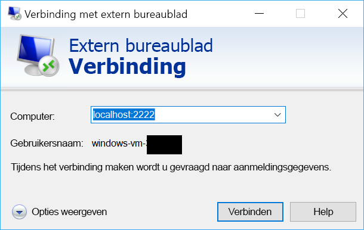

# <a name="quickstart-sshrdp-over-iot-hub-device-streams-using-c-proxy-applications-preview"></a>Quickstart: SSH/RDP via IoT Hub-apparaatstreams met behulp van C#-proxytoepassingen (preview)

[!INCLUDE [iot-hub-quickstarts-4-selector](../../includes/iot-hub-quickstarts-4-selector.md)]

Microsoft Azure IoT Hub apparaat-streams als op dit moment ondersteunt een [preview-functie](https://azure.microsoft.com/support/legal/preview-supplemental-terms/).

[IoT Hub-apparaatstreams](./iot-hub-device-streams-overview.md) zorgen ervoor dat service- en apparaattoepassingen kunnen communiceren op een beveiligde manier die de firewall toestaat. Deze quickstart bevat twee C#-programma's waarmee het mogelijk is dat verkeer van een client/server-toepassing (zoals SSH en RDP) via een apparaatstream in een IoT Hub wordt verstuurd. Kijk [hier](./iot-hub-device-streams-overview.md#local-proxy-sample-for-ssh-or-rdp) voor een overzicht van de instellingen.

We beschrijven eerst de instellingen voor SSH (met poort 22). Vervolgens beschrijven we hoe u de voor de instellingen geconfigureerde poort bewerkt voor RDP. Omdat apparaatstreams toepassings- en protocolneutraal zijn, kan hetzelfde voorbeeld zodanig worden bewerkt dat er andere soorten toepassingsverkeer mogelijk zijn. Daarvoor hoeft meestal alleen de communicatiepoort te worden gewijzigd in de voor de beoogde toepassing bestemde poort.


## <a name="how-it-works"></a>Hoe werkt het?

In de onderstaande afbeelding ziet u hoe het apparaat en de proxyprogramma's in de service in dit voorbeeld end-to-end-connectiviteit mogelijk maken tussen de SSH-client en SSH-daemon. We gaan er hier van uit dat de daemon wordt uitgevoerd op hetzelfde apparaat als de proxy in het apparaat.


1. De proxy in de service maakt verbinding met IoT Hub en begint een apparaatstream naar het doelapparaat met behulp van de apparaat-id.

2. De proxy in het apparaat voltooit de stream-handshake en zet een end-to-end-streaming-tunnel op van het streaming-eindpunt van IoT Hub naar de servicezijde.

3. De proxy in het apparaat maakt verbinding met de SSH-daemon (SSHD) die naar poort 22 van het apparaat luistert (deze poort kan worden geconfigureerd, zoals [hieronder](#run-the-device-local-proxy) is beschreven).

4. De proxy in de service wacht op nieuwe SSH-verbindingen van de gebruiker door te luisteren naar een opgegeven poort, in dit geval poort 2222 (dit kan eveneens worden geconfigureerd, zoals [hieronder](#run-the-service-local-proxy) is beschreven). Wanneer een gebruiker verbinding maakt via een SSH-client, zorgt de tunnel ervoor dat toepassingsverkeer kan worden uitgewisseld tussen de SSH-client en serverprogramma's.

> [!NOTE]
> SSH-verkeer dat via de stream wordt verstuurd, gaat via een tunnel van het streaming-eindpunt van IoT Hub in plaats van dat het rechtstreeks tussen de service en het apparaat wordt verzonden. Dit heeft [deze voordelen](./iot-hub-device-streams-overview.md#benefits).

[!INCLUDE [cloud-shell-try-it.md](../../includes/cloud-shell-try-it.md)]

Als u nog geen abonnement op Azure hebt, maakt u een [gratis account](https://azure.microsoft.com/free/?WT.mc_id=A261C142F) aan voordat u begint.

## <a name="prerequisites"></a>Vereisten

De Preview-versie van apparaat stromen is momenteel alleen ondersteund voor IoT-Hubs die zijn gemaakt in de volgende regio's:

  - **US - centraal**
  - **VS-midden EUAP**

De twee voorbeeldtoepassingen die u uitvoert in deze snelstartgids zijn geschreven in C#. .NET Core SDK 2.1.0 of hoger moet zijn geïnstalleerd op uw ontwikkelcomputer.

U kunt de .NET Core SDK voor meerdere platforms downloaden van [.NET](https://www.microsoft.com/net/download/all).

Gebruik de volgende opdracht om de huidige versie van C# op uw ontwikkelcomputer te controleren:

```
dotnet --version
```

Download het C#-voorbeeldproject van https://github.com/Azure-Samples/azure-iot-samples-csharp/archive/master.zip en pak het ZIP-archief uit.


## <a name="create-an-iot-hub"></a>Een IoT Hub maken

[!INCLUDE [iot-hub-include-create-hub](../../includes/iot-hub-include-create-hub-device-streams.md)]

## <a name="register-a-device"></a>Een apparaat registreren

Een apparaat moet zijn geregistreerd bij uw IoT-hub voordat het verbinding kan maken. In deze snelstart gebruikt u Azure Cloud Shell om een gesimuleerd apparaat te registreren.

1. Voer de volgende opdrachten uit in Azure Cloud Shell om de IoT Hub CLI-extensie toe te voegen en de apparaat-id te maken. 

   **YourIoTHubName**: vervang deze tijdelijke aanduiding door een door u gekozen naam voor de IoT-hub.

   **MyDevice**: dit is de naam van het geregistreerde apparaat. Gebruik MyDevice, zoals wordt weergegeven. Als u een andere naam voor het apparaat kiest, moet u deze naam ook in de rest van dit artikel gebruiken, en moet u de apparaatnaam bijwerken in de voorbeeldtoepassingen voordat u ze uitvoert.

    ```azurecli-interactive
    az extension add --name azure-cli-iot-ext
    az iot hub device-identity create --hub-name YourIoTHubName --device-id MyDevice
    ```

2. Voer de volgende opdrachten uit in Azure Cloud Shell om de _apparaatverbindingsreeks_ op te halen voor het apparaat dat u zojuist hebt geregistreerd:

   **YourIoTHubName**: vervang deze tijdelijke aanduiding door een door u gekozen naam voor de IoT-hub.

    ```azurecli-interactive
    az iot hub device-identity show-connection-string --hub-name YourIoTHubName --device-id MyDevice --output table
    ```

    Noteer de apparaatverbindingsreeks. Deze ziet eruit zoals in het volgende voorbeeld:

   `HostName={YourIoTHubName}.azure-devices.net;DeviceId=MyDevice;SharedAccessKey={YourSharedAccessKey}`

    U gebruikt deze waarde verderop in de snelstartgids.

3. U hebt ook de _serviceverbindingsreeks_ van uw IoT Hub nodig, zodat de toepassing aan de servicezijde verbinding kan maken met uw IoT Hub en een apparaatstream kan opzetten. Met de volgende opdracht haalt u deze waarde voor uw IoT-hub op:

   **YourIoTHubName**: vervang deze tijdelijke aanduiding door een door u gekozen naam voor de IoT-hub.

    ```azurecli-interactive
    az iot hub show-connection-string --policy-name service --name YourIoTHubName
    ```

    Noteer de geretourneerde waarde, die er als volgt uitziet:

   `"HostName={YourIoTHubName}.azure-devices.net;SharedAccessKeyName=service;SharedAccessKey={YourSharedAccessKey}"`
    

## <a name="ssh-to-a-device-via-device-streams"></a>SSH naar een apparaat via apparaatstreams

### <a name="run-the-device-local-proxy"></a>Voer de proxy in het apparaat uit

Navigeer naar `device-streams-proxy/device` in uw uitgepakte projectmap. Houd de volgende informatie bij de hand:

| Argumentnaam | Argumentwaarde |
|----------------|-----------------|
| `deviceConnectionString` | De verbindingsreeks van het apparaat dat u eerder hebt gemaakt. |
| `targetServiceHostName` | Het IP-adres waarop de SSH-server luistert (dit is `localhost` als dit hetzelfde IP-adres is als waar de proxy in het apparaat wordt uitgevoerd). |
| `targetServicePort` | De poort die door uw toepassingsprotocol wordt gebruikt (standaard is dit poort 22 voor SSH).  |

Compileer de code en voer deze als volgt uit:

```
cd ./iot-hub/Quickstarts/device-streams-proxy/device/

# Build the application
dotnet build

# Run the application
# In Linux/MacOS
dotnet run $deviceConnectionString localhost 22

# In Windows
dotnet run %deviceConnectionString% localhost 22
```

### <a name="run-the-service-local-proxy"></a>Voer de proxy in de service uit

Navigeer naar `device-streams-proxy/service` in uw uitgepakte projectmap. Houd de volgende informatie bij de hand:

| Parameternaam | Parameterwaarde |
|----------------|-----------------|
| `iotHubConnectionString` | De serviceverbindingsreeks van uw IoT Hub. |
| `deviceId` | De id van het apparaat dat u eerder hebt gemaakt. |
| `localPortNumber` | Een lokale poort waarmee uw SSH-client verbinding maakt. In dit voorbeeld gebruiken we poort 2222, maar u kunt dat wijzigen in willekeurige andere getallen. |

Compileer de code en voer deze als volgt uit:

```
cd ./iot-hub/Quickstarts/device-streams-proxy/service/

# Build the application
dotnet build

# Run the application
# In Linux/MacOS
dotnet run $serviceConnectionString MyDevice 2222

# In Windows
dotnet run %serviceConnectionString% MyDevice 2222
```

### <a name="run-ssh-client"></a>SSH-client uitvoeren

Gebruik nu uw SSH-clientprogramma en maak verbinding met de proxy in de service via poort 2222 (in plaats van rechtstreeks met de SSH-daemon). 

```
ssh <username>@localhost -p 2222
```

U wordt nu gevraagd om uw referenties in te voeren in het SSH-aanmeldingsprompt.

Console-uitvoer in de servicezijde (de proxy in de service luistert naar poort 2222):


Console-uitvoer in de proxy in het apparaat die verbinding maakt met de SSH-daemon via `IP_address:22`:

]Alternatieve tekst(./media/quickstart-device-streams-proxy-csharp/device-console-output.png "")Proxy-uitvoer in het apparaat

Console-uitvoer van het SSH-clientprogramma (SSH-client communiceert met SSH-daemon door verbinding te maken met poort 22, waar de proxy in de service naar luistert):


## <a name="rdp-to-a-device-via-device-streams"></a>RDP naar een apparaat via apparaatstreams

De instelling voor RDP is zeer vergelijkbaar met SSH (zoals hierboven is beschreven). In principe moeten we de doel-IP van de RDP en poort 3389 gebruiken en de RDP-client gebruiken (in plaats van de SSH-client).

### <a name="run-the-device-local-proxy-rdp"></a>Voer de lokale proxy van het apparaat uit (RDP)

Navigeer naar `device-streams-proxy/device` in uw uitgepakte projectmap. Houd de volgende informatie bij de hand:

| Argumentnaam | Argumentwaarde |
|----------------|-----------------|
| `DeviceConnectionString` | De verbindingsreeks van het apparaat dat u eerder hebt gemaakt. |
| `targetServiceHostName` | De hostnaam of het IP-adres waar de RDP-server wordt uitgevoerd (dit is `localhost` als dit hetzelfde IP-adres is als waar de proxy in het apparaat wordt uitgevoerd). |
| `targetServicePort` | De poort die door uw toepassingsprotocol wordt gebruikt (standaard is dit poort 3389 voor RDP).  |

Compileer de code en voer deze als volgt uit:

```
cd ./iot-hub/Quickstarts/device-streams-proxy/device

# Run the application
# In Linux/MacOS
dotnet run $DeviceConnectionString localhost 3389

# In Windows
dotnet run %DeviceConnectionString% localhost 3389
```

### <a name="run-the-service-local-proxy-rdp"></a>Voer de lokale proxy van de service uit (RDP)

Navigeer naar `device-streams-proxy/service` in uw uitgepakte projectmap. Houd de volgende informatie bij de hand:

| Parameternaam | Parameterwaarde |
|----------------|-----------------|
| `iotHubConnectionString` | De serviceverbindingsreeks van uw IoT Hub. |
| `deviceId` | De id van het apparaat dat u eerder hebt gemaakt. |
| `localPortNumber` | Een lokale poort waarmee uw SSH-client verbinding maakt. In dit voorbeeld gebruiken we poort 2222, maar u kunt dat wijzigen in willekeurige andere getallen. |

Compileer de code en voer deze als volgt uit:

```
cd ./iot-hub/Quickstarts/device-streams-proxy/service/

# Build the application
dotnet build

# Run the application
# In Linux/MacOS
dotnet run $serviceConnectionString MyDevice 2222

# In Windows
dotnet run %serviceConnectionString% MyDevice 2222
```

### <a name="run-rdp-client"></a>RDP-client uitvoeren

Gebruik uw RDP-clientprogramma nu en maak verbinding met de proxy in de lokale service via poort 2222 (dit is een willekeurige poort die u eerder hebt gekozen).



## <a name="clean-up-resources"></a>Resources opschonen

[!INCLUDE [iot-hub-quickstarts-clean-up-resources](../../includes/iot-hub-quickstarts-clean-up-resources-device-streams.md)]

## <a name="next-steps"></a>Volgende stappen

In deze quickstart hebt u een IoT Hub ingesteld, een apparaat geregistreerd, een apparaat en een proxyprogramma in een service geïmplementeerd om een apparaatstream via IoT Hub vast te stellen. U hebt eveneens de proxy's gebruikt om SSH- of RDP-verkeer via een tunnel te versturen. Hetzelfde paradigma kan worden gebruikt voor andere client-/serverprotocollen (waar de server op het apparaat wordt uitgevoerd, bijvoorbeeld SSH-daemon).

Gebruik de onderstaande koppelingen voor meer informatie over apparaatstreams:

> [!div class="nextstepaction"]
> [Overzicht van apparaatstreams](./iot-hub-device-streams-overview.md)
