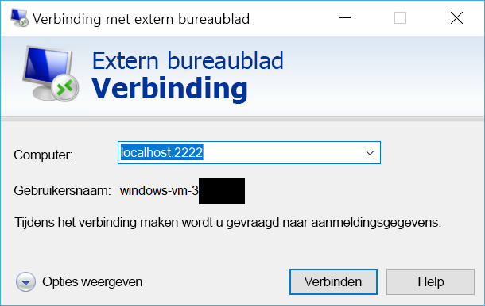

# <a name="quickstart-sshrdp-over-iot-hub-device-streams-using-nodejs-proxy-application-preview"></a>Quickstart: SSH/RDP via IoT Hub-apparaatstreams met behulp van Node.js-proxytoepassingen (preview)

[!INCLUDE [iot-hub-quickstarts-4-selector](../../includes/iot-hub-quickstarts-4-selector.md)]

Microsoft Azure IoT Hub apparaat-streams als op dit moment ondersteunt een [preview-functie](https://azure.microsoft.com/support/legal/preview-supplemental-terms/).

[IoT Hub-apparaatstreams](./iot-hub-device-streams-overview.md) zorgen ervoor dat service- en apparaattoepassingen kunnen communiceren op een beveiligde manier die de firewall toestaat. In deze quickstarthandleiding wordt beschreven hoe een Node.js-proxytoepassing aan de servicezijde wordt uitgevoerd zodat SSH/RDP-verkeer naar het apparaat kan worden verzonden via een apparaatstream. Kijk [hier](./iot-hub-device-streams-overview.md#local-proxy-sample-for-ssh-or-rdp) voor een overzicht van de instellingen. Gedurende de openbare preview biedt de Node.js SDK alleen ondersteuning voor apparaatstreams aan de servicezijde. Daarom bevat deze quickstarthandleiding alleen instructies voor het uitvoeren van de proxy in de service. U moet ook een bijbehorende proxy in het apparaat uitvoeren. Deze is beschikbaar in de handleidingen [Quickstart voor C](./quickstart-device-streams-proxy-c.md) of [Quickstart voor C#](./quickstart-device-streams-proxy-csharp.md).

We beschrijven eerst de instellingen voor SSH (met poort 22). Vervolgens beschrijven we hoe u de instellingen voor RDP (poort 3389) bewerkt. Omdat apparaatstreams toepassings- en protocolneutraal zijn, kan hetzelfde voorbeeld worden bewerkt om andere soorten toepassingsverkeer mogelijk te maken (doorgaans door de communicatiepoort te wijzigen).


[!INCLUDE [cloud-shell-try-it.md](../../includes/cloud-shell-try-it.md)]

Als u nog geen abonnement op Azure hebt, maakt u een [gratis account](https://azure.microsoft.com/free/?WT.mc_id=A261C142F) aan voordat u begint.


## <a name="prerequisites"></a>Vereisten

De Preview-versie van apparaat stromen is momenteel alleen ondersteund voor IoT-Hubs die zijn gemaakt in de volgende regio's:

  - **US - centraal**
  - **VS-midden EUAP**

Voor het uitvoeren van de toepassing in de service in deze quickstart moet Node.js versie 4.x.x of hoger op uw ontwikkelcomputer zijn geïnstalleerd.

U kunt Node.js voor meerdere platforms downloaden van [nodejs.org](https://nodejs.org).

Gebruik de volgende opdracht om de huidige versie van Node.js op uw ontwikkelcomputer te controleren:

```
node --version
```

Als u dit nog niet hebt gedaan, downloadt u het voorbeeldproject met Node.js van https://github.com/Azure-Samples/azure-iot-samples-node/archive/streams-preview.zip en pakt u het ZIP-archief uit.


## <a name="create-an-iot-hub"></a>Een IoT Hub maken

Als u [Snelstart: Als u telemetrie vanaf een apparaat wilt verzenden naar een IoT-hub](quickstart-send-telemetry-node.md), kunt u deze stap overslaan.

[!INCLUDE [iot-hub-include-create-hub](../../includes/iot-hub-include-create-hub-device-streams.md)]


## <a name="register-a-device"></a>Een apparaat registreren

Als u [Snelstart: Als u telemetrie vanaf een apparaat wilt verzenden naar een IoT-hub](quickstart-send-telemetry-node.md), kunt u deze stap overslaan.

Een apparaat moet zijn geregistreerd bij uw IoT-hub voordat het verbinding kan maken. In deze snelstart gebruikt u Azure Cloud Shell om een gesimuleerd apparaat te registreren.

1. Voer de volgende opdrachten uit in Azure Cloud Shell om de IoT Hub CLI-extensie toe te voegen en de apparaat-id te maken. 

   **YourIoTHubName**: vervang deze tijdelijke aanduiding door een door u gekozen naam voor de IoT-hub.

   **MyDevice**: dit is de naam van het geregistreerde apparaat. Gebruik MyDevice, zoals wordt weergegeven. Als u een andere naam voor het apparaat kiest, moet u deze naam ook in de rest van dit artikel gebruiken, en moet u de apparaatnaam bijwerken in de voorbeeldtoepassingen voordat u ze uitvoert.

    ```azurecli-interactive
    az extension add --name azure-cli-iot-ext
    az iot hub device-identity create --hub-name YourIoTHubName --device-id MyDevice
    ```

2. U hebt ook een _service-verbindingsreeks_ nodig, zodat de back-end-toepassing verbinding kan maken met de IoT-hub en de berichten kan ophalen. Met de volgende opdracht haalt u de serviceverbindingsreeks voor uw IoT-hub op:

    **YourIoTHubName**: vervang deze tijdelijke aanduiding door een door u gekozen naam voor de IoT-hub.

    ```azurecli-interactive
    az iot hub show-connection-string --policy-name service --name YourIoTHubName
    ```

    Noteer de geretourneerde waarde, die er als volgt uitziet:

   `"HostName={YourIoTHubName}.azure-devices.net;SharedAccessKeyName=service;SharedAccessKey={YourSharedAccessKey}"`


## <a name="ssh-to-a-device-via-device-streams"></a>SSH naar een apparaat via apparaatstreams

### <a name="run-the-device-local-proxy"></a>Voer de proxy in het apparaat uit

Zoals eerder vermeld, biedt de IoT Hub Node.js SDK alleen ondersteuning voor apparaatstreams aan de servicezijde. Voor de toepassing in het apparaat gebruikt u de bijbehorende proxyprogramma's voor het apparaat die beschikbaar zijn in de handleidingen [Quickstart voor C](./quickstart-device-streams-proxy-c.md) of [Quickstart voor C#](./quickstart-device-streams-proxy-csharp.md). Controleer of de proxy in het apparaat wordt uitgevoerd voordat u naar de volgende stap gaat.


### <a name="run-the-service-local-proxy"></a>Voer de proxy in de service uit

Ervan uitgaande dat de [proxy in het apparaat](#run-the-device-local-proxy) wordt uitgevoerd, volgt u de volgende stappen voor het uitvoeren van de proxy in de service in Node.js.

- Geef uw servicereferenties, de apparaat-id van het doel waarop de SSH-daemon wordt uitgevoerd en het poortnummer voor de proxy die op het apparaat wordt uitgevoerd op als omgevingsvariabelen.
  ```
  # In Linux
  export IOTHUB_CONNECTION_STRING="<provide_your_service_connection_string>"
  export STREAMING_TARGET_DEVICE="MyDevice"
  export PROXY_PORT=2222

  # In Windows
  SET IOTHUB_CONNECTION_STRING=<provide_your_service_connection_string>
  SET STREAMING_TARGET_DEVICE=MyDevice
  SET PROXY_PORT=2222
  ```
  Wijzig de waarden hierboven met uw apparaat-id en verbindingsreeks.

- Navigeer naar `Quickstarts/device-streams-service` in de uitgepakte projectmap en voer de proxy in de service uit.
  ```
  cd azure-iot-samples-node-streams-preview/iot-hub/Quickstarts/device-streams-service

  # Install the preview service SDK, and other dependencies
  npm install azure-iothub@streams-preview
  npm install

  # Run the service-local proxy application
  node proxy.js
  ```

### <a name="ssh-to-your-device-via-device-streams"></a>SSH naar uw apparaat via apparaatstreams
In Linux voert u SSH uit met behulp van `ssh $USER@localhost -p 2222` op een terminal. In Windows gebruikt u uw favoriete SSH-client (bijvoorbeeld PuTTY).

Console-uitvoer in de service nadat SSH-sessie tot stand is gebracht (de proxy in de service luistert naar poort 2222): 


Console-uitvoer van het SSH-clientprogramma (SSH-client communiceert met SSH-daemon door verbinding te maken met poort 22, waar de proxy in de service naar luistert): 


### <a name="rdp-to-your-device-via-device-streams"></a>RDP naar uw apparaat via apparaatstreams

Gebruik uw RDP-clientprogramma nu en maak verbinding met de proxy in de service via poort 2222 (dit is een willekeurige poort die u eerder hebt gekozen).

> [!NOTE]
> Zorg ervoor dat uw apparaat-proxy correct is geconfigureerd voor RDP met poort 3389.




## <a name="clean-up-resources"></a>Resources opschonen

[!INCLUDE [iot-hub-quickstarts-clean-up-resources](../../includes/iot-hub-quickstarts-clean-up-resources-device-streams.md)]

## <a name="next-steps"></a>Volgende stappen

In deze quickstart hebt u een IoT-hub ingesteld, een apparaat geregistreerd en een service-proxyprogramma geïmplementeerd om RDP- en SSH-verkeer naar een IoT-apparaat mogelijk te maken. Het RDP- en SSH-verkeer loopt via een apparaatstream en IoT Hub met behulp van tunneling. Hierdoor is er geen directe verbinding met het apparaat nodig.

Gebruik de onderstaande koppelingen voor meer informatie over apparaatstreams:

> [!div class="nextstepaction"]
> [Overzicht van apparaatstreams](./iot-hub-device-streams-overview.md)
