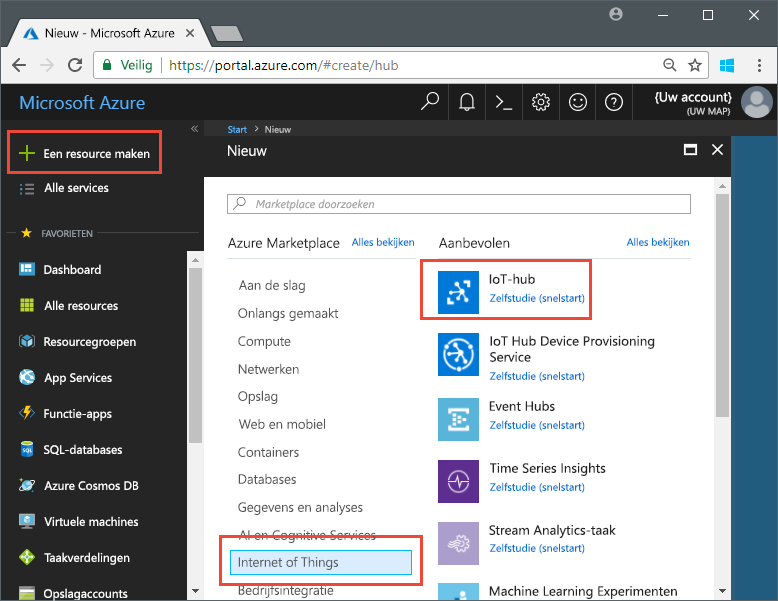
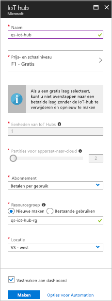

# <a name="send-telemetry-from-a-device-to-an-iot-hub-swift"></a>Telemetrie verzenden van een apparaat naar een IoT-hub (Swift)

IoT Hub is een Azure-service waarmee grote hoeveelheden telemetrie van uw IoT-apparaten naar de cloud kunt opnemen voor opslag of verwerking. In dit artikel verzendt u telemetrie van een toepassing met een gesimuleerd apparaat naar IoT Hub. Vervolgens kunt u de gegevens bekijken vanuit een back-endtoepassing. 

In dit artikel wordt gebruikgemaakt van een vooraf geschreven Swift toepassing om de telemetrie te verzenden, en van een CLI-hulpprogramma om de telemetrie uit IoT Hub te lezen. 

[!INCLUDE [cloud-shell-try-it.md](../../includes/cloud-shell-try-it.md)]

Als u nog geen abonnement op Azure hebt, maakt u een [gratis account](https://azure.microsoft.com/free/?WT.mc_id=A261C142F) aan voordat u begint.

## <a name="prerequisites"></a>Vereisten

- De voorbeeldcode downloaden uit [Azure-voorbeelden](https://github.com/Azure-Samples/azure-iot-samples-ios/archive/master.zip) 
- De nieuwste versie van [XCode](https://developer.apple.com/xcode/), met de nieuwste versie van de iOS-SDK. Deze snelstart is getest met XCode 9.3 en iOS 11.3.
- De nieuwste versie van [CocoaPods](https://guides.cocoapods.org/using/getting-started.html).
- Het CLI-hulpprogramma iothub-explorer voor het lezen van telemetrie uit IoT Hub. Installeer eerst [Node.js](https://nodejs.org) versie 4.x.x of hoger, en voer vervolgens deze opdracht uit: 

   ```sh
   sudo npm install -g iothub-explorer
   ```

## <a name="create-an-iot-hub"></a>Een IoT Hub maken

De eerste stap is Azure Portal te gebruiken om een IoT-hub te maken in uw abonnement. Met de IoT-hub kunt u grote hoeveelheden telemetrie naar de cloud opnemen vanaf een groot aantal apparaten. De hub stelt één of meerdere back-end diensten in de cloud in staat om die telemetrie te lezen en te verwerken.

1. Meld u aan bij [Azure Portal](http://portal.azure.com).

1. Selecteer **Een resource maken** > **Internet of Things** > **IoT Hub**. 

   

1. Gebruik de waarden in de volgende tabel voor het maken van uw IoT-hub:

    | Instelling | Waarde |
    | ------- | ----- |
    | Naam | Een unieke naam voor uw hub |
    | Prijs- en schaalniveau | F1 Free |
    | IoT Hub-eenheden | 1 |
    | Partities voor apparaat-naar-cloud | 2 partities |
    | Abonnement | Uw Azure-abonnement. |
    | Resourcegroep | Nieuwe maken. Voer een naam in voor uw resourcegroep. |
    | Locatie | De locatie het dichtst bij u in de buurt. |
    | Vastmaken aan dashboard | Ja |

1. Klik op **Create**.  

   

1. Noteer de namen van uw IoT-hub en resourcegroep. U gebruikt deze waarden later in deze snelstart.

## <a name="register-a-device"></a>Een apparaat registreren

Een apparaat moet zijn geregistreerd bij uw IoT-hub voordat het verbinding kan maken. In deze snelstart gebruikt u de Azure-CLI om een gesimuleerd apparaat te registreren.

1. Voeg de IoT Hub CLI-extensie toe en maak de apparaatidentiteit. Vervang `{YourIoTHubName}` door een naam voor uw IoT-hub:

   ```azurecli-interactive
   az extension add --name azure-cli-iot-ext
   az iot hub device-identity create --hub-name {YourIoTHubName} --device-id myiOSdevice
   ```

    Als u een andere naam voor het apparaat kiest, werkt u de apparaatnaam bij in de voorbeeldtoepassingen voordat u ze uitvoert.

1. Voer de volgende opdracht uit om de _apparaatverbindingsreeks_ op te halen voor het apparaat dat u zojuist hebt geregistreerd:

   ```azurecli-interactive
   az iot hub device-identity show-connection-string --hub-name {YourIoTHubName} --device-id myiOSdevice --output table
   ```

   Noteer de apparaatverbindingsreeks, die er ongeveer zo uitziet: `Hostname=...=`. U gebruikt deze waarde verderop in het artikel.

1. U hebt ook een _service verbindingsreeks_ nodig, zodat back-end-toepassingen verbinding kunnen maken met uw IoT-hub en apparaat-naar-cloud-berichten ophalen. Met de volgende opdracht haalt u de serviceverbindingsreeks voor uw IoT-hub op:

   ```azurecli-interactive
   az iot hub show-connection-string --hub-name {YourIoTHubName} --output table
   ```

   Noteer de serviceverbindingsreeks, die er ongeveer zo uitziet: `Hostname=...=`. U gebruikt deze waarde verderop in het artikel.

## <a name="send-simulated-telemetry"></a>Gesimuleerde telemetrie verzenden

De voorbeeldtoepassing wordt uitgevoerd op een iOS-apparaat dat verbinding maakt met een apparaatspecifiek eindpunt op uw IoT-hub en gesimuleerde temperatuur- en vochtigheidstelemetrie verzendt. 

### <a name="install-cocoapods"></a>CocoaPods installeren

CocoaPods beheren afhankelijkheden voor iOS-projecten die gebruikmaken van bibliotheken van derden.

Navigeer in een terminalvenster naar de Azure-IoT-Samples-iOS-map die u hebt gedownload bij de vereisten. Navigeer vervolgens naar het voorbeeldproject:

```sh
cd quickstart/sample-device
```

Zorg ervoor dat XCode is gesloten en voer vervolgens de volgende opdracht uit om de CocoaPods te installeren die worden gedeclareerd in het **podfile**-bestand:

```sh
pod install
```

Naast het installeren van de pods die nodig zijn voor uw project, heeft de installatieopdracht ook een XCode-werkruimtebestand gemaakt dat al geconfigureerd is om de pods te gebruiken voor afhankelijkheden. 

### <a name="run-the-sample-application"></a>De voorbeeldtoepassing uitvoeren 

1. Open de voorbeeldwerkruimte in XCode.

   ```sh
   open "MQTT Client Sample.xcworkspace"
   ```

2. Vouw het project **MQTT Client Sample** uit en vouw vervolgens de map met dezelfde naam uit.  
3. Open **ViewController.swift** om het te bewerken in XCode. 
4. Zoek de **connectionString**-variabele en werk de waarde bij met de apparaatverbindingsreeks die u eerder hebt genoteerd.
5. Sla uw wijzigingen op. 
6. Voer het project in de apparaatemulator uit met de knop **Build and run** of de toetscombinatie **command+r**. 

   

7. Wanneer de emulator wordt geopend, selecteert u **Start** in de voorbeeld-app.

In de volgende schermafbeelding ziet u voorbeelduitvoer van de gesimuleerde telemetrie die de toepassing naar uw IoT-hub verzendt:

   

## <a name="read-the-telemetry-from-your-hub"></a>De telemetrie van uw hub lezen

De voorbeeld-app die u hebt uitgevoerd op de XCode-emulator toont gegevens over van het apparaat verzonden berichten. U kunt de gegevens ook via uw IoT-hub bekijken terwijl ze worden ontvangen. Het `iothub-explorer` CLI-hulpprogramma maakt verbinding met het servicezijde-eindpunt **Gebeurtenissen** op uw IoT-hub. 

Open een nieuw terminalvenster. Voer de volgende opdracht uit, waarbij u {de verbindingsreeks van uw hub-service} vervangt door de service-verbindingsreeks die u aan het begin van dit artikel hebt opgehaald:

```sh
iothub-explorer monitor-events myiOSdevice --login "{your hub service connection string}"
```

De volgende schermafbeelding geeft het soort telemetrie weer dat u in uw terminalvenster ziet:


Als u een foutmelding krijgt bij het uitvoeren van de iothub-explorer-opdracht, controleer dan goed of u de *serviceverbindingsreeks* gebruikt voor uw IoT-hub, in plaats van de *apparaatverbindingsreeks*  voor uw IoT-apparaat. Beide verbindingsreeksen beginnen met **Hostname = {iothubname}**, maar de serviceverbindingsreeks bevat de eigenschap **SharedAccessKeyName**, terwijl de apparaatverbindingsreeks **DeviceID** bevat. 

## <a name="clean-up-resources"></a>Resources opschonen

Als u van plan bent om door te gaan met andere artikelen over het testen van IoT Hub, behoudt u de resourcegroep en IoT-hub zodat u ze later kunt gebruiken.

Als u de IoT-hub niet langer nodig hebt, verwijdert u deze en de resourcegroep in de portal. Selecteer hiertoe de resourcegroep met de IoT-hub en klik op **Verwijderen**.

## <a name="next-steps"></a>Volgende stappen

In dit artikel stelt u een IoT-hub in, registreert u een apparaat, verzendt u gesimuleerde telemetrie van een iOS-apparaat naar de hub en leest u de telemetrie vanaf de hub. 

Zie [Cloud-naar-apparaat-berichten verzenden met iOS (Swift)](iot-hub-ios-swift-c2d.md) om door te gaan met leren over de samenwerking van iOS-apparaten met IoT Hub.

<!-- Links -->
[lnk-process-d2c-tutorial]: iot-hub-csharp-csharp-process-d2c.md
[lnk-device-management]: iot-hub-node-node-device-management-get-started.md
[lnk-iot-edge]: ../iot-edge/tutorial-simulate-device-linux.md
[lnk-connect-device]: https://azure.microsoft.com/develop/iot/
