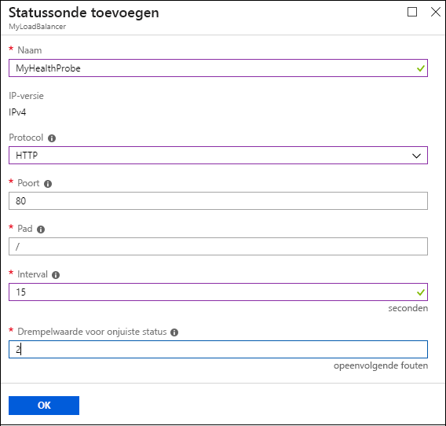
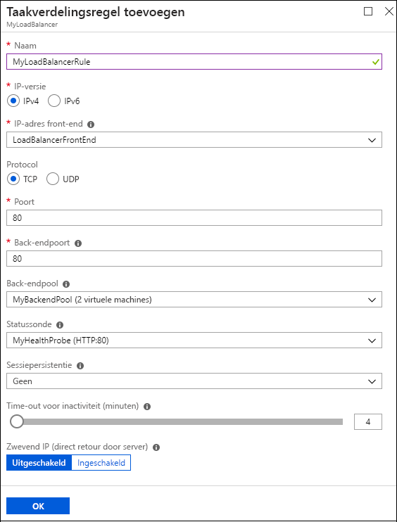

# Een internetgerichte load balancer maken met behulp van de Azure Portal

> [!div class="op_single_selector"]
> * [Portal](../load-balancer/load-balancer-get-started-internet-portal.md)
> * [PowerShell](../load-balancer/load-balancer-get-started-internet-arm-ps.md)
> * [Azure CLI](../load-balancer/load-balancer-get-started-internet-arm-cli.md)
> * [Sjabloon](../load-balancer/load-balancer-get-started-internet-arm-template.md)

[!INCLUDE [load-balancer-basic-sku-include.md](../../includes/load-balancer-basic-sku-include.md)]

[!INCLUDE [load-balancer-get-started-internet-intro-include.md](../../includes/load-balancer-get-started-internet-intro-include.md)]

Dit artikel is van toepassing op het Resource Manager-implementatiemodel.

[!INCLUDE [load-balancer-get-started-internet-scenario-include.md](../../includes/load-balancer-get-started-internet-scenario-include.md)]

Hierin wordt de volgorde van de afzonderlijke taken behandeld die moeten worden uitgevoerd voor het maken van een load balancer. Ook worden de handelingen om tot dit doel te komen in detail uitgelegd.

## Wat zijn de vereisten om een internetgerichte load balancer te maken?

U moet de volgende objecten maken en configureren om een load balancer te implementeren.

* Front-end-IP-configuratie: bevat openbare IP-adressen voor inkomend netwerkverkeer.
* Back-endadresgroep: bevat netwerkinterfaces (NIC's) waardoor de virtuele machines netwerkverkeer kunnen ontvangen van de load balancer.
* Regels voor taakverdeling: bevat regels die een openbare poort op de load balancer toewijzen aan een poort in de back-endadresgroep.
* NAT-regels voor binnenkomende verbindingen: bevat regels die een openbare poort op de load balancer toewijzen aan een poort voor een specifieke virtuele machine in de back-endadresgroep.
* Tests: bevat statustests die worden gebruikt om de beschikbaarheid van exemplaren van virtuele machines in de back-endadresgroep te controleren.

Meer informatie over de load balancer-onderdelen in Azure Resource Manager vindt u op [Ondersteuning van Azure Resource Manager voor Azure Load Balancer](load-balancer-arm.md).

## Een load balancer instellen in Azure Portal

> [!IMPORTANT]
> In dit voorbeeld wordt ervan uitgegaan dat u een virtueel netwerk hebt met de naam **myVNet**. Bekijk [Virtueel netwerk maken](../virtual-network/virtual-networks-create-vnet-arm-pportal.md) voor instructies. Er wordt ook verondersteld dat **myVNet** een subnet bevat met de naam **LB-Subnet-BE**, evenals twee virtuele machines met de naam **web1** en **web2** die zich respectievelijk binnen dezelfde beschikbaarheidsset met de naam **myAvailSet** in **myVNet** bevinden. Raadpleeg [deze koppeling](../virtual-machines/virtual-machines-windows-hero-tutorial.md?toc=%2fazure%2fvirtual-machines%2fwindows%2ftoc.json) voor instructies voor het maken van virtuele machines.

1. Navigeer via een browser naar Azure Portal: [http://portal.azure.com](http://portal.azure.com). Meld u vervolgens aan met uw Azure-account.
2. Selecteer linksboven in het scherm **Nieuw** > **Netwerken** > **Load balancer**.
3. Voer op de blade **Load balancer maken** een naam in voor de load balancer. Hier wordt deze **myLoadBalancer** genoemd.
4. Selecteer onder **Type** de optie **Openbaar**.
5. Maak onder **Openbaar IP-adres** een nieuw openbaar IP-adres met de naam **myPublicIP**.
6. Selecteer onder Resourcegroep de optie **myRG**. Selecteer een geschikte **Locatie** en klik vervolgens op **OK**. De load balancer begint vervolgens met de implementatie. Het duurt een aantal minuten voordat de implementatie is voltooid.

    

## Een back-endadresgroep maken

1. Zodra de load balancer is geïmplementeerd, selecteert u deze in uw resources. Selecteer in de instellingen Back-endgroepen. Voer een naam voor uw back-endgroep in. Klik vervolgens op de knop **Toevoegen** boven aan de blade die wordt weergegeven.
2. Klik op **Een virtuele machine toevoegen** op de blade **Back-endgroep toevoegen**.  Selecteer **Een beschikbaarheidsset kiezen** onder **Beschikbaarheidsset** en selecteer **myAvailSet**. Selecteer vervolgens **De virtuele machines kiezen** in de sectie Virtuele machines op de blade, en klik op **web1** en **web2**, de twee VM’s die u hebt gemaakt voor taakverdeling. Zorg ervoor dat er links van beide VM’s blauwe vinkjes staan, zoals wordt weergegeven in de onderstaande afbeelding. Klik vervolgens op **Selecteren** op de blade en vervolgens op OK op de blade **Virtuele machines kiezen**. Klik daarna op **OK** op de blade **Back-endgroep toevoegen**.

    

3. Controleer of uw vervolgkeuzelijst met meldingen een update heeft met betrekking tot het opslaan van de back-endgroep voor de load balancer en werk de netwerkinterface bij voor de virtuele machines **web1** en **web2**.

## Een test, LB-regel en NAT-regels maken

1. Maak een statustest.

    Selecteer Testen in de instellingen van de load balancer. Klik vervolgens op **Toevoegen** boven aan de blade.

    Er zijn twee manieren om een test te configureren: HTTP of TCP. In dit voorbeeld wordt HTTP gebruikt, maar TCP kan op een vergelijkbare manier worden geconfigureerd.
    Werk de nodige informatie bij. Zoals is vermeld, verdeelt **myLoadBalancer** het verkeer op poort 80. Het geselecteerde pad is HealthProbe.aspx, het interval is 15 seconden en de drempelwaarde voor een slechte status is twee. Klik wanneer u klaar bent, op **OK** om de test te maken.

    Beweeg de muisaanwijzer boven het pictogram 'i' voor meer informatie over deze afzonderlijke configuraties en over hoe u ze zodanig kunt wijzigen dat ze aan uw eisen voldoen.

    

2. Maak een load balancer-regel.

    Klik op de taakverdelingsregels in het gedeelte Instellingen van de load balancer. Klik op de nieuwe blade op **Toevoegen**. Geef uw regel een naam. Hier gebruiken we HTTP. Kies de front-endpoort en de back-endpoort. Hier is 80 gekozen voor beide. Kies **LB-backend** als uw back-endgroep en de eerder gemaakte **HealthProbe** als de test. Andere configuraties kunnen worden ingesteld op basis van uw vereisten. Klik vervolgens op OK om de taakverdelingsregel op te slaan.

    

3. Inkomende NAT-regels maken

    Klik op Inkomende NAT-regels in het gedeelte Instellingen van de load balancer. Klik op de nieuwe blade op **Toevoegen**. Geef uw inkomende NAT-regel een naam. Hier gebruiken we de naam **inboundNATrule1**. De bestemming moet het openbare IP-adres zijn dat u eerder hebt gemaakt. Selecteer Aangepast onder Service. Selecteer vervolgens het protocol dat u wilt gebruiken. Hier is TCP geselecteerd. Voer de poort in (3441) en de doelpoort. Dat is in dit geval 3389. Klik vervolgens op OK om deze regel op te slaan.

    Nadat de eerste regel is gemaakt, herhaalt u deze stap voor de tweede inkomende NAT-regel met de naam inboundNATrule2 vanaf poort 3442 naar doelpoort 3389.

    

## Een load balancer verwijderen

Als u een load balancer wilt verwijderen, selecteert u de load balancer die u wilt verwijderen. Klik op de blade *Load balancer* op **Verwijderen** boven aan de blade. Selecteer **Ja** wanneer dit wordt gevraagd.

## Volgende stappen

[Aan de slag met het configureren van een interne load balancer](load-balancer-get-started-ilb-arm-cli.md)

[Een distributiemodus voor de load balancer configureren](load-balancer-distribution-mode.md)

[TCP-time-outinstellingen voor inactiviteit voor de load balancer configureren](load-balancer-tcp-idle-timeout.md)
