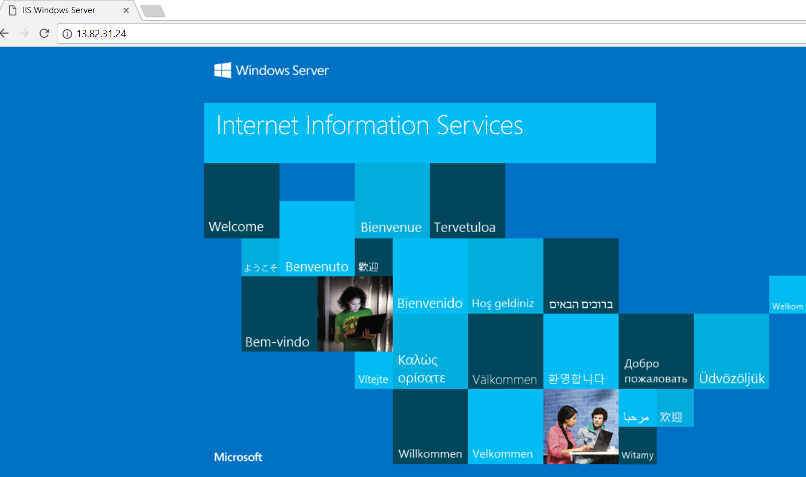

# Quickstart: Een Standard load balancer maken om taken van VM's te verdelen via Azure Portal

Taakverdeling zorgt voor een hogere beschikbaarheid en betere schaalbaarheid door binnenkomende aanvragen te spreiden over meerdere virtuele machines. U kunt in Azure Portal een load balancer maken om taken van virtuele machines (VM's) te verdelen. In deze snelstart wordt getoond hoe u taken van VM's kunt verdelen met een Standard Load Balancer.

Als u nog geen abonnement op Azure hebt, maak dan een [gratis account](https://azure.microsoft.com/free/?WT.mc_id=A261C142F) aan voordat u begint. 

## Aanmelden bij Azure

Meld u aan bij de Azure Portal op [https://portal.azure.com](https://portal.azure.com).

## Een Load Balancer van het type Standard maken

In deze sectie maakt u een Standard Load Balancer die helpt bij het laden van verdelen over virtuele machines. Standard Load Balancer biedt alleen ondersteuning voor een standaard, openbaar IP-adres. Als u een Standard Load Balancer maakt, moet u ook een nieuw, standaard, openbaar IP-adres maken dat als de front-end (standaard *LoadBalancerFrontend* genoemd) wordt geconfigureerd voor de Standard Load Balancer. 

1. Selecteer op de bovenste linkerkant van het scherm, **een resource maken** > **netwerken** > **Load Balancer**.
2. Voer op het tabblad **Basis** van de pagina **Load balancer maken** de volgende gegevens in of selecteer deze, accepteer de standaardwaarden voor de overige instellingen en selecteer vervolgens **Controleren + maken**:

    | Instelling                 | Value                                              |
    | ---                     | ---                                                |
    | Abonnement               | Selecteer uw abonnement.    |    
    | Resourcegroep         | Selecteer **nieuw** en het type *myResourceGroupSLB* in het tekstvak in.|
    | Name                   | *myLoadBalancer*                                   |
    | Regio         | Selecteer **Europa - west**.                                        |
    | Type          | Selecteer **Openbaar**.                                        |
    | SKU           | selecteer **Standaard**.                          |
    | Openbaar IP-adres | Selecteer **Nieuw maken**. |
    | Naam openbaar IP-adres              | Typ *myPublicIP* in het tekstvak.   |
    |Beschikbaarheidszone| Selecteer **Zone-redundant**.    |
3. In de **revisie + maken** tabblad **maken**.   

    

## Resources voor Load Balancer maken

In deze sectie maakt u Load Balancer configureren voor een back-endadresgroep, een statustest en een balancer-regel opgeven.

### Een back-endadresgroep maken

Voor het distribueren van verkeer naar de virtuele machines, een back-end-adresgroep bevat de IP-adressen van de virtuele (NIC's) die zijn verbonden met de Load Balancer. Maak de back-endadresgroep *myBackendPool* om op te nemen van virtuele machines voor taakverdeling internetverkeer.

1. Selecteer **alle services** Selecteer in het menu links **alle resources**, en selecteer vervolgens **myLoadBalancer** in de lijst met resources.
2. Onder **instellingen**, selecteer **back-endpools**en selecteer vervolgens **toevoegen**.
3. Op de **toevoegen van een back-endpool** pagina voor de naam, type *myBackendPool*, als de naam voor uw back-endpool en selecteer vervolgens **toevoegen**.

### Een statustest maken

Als u wilt toestaan dat de Load Balancer voor het bewaken van de status van uw app, gebruikt u een statustest. De statustest wordt dynamisch toegevoegd of verwijderd van virtuele machines uit de Load Balancer-rotatie op basis van hun reactie op statuscontroles. Maak een statustest (*myHealthProbe*) om de status van de VM's te bewaken.

1. Selecteer **alle services** Selecteer in het menu links **alle resources**, en selecteer vervolgens **myLoadBalancer** in de lijst met resources.
2. Onder **instellingen**, selecteer **statuscontroles**en selecteer vervolgens **toevoegen**.
    
    | Instelling | Waarde |
    | ------- | ----- |
    | Name | Enter *myHealthProbe*. |
    | Protocol | Selecteer **HTTP**. |
    | Poort | Voer *80*.|
    | Interval | Voer *15* voor aantal **Interval** in seconden tussen tests. |
    | Drempelwaarde voor onjuiste status | Selecteer *2* voor aantal **drempelwaarde voor onjuiste status** of opeenvolgende testfouten dat optreden moeten voordat een virtuele machine als slecht beschouwd.|
    | Test | Select *myHealthProbe*. |
4. Selecteer **OK**.

### Een load balancer-regel maken
Een load balancer-regel wordt gebruikt om de verdeling van het verkeer over de VM's te definiëren. U definieert de front-end-IP-configuratie voor het inkomende verkeer en de back-end-IP-groep om het verkeer te ontvangen, samen met de gewenste bron- en doelpoort. Maak een Load Balancer-regel *myLoadBalancerRuleWeb* voor het luisteren naar poort 80 in de front-end *FrontendLoadBalancer* en het verzenden van netwerkverkeer met load balancing naar de back-endadresgroep *myBackEndPool* ook van poort 80. 

1. Selecteer **alle services** Selecteer in het menu links **alle resources**, en selecteer vervolgens **myLoadBalancer** in de lijst met resources.
2. Onder **instellingen**, selecteer **Taakverdelingsregels**en selecteer vervolgens **toevoegen**.
3. Gebruik deze waarden om de taakverdelingsregel te configureren:
    
    | Instelling | Waarde |
    | ------- | ----- |
    | Name | Voer *myHTTPRule*. |
    | Protocol | selecteer **TCP**. |
    | Poort | Voer *80*.|
    | Back-endpoort | Voer *80*. |
    | Back-endpool | Select *myBackendPool*.|
    | Test | Select *myHealthProbe*. |
4. Laat de overige standaardwaarden staan en selecteer **OK**.
4. Selecteer **OK**.

## Back-endservers maken

In deze sectie maakt u een virtueel netwerk maken, twee virtuele machines voor de back-endpool van de Load Balancer maken en installeert u IIS op de virtuele machines om de Load Balancer te testen.

### Een virtueel netwerk maken
1. Selecteer linksboven in het scherm **Een resource maken** > **Netwerken** > **Virtueel netwerk**.

1. Typ of selecteer in **Virtueel netwerk maken** de volgende gegevens:

    | Instelling | Waarde |
    | ------- | ----- |
    | Name | Voer *myVNet* in. |
    | Adresruimte | Voer *10.1.0.0/16* in. |
    | Abonnement | Selecteer uw abonnement.|
    | Resourcegroep | Select existing resource - *myResourceGroupSLB*. |
    | Locatie | Selecteer **Europa - west**.|
    | Subnet - Naam | Voer *myBackendSubnet* in. |
    | Subnet - adresbereik | Voer *10.1.0.0/24* in. |
1. Laat de overige standaardwaarden staan en selecteer **Maken**.

### Virtuele machines maken
Standard Load Balancer biedt alleen ondersteuning voor VM's met standaard IP-adressen in de back-endpool. In deze sectie maakt u twee virtuele machines (*myVM1* en *myVM2*) met een Standard openbaar IP-adres in twee verschillende zones (*Zone 1* en *Zone 2*) die zijn toegevoegd aan de back-endpool van de Standard Load Balancer die eerder is gemaakt.

1. Selecteer **Een resource maken** > **Compute** > **Windows Server 2016 Datacenter** linksboven in de portal. 
   
1. In **Een virtuele machine maken** typt of selecteert u de volgende waarden op het tabblad **Basisinformatie**:
   - **Abonnement** > **Resourcegroep**: Select **myResourceGroupSLB**.
   - **Instantiedetails** > **Naam van virtuele machine**: Type *myVM1*.
   - **Details van exemplaar** > **regio** > Selecteer **West-Europa**.
   - **Details van exemplaar** > **Beschikbaarheidsopties** > Selecteer **beschikbaarheidszones**. 
   - **Details van exemplaar** > **binnen een beschikbaarheidszone** > Selecteer **1**.
  
1. Selecteer het tabblad **Netwerken** of selecteer **Volgende: Schijven** en vervolgens **Volgende: Netwerken**. 
   
   - Zorg ervoor dat de volgende opties zijn geselecteerd:
       - **Virtueel netwerk**: *myVnet*
       - **Subnet**: *myBackendSubnet*
       - **Openbaar IP-adres** > Selecteer **nieuw**, en klik in de **openbare IP-adres maken** venster voor **SKU**, selecteer **Standard**, en voor **binnen een beschikbaarheidszone**, selecteer **Zone-redundante**, en selecteer vervolgens **OK**.
   - Als u een nieuwe netwerkbeveiligingsgroep (NSG) wilt maken, een soort firewall, selecteert u onder **Netwerkbeveiligingsgroep** de optie **Geavanceerd**. 
       1. Selecteer in het veld **Netwerkbeveiligingsgroep configureren** de optie **Nieuwe maken**. 
       1. Type *myNetworkSecurityGroup*, en selecteer **OK**.
   - Als u de virtuele machine een deel van de Load Balancer back-endpool, voert u de volgende stappen uit:
        - In **Load Balancing**, voor **plaatsen van deze virtuele machine achter een bestaande oplossing voor taakverdeling?**, selecteer **Ja**.
        - In **Load balancing-instellingen**, voor **opties voor taakverdeling**, selecteer **Azure load balancer**.
        - Voor **selecteert u een load balancer**, *myLoadBalancer*. 
1. Selecteer het tabblad **Beheer** of selecteer **Volgende** > **Beheer**. Stel bij **Bewaking** **Diagnostische gegevens over opstarten** in op **Uit**. 
1. Selecteer **Controleren + maken**.   
1. Controleer de instellingen en selecteer vervolgens **Maken**.
1. Volg de stappen voor het maken van een tweede virtuele machine met de naam *myVM2*, met een openbaar IP-adres van standaard-SKU, met de naam *myVM2-IP-*, en **binnen een beschikbaarheidszone** van **2** en alle andere instellingen hetzelfde zijn als *myVM1*. 

### Een NSG-regel maken

In deze sectie maakt u een regel voor de netwerkbeveiligingsgroep voor binnenkomende verbindingen via HTTP.

1. Selecteer **alle services** Selecteer in het menu links **alle resources**, en vervolgens vanaf de resources die lijst selecteert **myNetworkSecurityGroup** die bevindt zich in de **myResourceGroupSLB** resourcegroep.
2. Selecteer onder **Instellingen** **Inkomende beveiligingsregels** en selecteer vervolgens **Toevoegen**.
3. Voer deze waarden in voor de inkomende beveiligingsregel met de naam *myHTTPRule* om een binnenkomende HTTP-verbinding via poort 80 toe te staan:
    - *Service Tag* bij **Bron**.
    - *Internet* bij **Bronservicetag**
    - *80* bij **Poortbereiken van doel**
    - *TCP* bij **Protocol**
    - *Allow* bij **Actie**
    - *100* bij **Prioriteit**
    - *myHTTPRule* als naam
    - *Allow HTTP* als beschrijving
4. Selecteer **OK**.
 
### IIS installeren

1. Selecteer **alle services** Selecteer in het menu links **alle resources**, en selecteer vervolgens in de lijst met resources **myVM1** die bevindt zich in de  *myResourceGroupSLB* resourcegroep.
2. Selecteer op de pagina **Overzicht** de optie **Verbinding maken** om extern verbinding te maken met de VM.
3. Meld u aan bij de VM met gebruikersnaam *azureuser*.
4. Ga op de serverdesktop naar **Windows Systeembeheer**>**Serverbeheer**.
5. Selecteer in Serverbeheer **functies en onderdelen toevoegen**.
6. Gebruik in de **wizard Rollen en functies toevoegen** de volgende waarden:
    - In de **installatietype selecteren** pagina, selecteert u **op basis van functie of onderdeel gebaseerde installatie**.
    - In de **Selecteer doelserver** pagina, selecteert u **myVM1**
    - In de **serverfunctie selecteren** pagina, selecteert u **webserver (IIS)**
    - Volg de aanwijzingen om de rest van de wizard te voltooien 
7. Herhaal stap 1 t/m 6 voor virtuele machine *myVM2*.

## Test de Load Balancer
1. Zoek op het scherm **Overzicht** het openbare IP-adres voor de load balancer. Selecteer **alle services** Selecteer in het menu links **alle resources**, en selecteer vervolgens **myPublicIP**.

2. Kopieer het openbare IP-adres en plak het in de adresbalk van de browser. De standaardpagina van IIS-webserver wordt weergegeven in de browser.

      

Als u wilt zien hoe de Load Balancer verkeer distribueert naar alle drie virtuele machines waarop uw app wordt uitgevoerd, u kunt forceren vernieuwing van uw webbrowser.

## Resources opschonen

Wanneer u niet meer nodig hebt, verwijdert u de resourcegroep, Load Balancer en alle gerelateerde resources. Om dit te doen, selecteert u de resourcegroep (*myResourceGroupSLB*) die de Load Balancer bevat en selecteer vervolgens **verwijderen**.

## Volgende stappen

In deze snelstartgids hebt u een Standard Load Balancer gemaakt, VM's die zijn gekoppeld aan het statustest van de Load Balancer verkeersregel geconfigureerd en vervolgens de Load Balancer getest. Voor meer informatie over Azure Load Balancer gaat u verder met de zelfstudies voor Azure Load Balancer.

> [!div class="nextstepaction"]
> [Zelfstudies voor Azure Load Balancer](tutorial-load-balancer-standard-public-zone-redundant-portal.md)
