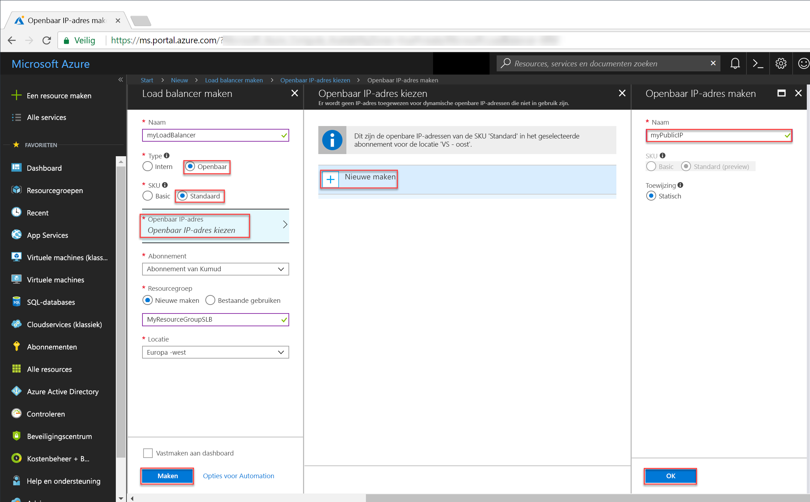
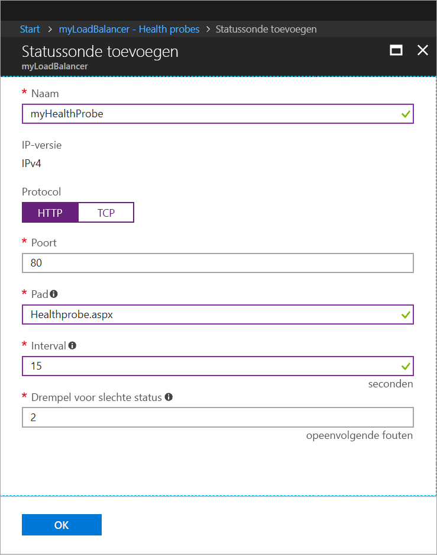
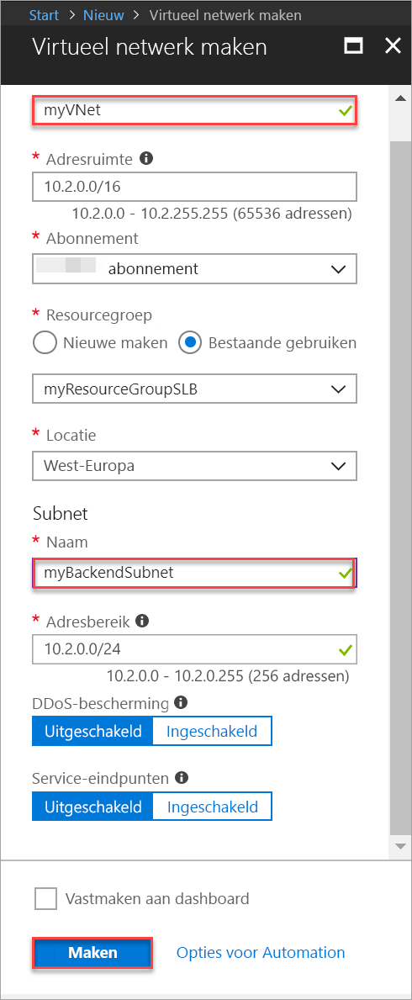

# <a name="tutorial-create-and-manage-standard-load-balancer-using-the-azure-portal"></a>Zelfstudie: Een Standard Load Balancer maken en beheren via Azure Portal

Taakverdeling zorgt voor een hogere beschikbaarheid en betere schaalbaarheid door binnenkomende aanvragen te spreiden over meerdere virtuele machines. In deze zelfstudie leert u meer over de verschillende onderdelen van Azure Standard Load Balancer die het verkeer verdelen en zorgen voor hoge beschikbaarheid. In deze zelfstudie leert u procedures om het volgende te doen:


> [!div class="checklist"]
> * Een Azure-load balancer maken
> * Een load balancer-statustest maken
> * Load balancer-verkeersregels maken
> * Virtuele machines maken en IIS-server installeren
> * Virtuele machines koppelen aan een load balancer
> * Een load balancer in actie zien
> * VM's toevoegen aan en verwijderen uit een load balancer


Als u nog geen abonnement op Azure hebt, maak dan een [gratis account](https://azure.microsoft.com/free/?WT.mc_id=A261C142F) aan voordat u begint. 

## <a name="log-in-to-azure"></a>Meld u aan bij Azure.

Meld u aan bij de Azure-portal op [http://portal.azure.com](http://portal.azure.com).

## <a name="create-a-standard-load-balancer"></a>Een Load Balancer van het type Standard maken

In deze sectie maakt u een openbare load balancer die helpt bij het laden van virtuele machines. Standard Load Balancer biedt alleen ondersteuning voor een standaard, openbaar IP-adres. Wanneer u een Standard Load Balancer maakt, moet u ook een nieuw, standaard, openbaar IP-adres maken dat als de front-end (standaard *LoadBalancerFrontend* genoemd) wordt geconfigureerd voor de Standard Load Balancer. 

1. Klik linksboven in het scherm op **Een resource maken** > **Netwerken** > **Load balancer**.
2. Voer op de pagina **Een load balancer maken** deze waarden in voor de load balancer:
    - *myLoadBalancer* als naam van de load balancer.
    - **Openbaar** als het type load balancer.
    - **Standard** als de SKU-versie van de load balancer.
     - *myPublicIP* voor het **nieuwe**, openbare IP-adres dat u maakt.
    - *myResourceGroupSLB* als naam van de **nieuwe** resourcegroep die u wilt maken.
    - **westeurope** als locatie.
3. Klik op **Maken** om de load balancer te maken.


   
## <a name="create-load-balancer-resources"></a>Resources voor load balancer maken

In deze sectie configureert u de instellingen van de load balancer voor een back-endadresgroep en een statustest en geeft u regels voor de load balancer op.

### <a name="create-a-backend-address-pool"></a>Een back-endadresgroep maken

Om verkeer te distribueren naar de VM's bevat een back-end-adresgroep de IP-adressen van de virtuele netwerkinterfacekaarten (NIC's) die zijn verbonden met de load balancer. Maak de back-endadresgroep *myBackendPool* om *VM1* en *VM2* op te nemen.

1. Klik in het linkermenu op **Alle resources** en vervolgens in de lijst met resources op **myLoadBalancer**.
2. Klik onder **Instellingen** op **Back-endpools** en vervolgens op **Toevoegen**.
3. Typ op de pagina **Back-endpool toevoegen** de naam *myBackEndPool* als naam voor de back-endpool. Klik vervolgens op **OK**.

### <a name="create-a-health-probe"></a>Een statustest maken

U gebruikt een statustest om de load balancer de status van uw app te laten bewaken. De statustest voegt dynamisch VM's toe aan de load balancer-rotatie of verwijdert ze, op basis van hun reactie op statuscontroles. Maak een statustest (*myHealthProbe*) om de status van de VM's te bewaken.

1. Klik in het linkermenu op **Alle resources** en vervolgens in de lijst met resources op **myLoadBalancer**.
2. Klik onder **Instellingen** op **Tests** en klik op **Toevoegen**.
3. Gebruik deze waarden om de statustest te maken:
    - *myHealthProbe* als naam van de statustest.
    - **HTTP** als protocoltype.
    - *80* als poortnummer.
    - *15* als **interval** in seconden tussen tests.
    - *2* als aantal **drempelwaarden voor onjuiste status** of opeenvolgende mislukte tests dat moet optreden voordat wordt besloten dat een VM een onjuiste status heeft.
4. Klik op **OK**.

   

### <a name="create-a-load-balancer-rule"></a>Een load balancer-regel maken

Een load balancer-regel wordt gebruikt om de verdeling van het verkeer over de VM's te definiëren. U definieert de front-end-IP-configuratie voor het inkomende verkeer en de back-end-IP-groep om het verkeer te ontvangen, samen met de gewenste bron- en doelpoort. Maak de regel *myLoadBalancerRuleWeb* voor de load balancer voor het luisteren naar poort 80 in de front-end *FrontendLoadBalancer* en het verzenden van netwerkverkeer met gelijke taakverdeling naar de back-endadresgroep *myBackEndPool* waarbij ook van poort 80 gebruik wordt gemaakt. 

1. Klik in het linkermenu op **Alle resources** en vervolgens in de lijst met resources op **myLoadBalancer**.
2. Klik onder **Instellingen** op **Taakverdelingsregels** en vervolgens op **Toevoegen**.
3. Gebruik deze waarden om de taakverdelingsregel te configureren:
    - *myHTTPRule* als naam van de taakverdelingsregel.
    - **TCP** als protocoltype.
    - *80* als poortnummer.
    - *80* als back-endpoort.
    - *myBackendPool* als naam van de back-endpool.
    - *myHealthProbe* als naam van de statustest.
4. Klik op **OK**.
    
## <a name="create-backend-servers"></a>Back-endservers maken

In deze sectie maakt u een virtueel netwerk en twee virtuele machines voor de back-endpool van de load balancer en installeert u IIS op de virtuele machines om de load balancer te testen.

### <a name="create-a-virtual-network"></a>Een virtueel netwerk maken
1. Klik linksboven in het scherm op **Nieuw** > **Netwerken** > **Virtueel netwerk** en voer deze waarden in voor het virtuele netwerk:
    - *myVnet* als naam van het virtuele netwerk.
    - *myResourceGroupSLB* als naam van de bestaande resourcegroep
    - *myBackendSubnet* als naam van het subnet.
2. Klik op **Maken** om het virtuele netwerk te maken.

    

### <a name="create-virtual-machines"></a>Virtuele machines maken

1. Klik linksboven in het scherm op **Nieuw** > **Compute** > **Windows Server 2016 Datacenter** en voer deze waarden in voor de virtuele machine:
    - *myVM1* als naam van de virtuele machine.        
    - *azureuser* als gebruikersnaam van de beheerder.    
    - *myResourceGroupSLB*: voor **Resource group** selecteert u **Bestaande gebruiken** en vervolgens *myResourceGroupSLB*.
2. Klik op **OK**.
3. Selecteer **DS1_V2** als grootte van de virtuele machine en klik op **Selecteren**.
4. Voer deze waarden in voor de instellingen van de VM:
    -  *myVNet*: controleer of dit als virtueel netwerk is geselecteerd.
    - *myBackendSubnet*: controleer of dit als subnet is geselecteerd.
    - *myNetworkSecurityGroup* als naam van de nieuwe netwerkbeveiligingsgroep (firewall) die u moet maken.
5. Klik op **Uitgeschakeld** om diagnostische gegevens over opstarten uit te schakelen.
6. Klik op **OK**, controleer de instellingen op de overzichtspagina en klik op **Maken**.
7. Maak nog twee VM's met de naam *VM2* en *VM3*, met *myVnet* als het virtuele netwerk, *myBackendSubnet* als het subnet, en**myNetworkSecurityGroup* als de netwerkbeveiligingsgroep via stap 1 t/m 6. 

### <a name="create-nsg-rules"></a>NSG-regels maken

In deze sectie maakt u NSG-regels om inkomende verbindingen via HTTP en RDP toe te staan.

1. Klik in het linkermenu op **Alle resources** en klik in de lijst met resources op **myNetworkSecurityGroup**, die zich in de resourcegroep **myResourceGroupSLB** bevindt.
2. Klik onder **Instellingen** op **Inkomende beveiligingsregels** en vervolgens op **Toevoegen**.
3. Voer deze waarden in voor de inkomende beveiligingsregel met de naam *myHTTPRule* om een binnenkomende HTTP-verbinding via poort 80 toe te staan:
    - *Service Tag* bij **Bron**.
    - *Internet* bij **Bronservicetag**
    - *80* bij **Poortbereiken van doel**
    - *TCP* bij **Protocol**
    - *Allow* bij **Actie**
    - *100* bij **Prioriteit**
    - *myHTTPRule* als naam
    - *Allow HTTP* als beschrijving
4. Klik op **OK**.
 
 
5. Herhaal stap 2 t/m 4 om nog een regel te maken (*myRDPRule*) om een binnenkomende RDP-verbinding toe te staan via poort 3389 met de volgende waarden:
    - *Service Tag* bij **Bron**.
    - *Internet* bij **Bronservicetag**
    - *3389* bij **Poortbereiken van doel**
    - *TCP* bij **Protocol**
    - *Allow* bij **Actie**
    - *200* bij **Prioriteit**
    - *myRDPRule* als naam
    - *Allow RDP* als beschrijving

### <a name="install-iis-on-vms"></a>IIS installeren op VM's

1. Klik in het linkermenu op **Alle resources** en klik in de lijst met resources op **myVM1**, die zich in de resourcegroep *myResourceGroupSLB* bevindt.
2. Klik op de pagina **Overzicht** op **Verbinding maken** om extern verbinding te maken met de VM.
3. Meld u aan bij de VM met gebruikersnaam *azureuser*.
4. Ga op de serverdesktop naar **Windows Systeembeheer**>**Windows Powershell**.
5. Voer in het venster PowerShell de volgende opdrachten uit om de IIS-server te installeren, het standaardbestand iisstart.htm te verwijderen en een nieuw bestand iisstart.htm toe te voegen dat de naam van de VM weergeeft:

   ```azurepowershell-interactive
    
    # install IIS server role
    Install-WindowsFeature -name Web-Server -IncludeManagementTools
    
    # remove default htm file
     remove-item  C:\inetpub\wwwroot\iisstart.htm
    
    # Add a new htm file that displays server name
     Add-Content -Path "C:\inetpub\wwwroot\iisstart.htm" -Value $("Hello World from" + $env:computername)
   ```
6. Sluit de RDP-sessie met *myVM1*.
7. Herhaal stappen 1 tot en met 6 om IIS en het bijgewerkte bestand iisstart.htm te installeren op *myVM2* en *myVM3*.

## <a name="add-vms-to-the-backend-address-pool"></a>VM’s toevoegen aan de back-endadresgroep

Als u verkeer wilt verdelen over de VM’s, voegt u de virtuele machines *VM1*, *VM2* en *VM3* toe aan de eerder gemaakte back-endadresgroep *myBackendPool*. De back-endadresgroep bevat de IP-adressen van de virtuele netwerkinterfacekaarten (NIC's) die zijn verbonden met de load balancer.

1. Klik in het linkermenu op **Alle resources** en vervolgens in de lijst met resources op **myLoadBalancer**.
2. Klik onder **Instellingen** op **Back-endpools**. Klik vervolgens in de lijst van de back-endpool op **myBackendPool**.
3. Voer op de pagina **myBackendPool** de volgende handelingen uit:
    - Klik op **Een doelnetwerk-IP-configuratie toevoegen** om elke virtuele machine die u hebt gemaakt (*myVM1*, *myVM2* en *myVM3*), toe te voegen aan de back-endpool.
    - Klik op **OK**.

4. Controleer of alle VM's (**VM1**, **VM2** en **VM3**) worden weergegeven bij de instelling voor de back-endpool van de load balancer.

## <a name="test-the-load-balancer"></a>Load balancer testen
1. Zoek op het scherm **Overzicht** het openbare IP-adres voor de load balancer. Klik op **Alle resources** en vervolgens op **myPublicIP**.

2. Kopieer het openbare IP-adres en plak het in de adresbalk van de browser. De standaardpagina van IIS-webserver wordt weergegeven in de browser.

      

U kunt het vernieuwen van de webbrowser forceren om te zien hoe het verkeer met behulp van de load balancer wordt verdeeld over de drie VM’s waarop de app wordt uitgevoerd.

## <a name="remove-or-add-vms-from-the-backend-pool"></a>Virtuele machines toevoegen aan of verwijderen uit de back-endpool
Het is mogelijk dat u onderhoud moet uitvoeren op de VM's waarop uw app wordt uitgevoerd, zoals het installeren van besturingssysteemupdates. U moet mogelijk extra VM's toevoegen vanwege toegenomen verkeer naar uw app. In dit gedeelte wordt beschreven hoe u een VM aan de load balancer toevoegt of ervan verwijdert.

1. Klik in het linkermenu op **Alle resources** en vervolgens in de lijst met resources op **myLoadBalancer**.
2. Klik onder **Instellingen** op **Back-endpools**. Klik vervolgens in de lijst van de back-endpool op **myBackendPool**.
3. Als u op de pagina **myBackendPool** onder **IP-configuraties doelnetwerk** *VM1* wilt verwijderen uit de back-end, klikt u op het verwijderpictogram naast **Virtuele machine:myVM1**

Nu *myVM1* niet meer in de back-endadresgroep zit, kunt u onderhoudstaken uitvoeren op *myVM1*, zoals het installeren van software-updates. Omdat *VM1** niet meer beschikbaar is, wordt de belasting verdeeld over *myVM2* en *myVM3*. 

Als u *myVM1* weer wilt toevoegen aan de back-endpool, volgt u de procedure in de sectie *VM's toevoegen aan de back-endpool* van dit artikel.

## <a name="clean-up-resources"></a>Resources opschonen

Verwijder de resourcegroep, de load balancer en alle gerelateerde resources, wanneer u deze niet meer nodig hebt. Selecteer hiertoe de resourcegroep met de load balancer en klik op **Verwijderen**.

## <a name="next-steps"></a>Volgende stappen

In deze zelfstudie hebt u een Standard Load Balancer gemaakt, hieraan VM's gekoppeld, een regel geconfigureerd voor verkeer van deze load balancer, een statustest gemaakt en de load balancer vervolgens getest. U hebt ook een VM verwijderd uit de set load balancers en deze weer toegevoegd aan de back-endadresgroep. Voor meer informatie over Azure Load Balancer gaat u verder met de zelfstudies voor Azure Load Balancer.

> [!div class="nextstepaction"]
> [Zelfstudies voor Azure Load Balancer](tutorial-load-balancer-standard-public-zone-redundant-portal.md)
