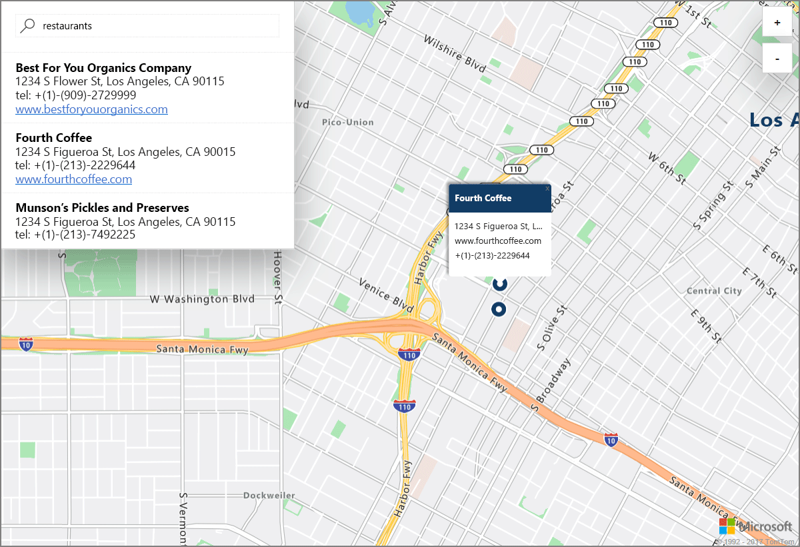

# Een demo starten over interactief zoeken naar kaarten met de Azure Location Based Services (preview)

In dit artikel worden de mogelijkheden beschreven van Azure Location Based Services (preview), of kortweg LBS, met behulp van een interactieve zoekopdracht met behulp van Azure-kaarten. U leert ook de basisstappen voor het maken van uw eigen LBS-account en voor het ophalen van de sleutel van uw account voor gebruik in de demo-webtoepassing. 

Als u nog geen abonnement op Azure hebt, maak dan een [gratis account](https://azure.microsoft.com/free/?WT.mc_id=A261C142F) aan voordat u begint.

## Aanmelden bij Azure Portal

Meld u aan bij [Azure Portal](https://portal.azure.com/).

## Een Location Based Services-account maken en accountsleutel ophalen

1. Klik in de linkerbovenhoek van [Azure Portal](https://portal.azure.com) op **Een resource maken**.
2. In het vak *Marketplace doorzoeken* typt u **location based services**.
3. Klik in de *Resultaten* op **Location Based Services (preview)**. Klik op de knop **Maken** die onder de kaart wordt weergegeven. 
4. Op de pagina **Location Based Services-account maken** voert u de *Naam* voor uw nieuwe account in, selecteert u het gewenste *Abonnement* en voert u de naam van een nieuwe of bestaande *Resourcegroep* in. Selecteer de locatie voor de resourcegroep, accepteer de *Preview-voorwaarden* en klik op **Maken**.

    

5. Nadat uw account is gemaakt, opent u het account en gaat u naar de **Instellingen** van het account. Klik op **Sleutels** om de primaire en secundaire abonnementsleutels voor uw account op te halen. Kopieer de waarde van de **Primaire sleutel** naar uw lokale klembord voor gebruik in de volgende sectie. 

## De demo-toepassing voor Azure-kaarten downloaden

1. Download of kopieer de inhoud van het bestand [interactiveSearch.html](https://github.com/Azure-Samples/location-based-services-samples/blob/master/src/interactiveSearch.html).
2. Sla de inhoud van dit bestand lokaal op als **AzureMapDemo.html** en open de inhoud in een teksteditor.
3. Zoek naar de tekenreeks **&#60;insert-key&#62;** en vervang deze door de waarde voor de **Primaire sleutel** die u in het voorgaande gedeelte hebt verkregen. 

## De demo-toepassing voor Azure-kaarten starten

1. Open het bestand **AzureMapDemo.html** in een browser naar keuze.
2. Bekijk de kaart van Los Angeles. De plaats wordt bepaald door de waarde van het `[longitude, latitude]`-paar dat aan de JavaScript-variabele **center** is gegeven in de *AzureMapDemo.html*. U kunt deze coördinaten wijzigen in die voor een andere plaats van uw keuze. De coördinaten van bijvoorbeeld New York zijn *[-74.0060, 40.7128]*.
3. Voer in het zoekvak in de linkerbovenhoek van de demo-webtoepassing een locatietype of adres in dat u wilt opzoeken. 
4. Beweeg de muis over de lijst met adressen/locaties die wordt weergegeven onder het zoekvak en zie hoe de bijbehorende speld op de kaart informatie over die locatie weergeeft. Een voorbeeld van het gebruik van deze webtoepassing en een zoekopdracht naar *restaurants* leidt tot het volgende. Ten behoeve van de privacy van particuliere bedrijven worden er fictieve namen en adressen weergegeven. 

    

## Resources opschonen

De zelfstudies gaan nader in op het gebruiken en configureren van Azure Location Based Services voor uw account. Als u van plan bent om door te gaan met de zelfstudies, moet u niet de resources verwijderen die u in deze Quick Start hebt gemaakt. Als u niet wilt doorgaan, gebruikt u de volgende stappen om alle resources die via deze Snelstartgids zijn gemaakt, te verwijderen.

1. Sluit de browser waarin de **AzureMapDemo.html**-webtoepassing wordt uitgevoerd.
2. Klik in het linkermenu van Azure Portal op **Alle resources** en selecteer uw LBS-account. Klik bovenaan de blade **Alle resources** op **Verwijderen**.

## Volgende stappen

In deze Quick Start hebt u uw Azure LBS-account gemaakt en een demo-toepassing met uw account uitgevoerd. Als u meer informatie wilt over het maken van uw eigen toepassing met de Azure Location Based Services-API's, ga dan verder met de volgende zelfstudie.

> [!div class="nextstepaction"]
> [Zelfstudie over het gebruik van kaarten en zoeken in Azure](./tutorial-search-location.md)
