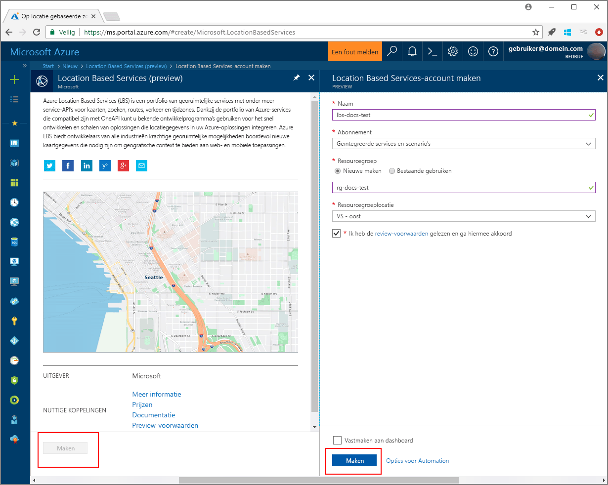

# <a name="search-nearby-points-of-interest-using-azure-location-based-services"></a>Zoek naar nuttige plaatsen in de buurt op basis van Azure Location Based Services

Deze zelfstudie laat zien hoe u een account instellen met Azure Location Based Services en vervolgens de opgegeven API's gebruikt om te zoeken naar een nuttige plaats. In deze zelfstudie leert u het volgende:

> [!div class="checklist"]
> * Een account van Azure Location Based Services maken
> * De primaire sleutel voor uw Azure Location Based Services-account opzoeken
> * Een nieuwe webpagina maken met de Map Control API
> * Search Service gebruiken om een nuttige plaats in de buurt te vinden

Als u nog geen abonnement op Azure hebt, maak dan een [gratis account](https://azure.microsoft.com/free/) aan voordat u begint.

## <a name="log-in-to-the-azure-portal"></a>Aanmelden bij Azure Portal
Meld u aan bij [Azure Portal](https://portal.azure.com).

<a id="createaccount"></a>

## <a name="create-an-account-with-azure-location-based-services"></a>Een account van Azure Location Based Services maken

Volg deze stappen om een nieuw Location Based Services-account. te maken.

1. Klik in de linkerbovenhoek van [Azure Portal](https://portal.azure.com) op **Een resource maken**.
2. In het vak *Marketplace doorzoeken* typt u **location based services**.
3. Klik in de *Resultaten* op **Location Based Services (preview)**. Klik op de knop **Maken** die onder de kaart wordt weergegeven. 
4. Op de pagina **Location Based Services-account maken** voert u de volgende waarden in:
    - De *Naam* van uw nieuwe account. 
    - Het *Abonnement* dat u wilt gebruiken voor dit account.
    - De naam van de *Resourcegroep* voor dit account. U kunt kiezen om een *Nieuwe* of *Bestaande* resourcegroep te gebruiken.
    - Selecteer een *Loacatie voor de resourcegroep*.
    - Lees de *Preview-voorwaarden* en vink het selectievakje aan om de voorwaarden accepteren. 
    - Klik ten slotte op de knop **Maken**.
   
    


<a id="getkey"></a>

## <a name="get-the-primary-key-for-your-account"></a>De primaire sleutel voor uw account ophalen

Als uw Location Based Services-account succesvol is gemaakt, volg u de stappen om een link naar de Map Search API's te maken:

1. Open uw Location Based Services-account in de portal.
2. Navigeer naar de **Instellingen** van uw account en selecteer vervolgens **Sleutels**.
3. Kopieer de **Primaire Sleutel** naar het Klembord. Sla de sleutel lokaal op om te gebruiken in de volgende stappen. 

    


<a id="createmap"></a>

## <a name="create-new-web-page-using-azure-map-control-api"></a>Nieuwe webpagina met Azure Map Control API maken
Azure Map Control API is een handige clientbibliotheek waarmee u eenvoudig Azure Location Based Services in uw webtoepassing integreert. Het verbergt de complexiteit van het aanroepen van de REST-service en verhoogt de productiviteit met stijlbare en aanpasbare onderdelen. Gebruik de volgende stappen voor het maken van een statische HTML-pagina, ingesloten met de Map Control API van Location Based Services. 

1. Maak een nieuw bestand op uw lokale computer en noem dit **MapSearch.html**. 
2. Voeg de volgende HTML-onderdelen toe aan het bestand:

    ```HTML
    <!DOCTYPE html>
    <html lang="en">

    <head>
        <meta charset="utf-8" />
        <meta name="viewport" content="width=device-width, user-scalable=no" />
        <title>Map Search</title>

        <link rel="stylesheet" href="https://atlas.microsoft.com/sdk/css/atlas.min.css?api-version=1.0" type="text/css" />
        <script src="https://atlas.microsoft.com/sdk/js/atlas.min.js?api-version=1.0"></script>

        <style>
            html,
            body {
                width: 100%;
                height: 100%;
                padding: 0;
                margin: 0;
            }

            #map {
                width: 100%;
                height: 100%;
            }
        </style>
    </head>

    <body>
        <div id="map"></div>
        <script>
            // Embed Map Control JavaScript code here
        </script>
    </body>

    </html>
    ``` 
    U ziet dat de HTML-header de CSS- en JavaScript-bronbestanden bevat, gehost door de Azure Map Control-bibliotheek. Let op het *script*-segment dat is toegevoegd aan de *hoofdtekst* van het HTML-bestand. Dit segment bevat de inline JavaScript-code voor toegang tot Location Based Service API's.
 
3.  Voeg de volgende JavaScript-code toe aan het blok *script* van het HTML-bestand. Gebruik de primaire sleutel van uw Location Based Services-account in het script. 

    ```JavaScript
    // Instantiate map to the div with id "map"
    var LBSAccountKey = "<_your account key_>";
    var map = new atlas.Map("map", {
        "subscription-key": LBSAccountKey
    });
    ```
    Dit segment initieert de Map Control API voor de sleutel van uw Azure Location Based Services-account. **Atlas** is de naamruimte die de Azure Map Control API en gerelateerde visuele onderdelen bevat. **atlas.Map** biedt het besturingselement voor een visuele en interactieve webkaart. U kunt zien hoe de kaart eruit ziet door de HTML-pagina in de browser te openen. 

4. Voeg de volgende JavaScript-code toe aan het blok *script* om een laag pins toe te voegen aan Map Control:

    ```JavaScript
    // Initialize the pin layer for search results to the map
    var searchLayerName = "search-results";
    map.addPins([], {
        name: searchLayerName,
        cluster: false,
        icon: "pin-round-darkblue"
    });
    ```

5. Sla het bestand op uw computer op. 


<a id="usesearch"></a>

## <a name="use-search-service-to-find-nearby-point-of-interest"></a>Search Service gebruiken om nuttige plaatsen in de buurt te vinden

Deze sectie beschrijft hoe u met de Search Service API van Azure Location Based Services een nuttige plaats vindt op de kaart. Het is een RESTful API die is bestemd voor ontwikkelaars, om te zoeken naar adressen, nuttige plaatsen en andere geografische informatie. De Search Service wijst informatie over breedtegraad en lengtegraad toe aan een opgegeven adres. 

1. Open het bestand **MapSearch.html** dat in de voorgaande sectie is gemaakt en voeg de volgende JavaScript-code toe aan het blok*script*, ter illustratie van de Search Service. 
    ```JavaScript
    // Perform a request to the search service and create a pin on the map for each result
    var xhttp = new XMLHttpRequest();
    xhttp.onreadystatechange = function () {
        var searchPins = [];

        if (this.readyState === 4 && this.status === 200) {
            var response = JSON.parse(this.responseText);

            var poiResults = response.results.filter((result) => { return result.type === "POI" }) || [];

            searchPins = poiResults.map((poiResult) => {
                var poiPosition = [poiResult.position.lon, poiResult.position.lat];
                return new atlas.data.Feature(new atlas.data.Point(poiPosition), {
                    name: poiResult.poi.name,
                    address: poiResult.address.freeformAddress,
                    position: poiResult.position.lat + ", " + poiResult.position.lon
                });
            });

            map.addPins(searchPins, {
                name: searchLayerName
            });

            var lons = searchPins.map((pin) => { return pin.geometry.coordinates[0] });
            var lats = searchPins.map((pin) => { return pin.geometry.coordinates[1] });

            var swLon = Math.min.apply(null, lons);
            var swLat = Math.min.apply(null, lats);
            var neLon = Math.max.apply(null, lons);
            var neLat = Math.max.apply(null, lats);

            map.setCameraBounds({
                bounds: [swLon, swLat, neLon, neLat],
                padding: 50
            });
        }
    };
    ```
    Dit codefragment maakt een [XMLHttpRequest](https://xhr.spec.whatwg.org/) en voegt een gebeurtenis-handler toe voor het parseren van de binnenkomende respons. Voor een geslaagde respons verzamelt het de informatie over adressen, namen, breedtegraad en lengtegraad voor elke locatie die is geretourneerd, in de variabele `searchPins`. Ten slotte voegt het deze verzameling van locatiepunten als pins toe aan het besturingselement `map`. 

2. Voeg de volgende code toe aan het blok *script* om de XMLHttpRequest te verzenden naar de Search Service van Azure Location Based Services:

    ```JavaScript
    var url = "https://atlas.microsoft.com/search/fuzzy/json?";
    url += "&api-version=1.0";
    url += "&query=gasoline%20station";
    url += "&subscription-key=" + LBSAccountKey;
    url += "&lat=47.6292";
    url += "&lon=-122.2337";
    url += "&radius=100000";

    xhttp.open("GET", url, true);
    xhttp.send();
    ``` 
    Dit fragment maakt gebruik van de basis-zoek-API van de Search Service, die **Fuzzy zoeken** wordt genoemd. Het verwerkt de meest fuzzy invoer van elke combinatie van adres- of *POI*-tokens. Het zoekt naar het **benzinestation** in de buurt, voor het opgegeven adres in breedtegraad en lengtegraad en binnen de opgegeven radius. Het gebruikt de primaire sleutel van uw account die eerder in het voorbeeldbestand werd opgegeven om de aanroep naar de Location Based Services te maken. Deze retourneert de resultaten als breedtegraad lengtegraad/waardeparen voor de locaties die zijn gevonden. U kunt de search pins zien door de HTML-pagina in de browser te openen. 

3. Voeg de volgende regels toe aan het blok *script*, om pop-ups te maken voor de nuttige plaatsen die zijn geretourneerd door de Search Service:

    ```JavaScript
    // Add a popup to the map which will display some basic information about a search result on hover over a pin
    var popup = new atlas.Popup();
    map.addEventListener("mouseover", searchLayerName, (e) => {
        var popupContentElement = document.createElement("div");
        popupContentElement.style.padding = "5px";

        var popupNameElement = document.createElement("div");
        popupNameElement.innerText = e.features[0].properties.name;
        popupContentElement.appendChild(popupNameElement);

        var popupAddressElement = document.createElement("div");
        popupAddressElement.innerText = e.features[0].properties.address;
        popupContentElement.appendChild(popupAddressElement);

        var popupPositionElement = document.createElement("div");
        popupPositionElement.innerText = e.features[0].properties.position;
        popupContentElement.appendChild(popupPositionElement);

        popup.setPopupOptions({
            position: e.features[0].geometry.coordinates,
            content: popupContentElement
        });

        popup.open(map);
    });
    ```
    De API **atlas.Popup** voorziet in een informatievenster dat is verankerd op de juiste positie op de kaart. Met dit codefragment stelt u de inhoud en de positie voor de pop-up in, en voegt een gebeurtenislistener toe aan het besturingselement `map`, dat wacht tot de _muis_ over de pop-up beweegt. 

4. Sla het bestand op, open vervolgens het bestand **MapSearch.html** in een webbrowser naar keuze en bekijk het resultaat. Op dit moment laat de kaart in de browser informatie-pop-ups zien wanneer u de muisaanwijzer over een van de zoekopdracht-pins beweegt, vergelijkbaar met het volgende. 

    


## <a name="next-steps"></a>Volgende stappen
In deze zelfstudie heeft u het volgende geleerd:

> [!div class="checklist"]
> * Een account van Azure Location Based Services maken
> * De primaire sleutel voor uw account ophalen
> * Nieuwe webpagina met Map Control API maken
> * Search Service gebruiken om nuttige plaatsen in de buurt te vinden

Ga door naar de zelfstudie [Route naar een nuttige plaats met behulp van Azure Location Based Services](./tutorial-route-location.md) voor meer informatie over het gebruik van Azure Location Based Services voor de route naar nuttige plaats. 
