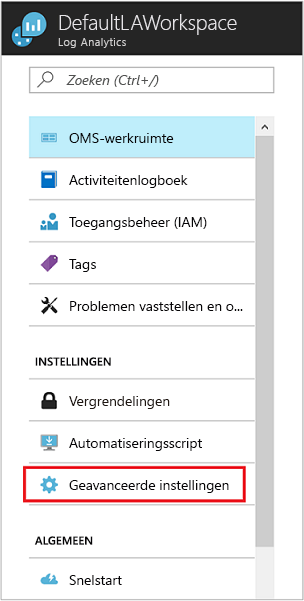
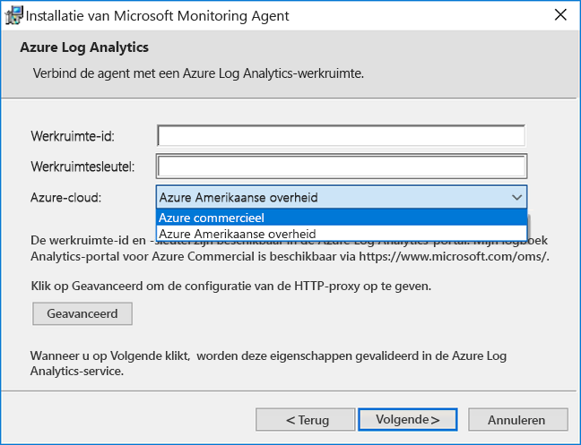
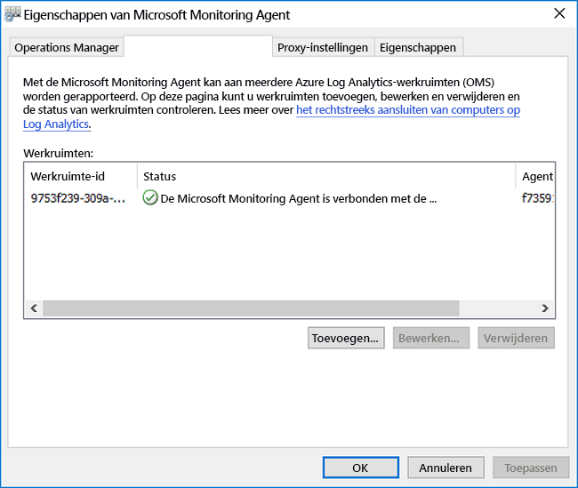

# <a name="connect-windows-computers-to-the-log-analytics-service-in-azure"></a>Windows-computers verbinding met de Log Analytics-service in Azure

Om te controleren en beheren van virtuele machines of fysieke computers in uw lokale datacentrum of andere cloudomgeving met Log Analytics, moet u de Microsoft Monitoring Agent (MMA) implementeren en configureren van deze rapporteert aan een of meer Log Analytics-werkruimten.  De agent ondersteunt ook de hybride Runbook Worker-rol voor Azure Automation.  

De agent wordt weergegeven als de service Microsoft Monitoring Agent op een bewaakte Windows-computer. De service Microsoft Monitoring Agent verzamelt gebeurtenissen van logboekbestanden en Windows-gebeurtenislogboek, prestatiegegevens en andere telemetrie. Zelfs als de agent kan niet communiceren met de Log Analytics-service rapporteert, wordt de agent blijft actief en plaatst de verzamelde gegevens op de schijf van de bewaakte computer. Wanneer de verbinding wordt hersteld, verzendt de service Microsoft Monitoring Agent verzamelde gegevens naar de service.

De agent kan worden geïnstalleerd met behulp van een van de volgende methoden. De meeste installaties gebruik een combinatie van deze methoden voor het installeren van verschillende sets van computers, naar gelang van toepassing.

* Handmatige installatie. Setup wordt handmatig uitgevoerd op de computer met de wizard setup vanaf de opdrachtregel of geïmplementeerd met behulp van een bestaande software-distributie-hulpprogramma.
* Azure Automation Desired State Configuration (DSC). Gebruik van DSC in Azure Automation met een script voor Windows-computers die al zijn geïmplementeerd in uw omgeving.  
* PowerShell-script.
* Resource Manager-sjabloon voor virtuele machines met Windows on-premises in Azure-Stack.  

Raadpleeg voor informatie over de netwerk- en vereisten voor het implementeren van de Windows-agent, [verzamelen van gegevens van uw omgeving met een Azure-logboekanalyse](log-analytics-concept-hybrid.md#prerequisites).

## <a name="obtain-workspace-id-and-key"></a>Werkruimte-ID en -sleutel ophalen
Voordat u de Microsoft Monitoring Agent voor Windows installeert, moet u de werkruimte-ID en de sleutel voor uw werkruimte voor logboekanalyse.  Deze informatie is vereist tijdens de installatie van elke installatiemethode correct configureren van de agent en ervoor zorgen dat deze kan communiceren met logboekanalyse.  

1. Klik in Azure Portal op **Meer services** in de linkerbenedenhoek. Typ in de lijst met resources **Log Analytics**. Als u begint te typen, wordt de lijst gefilterd op basis van uw invoer. Selecteer **Log Analytics**.
2. Selecteer in de lijst met Log Analytics-werkruimten, de werkruimte die u van plan bent over het configureren van de agent om aan te melden.
3. Selecteer **Geavanceerde instellingen**.<br><br> <br><br>  
4. Selecteer **verbonden bronnen**, en selecteer vervolgens **Windows-Servers**.   
5. De waarde rechts van **Werkruimte-ID** en **Primaire sleutel**. Kopieer en plak beide in uw favoriete editor.   
   
## <a name="install-the-agent-using-setup"></a>Installeer de agent via setup
De volgende stappen installeren en configureren van de agent voor logboekanalyse in Azure en Azure Government cloud met behulp van de setup van Microsoft Monitoring Agent op uw computer.  Het installatieprogramma voor de agent is opgenomen in het gedownloade bestand en om moet worden geëxtraheerd 

1. Op de **Windows-Servers** pagina, selecteer de relevante **Windows-Agent downloaden** versie te downloaden, afhankelijk van de processorarchitectuur van de Windows-besturingssysteem.
2. Voer de installatie voor de installatie van de agent op uw computer.
2. Op de **Welkom** pagina, klikt u op **volgende**.
3. Op de **licentievoorwaarden** pagina, lees de licentievoorwaarden en klik vervolgens op **ik ga akkoord**.
4. Op de **doelmap** pagina, wijzigen of de standaardinstallatiemap houden en klik vervolgens op **volgende**.
5. Op de **installatieopties voor Agent** pagina, kiest u de agent verbinden met naar Azure logboekanalyse (OMS) en klik vervolgens op **volgende**.   
6. Op de **Azure Log Analytics** pagina, voert u het volgende:
   1. Plak de **werkruimte-ID** en **Werkruimtesleutel (primaire sleutel)** die u eerder hebt gekopieerd.  Als de computer een werkruimte voor logboekanalyse in Azure Government cloud rapporteren moet, selecteert u **Azure US Government** van de **Azure-Cloud** vervolgkeuzelijst.  
   2. Als de computer communiceren met de Log Analytics-service via een proxyserver moet, klikt u op **Geavanceerd** en geef de URL en het poortnummer van de proxyserver.  Als de proxyserver verificatie vereist, typ de gebruikersnaam en wachtwoord voor verificatie met de proxyserver en klik vervolgens op **volgende**.  
7. Klik op **volgende** als u klaar bent met het leveren van de vereiste configuratie-instellingen.<br><br> <br><br>
8. Op de **gereed voor installatie** pagina, Controleer uw selecties en klik vervolgens op **installeren**.
9. Op de **configuratie voltooid** pagina, klikt u op **voltooien**.

Na voltooiing wordt de **Microsoft Monitoring Agent** wordt weergegeven in **Configuratiescherm**. Om te bevestigen meldt met Log Analytics, Bekijk [controleren of de verbinding van de agent met logboekanalyse](#verify-agent-connectivity-to-log-analytics). 

## <a name="install-the-agent-using-the-command-line"></a>Installeer de agent via de opdrachtregel
Het gedownloade bestand voor de agent is een zelfstandig installatiepakket dat is gemaakt met IExpress.  Het installatieprogramma voor de agent en de ondersteunende bestanden zijn opgenomen in het pakket en moet worden geëxtraheerd correct wilt installeren via de opdrachtregel die wordt weergegeven in de volgende voorbeelden.  Deze methode ondersteunt de configuratie van de agent voor het rapporteren van US Government-en Azure commerciële.  

>[!NOTE]
>Als u een agent bijwerken wilt, moet u de logboekanalyse scripting API gebruiken. Zie het onderwerp [beheren en onderhouden van de agent Log Analytics voor Windows en Linux](log-analytics-agent-manage.md) voor meer informatie.

De volgende tabel licht de specifieke Log Analytics-parameters ondersteund door het installatieprogramma voor de agent, inclusief wanneer geïmplementeerd met behulp van Automation DSC.

|MMA-specifieke opties                   |Opmerkingen         |
|---------------------------------------|--------------|
|ADD_OPINSIGHTS_WORKSPACE               | 1 = de agent voor het rapporteren van een werkruimte configureren                |
|OPINSIGHTS_WORKSPACE_ID                | Werkruimte-Id (guid) voor de werkruimte toevoegen                    |
|OPINSIGHTS_WORKSPACE_KEY               | Werkruimtesleutel in eerste instantie wordt geverifieerd met de werkruimte |
|OPINSIGHTS_WORKSPACE_AZURE_CLOUD_TYPE  | Geef de cloudomgeving waar de werkruimte zich bevindt <br> 0 = azure commerciële cloudservice (standaard) <br> 1 = azure Government |
|OPINSIGHTS_PROXY_URL               | URI voor de proxy te gebruiken |
|OPINSIGHTS_PROXY_USERNAME               | Gebruikersnaam voor toegang tot een geverifieerde proxyserver |
|OPINSIGHTS_PROXY_PASSWORD               | Wachtwoord voor toegang tot een geverifieerde proxyserver |

1. De installatiebestanden van agent ophalen uit een verhoogde opdrachtprompt uitgevoerd `extract MMASetup-<platform>.exe` en krijgt u voor het pad naar de bestanden moeten worden uitgepakt.  U kunt ook het pad opgeven door de argumenten `extract MMASetup-<platform>.exe /c:<Path> /t:<Path>`.  Zie voor meer informatie over het opdrachtregelprogramma switches wordt ondersteund door IExpress [opdrachtregelopties voor IExpress](https://support.microsoft.com/help/197147/command-line-switches-for-iexpress-software-update-packages) en werk vervolgens in het voorbeeld aan uw behoeften.
2. Voor de achtergrond de agent installeren en configureren van deze rapporteert aan een werkruimte in de commerciële Azure-cloud, vanuit de map uitgepakt u de setup-bestanden naar het type: 
   
     ```dos
    setup.exe /qn ADD_OPINSIGHTS_WORKSPACE=1 OPINSIGHTS_WORKSPACE_AZURE_CLOUD_TYPE=0 OPINSIGHTS_WORKSPACE_ID=<your workspace id> OPINSIGHTS_WORKSPACE_KEY=<your workspace key> AcceptEndUserLicenseAgreement=1
    ```

   of typ voor het configureren van de agent om te rapporteren aan Azure US Government cloud: 

     ```dos
    setup.exe /qn ADD_OPINSIGHTS_WORKSPACE=1 OPINSIGHTS_WORKSPACE_AZURE_CLOUD_TYPE=1 OPINSIGHTS_WORKSPACE_ID=<your workspace id> OPINSIGHTS_WORKSPACE_KEY=<your workspace key> AcceptEndUserLicenseAgreement=1
    ```

## <a name="install-the-agent-using-dsc-in-azure-automation"></a>De agent installeert met DSC in Azure Automation

Het volgende scriptvoorbeeld kunt u de agent installeert met Azure Automation DSC.   Als u een Automation-account niet hebt, raadpleegt u [aan de slag met Azure Automation](../automation/automation-offering-get-started.md) vereisten en stappen voor het maken van een Automation-account vereist voordat u Automation DSC begrijpen.  Als u niet bekend met Automation DSC bent, bekijkt u [aan de slag met Automation DSC](../automation/automation-dsc-getting-started.md).

Het volgende voorbeeld installeert de 64-bits agent, geïdentificeerd door de `URI` waarde. U kunt ook de 32-bits versie door de URI-waarde te vervangen. De URI voor beide versies zijn:

- Windows 64-bits agent - https://go.microsoft.com/fwlink/?LinkId=828603
- Windows 32-bits agent - https://go.microsoft.com/fwlink/?LinkId=828604


>[!NOTE]
>In dit voorbeeld procedure en script biedt geen ondersteuning voor het upgraden van de agent al geïmplementeerd op een Windows-computer.

De 32-bits en 64-bits versies van het agentpakket hebben verschillende productcodes en nieuwe versies uitgebracht ook een unieke waarde hebben.  De productcode is een GUID die de principal-id van een toepassing of product en wordt vertegenwoordigd door de Windows Installer **ProductCode** eigenschap.  De `ProductId value` in de **MMAgent.ps1** script moet overeenkomen met de productcode uit het 32-bits of 64-bits agent-installatiepakket.

Als u wilt de productcode rechtstreeks vanaf het agent-installatiepakket ophalen, kunt u Orca.exe uit de [Windows SDK-onderdelen voor Windows Installer-ontwikkelaars](https://msdn.microsoft.com/library/windows/desktop/aa370834%27v=vs.85%28.aspx) is een onderdeel van Windows Software Development Kit of met behulp van De volgende PowerShell een [voorbeeldscript](http://www.scconfigmgr.com/2014/08/22/how-to-get-msi-file-information-with-powershell/) geschreven door een Microsoft waardevolle Professional (MVP).

1. Importeer de DSC xPSDesiredStateConfiguration Module op basis van [http://www.powershellgallery.com/packages/xPSDesiredStateConfiguration](http://www.powershellgallery.com/packages/xPSDesiredStateConfiguration) in Azure Automation.  
2.  Maken van Azure Automation-variabele assets voor *OPSINSIGHTS_WS_ID* en *OPSINSIGHTS_WS_KEY*. Ingesteld *OPSINSIGHTS_WS_ID* tot uw Log Analytics-werkruimte-ID en een set *OPSINSIGHTS_WS_KEY* op de primaire sleutel van uw werkruimte.
3.  Kopieer het script en sla deze op als MMAgent.ps1

    ```PowerShell
    Configuration MMAgent
    {
        $OIPackageLocalPath = "C:\Deploy\MMASetup-AMD64.exe"
        $OPSINSIGHTS_WS_ID = Get-AutomationVariable -Name "OPSINSIGHTS_WS_ID"
        $OPSINSIGHTS_WS_KEY = Get-AutomationVariable -Name "OPSINSIGHTS_WS_KEY"

        Import-DscResource -ModuleName xPSDesiredStateConfiguration

        Node OMSnode {
            Service OIService
            {
                Name = "HealthService"
                State = "Running"
                DependsOn = "[Package]OI"
            }

            xRemoteFile OIPackage {
                Uri = "https://go.microsoft.com/fwlink/?LinkId=828603"
                DestinationPath = $OIPackageLocalPath
            }

            Package OI {
                Ensure = "Present"
                Path  = $OIPackageLocalPath
                Name = "Microsoft Monitoring Agent"
                ProductId = "8A7F2C51-4C7D-4BFD-9014-91D11F24AAE2"
                Arguments = '/C:Deploy"setup.exe /qn ADD_OPINSIGHTS_WORKSPACE=1 OPINSIGHTS_WORKSPACE_ID=' + $OPSINSIGHTS_WS_ID + ' OPINSIGHTS_WORKSPACE_KEY=' + $OPSINSIGHTS_WS_KEY + ' AcceptEndUserLicenseAgreement=1"'
                DependsOn = "[xRemoteFile]OIPackage"
            }
        }
    }

    ```

4. [Importeren van een script voor de configuratie van de MMAgent.ps1](../automation/automation-dsc-getting-started.md#importing-a-configuration-into-azure-automation) in uw Automation-account. 
5. [Toewijzen van een Windows-computer of het knooppunt](../automation/automation-dsc-getting-started.md#onboarding-an-azure-vm-for-management-with-azure-automation-dsc) voor de configuratie. Het knooppunt controleert de configuratie en de agent wordt doorgeschoven, is naar het knooppunt binnen 15 minuten.

## <a name="verify-agent-connectivity-to-log-analytics"></a>Controleer of de agent-connectiviteit met Log Analytics

Zodra instalaltion van de agent voltooid is, is controle van de is verbonden en rapportage kan worden uitgevoerd op twee manieren.  

Bij de computer in **Configuratiescherm**, het item opzoeken **Microsoft Monitoring Agent**.  Selecteer deze en klik op de **Azure logboekanalyse (OMS)** tabblad en de agent moet worden weergegeven in een bericht weergegeven: **de Microsoft Monitoring Agent verbonden is met de Microsoft Operations Management Suite-service.**<br><br> 

U kunt ook een eenvoudige logboek zoekopdracht uitvoeren in de Azure portal.  

1. Klik in Azure Portal op **Meer services** in de linkerbenedenhoek. Typ in de lijst met resources **Log Analytics**. Als u begint te typen, wordt de lijst gefilterd op basis van uw invoer. Selecteer **Log Analytics**.  
2. Selecteer de doelwerkruimte op de pagina van de werkruimte Log Analytics en selecteer vervolgens de **logboek zoeken** tegel. 
2. Klik in het deelvenster logboek zoeken in het veld querytype:  

    ```
    search * 
    | where Type == "Heartbeat" 
    | where Category == "Direct Agent" 
    | where TimeGenerated > ago(30m)  
    ```

U ziet in de lijst met zoekresultaten geretourneerd heartbeat-records voor de computer waarmee wordt aangegeven dat is verbonden en naar de service reporting.   

## <a name="next-steps"></a>Volgende stappen

Bekijk [beheren en onderhouden van de agent Log Analytics voor Windows en Linux](log-analytics-agent-manage.md) voor meer informatie over het beheren van de agent tijdens de levenscyclus van de implementatie op uw computers.  