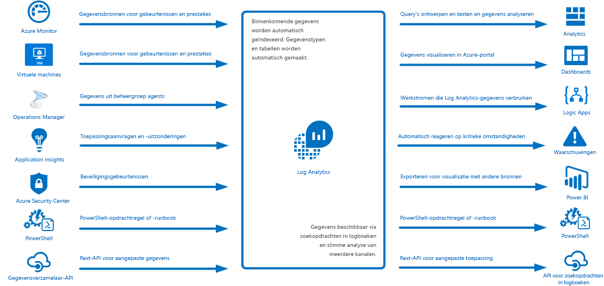
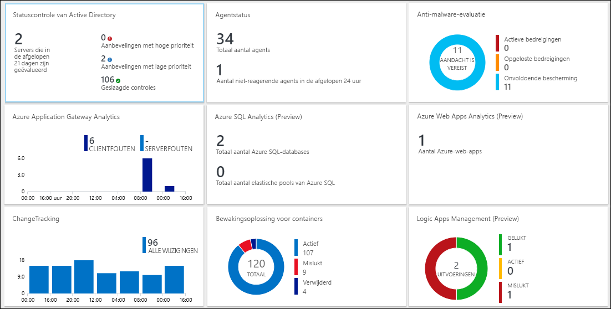
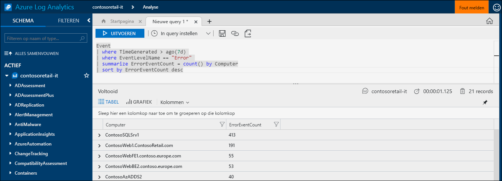
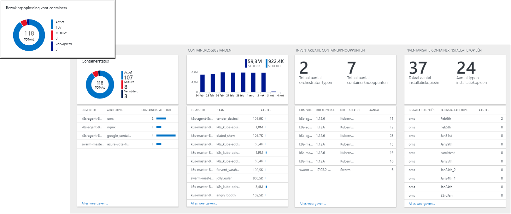
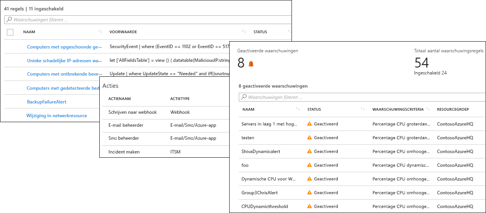
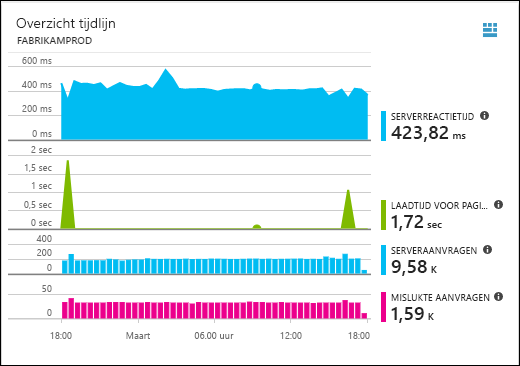
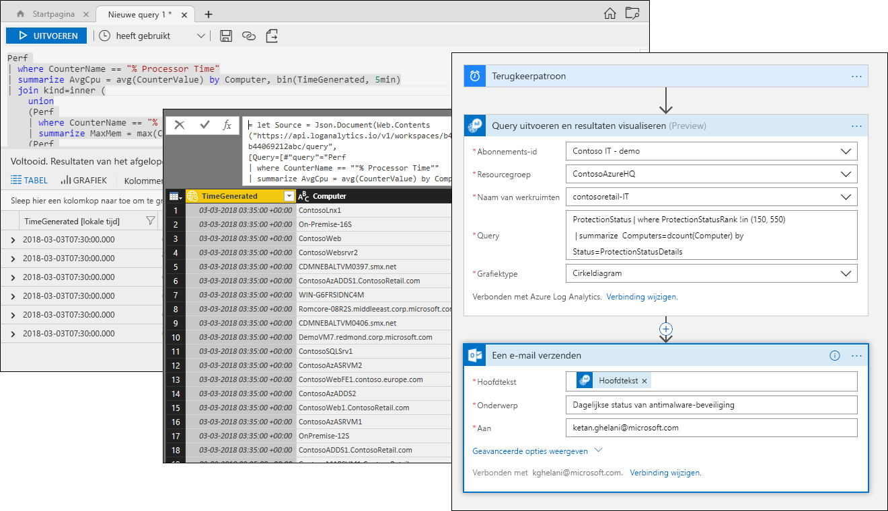

# Wat is Azure Log Analytics?
Log Analytics speelt een centrale rol in Azure-management door telemetrie en andere gegevens te verzamelen uit verschillende bronnen en een querytaal en analysesysteem te leveren die inzicht geven in de werking van uw toepassingen en resources.  U kunt rechtstreeks met Log Analytics- gegevens werken door logboeken en weergaven te doorzoeken, of u kunt gebruikmaken van analyseprogramma's in andere Azure-services die hun gegevens opslaan in Log Analytics, zoals Application Insights of Azure Security Center.  

Log Analytics vereist minimale configuratie en is al geïntegreerd met andere Azure-services.  U hoeft alleen een werkruimte te maken om het verzamelen mogelijk te maken.  Daarna kunt u agents op virtuele machines installeren om deze op te nemen in de werkruimte, en beheeroplossingen inschakelen die logica bevatten om extra inzichten te geven in verschillende toepassingen.  Achter de schermen worden gegevenstypen vooraf gedefinieerd of automatisch gemaakt, naarmate gegevens worden verzameld.

## Rol in bewaking

De verschillende bewakingsservices in Azure worden beschreven in [Monitoring Azure applications and resources](../monitoring-and-diagnostics/monitoring-overview.md) (Azure-toepassingen en -resources bewaken).  Log Analytics speelt een centrale rol door bewakingsgegevens van verschillende bronnen samen te voegen en een krachtige querytaal voor samenvoeging en analyse te bieden.  

Log Analytics is echter niet beperkt tot het bewaken van Azure-resources.  Hiermee kunt u gegevens verzamelen uit resources die zich on-premises of in andere clouds bevinden, om een hybride bewakingsomgeving te creëren. Daarnaast kan Log Analytics rechtstreeks verbinding maken met System Center Operations Manager om telemetriegegevens van bestaande agents te verzamelen.  Analyseprogramma's in Log Analytics, zoals zoeken in logboeken, weergaven en managementoplossingen, worden toegepast op alle verzamelde gegevens, zodat u op één plek uw hele omgeving kunt analyseren.

## Gegevensverzameling
Log Analytics verzamelt gegevens uit verschillende bronnen.  Zodra de gegevens zijn verzameld, worden ze georganiseerd in aparte tabellen voor elk gegevenstype, zodat alle gegevens samen kunnen worden geanalyseerd, ongeacht de oorspronkelijke bron.

Log Analytics beschikt over de volgende methoden voor het verzamelen van gegevens:

- Configureer Azure Monitor om metrische gegevens en de logboeken die van Azure-resources zijn verzameld, te kopiëren.
- Agents op virtuele [Windows](log-analytics-windows-agent.md)- en [Linux](log-analytics-linux-agents.md)-machines verzenden telemetrie vanuit het gastbesturingssysteem en toepassingen naar Log Analytics volgens [gegevensbronnen](log-analytics-data-sources.md) die u hebt geconfigureerd.  
- Verbind een [System Center Operations Manager-beheergroep](log-analytics-om-agents.md) met Log Analytics om gegevens van de agents te verzamelen.
- Azure-services, zoals [Application Insights](https://docs.microsoft.com/azure/application-insights/) en [Azure Security Center](https://docs.microsoft.com/azure/security-center/) slaan hun gegevens rechtstreeks en zonder configuratie op in Log Analytics.
- Schrijf gegevens vanaf de PowerShell-opdrachtregel of vanuit het [Azure Automation-runbook](../automation/automation-runbook-types.md) met behulp van Log Analytics-cmdlets.
- Als u speciale vereisten hebt, kunt u de [API HTTP Data Collector](log-analytics-data-collector-api.md) gebruiken om vanuit een willekeurige REST API-client gegevens weg te schrijven naar Log Analytics.

## Functionaliteit toevoegen met beheeroplossingen
[Managementoplossingen](log-analytics-add-solutions.md) bevatten kant-en-klare logica voor een bepaald product of scenario.  Ze kunnen extra gegevens verzamelen in Log Analytics of gegevens verwerken die eerder zijn verzameld.  Doorgaans bevatten ze een weergave waarmee u deze extra gegevens kunt analyseren.  Er zijn oplossingen voor allerlei functies en er worden elke dag weer nieuwe oplossingen toegevoegd.  U kunt in Azure Marketplace eenvoudig door de beschikbare oplossingen bladeren en [deze toevoegen aan uw werkruimte](log-analytics-add-solutions.md).  

## Querytaal

Log Analytics bevat een [uitgebreide querytaal](http://docs.loganalytics.io) waarmee u verzamelde gegevens snel kunt ophalen, samenvoegen en analyseren.  U kunt query's maken en testen met behulp van de [portals voor Zoeken in logboeken en Geavanceerde analyse](log-analytics-log-search-portals.md). Daarna kunt u de gegevens rechtstreeks analyseren met deze hulpprogramma's of query's opslaan voor gebruik met visualisaties, waarschuwingen, of exporteren naar andere hulpprogramma's, zoals Power BI of Excel.

De querytaal van Log Analytics is geschikt voor eenvoudige zoekopdrachten in logboeken, maar bevat ook geavanceerde functies, zoals aggregaties, joins en slimme analysen. Met de [diverse zelfstudies](https://docs.loganalytics.io/docs/Learn/Tutorials) kunt u de querytaal snel leren.  Er worden specifieke richtlijnen gegeven voor gebruikers die al bekend zijn met [SQL](https://docs.loganalytics.io/docs/Learn/References/SQL-to-Azure-Log-Analytics) en [Splunk](https://docs.loganalytics.io/docs/Learn/References/Splunk-to-Azure-Log-Analytics).

## Log Analytics-gegevens visualiseren

In [weergaven in Log Analytics](log-analytics-view-designer.md) worden de resultaten van zoekopdrachten in logboeken visueel weergegeven.  Elke weergave bevat een combinatie van visualisaties, zoals staaf- en lijndiagrammen, aangevuld met lijsten waarin kritieke gegevens worden samengevat.  [Managementoplossingen](#add-functionality-with-management-solutions) bevatten weergaven waarin gegevens voor een bepaalde toepassing worden samengevat. U kunt uw eigen weergaven maken om de resultaten van een zoekopdracht in Log Analytics-logboeken te weer te geven.

U kunt de resultaten van een Log Analytics-query ook vastmaken aan een [Azure-dashboard](../azure-portal/azure-portal-dashboards.md). Op die manier kunt u tegels uit verschillende Azure-services combineren.  U kunt zelfs een Log Analytics-weergave aan een dashboard vastmaken.

## Waarschuwingen maken op basis van Log Analytics-gegevens

Gebruik [Azure-waarschuwingen](../monitoring-and-diagnostics/monitoring-overview-unified-alerts.md) om u proactief te waarschuwen over voorwaarden in Log Analytics-gegevens die voor u belangrijk zijn.  Een query wordt automatisch uitgevoerd op geplande tijden en er wordt een waarschuwing gemaakt als de resultaten aan bepaalde criteria voldoen.  Op die manier kunt u waarschuwingen vanuit Log Analytics combineren met andere bronnen, zoals bijna realtime waarschuwingen [Azure Monitor](../monitoring-and-diagnostics/monitoring-near-real-time-metric-alerts.md) en toepassingsuitzonderingen [Application Insights](../application-insights/app-insights-alerts.md), delen [Actiegroepen](../monitoring-and-diagnostics/monitoring-action-groups.md) om op belangrijke situaties te reageren.

## Log Analytics-gegevens gebruiken in andere services
Services, zoals Application Insights en Azure Security Center, slaan hun gegevens op in Log Analytics.  Doorgaans werkt u met de uitgebreide analysehulpprogramma's van deze services, maar u kunt ook Log Analytics-query's gebruiken om toegang te krijgen tot hun gegevens en deze mogelijk combineren met gegevens van andere services.  

De volgende weergave komt bijvoorbeeld uit Application Insights.  Als u op het pictogram in de rechterbovenhoek klikt, wordt de analyseconsole van Log Analytics gestart met de query's die door de grafiek worden gebruikt.

## Log Analytics-gegevens exporteren

Log Analytics stelt gegevens ook beschikbaar buiten Azure.  U kunt [Power BI](log-analytics-powerbi.md) configureren om de resultaten van een query met regelmatige tussenpozen te importeren. U kunt dan profiteren van de functies, zoals het combineren van gegevens uit verschillende bronnen en het delen van rapporten op het web en mobiele apparaten.  U kunt ook gebruikmaken van de [API voor de zoekopdrachten in logboeken](log-analytics-log-search-api.md) om aangepaste oplossingen te bouwen die gebruikmaken van Log Analytics-gegevens of om te integreren met andere systemen.

U kunt [Logic Apps](../logic-apps/logic-apps-overview.md) in Azure gebruiken voor het maken van aangepaste werkstromen op basis van Log Analytics-gegevens.  Voor complexere logica op basis van PowerShell kunt u [runbooks in Azure Automation](../automation/automation-runbook-types.md) gebruiken.

## Volgende stappen
- Ga aan de slag door [gegevens te verzamelen van Azure VM's](log-analytics-quick-collect-azurevm.md).
- Doorloop een [zelfstudie over hoe u Log Analytics-gegevens kunt analyseren met een eenvoudige query](log-analytics-tutorial-viewdata.md).
* [Blader door de beschikbare oplossingen](log-analytics-add-solutions.md) om functionaliteit toe te voegen aan Log Analytics.

