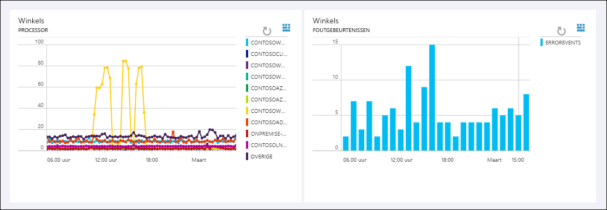

# Wat is Log Analytics?
Log Analytics is een service in [Operations Management Suite \(OMS\)](../operations-management-suite/operations-management-suite-overview.md) waarmee u uw cloud- en on-premises omgevingen kunt bewaken om zo hun beschikbaarheid en prestaties te onderhouden.  De service verzamelt gegevens afkomstig van resources in uw cloud- en on-premises omgevingen en van andere bewakingsprogramma's om analyse over meerdere resources aan te bieden.  Dit artikel bevat een korte beschrijving van de waarde die Log Analytics toevoegt, een overzicht van hoe het werkt en koppelingen naar meer gedetailleerde inhoud zodat u dieper op het onderwerp in kunt gaan.

## Is Log Analytics iets voor u?
Als u op dit moment niet beschikt over een bewakingsfunctie voor uw Azure-omgeving, kunt u beginnen met [Azure Monitor](../monitoring-and-diagnostics/monitoring-overview.md) om bewakingsgegevens voor uw Azure-resources te verzamelen en analyseren.  Log Analytics kan [gegevens van Azure Monitor opvragen](log-analytics-azure-storage.md) en deze correleren met andere gegevens om zo aanvullende analyse mogelijk te maken.

Als u uw on-premises omgeving wilt bewaken of als u bewaking hebt ingesteld op basis van services zoals Azure Monitor of System Center Operations Manager, kan Log Analytics aanzienlijke waarde toevoegen.  De service kan namelijk rechtstreeks gegevens opvragen bij verschillende agents en bij deze andere services en verzamelen in één opslagplaats.  Analyseprogramma's in Log Analytics zoals zoeken in logboeken, weergaven en oplossingen worden toegepast op alle verzamelde gegevens zodat u op één plek toegang hebt tot een analyse van de hele omgeving.

## Log Analytics gebruiken
Log Analytics is via elke browser toegankelijk vanuit de OMS-portal of Azure Portal. U kunt daar configuratie-instellingen opgeven en verschillende hulpprogramma's uitvoeren om de verzamelde gegevens te analyseren en er actie op te ondernemen.  Vanuit de portal kunt u gebruikmaken van [zoekopdrachten in logboeken](log-analytics-log-searches.md) waar u query's samenstelt om verzamelde gegevens te analyseren, [dashboards](log-analytics-dashboards.md) die u kunt aanpassen met grafische views van uw waardevolste zoekopdrachten en [oplossingen](log-analytics-add-solutions.md) die aanvullende functionaliteit en analysehulpprogramma's bieden.

Hieronder ziet u een afbeelding van de OMS-portal, met daarin het dashboard met samenvattingsinformatie voor de [oplossingen](#add-functionality-with-management-solutions) die in de werkruimte zijn geïnstalleerd.  U kunt klikken op een tegel om verder in te zoomen op de gegevens voor die oplossing.

Log Analytics ondersteunt een querytaal voor het snel ophalen en samenvoegen van gegevens in de opslagplaats.  U kunt [zoekopdrachten in logboeken](log-analytics-log-searches.md) maken en opslaan om gegevens direct in de portal te analyseren of automatisch zoekopdrachten in logboeken uitvoeren om een waarschuwing te genereren als de resultaten van de query een belangrijke toestand aangeven.

Om een snelle grafische weergave van de status van uw algehele omgeving te krijgen, kunt u visualisaties voor opgeslagen zoekopdrachten in logboeken toevoegen aan uw [dashboard](log-analytics-dashboards.md).   

Als u gegevens buiten Log Analytics wilt analyseren, kunt u de gegevens uit de OMS-opslagplaats OMS exporteren in hulpprogramma's zoals [Power BI](log-analytics-powerbi.md) of Excel.  U kunt ook gebruikmaken van de [API voor de zoekopdrachten in logboeken](log-analytics-log-search-api.md) om aangepaste oplossingen te bouwen die gebruikmaken van Log Analytics-gegevens of om te integreren met andere systemen.

## Functionaliteit toevoegen met beheeroplossingen
[Beheeroplossingen](log-analytics-add-solutions.md) voegen functionaliteit toe aan OMS, waardoor er aanvullende gegevens- en analysefuncties beschikbaar komen voor Log Analytics.  Er zijn ook oplossingen waarmee nieuwe recordtypen kunnen worden gedefinieerd die moeten worden verzameld. Deze kunnen vervolgens worden geanalyseerd met zoekopdrachten in logboeken of door een aanvullende gebruikersinterface die door de oplossing wordt weergegeven in het dashboard.  In de afbeelding hieronder ziet u de oplossing [Windows-bestandstracering](log-analytics-change-tracking.md).

Er zijn oplossingen voor allerlei functies en er worden elke dag weer nieuwe oplossingen toegevoegd.  U kunt in de oplossingengalerie of Azure Marketplace eenvoudig door de beschikbare oplossingen bladeren en [deze toevoegen aan uw OMS-werkruimte](log-analytics-add-solutions.md).  Veel van de oplossing worden automatisch geïmplementeerd en zijn direct bruikbaar, terwijl voor andere oplossingen mogelijk enige configuratie vereist is.

## Onderdelen van Log Analytics
In het centrum van Log Analytics bevindt zich de OMS-opslagplaats die in de Azure-cloud wordt beheerd.  Gegevens worden vanuit verbonden bronnen verzameld in de opslagplaats door gegevensbronnen te configureren en oplossingen toe te voegen aan uw abonnement.  Gegevensbronnen en oplossingen creëren elk verschillende recordtypen die hun eigen set eigenschappen hebben, maar nog steeds samen kunnen worden geanalyseerd in query's in de opslagplaats.  Hiermee kunt u dezelfde hulpprogramma's en methoden gebruiken om te werken met verschillende soorten gegevens die door verschillende bronnen zijn verzameld.

Verbonden bronnen zijn de computers en andere bronnen die gegevens genereren die worden verzameld door Log Analytics.  Dit kunnen agenten zijn die zijn geïnstalleerd op [Windows-](log-analytics-windows-agents.md) en [Linux](log-analytics-linux-agents.md)-computers die rechtstreeks verbinding maken of agenten in een [verbonden beheergroep van System Center Operations Manager](log-analytics-om-agents.md).  In het geval van Azure-resources verzamelt Log Analytics gegevens uit [Azure Monitor en Azure Diagnostics](log-analytics-azure-storage.md).

[Gegevensbronnen](log-analytics-data-sources.md) zijn de verschillende soorten gegevens die uit elke verbonden bron worden verzameld.  Voorbeelden hiervan zijn [gebeurtenissen](log-analytics-data-sources-windows-events.md) en [prestatiegegevens](log-analytics-data-sources-performance-counters.md) van [Windows](log-analytics-data-sources-windows-events.md)- en Linux-agenten, naast bronnen zoals [IIS-logboeken](log-analytics-data-sources-iis-logs.md) en [aangepaste tekstlogboeken](log-analytics-data-sources-custom-logs.md).  U configureert elke gegevensbron die u wenst te verzamelen en de configuratie wordt automatisch doorgegeven aan elke verbonden bron.

Als u speciale vereisten hebt, kunt u de [API HTTP Data Collector](log-analytics-data-collector-api.md) gebruiken om vanuit een REST API-client gegevens weg te schrijven naar de opslagplaats.

## Architectuur van Log Analytics
De implementatievereisten van Log Analytics zijn minimaal omdat de centrale onderdelen in de Azure-cloud worden gehost.  Dit omvat de opslagplaats naast de services die u in staat stellen verzamelde gegevens te correleren en te analyseren.  De portal is toegankelijk vanuit elke browser. Er is dus geen vereiste voor de clientsoftware.

U moet agenten installeren op [Windows](log-analytics-windows-agents.md)- en [Linux](log-analytics-linux-agents.md)-computers, maar er is geen aanvullende agent vereist voor computers die al lid van zijn een [verbonden SCOM-beheergroep](log-analytics-om-agents.md).  SCOM-agenten blijven communiceren met beheerservers die hun gegevens doorsturen naar Log Analytics.  Een aantal oplossingen vereist echter agenten om rechtstreeks te communiceren met Log Analytics.  In de documentatie voor elke oplossing worden de communicatievereisten gespecificeerd.

Wanneer u [zich aanmeldt voor Log Analytics](log-analytics-get-started.md), maakt u een OMS-werkruimte.  U kunt de werkruimte zien als een unieke omgeving van Log Analytics met een eigen gegevensopslagplaats, gegevensbronnen en oplossingen. U kunt meerdere werkruimten maken in uw abonnement om meerdere omgevingen zoals een productieomgeving en testomgeving te ondersteunen.

## Volgende stappen
* [Meld u aan voor een gratis Log Analytics-account](log-analytics-get-started.md) om in uw eigen omgeving te testen.
* Bekijk de verschillende [gegevensbronnen](log-analytics-data-sources.md) die beschikbaar voor het verzamelen van gegevens in de OMS-opslagplaats.
* [Blader door de beschikbare oplossingen in de Galerie van oplossingen](log-analytics-add-solutions.md) om functionaliteit toe te voegen aan Log Analytics.

