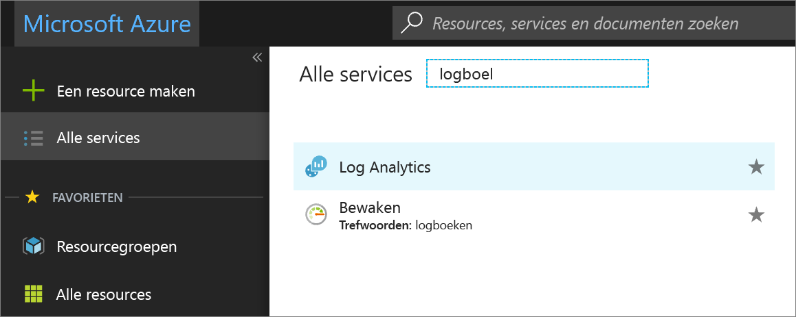
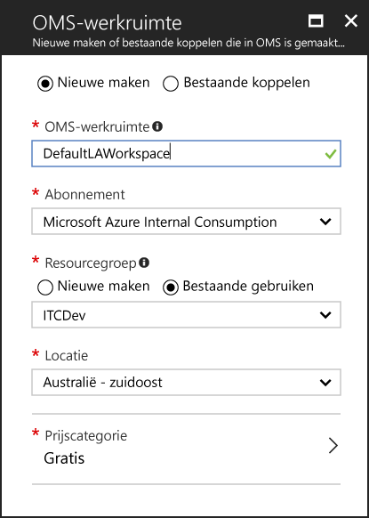
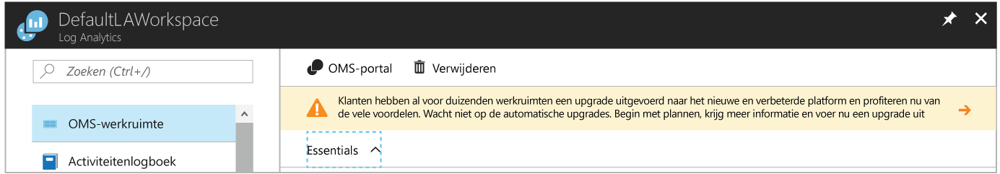
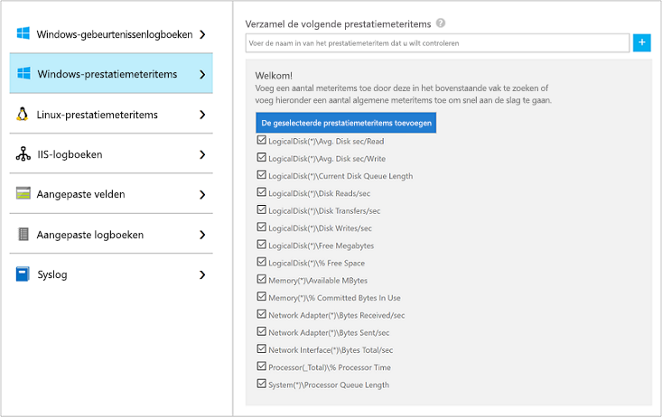
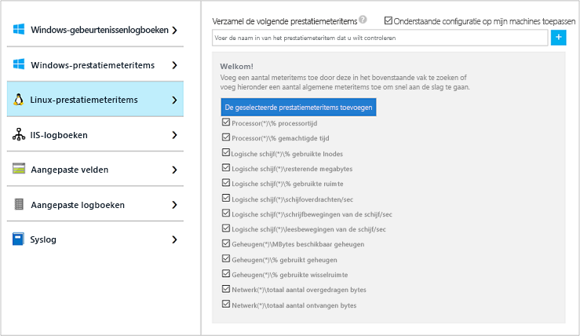
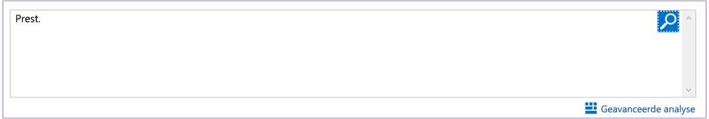
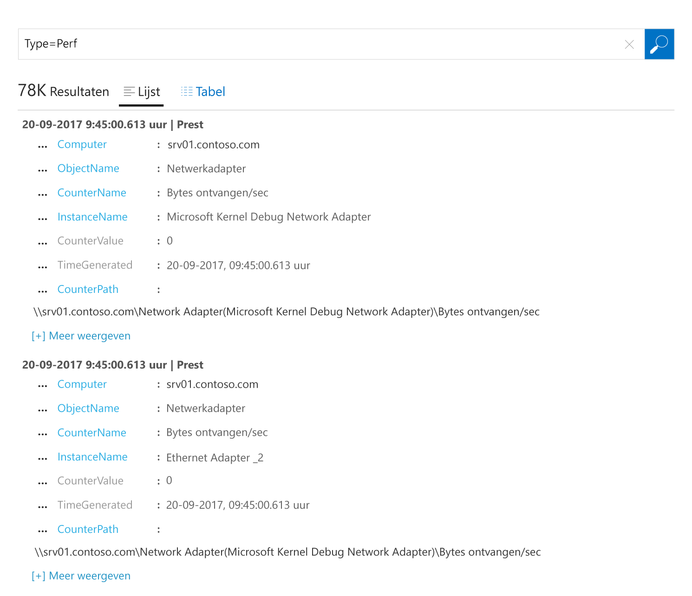
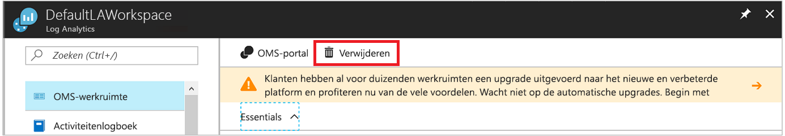

# Gegevens verzamelen over Azure Virtual Machines
[Azure Log Analytics](log-analytics-overview.md) kan gegevens rechtstreeks vanuit uw Azure-VM’s en andere bronnen in uw omgeving verzamelen en onderbrengen in één opslagplaats voor gedetailleerde analyse en correlatie.  In deze Quick Start wordt beschreven hoe u met een paar eenvoudige stappen gegevens van uw Azure Linux- of Windows-VM’s configureert en verzamelt.  
 
In deze Quick Start wordt ervan uitgegaan dat u een bestaande Azure-VM hebt. Als u geen [Windows-VM](../virtual-machines/windows/quick-create-portal.md) of [Linux-VM](../virtual-machines/linux/quick-create-cli.md) kunt maken, raadpleeg dan onze Quick Starts voor VM’s.

## Aanmelden bij Azure Portal
Meld u aan bij Azure Portal op [https://portal.azure.com](https://portal.azure.com). 

## Een werkruimte maken
1. Klik in Azure Portal op **Meer services** in de linkerbenedenhoek. Typ in de lijst met resources **Log Analytics**. Als u begint te typen, wordt de lijst gefilterd op basis van uw invoer. Selecteer **Log Analytics**.     
2. Klik op **Maken** en geef uw keuze aan voor de volgende items:

  * Geef een naam op voor de nieuwe **OMS-werkruimte**, bijvoorbeeld *StandaardLAWerkruimte*. 
  * Selecteer een **abonnement** om te koppelen door een selectie in de vervolgkeuzelijst te maken als de geselecteerde standaardwaarde niet juist is.
  * Selecteer bij **Resourcegroep** een bestaande resourcegroep die een of meer virtuele Azure-machines bevat.  
  * Selecteer de **Locatie** waarop uw virtuele machines zijn geïmplementeerd.  Bekijk [in welke regio's Log Analytics beschikbaar is](https://azure.microsoft.com/regions/services/) voor aanvullende informatie.
  * U kunt in Log Analytics kiezen uit drie verschillende **prijscategorieën**, maar in deze snelstartgids gaat u de **gratis** categorie selecteren.  Zie [Prijzen voor Log Analytics](https://azure.microsoft.com/pricing/details/log-analytics/) voor aanvullende informatie over de afzonderlijke lagen.

           
3. Nadat u de vereiste gegevens hebt opgegeven in het deelvenster **OMS-werkruimte**, klikt u op **OK**.  

Terwijl de gegevens worden geverifieerd en de werkruimte wordt gemaakt, kunt u de voortgang bijhouden onder **Meldingen** in het menu. 

## De Log Analytics VM-extensie inschakelen
Voor Windows- en Linux-VM’s die al zijn geïmplementeerd in Azure, installeert u de Log Analytics-agent met de VM-extensie van Log Analytics.  De extensie vereenvoudigt het installatieproces en configureert automatisch de agent voor het verzenden van gegevens naar de Log Analytics-werkruimte die u opgeeft. De agent wordt bovendien automatisch bijgewerkt, zodat u over de nieuwste functies en correcties beschikt.

>[!NOTE]
>De OMS-agent voor Linux kan niet worden geconfigureerd om aan meer dan één werkruimte voor Log Analytics te rapporteren. 

Als u een werkruimte hebt gemaakt in Azure Government-cloud, ziet u mogelijk boven aan de Log Analytics-resourcepagina in de portal een banner met de vraag om een upgrade uit te voeren.  De upgrade is niet nodig voor het doel van deze Quick Start. 

.    
1. Klik in Azure Portal op **Meer services** in de linkerbenedenhoek. Typ in de lijst met resources **Log Analytics**. Als u begint te typen, wordt de lijst gefilterd op basis van uw invoer. Selecteer **Log Analytics**.
2. Selecteer in de lijst met Log Analytics-werkruimten de *StandaardLAWerkruimte* die u eerder hebt gemaakt.
3. In het menu links, onder Gegevensbronnen voor werkruimte, klikt u op **Virtuele machines**.  
4. Selecteer in de lijst **Virtuele machines** een virtuele machine waarop u de agent wilt installeren. Zoals u ziet, geeft de **OMS-verbindingsstatus** voor de virtuele machine aan dat deze **Niet verbonden** is.
5. Selecteer **Verbinding maken** in de details voor de virtuele machine. De agent wordt automatisch geïnstalleerd en geconfigureerd voor uw Log Analytics-werkruimte. Tijdens dit proces, dat een paar minuten duurt, is de **status** **Verbinding maken**.
6. Nadat u de agent hebt geïnstalleerd en er verbinding mee hebt gemaakt, wordt de **OMS-verbindingsstatus** bijgewerkt met **Deze werkruimte**.

## Gebeurtenis- en prestatiegegevens verzamelen
Log Analytics kan gebeurtenissen uit de Windows-gebeurtenislogboeken of de Linux Syslog en prestatiemeteritems verzamelen die u opgeeft voor langetermijnanalyses en -rapportages en kan actie ondernemen wanneer een bepaalde voorwaarde wordt gedetecteerd.  Volg deze stappen voor het verzamelen van gebeurtenissen uit het Windows-gebeurtenislogboek en de Linux Syslog en diverse algemene prestatiemeters om mee te beginnen.  

### Gegevens verzamelen van virtuele Windows-machines
1. Selecteer **Geavanceerde instellingen**.    
3. Selecteer **Gegevens** en selecteer vervolgens **Windows-gebeurtenislogboeken**.  
4. U kunt een gebeurtenislogboek toevoegen door de naam van het logboek te typen.  Typ **System** en klik op het plusteken **+**.  
5. Schakel in de tabel de ernstcategorieën **Fout** en **Waarschuwing** in.   
6. Klik op **Opslaan** bovenaan de pagina om de configuratie op te slaan.
7. Selecteer **Windows-prestatiegegevens** om het verzamelen van prestatiemeteritems op een Windows-computer in te schakelen. 
8. Wanneer u voor het eerst Windows-prestatiemeteritems voor een nieuwe Log Analytics-werkruimte configureert, krijgt u de optie om snel verschillende algemene prestatiemeteritems te maken. Ze worden weergegeven met een selectievakje ernaast.  .  Klik op **De geselecteerde prestatiemeteritems toevoegen**.  Ze worden toegevoegd en vooraf ingesteld met een sample-interval van tien seconden.  
9. Klik op **Opslaan** bovenaan de pagina om de configuratie op te slaan.

### Gegevens verzamelen van virtuele Linux-machines

1. Selecteer **Syslog**.  
2. U kunt een gebeurtenislogboek toevoegen door de naam van het logboek te typen.  Typ **Syslog** en klik op het plusteken **+**.  
3. Schakel in de tabel de ernstcategorieën **Info**, **Kennisgeving** en **Fouten opsporen** uit. 
4. Klik op **Opslaan** bovenaan de pagina om de configuratie op te slaan.
5. Selecteer **Linux-prestatiegegevens** om het verzamelen van prestatiemeteritems op een Linux-computer in te schakelen. 
6. Wanneer u Linux-prestatiemeteritems voor een nieuwe Log Analytics-werkruimte voor het eerst configureert, krijgt u de optie om snel verschillende algemene prestatiemeteritems te maken. Ze worden weergegeven met een selectievakje ernaast.  .  Klik op **De geselecteerde prestatiemeteritems toevoegen**.  Ze worden toegevoegd en vooraf ingesteld met een sample-interval van tien seconden.  
7. Klik op **Opslaan** bovenaan de pagina om de configuratie op te slaan.

## Verzamelde gegevens weergeven
Nu u gegevensverzameling hebt ingeschakeld, geven we een voorbeeld van een eenvoudige zoekopdracht in logboeken om enkele gegevens afkomstig van de doel-VM’s weer te geven.  

1. Navigeer in Azure Portal naar Log Analytics en selecteer de werkruimte die u eerder hebt gemaakt.
2. Klik op de tegel **Zoeken in logboeken**. In het deelvenster Zoeken in logboeken typt u `Perf` in het queryveld en drukt u op Enter of klikt u op de zoekknop rechts van het queryveld.    

   >[!NOTE]
   >Als de werkruimte is gemaakt in Azure Government-cloud, gebruikt u de query `Type=Perf`.  
   >

Zo geeft de query in de volgende afbeelding 78.000 prestatierecords als resultaat.  Uw resultaat zal aanzienlijk kleiner zijn.  

## Resources opschonen
Wanneer deze niet langer nodig is, verwijdert u de Log Analytics-werkruimte. U kunt de werkruimte verwijderen door de Log Analytics-werkruimte te selecteren die u eerder hebt gemaakt en vervolgens te klikken op **Verwijderen** op de resourcepagina.  

## Volgende stappen
Nu u bezig bent met het verzamelen van operationele gegevens en prestatiegegevens van uw virtuele Windows- of Linux-machines, kunt u beginnen met het verkennen, analyseren en het ondernemen van actie op gegevens die u *gratis* verzamelt.  

Voor informatie over het weergeven en analyseren van de gegevens gaat u verder met de zelfstudie.   

> [!div class="nextstepaction"]
> [Gegevens weergeven of analyseren in Log Analytics](log-analytics-tutorial-viewdata.md)
