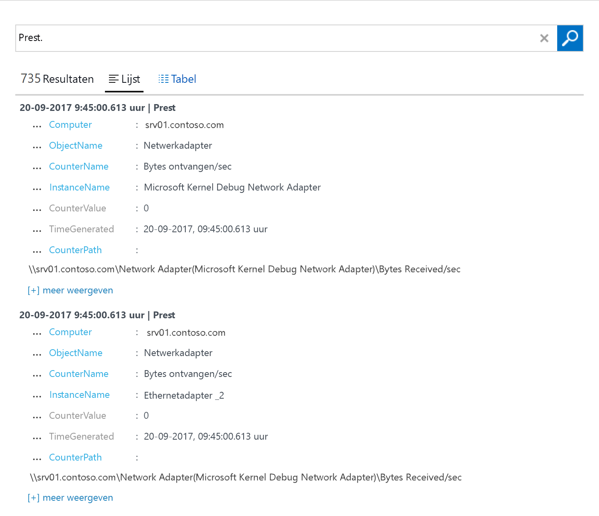

# Gegevens verzamelen van Windows-computers die in uw omgeving worden gehost
[Azure Log Analytics](log-analytics-overview.md) kan gegevens rechtstreeks vanuit uw fysieke of virtuele Windows-computers en andere bronnen in uw omgeving verzamelen en onderbrengen in één opslagplaats voor uitvoerige analyse en correlatie.  In deze quickstart wordt beschreven hoe u met een paar eenvoudige stappen gegevens van uw Windows-computer configureert en verzamelt.  Zie het volgende onderwerp, [Gegevens over Azure Virtual Machines verzamelen](log-analytics-quick-collect-azurevm.md), voor informatie over virtuele Windows-machines in Azure.  

Raadpleeg [Gegevens uit uw omgeving verzamelen met Azure Log Analytics](log-analytics-concept-hybrid.md#prerequisites) voor informatie over de netwerk- en systeemvereisten voor het implementeren van de Windows-agent.
 
Als u nog geen abonnement op Azure hebt, maak dan een [gratis account](https://azure.microsoft.com/free/?WT.mc_id=A261C142F) aan voordat u begint.

## Aanmelden bij Azure Portal
Meld u aan bij Azure Portal op [https://portal.azure.com](https://portal.azure.com). 

## Een werkruimte maken
1. Klik in Azure Portal op **Meer services** in de linkerbenedenhoek. Typ in de lijst met resources **Log Analytics**. Als u begint te typen, wordt de lijst gefilterd op basis van uw invoer. Selecteer **Log Analytics**.       
2. Klik op **Maken** en geef uw keuze aan voor de volgende items:

  * Geef een naam op voor de nieuwe **OMS-werkruimte**, bijvoorbeeld *StandaardLAWerkruimte*. 
  * Selecteer een **abonnement** om te koppelen door een selectie in de vervolgkeuzelijst te maken als de geselecteerde standaardwaarde niet juist is.
  * Selecteer bij **Resourcegroep** een bestaande resourcegroep die een of meer virtuele Azure-machines bevat.  
  * Selecteer de **Locatie** waarop uw virtuele machines zijn geïmplementeerd.  Bekijk [in welke regio's Log Analytics beschikbaar is](https://azure.microsoft.com/regions/services/) voor aanvullende informatie.
  * U kunt in Log Analytics kiezen uit drie verschillende **prijscategorieën**, maar in deze quickstart gaat u de **gratis** categorie selecteren.  Zie [Prijzen voor Log Analytics](https://azure.microsoft.com/pricing/details/log-analytics/) voor aanvullende informatie over de afzonderlijke lagen.

           
3. Nadat u de vereiste gegevens hebt opgegeven in het deelvenster **OMS-werkruimte**, klikt u op **OK**.  

Terwijl de gegevens worden geverifieerd en de werkruimte wordt gemaakt, kunt u de voortgang bijhouden onder **Meldingen** in het menu. 

## Werkruimte-ID en -sleutel ophalen
Voordat u de MMA (Microsoft Monitoring Agent) voor Windows installeert, hebt u eerst de werkruimte-id en -sleutel voor uw Log Analytics-werkruimte nodig.  Het script voor de wizard Setup heeft deze informatie nodig om de agent correct te configureren en ervoor te zorgen dat deze kan communiceren met Log Analytics.  

1. Klik in Azure Portal op **Meer services** in de linkerbenedenhoek. Typ in de lijst met resources **Log Analytics**. Als u begint te typen, wordt de lijst gefilterd op basis van uw invoer. Selecteer **Log Analytics**.
2. Selecteer in de lijst met Log Analytics-werkruimten de *StandaardLAWerkruimte* die u eerder hebt gemaakt.
3. Selecteer **Geavanceerde instellingen**.       
4. Selecteer **Verbonden bronnen** en selecteer vervolgens **Windows-servers**.   
5. De waarde rechts van **Werkruimte-id** en **Primaire sleutel**. Kopieer en plak beide in uw favoriete editor.   

## De agent voor Windows installeren
Met de volgende stappen wordt de agent voor Log Analytics in Azure en een Azure Government-cloud op uw computer geïnstalleerd en geconfigureerd met behulp van de setup voor de MMA.  

1. Selecteer op de pagina **Windows-servers** de desbetreffende versie bij **Windows Agent downloaden** om deze te downloaden. De versie is afhankelijk van de processorarchitectuur van het Windows-besturingssysteem.
2. Voer Setup uit om de agent op de computer te installeren.
2. Klik op de pagina **Welkom** op **Volgende**.
3. Lees de licentie op de pagina **Licentievoorwaarden** en klik op **Akkoord**.
4. Op de pagina **Doelmap** wijzigt u desgewenst de standaardinstallatiemap en klikt u op **Volgende**.
5. Op de pagina **Installatieopties voor agent** kiest u ervoor de agent verbinding te laten maken met Azure Log Analytics (OMS) en klikt u op **Volgende**.   
6. Ga op de pagina **Azure Log Analytics** als volgt te werk:
   1. Plak de **Werkruimte-id** en **Werkruimtesleutel (primaire sleutel)** die u eerder hebt gekopieerd.  Als u de computer wilt laten rapporteren bij een Log Analytics-werkruimte in de Azure Government-cloud, selecteert u **Azure US Government** in de vervolgkeuzelijst **Azure Cloud**.  
   2. Als de computer met de Log Analytics-service moet communiceren via een proxyserver, klikt u op **Geavanceerd** en geeft u de URL en het poortnummer van de proxyserver op.  Als er voor uw proxyserver verificatie is vereist, voert u de gebruikersnaam en het wachtwoord in voor verificatie met de proxyserver. Klik vervolgens op **Volgende**.  
7. Klik op **Volgende** als u de vereiste configuratie-instellingen hebt voltooid.     
8. Controleer op de pagina **Gereed om te installeren** uw keuzes en klik op **Installeren**.
9. Klik op de pagina **Configuratie voltooid** op **Voltooien**.

Als u klaar bent wordt de **MMA** in het **Configuratiescherm** weergegeven. U kunt de configuratie controleren en verifiëren of de agent is verbonden met Log Analytics. Als er verbinding is gemaakt, wordt op het tabblad **Azure Log Analytics (OMS)** het volgende bericht weergegeven: **The Microsoft Monitoring Agent has successfully connected to the Microsoft Operations Management Suite service**.   

## Gebeurtenis- en prestatiegegevens verzamelen
Log Analytics kan gebeurtenissen uit de Windows-gebeurtenislogboeken en prestatiemeteritems verzamelen die u opgeeft voor langetermijnanalyses en -rapportages en kan actie ondernemen wanneer een bepaalde voorwaarde wordt gedetecteerd.  Volg deze stappen om eerst het verzamelen van gebeurtenissen uit de Windows-gebeurtenislogboeken en diverse algemene prestatiemeters te configureren.  

1. Klik in Azure Portal op **Meer services** in de linkerbenedenhoek. Typ in de lijst met resources **Log Analytics**. Als u begint te typen, wordt de lijst gefilterd op basis van uw invoer. Selecteer **Log Analytics**.
2. Selecteer **Geavanceerde instellingen**.      
3. Selecteer **Gegevens** en selecteer vervolgens **Windows-gebeurtenislogboeken**.  
4. U kunt een gebeurtenislogboek toevoegen door de naam van het logboek te typen.  Typ **System** en klik op het plusteken **+**.  
5. Schakel in de tabel de ernstcategorieën **Fout** en **Waarschuwing** in.   
6. Klik op **Opslaan** bovenaan de pagina om de configuratie op te slaan.
7. Selecteer **Windows-prestatiegegevens** om het verzamelen van prestatiemeteritems op een Windows-computer in te schakelen. 
8. Wanneer u voor het eerst Windows-prestatiemeteritems voor een nieuwe Log Analytics-werkruimte configureert, krijgt u de optie om snel verschillende algemene prestatiemeteritems te maken. Ze worden weergegeven met een selectievakje ernaast.  .  Klik op **De geselecteerde prestatiemeteritems toevoegen**.  Ze worden toegevoegd en vooraf ingesteld met een sample-interval van tien seconden.  
9. Klik op **Opslaan** bovenaan de pagina om de configuratie op te slaan.

## Verzamelde gegevens weergeven
Nu u gegevensverzameling hebt ingeschakeld, geven we een voorbeeld van een eenvoudige zoekopdracht in logboeken om enkele gegevens afkomstig van de doelcomputer weer te geven.  

1. Klik in Azure Portal, onder de geselecteerde werkruimte, op de tegel **Zoeken in logboeken**.  
2. In het deelvenster Zoeken in logboeken typt u `Perf` in het queryveld en drukt u op Enter of klikt u op de zoekknop rechts van het queryveld.      Zo geeft de query in de volgende afbeelding 735 prestatierecords als resultaat.   

## Resources opschonen
Wanneer deze niet langer nodig is, kunt u de agent verwijderen van de Windows-computer en de Log Analytics-werkruimte verwijderen.  

Voer de volgende stappen uit om de agent te verwijderen.

1. Open het **Configuratiescherm**.
2. Open **Programma's en onderdelen**.
3. Selecteer in **Programma's en onderdelen** de optie **MMA** en klik op **Verwijderen**.

U verwijdert de werkruimte door de eerder gemaakte Log Analytics-werkruimte te selecteren en op de resourcepagina op **Verwijderen** te klikken.   

## Volgende stappen
Nu u bezig bent met het verzamelen van operationele gegevens en prestatiegegevens van uw on-premises Windows-computer, kunt u beginnen met het verkennen, analyseren en het ondernemen van actie op gegevens die u *gratis* verzamelt.  

Voor informatie over het weergeven en analyseren van de gegevens gaat u verder met de zelfstudie.   

> [!div class="nextstepaction"]
> [Gegevens weergeven of analyseren in Log Analytics](log-analytics-tutorial-viewdata.md)
