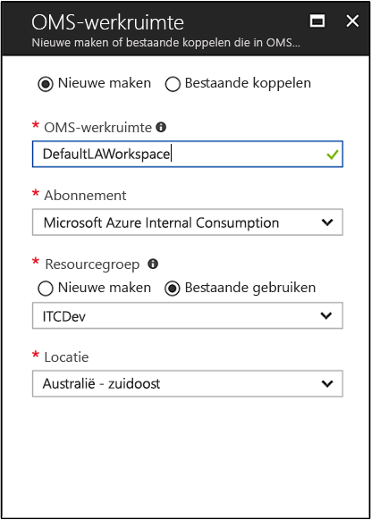

# Een Log Analytics-werkruimte maken in de Azure portal
Dit is een unieke Log Analytics-omgeving met een eigen data-opslagplaats, gegevensbronnen en oplossingen in de Azure-Portal die kunt u een werkruimte voor logboekanalyse instellen.  De stappen in dit artikel zijn vereist als u van plan bent op het verzamelen van gegevens van de volgende bronnen:

* Azure-resources in uw abonnement
* Lokale computers worden bewaakt door System Center Operations Manager
* Apparaatverzamelingen van System Center Configuration Manager 
* Diagnose- of logboekgegevens van Azure Storage

Voor andere bronnen, zoals Azure VM's en Windows of Linux-computers in uw omgeving, Zie de volgende onderwerpen:

*  [Verzamelt gegevens over Azure Virtual Machines](log-analytics-quick-collect-azurevm.md) 
*  [Verzamelen van gegevens over Linux-computers](log-analytics-quick-collect-linux-computer.md)
*  [Verzamelen van gegevens over Windows-computers](log-analytics-quick-collect-windows-computer.md)

Als u nog geen abonnement op Azure hebt, maak dan een [gratis account](https://azure.microsoft.com/free/?WT.mc_id=A261C142F) aan voordat u begint.

## Aanmelden bij Azure Portal
Meld u aan bij de Azure-portal op [https://portal.azure.com](https://portal.azure.com). 

## Een werkruimte maken
1. Klik in Azure Portal op **Alle services**. Typ in de lijst met resources **Log Analytics**. Als u begint te typen, wordt de lijst gefilterd op basis van uw invoer. Selecteer **Log Analytics**.       
2. Klik op **Maken** en geef uw keuze aan voor de volgende items:

  * Geef een naam op voor de nieuwe **OMS-werkruimte**, bijvoorbeeld *StandaardLAWerkruimte*. 
  * Selecteer een **abonnement** om te koppelen door een selectie in de vervolgkeuzelijst te maken als de geselecteerde standaardwaarde niet juist is.
  * Voor **resourcegroep**, ervoor kiezen een bestaande resource gebruiken groep al setup of maak een nieuwe.  
  * Selecteer een beschikbaar **locatie**.  Bekijk [in welke regio's Log Analytics beschikbaar is](https://azure.microsoft.com/regions/services/) voor aanvullende informatie.
  * Als u een werkruimte in een nieuw abonnement gemaakt nadat 2 April 2018 maakt, gebruiken deze automatisch de *Per GB* prijzen plan en de optie voor het selecteren van een prijscategorie niet meer beschikbaar.  Als u een werkruimte voor een bestaand abonnement gemaakt vóór 2 April of aan het abonnement dat is gekoppeld aan een bestaande EA inschrijving maakt, hebt u de optie te kiezen tussen drie Prijscategorieën.  U gaat de gratis categorie selecteren in deze snelstartgids.  Zie [Prijzen voor Log Analytics](https://azure.microsoft.com/pricing/details/log-analytics/) voor aanvullende informatie over de afzonderlijke lagen.

           

3. Nadat u de vereiste gegevens hebt opgegeven in het deelvenster **OMS-werkruimte**, klikt u op **OK**.  

Terwijl de gegevens worden geverifieerd en de werkruimte wordt gemaakt, kunt u de voortgang bijhouden onder **Meldingen** in het menu. 

## Volgende stappen
Nu dat u een werkruimte die beschikbaar is hebt, kunt u verzamelen van de bewaking van telemetrie configureren, logboek zoeken en om die gegevens te analyseren en toevoegen van een oplossing om aanvullende gegevens en analytische inzichten te bieden. 

* Zie voor het inschakelen van gegevensverzameling van Azure-resources met Azure Diagnostics of Azure-opslag [verzamelen Azure service-logboeken en metrische gegevens voor gebruik in logboekanalyse](log-analytics-azure-storage.md).  
* [System Center Operations Manager toevoegen als een gegevensbron](log-analytics-om-agents.md) voor het verzamelen van gegevens van uw beheergroep van Operations Manager reporting agents en opslaan in uw opslagplaats Log Analytics-werkruimte. 
* Verbinding maken met [Configuration Manager](log-analytics-sccm.md) voor het importeren van computers die lid van verzamelingen in de hiërarchie zijn.  
* Controleer de [beheeroplossingen](/log-analytics-add-solutions.md) beschikbaar en het toevoegen of verwijderen van een oplossing uit uw werkruimte.

