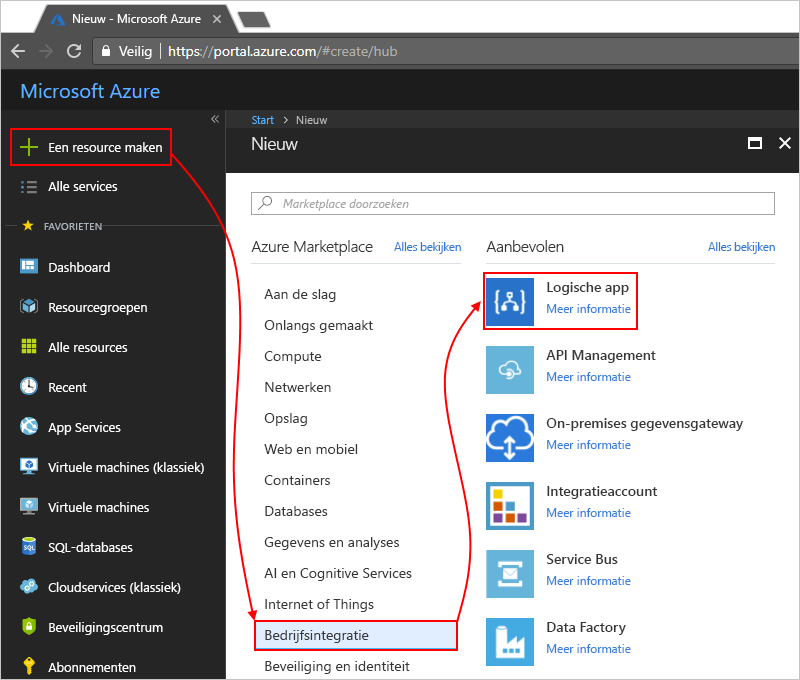

# Controleren en verkrijgen van inzicht in logic app wordt uitgevoerd met Operations Management Suite (OMS) en Log Analytics

Voor bewaking en uitgebreidere informatie over foutopsporing, kunt u Log Analytics inschakelen op hetzelfde moment als u een logische app maakt. Log Analytics biedt Diagnostische logboekregistratie en controle voor uw logische app wordt uitgevoerd via de portal Operations Management Suite (OMS). Wanneer u de oplossing Logic Apps aan OMS toevoegt, krijgt u de cumulatieve status van uw logische app wordt uitgevoerd en de specifieke gegevens, zoals status, uitvoeringstijd, de status opnieuw indienen en correlatie-id's.

Dit onderwerp wordt beschreven hoe logboekanalyse inschakelen of installeren van de oplossing Logic Apps Management in OMS zodat u de runtime-gebeurtenissen en de gegevens voor uw logische app uitgevoerd bekijken kunt.

 > [!TIP]
 > Volg deze stappen voor voor het bewaken van uw bestaande logische apps [Diagnostische logboekregistratie inschakelen en logic app runtimegegevens verzenden naar OMS](../logic-apps/logic-apps-monitor-your-logic-apps.md#azure-diagnostics).

## Vereisten

Voordat u begint, moet u een OMS-werkruimte hebt. Meer informatie over [het maken van een OMS-werkruimte](../log-analytics/log-analytics-get-started.md). 

## Logboekregistratie van diagnostische gegevens inschakelen bij het maken van logische apps

1. In [Azure-portal](https://portal.azure.com), een logische app maken. Kies **nieuwe** > **Enterprise Integration** > **logische App** > **maken**.

   

2. In de **maken logische app** pagina, deze taken uitvoeren zoals wordt weergegeven:

   1. Geef een naam voor uw logische app en selecteer uw Azure-abonnement. 
   2. Maak of Selecteer een Azure-resourcegroep.
   3. Stel **Meld Analytics** naar **op**. 
   Selecteer de OMS-werkruimte waar u wilt verzenden van gegevens voor uw logische app wordt uitgevoerd. 
   4. Als u klaar bent, kiest u **vastmaken aan dashboard** > **maken**.

      

      Nadat u deze stap, Azure uw logische app, nu is maakt die zijn gekoppeld aan de OMS-werkruimte. 
      Deze stap installeert ook ook automatisch het beheersysteem voor Logic Apps in de OMS-werkruimte.

3. Om weer te geven van de logische app wordt uitgevoerd in OMS, [doorgaan met deze stappen](#view-logic-app-runs-oms).

## De oplossing Logic Apps Management in OMS installeren

Als u al ingeschakeld logboekanalyse tijdens het maken van uw logische app, moet u deze stap overslaan. U hebt al het beheersysteem voor Logic Apps geïnstalleerd in OMS.

1. In de [Azure-portal](https://portal.azure.com), kies **meer Services**. Zoek naar 'log analytics' als filter, en kies **logboekanalyse** zoals wordt weergegeven:

   

2. Onder **logboekanalyse**, zoeken en selecteert u de OMS-werkruimte. 

   

3. Onder **Management**, kies **OMS-Portal**.

   

4. Op uw startpagina OMS als de upgrade banner wordt weergegeven, kies de banner zodat u uw OMS-werkruimte eerst upgraden. Kies vervolgens **galerie met oplossingen**.

   

5. Onder **alle oplossingen**, zoeken en kiest u de tegel voor de **Logic Apps Management** oplossing.

   

6. Voor het installeren van de oplossing in de OMS-werkruimte, kiest u **toevoegen**.

   

## Uw logische app wordt uitgevoerd in de OMS-werkruimte weergeven

1. Het aantal en de status van uw logische app wordt uitgevoerd, Ga naar de overzichtspagina voor de OMS-werkruimte. Lees de informatie op de **Logic Apps Management** tegel.

   

   > [!Note]
   > Als deze upgrade banner wordt weergegeven in plaats van de tegel Logic Apps Management, kiest u de banner zodat u uw OMS-werkruimte eerst upgraden.
  
   > 

2. Kies een overzicht met meer informatie over uw logische app wordt uitgevoerd, de **Logic Apps Management** tegel.

   Uw logische app wordt uitgevoerd worden hier, gegroepeerd op naam of uitvoeringsstatus. U ziet ook details over de fouten in acties of triggers voor de logische app wordt uitgevoerd.

   
   
3. Als u wilt weergeven van de uitvoert voor een specifieke logische app of de status, selecteer de rij voor een logische app of met de status.

   Hier volgt een voorbeeld waarin de uitvoert voor een specifieke logische app:

   

   Er zijn twee geavanceerde opties op deze pagina:
   * **Eigenschappen bijgehouden:** in deze kolom wordt bijgehouden eigenschappen die zijn gegroepeerd op acties voor de logische app. U kunt de bijgehouden eigenschappen bekijken **weergave**. U kunt de bijgehouden eigenschappen zoeken met behulp van de kolom-filter.
   
     

     Alle toegevoegde bijgehouden eigenschappen mogelijk 10-15 minuten duren voordat ze worden eerst weergegeven. Meer informatie over [bijgehouden eigenschappen toevoegen aan uw logische app](logic-apps-monitor-your-logic-apps.md#azure-diagnostics-event-settings-and-details).

   * **Verzend:** u een of meer logische app wordt uitgevoerd die niet zijn geslaagd, is voltooid, kunt verzenden of nog steeds actief. Schakel de selectievakjes in voor de uitvoert die u wilt verzenden, en kies **opnieuw indienen**. 

     

4. Als u wilt filteren op deze resultaten, kunt u zowel client- en serverzijde filteren uitvoeren.

   * Client-side '-filter: Kies de filters die u wilt dat voor elke kolom. 
   Hier volgen enkele voorbeelden:

     

   * Filter serverzijde: kiezen van een specifiek tijdvenster of beperken het aantal uitgevoerd die worden weergegeven, gebruikt u het bereik-besturingselement aan de bovenkant van de pagina. 
   Standaard worden alleen 1000 records tegelijk weergegeven. 
   
     
 
5. Als u wilt weergeven van alle acties en de bijbehorende gegevens voor een specifiek run, selecteer een rij voor een logische app uitgevoerd.

   Hier volgt een voorbeeld ziet u alle acties voor een specifieke logische-app uitvoeren:

   
   
6. Op elke resultatenpagina, om de query achter de resultaten weer te geven of om alle resultaten te bekijken, kiest u **alle Zie**, waarmee u de zoekpagina Log opent.
   
   
   
   Op de pagina logboek zoeken
   * U kunt bekijken van resultaten van de query in een tabel **tabel**.
   * Als u wilt de query wijzigt, kunt u de query-tekenreeks in de zoekbalk kunt bewerken. 
   Kies voor een betere ervaring **Advanced Analytics**.

     
     
     Op de pagina Azure Log Analytics kunt u hier query's bijwerken en bekijk de resultaten van de tabel. 
     Deze query gebruikt [Kusto querytaal](https://docs.loganalytics.io/docs/Language-Reference), die u als u wilt weergeven van verschillende resultaten kunt bewerken. 

     

## Volgende stappen

* [B2B-berichten bewaken](../logic-apps/logic-apps-monitor-b2b-message.md)

