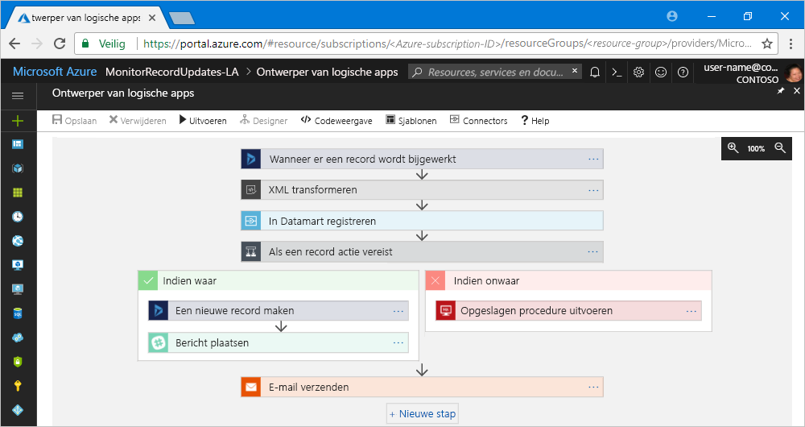

# Wat is Azure Logic Apps?

Met [Logic Apps](https://azure.microsoft.com/services/logic-apps) kunt u processen maken, plannen en automatiseren als [werkstromen](#logic-app-concepts) zodat u apps, gegevens, systemen en services kunt integreren in ondernemingen of organisaties. Logic Apps vereenvoudigt het ontwerpen en maken van schaalbare oplossingen voor app-integratie, gegevensintegratie, systeemintegratie, Enterprise Application Integration (EAI) en communicatie voor business-to-business (B2B), in de cloud, lokaal of beide.

Dit zijn enkele voorbeelden van workloads die u met logische apps kunt automatiseren:

* Orders verwerken en rondsturen in cloudservices en on-premises systemen.
* Geüploade bestanden verplaatsen van een FTP-server naar Azure Storage. 
* Tweets bewaken voor een bepaald onderwerp, de feel analyseren en waarschuwingen of taken maken voor items die nagekeken moeten worden.

Als u integratieoplossingen met logische apps wilt bouwen, kunt u uw keuze maken in een steeds groter wordende galerie met [~200 ingebouwde connectors](../connectors/apis-list.md), zoals SQL Database, Azure-services, Office 365, Salesforce, Google en meer. Deze [connectors](#logic-app-concepts) bieden [triggers](#logic-app-concepts), [acties](#logic-app-concepts) of beide om logische apps te maken voor veilige toegang en verwerking van gegevens in realtime.

> [!VIDEO https://channel9.msdn.com/Blogs/Azure/Introducing-Azure-Logic-Apps/player]

## Hoe werkt Logic Apps? 

Iedere werkstroom van logische apps begint met een trigger, die wordt geactiveerd wanneer een bepaalde gebeurtenis wordt uitgevoerd of wanneer nieuwe beschikbare gegevens aan bepaalde criteria voldoen. Veel triggers bevatten mogelijkheden voor eenvoudige planning waarmee u kunt opgeven met welke regelmaat uw workloads moeten worden uitgevoerd. Voor meer aangepaste planningsscenario's kunt u uw werkstromen beginnen met de planning-trigger. Meer informatie over [het bouwen van werkstromen op basis van planning](../logic-apps/tutorial-build-schedule-recurring-logic-app-workflow.md).

Telkens wanneer de trigger wordt geactiveerd, maakt de Logic Apps-engine een exemplaar van een logische waarmee de acties van de werkstroom worden gestart. Deze acties kunnen ook bestaan uit gegevensconversies en datatransportbesturing, zoals voorwaardelijke instructies, switch-instructies, lussen en vertakking. Deze logische app begint bijvoorbeeld met een Dynamics 365-trigger met 'Wanneer een record wordt bijgewerkt' als ingebouwd criterium. Als de trigger een gebeurtenis detecteert die aan dit criterium voldoet, wordt de trigger geactiveerd, die vervolgens de acties van de werkstroom uitvoert. Hier bestaan de acties uit XML-transformatie, gegevensupdates, vertakking van beslissingen en e-mailmeldingen.

U kunt uw logische apps visueel compileren met Ontwerper van logische apps, een functie die beschikbaar is op Azure Portal via uw browser en in Visual Studio. Voor meer aangepaste logische apps kunt u definities voor logische apps maken of bewerken in JavaScript Object Notation (JSON) door in de modus 'codeweergave' te werken. U kunt voor bepaalde taken ook Azure PowerShell-opdrachten en Azure Resource Manager-sjablonen gebruiken. Logische apps worden geïmplementeerd en uitgevoerd in de cloud op Azure. Bekijk de video [Use Azure Enterprise Integration Services to run cloud apps at scale](https://channel9.msdn.com/Events/Connect/2017/T119/) (Azure Enterprise Integration Services gebruiken om cloud-apps op schaal uit te voeren) voor een gedetailleerde inleiding.

## Waarom Logic Apps?

Nu bedrijven steeds meer opschuiven naar digitalisering, kunnen logische apps helpen om oudere systemen en moderne en geavanceerde systemen gemakkelijk en snel met elkaar te verbinden met behulp van vooraf gedefinieerde API's als door Microsoft beheerde connectors. Op die manier kunt u zich richten op de bedrijfslogica en functionaliteit van uw apps. U hoeft zich geen zorgen te maken over het compileren, hosten, schalen, beheren, onderhouden en controleren van uw apps. Logic Apps werkt dat allemaal voor u af. Bovendien betaalt u alleen voor wat u gebruikt op basis van een [prijsmodel](../logic-apps/logic-apps-pricing.md). 

In veel gevallen hoeft u ook geen code te schrijven. Maar als u toch wat code moet schrijven, kunt u codefragmenten maken met [Azure Functions](../azure-functions/functions-overview.md) en die code op aanvraag uitvoeren vanuit logische apps. En als uw logische apps moeten communiceren met gebeurtenissen uit Azure-services, aangepaste apps of oplossingen van derden, kunt u [Azure Event Grid](../event-grid/overview.md) gebruiken in combinatie met uw logische apps voor het controleren, rondsturen en publiceren van gebeurtenissen.

Logic Apps, Functions en Event Grid worden volledig beheerd door Microsoft Azure, zodat u zich geen zorgen hoeft te maken over het compileren, hosten, schalen, beheren, controleren en onderhouden van uw oplossingen. Omdat u [apps en oplossingen 'zonder server’](../logic-apps/logic-apps-serverless-overview.md) kunt maken, hoeft u zich alleen bezig te houden met de bedrijfslogica. Deze services worden automatisch geschaald om aan uw behoeften te voldoen, integraties te versnellen en u te helpen bij het maken van robuuste cloud-apps met minimale code. Bovendien betaalt u alleen voor wat u gebruikt op basis van een [prijsmodel](../logic-apps/logic-apps-pricing.md). 

Lees deze [klantervaringen](https://aka.ms/logic-apps-customer-stories) als u wilt weten hoe bedrijven hun flexibiliteit verbeterden en zich meer wisten te richten op hun kernactiviteiten door Logic Apps te combineren met andere Azure-services en Microsoft-producten.

Hier vindt u meer informatie over de mogelijkheden en voordelen van Logic Apps:

* **Werkstromen visueel samenstellen met eenvoudig te gebruiken hulpprogramma's**

  Bespaar tijd en vereenvoudig complexe processen met hulpprogramma's voor visueel ontwerp. 
  Maak logische apps van begin tot eind met behulp van Ontwerper van logische apps via uw browser in Azure Portal of in Visual Studio. Begin uw werkstroom met een trigger en voeg een willekeurig aantal acties toe vanuit de [galerie met connectors](../connectors/apis-list.md).

* **Sneller aan de slag met sjablonen voor logische apps**

  Stel veelgebruikte oplossingen sneller samen met vooraf gedefinieerde werkstromen uit de [sjablonengalerie](../logic-apps/logic-apps-create-logic-apps-from-templates.md). 
  Sjablonen variëren van eenvoudige connectiviteit voor SaaS-apps (software as a service) tot geavanceerde B2B-oplossingen. Maar daarnaast zijn er ook sjablonen gewoon voor het plezier. Informatie over [het maken van logische apps met vooraf gedefinieerde sjablonen](../logic-apps/logic-apps-create-logic-apps-from-templates.md).

* **Ongelijksoortige systemen in verschillende omgevingen met elkaar verbinden**

  Sommige patronen en werkstromen zijn gemakkelijk te beschrijven, maar moeilijk in code te implementeren. 
  Met logische apps kunt u naadloos verbinding maken met ongelijksoortige systemen in on-premises en cloud-omgevingen. U kunt bijvoorbeeld een marketingoplossing in de cloud verbinden met een on-premises factureringssysteem of een berichtenservice via API's en systemen met een Enterprise Service Bus centraliseren. Logische apps bieden een snelle, betrouwbare en consistente manier om herbruikbare en herconfigureerbare oplossingen voor deze scenario's te leveren.

* **Eersteklas ondersteuning voor bedrijfsintegratie en B2B-scenario's**

  Bedrijven en organisaties communiceren elektronisch met elkaar met behulp van gestandaardiseerde maar verschillende berichtprotocollen en -indelingen, zoals EDIFACT, AS2 en X12. 
  Met de functies in het [Enterprise Integration Pack (EIP)](../logic-apps/logic-apps-enterprise-integration-overview.md) kunt u logische apps bouwen voor het omzetten van berichtindelingen in gebruik bij uw partners naar indelingen die de systemen van uw organisatie kunnen interpreteren en verwerken. Logische apps verwerken deze uitwisselingen soepel en veilig met versleuteling en digitale handtekeningen.

  Begin klein met uw huidige systemen en services en breid dan in uw eigen tempo verder uit. Wanneer u klaar bent, helpen Logic Apps en de EIP u bij het implementeren van en omhoog schalen naar meer volwassen integratiescenario's door onder andere de volgende mogelijkheden te bieden:

  * Ga uit van deze producten en services: 
    * [Microsoft BizTalk Server](https://docs.microsoft.com/biztalk/core/introducing-biztalk-server) 
    * [API Management](../api-management/api-management-key-concepts.md) 
    * [Azure Functions](../azure-functions/functions-overview.md) 
    * [Azure Service Bus](../service-bus-messaging/service-bus-messaging-overview.md)
  * [XML-berichten](../logic-apps/logic-apps-enterprise-integration-xml.md) verwerken
  * [platte bestanden](../logic-apps/logic-apps-enterprise-integration-flatfile.md) verwerken
  * Berichten uitwisselen met [EDIFACT](../logic-apps/logic-apps-enterprise-integration-edifact.md)-, [AS2](../logic-apps/logic-apps-enterprise-integration-as2.md)- en [X12](../logic-apps/logic-apps-enterprise-integration-x12.md)-protocollen
  * Gebruik [integratieaccounts](../logic-apps/logic-apps-enterprise-integration-accounts.md) om deze B2B-artefacten en meer in één locatie op te slaan en te beheren:
    * [Partners](../logic-apps/logic-apps-enterprise-integration-partners.md)
    * [Overeenkomsten](../logic-apps/logic-apps-enterprise-integration-agreements.md) 
    * [Toewijzingen voor XML-transformatie](../logic-apps/logic-apps-enterprise-integration-maps.md)
    * [Schema's voor XML-validatie](../logic-apps/logic-apps-enterprise-integration-schemas.md)

* **Eenmaal schrijven, vaak opnieuw gebruiken**

  Maak uw logische apps in de vorm van sjablonen zodat u [uw apps kunt implementeren en configureren](../logic-apps/logic-apps-create-deploy-template.md) in meerdere omgevingen en regio's.

* **Ingebouwde uitbreidbaarheid**

  Als u de connector om de aangepaste code uit te voeren niet kunt vinden, kunt u logische apps uitbreiden door uw eigen codefragmenten op aanvraag te maken en aan te roepen via [Azure Functions](../azure-functions/functions-overview.md). 
  Maak uw eigen [API's](../logic-apps/logic-apps-create-api-app.md) en [aangepaste connectors](../logic-apps/custom-connector-overview.md) die u kunt aanroepen vanuit logic apps.

* **U betaalt uitsluitend voor wat u gebruikt**
  
  Logic Apps gebruikt [prijzen en metingen](../logic-apps/logic-apps-pricing.md) op basis van verbruik tenzij u eerder logische apps hebt gemaakt met App Service-plannen.

Meer informatie over Logic Apps vindt u in deze inleidende video's:
* [Integratie met Logic Apps - Van beginner tot expert](https://channel9.msdn.com/Events/Build/2017/C9R17)
* [Bedrijfsintegratie met Microsoft Azure Logic Apps](https://channel9.msdn.com/Events/Ignite/Microsoft-Ignite-Orlando-2017/BRK2188)
* [Geavanceerde bedrijfsprocessen samenstellen Met Logic Apps](https://channel9.msdn.com/Events/Ignite/Microsoft-Ignite-Orlando-2017/BRK3179)

## Belangrijkste termen

* **Werkstroom**: het visualiseren, ontwerpen, compileren, automatiseren en implementeren van bedrijfsprocessen als een reeks stappen.

* **Beheerde connectors**: uw logische apps hebben toegang tot gegevens, services en systemen nodig. U kunt vooraf gedefinieerde, door Microsoft beheerde connectors gebruiken die zijn ontworpen om verbinding te maken met uw gegevens en om deze te openen en ermee te werken. Zie [Connectors voor Azure Logic Apps](../connectors/apis-list.md)

* **Triggers**: veel door Microsoft beheerde connectors bieden triggers die worden geactiveerd wanneer gebeurtenissen of nieuwe gegevens voldoen aan opgegeven voorwaarden. Een gebeurtenis kan bijvoorbeeld een e-mailbericht ontvangen of wijzigingen detecteren in uw Azure Storage-account. Telkens wanneer de trigger wordt geactiveerd, maakt de Logic Apps-engine een nieuw exemplaar van een logische app waarmee de werkstroom wordt gestart.

* **Acties**: acties zijn alle stappen die na de trigger plaatsvinden. Elke actie verwijst doorgaans naar een bewerking die wordt gedefinieerd door een beheerde connector, aangepaste API of aangepaste connector.

* **Enterprise Integration Pack**: voor geavanceerdere integratiescenario’s bevat Logic Apps functies van BizTalk. De Enterprise Integration Pack bevat connectors waarmee logische apps eenvoudig validaties, transformaties en andere acties kunnen uitvoeren.

## Hoe verschilt Logic Apps van Functions, WebJobs en Flow?

Met al deze services kunt u ongelijksoortige systemen aan elkaar koppelen. Omdat elke service zijn eigen voordelen heeft, is het combineren van hun verschillende mogelijkheden de beste manier om snel een schaalbaar en compleet integratiesysteem samen te stellen. Zie [Kiezen tussen Flow, Logic Apps, Functions en WebJobs](../azure-functions/functions-compare-logic-apps-ms-flow-webjobs.md) voor meer informatie.

## Aan de slag 

Logic Apps is een van de vele services die worden gehost op Microsoft Azure. Voordat u kunt beginnen, hebt u een Azure-abonnement nodig. Als u nog geen abonnement hebt, <a href="https://azure.microsoft.com/free/" target="_blank">meld u dan aan voor een gratis Azure-account</a>. 

Als u wel een Azure-abonnement hebt, kunt u deze [quickstart doornemen voor het maken van uw eerste logische app](../logic-apps/quickstart-create-first-logic-app-workflow.md), die via een RSS-feed controleert op nieuwe inhoud op een website en een e-mail stuurt wanneer er nieuwe inhoud is.

## Ondersteuning en feedback

* Ga naar het [Azure Logic Apps forum](https://social.msdn.microsoft.com/Forums/en-US/home?forum=azurelogicapps) (Forum voor Azure Logic Apps) als u vragen hebt.
* Als u ideeën voor functies wilt indienen of erop wilt stemmen, gaat u naar de [website voor feedback van Logic Apps-gebruikers](http://aka.ms/logicapps-wish).

## Volgende stappen

* [Verkeer controleren met een logische app op basis van een planning](../logic-apps/tutorial-build-schedule-recurring-logic-app-workflow.md)
* Meer informatie over [oplossingen zonder server met Azure](../logic-apps/logic-apps-serverless-overview.md)
* Meer informatie over [B2B-integratie met het Enterprise Integration Pack](../logic-apps/logic-apps-enterprise-integration-overview.md)