# <a name="quickstart-create-your-first-automated-workflow-with-azure-logic-apps---azure-portal"></a>Snelstart: maak uw eerste geautomatiseerde werkstroom met Azure Logic Apps - Azure-portal

In deze snelstart leert u uw eerste geautomatiseerde werkstroom bouwen met [Azure Logic Apps](../logic-apps/logic-apps-overview.md). In dit artikel maakt u een logische app waarmee de RSS-feed van een website regelmatig wordt gecontroleerd op nieuwe items. Als er nieuwe items bestaan, stuurt de logische app een e-mail voor elk item. Wanneer u bent klaar, ziet uw logische app eruit als deze werkstroom op hoog niveau:

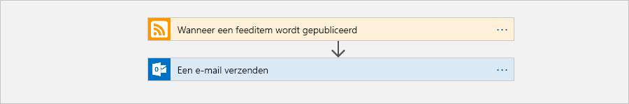

Voor het uitvoeren van deze quickstart hebt u een e-mailaccount nodig van een provider die wordt ondersteund door Logic Apps, zoals Outlook van Office 365, Outlook.com en Gmail. Voor andere providers [kunt u hier de lijst met connectors bekijken](https://docs.microsoft.com/connectors/). Deze logische app maakt gebruik van een Office 365 Outlook-account. Als u een ander e-mailaccount gebruikt, zijn de algemene stappen hetzelfde, maar ziet de gebruikersinterface er misschien iets anders uit. 

Als u nog geen abonnement op Azure hebt, <a href="https://azure.microsoft.com/free/" target="_blank">meld u dan nu aan voor een gratis Azure-account</a>.

## <a name="sign-in-to-the-azure-portal"></a>Aanmelden bij Azure Portal

Gebruik de referenties van uw Azure-account om u aan melden bij het <a href="https://portal.azure.com" target="_blank">Azure Portal</a>.

## <a name="create-your-logic-app"></a>Uw logische app maken 

1. Kies in het hoofdmenu van Azure **Een resource maken** > **Integratie** > **Logische app**.

   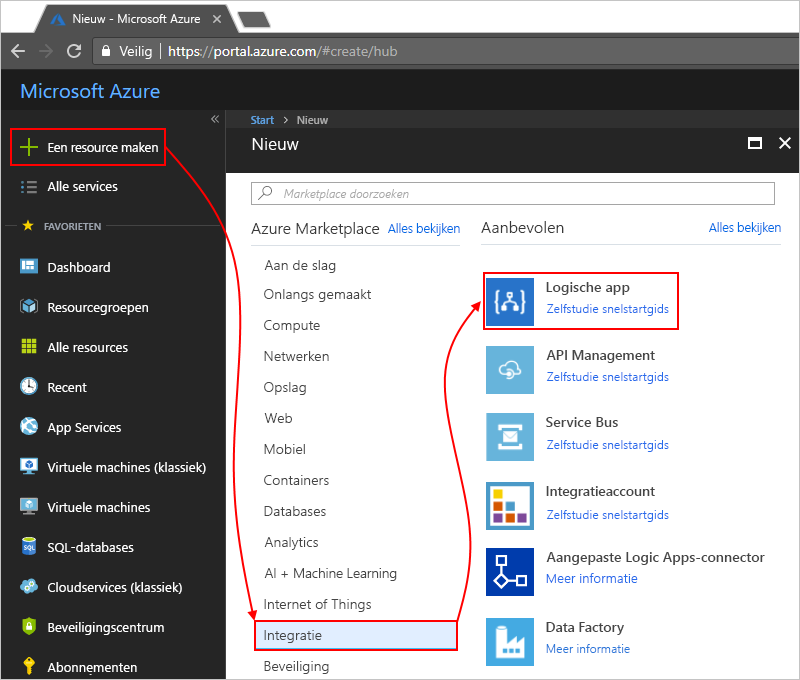

3. Onder **Logische app maken** geeft u informatie op over uw logische app zoals hier wordt weergegeven. Als u klaar bent, kiest u **Vastmaken aan dashboard** > **Maken**.

   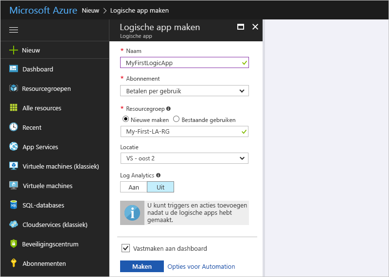

   | Eigenschap | Waarde | Beschrijving | 
   |----------|-------|-------------| 
   | **Naam** | MyFirstLogicApp | De naam voor uw logische app | 
   | **Abonnement** | <*your-Azure-subscription-name*> | De naam van uw Azure-abonnement | 
   | **Resourcegroep** | My-First-LA-RG | De naam van de [Azure-resourcegroep](../azure-resource-manager/resource-group-overview.md) die wordt gebruikt om verwante resources te organiseren | 
   | **Locatie** | US - west | De regio waar uw logische app-gegevens wordt opgeslagen | 
   | **Log Analytics** | Uit | Behoud de instelling **Uit** voor het vastleggen van diagnostische gegevens. | 
   |||| 

3. Nadat Azure uw app heeft geïmplementeerd, wordt de Ontwerper van logische apps geopend en ziet u een pagina met een inleidende video en veelgebruikte triggers. Kies onder **Sjablonen** de optie **Lege logische app**.

   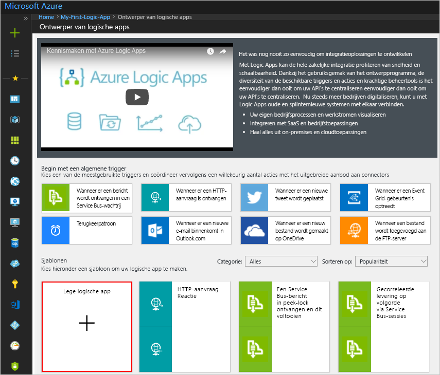

Vervolgens voegt u een [trigger](../logic-apps/logic-apps-overview.md#logic-app-concepts) toe die wordt geactiveerd zodra er een nieuw RSS-feeditem wordt weergegeven. Elke logische app moet beginnen met een trigger, die wordt geactiveerd wanneer er een bepaalde gebeurtenis plaatsvindt of wanneer er aan een bepaalde voorwaarde is voldaan. Telkens wanneer de trigger wordt geactiveerd, maakt de Logic Apps-engine een exemplaar van een logische app dat wordt gestart en de werkstroom uitvoert.

<a name="add-rss-trigger"></a>

## <a name="check-rss-feed-with-a-trigger"></a>RSS-feed controleren met een trigger

1. Typ 'rss' in het zoekvak van de ontwerpfunctie. Selecteer deze trigger: **RSS - Wanneer een feeditem wordt gepubliceerd**

   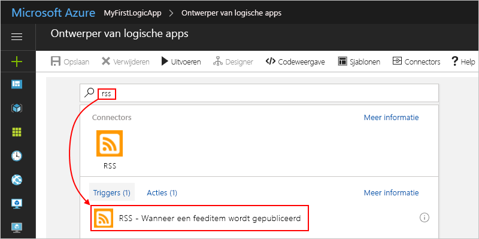

2. Geef deze informatie voor de trigger op zoals weergegeven en beschreven: 

   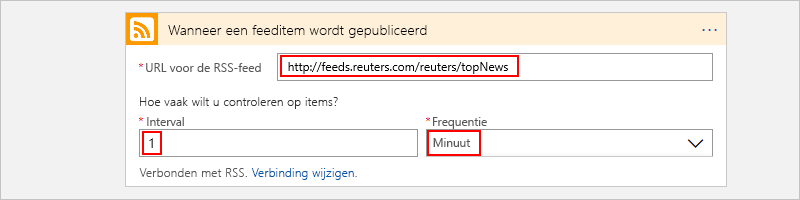

   | Eigenschap | Waarde | Beschrijving | 
   |----------|-------|-------------| 
   | **De URL voor de RSS-feed** | ```http://feeds.reuters.com/reuters/topNews``` | De koppeling voor de RSS-feed die u wilt bijhouden | 
   | **Interval** | 1 | Het aantal intervallen dat tussen controles moet worden gewacht | 
   | **Frequentie** | Minuut | De tijdseenheid voor elk interval tussen controles  | 
   |||| 

   Het interval en de frequentie bepalen samen de planning van de trigger voor uw logische app. 
   Deze logische app controleert de feed elke minuut.

3. Als u de details van de trigger voorlopig wilt verbergen, klikt u in de titelbalk van de trigger.

   

4. Sla uw logische app op. Kies **Opslaan** op de werkbalk van de ontwerper. 

Uw logische app is nu live, maar kan alleen de RSS-feed controleren. Daarom gaat u nu een actie toevoegen die reageert wanneer de trigger wordt geactiveerd.

## <a name="send-email-with-an-action"></a>E-mail versturen bij een actie

Voeg nu een [actie](../logic-apps/logic-apps-overview.md#logic-app-concepts) waardoor een e-mail wordt verzonden zodra een nieuw item in de RSS-feed wordt weergegeven. 

1. Onder de trigger **Wanneer een feeditem wordt gepubliceerd** kiest u **+ Nieuwe stap** > **Een actie toevoegen**.

   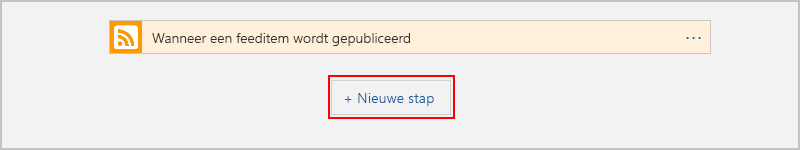

2. Voer onder **Kies een actie** 'een e-mail verzenden' als filter in. Selecteer in de lijst met acties de actie 'een e-mail verzenden' voor de gewenste e-mailprovider. 

   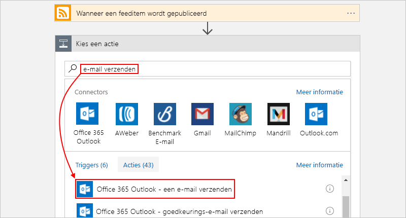

   Als u de lijst met acties wilt filteren op een bepaalde app of service, kunt u eerst die app of service selecteren:

   * Voor werk- of schoolaccounts van Azure selecteert u Outlook van Office 365. 
   * Selecteer Outlook.com voor persoonlijke Microsoft-accounts.

3. Als u naar uw referenties wordt gevraagd, meldt u zich aan bij uw e-mailaccount zodat Logic Apps een verbinding met uw e-mailaccount kan maken.

4. In de actie **Een e-mail verzenden** geeft u de gegevens op die u in het e-mailbericht wilt opnemen. 

   1. Voer het e-mailadres van de ontvanger in het vak **Aan** in. 
   Voor testdoeleinden kunt u uw eigen e-mailadres gebruiken.

      Negeer voorlopig de lijst **Dynamische inhoud toevoegen** die wordt weergegeven. 
      Wanneer u in bepaalde invoervakken klikt, wordt deze lijst geopend met alle beschikbare parameters uit de vorige stap die u als invoer in uw werkstroom kunt opnemen. 

   2. Voer in het vak **Onderwerp** deze tekst met een afsluitende spatie in: ```New RSS item: ```

      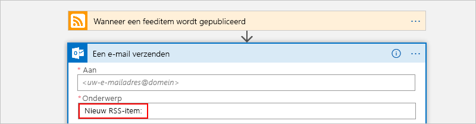
 
   3. In de lijst **Dynamische inhoud toevoegen** selecteert u **Feedtitel** om de titel van het RSS-item op te nemen.

      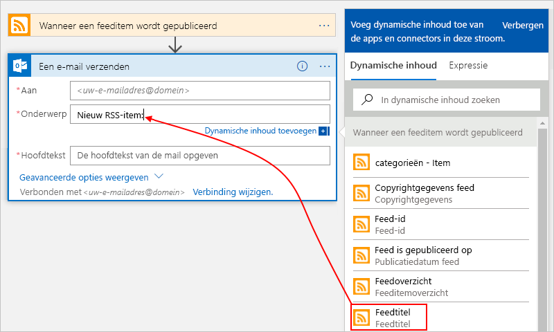

      Wanneer u klaar bent, ziet het onderwerp van de e-mail eruit zoals in dit voorbeeld:

      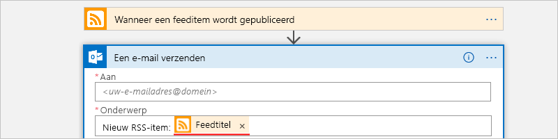

      Als een 'For each'-lus in de ontwerpfunctie wordt weergegeven, hebt u een token voor een matrix geselecteerd, bijvoorbeeld het token **categories-Item**. 
      Voor dit type tokens voegt de ontwerpfunctie automatisch deze lus toe rond de actie die verwijst naar dat token. 
      Op die manier wordt dezelfde actie uitgevoerd voor elk matrixitem. 
      Als u de lus wilt verwijderen, kiest u de (**puntjes** (**...**) op de titelbalk van de lus. Kies vervolgens **Verwijderen**.

   4. In het vak voor de **hoofdtekst** voert u deze tekst in en selecteert u deze tokens voor de inhoud van het e-mailbericht. 
   Als u lege regels wilt toevoegen in een invoervak, drukt u op Shift + Enter. 

      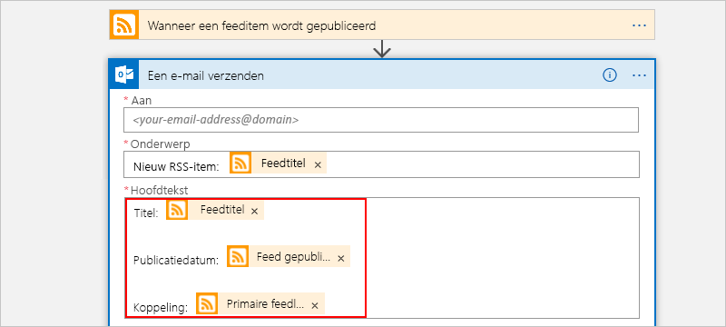

      | Eigenschap | Beschrijving | 
      |----------|-------------| 
      | **Feedtitel** | De titel van het item | 
      | **Feed gepubliceerd op** | De publicatiedatum en -tijd van het item | 
      | **Primaire feedkoppeling** | De URL voor het item | 
      ||| 
   
5. Sla uw logische app op.

Test vervolgens de logische app.

## <a name="run-your-logic-app"></a>Uw logische app uitvoeren

Kies **Uitvoeren** op de werkbalk in de ontwerper als u de logische app handmatig wilt uitvoeren. Of wacht tot de logische app de RSS-feed op basis van uw opgegeven schema (elke minuut) heeft gecontroleerd. Als de RSS-feed nieuwe items heeft, verzendt uw logische app een e-mailbericht voor elk nieuw item. Anders wacht de logische app tot het volgende interval voordat opnieuw een controle wordt uitgevoerd. 

Dit is een voorbeeld van een e-mailbericht dat deze logische app verzendt. Als u geen een e-mailberichten ontvangt, controleert u de map Ongewenste e-mail.

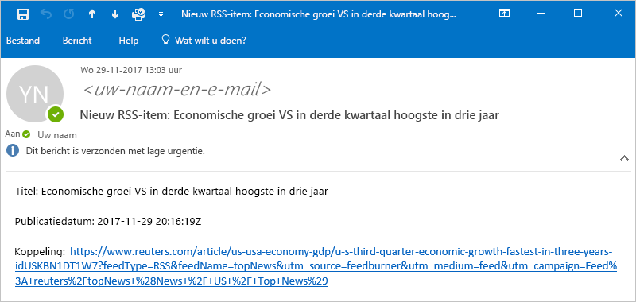

Technisch gezien wordt, als bij controle van de RSS-feed nieuwe items worden aangetroffen, de trigger geactiveerd en maakt de Logic Apps-engine een exemplaar van de werkstroom van uw logische app die de acties in de werkstroom uitvoert.
Als de trigger geen nieuwe items vindt, wordt deze niet geactiveerd en wordt het instantiëren van de werkstroom overgeslagen.

Gefeliciteerd, u hebt uw eerste logische app in Azure Portal gemaakt en uitgevoerd.

## <a name="clean-up-resources"></a>Resources opschonen

Als u dit voorbeeld niet meer nodig hebt, verwijdert u de resourcegroep die uw logische app en alle gerelateerde resources bevat. 

1. Ga in het Azure-hoofdmenu naar **Resourcegroepen** en selecteer de resourcegroep voor uw logische app. Kies op de pagina **Overzicht** de optie **Resourcegroep verwijderen**. 

   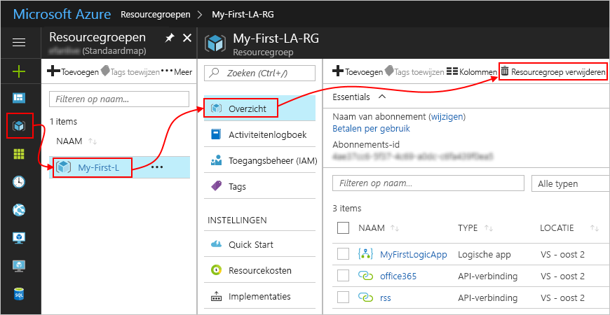

2. Voer ter bevestiging de naam van de resourcegroep in en kies **Verwijderen**.

   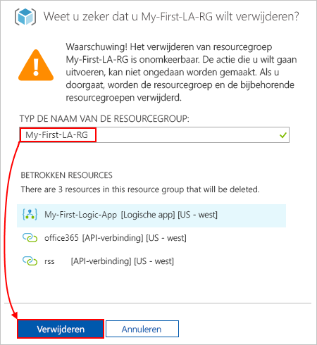

> [!NOTE]
> Wanneer u een logische app verwijdert, worden geen nieuwe uitvoeringen gemaakt. Alle uitvoeringen die bezig zijn en wachten op uitvoering worden geannuleerd. Als u duizenden uitvoeringen hebt, kan de annulering een aanzienlijke tijd in beslag nemen.

## <a name="get-support"></a>Ondersteuning krijgen

* Ga naar het [Azure Logic Apps forum](https://social.msdn.microsoft.com/Forums/en-US/home?forum=azurelogicapps) (Forum voor Azure Logic Apps) als u vragen hebt.
* Als u ideeën voor functies wilt indienen of erop wilt stemmen, gaat u naar de [website voor feedback van Logic Apps-gebruikers](http://aka.ms/logicapps-wish).

## <a name="next-steps"></a>Volgende stappen

In deze quickstart hebt u uw eerste logische app gemaakt die controleert op de aanwezigheid van RSS-updates op basis van de opgegeven planning (elke minuut) en onderneemt actie (stuurt e-mail) wanneer er updates zijn. Als u meer wilt weten, gaat u verder met deze zelfstudie om geavanceerdere werkstromen op basis van een planning te maken:

> [!div class="nextstepaction"]
> [Verkeer controleren met een logische app op basis van een planning](../logic-apps/tutorial-build-schedule-recurring-logic-app-workflow.md)
