# Snelstart: Maken en automatiseren van taken, processen en werkstromen met Azure Logic Apps in Visual Studio

Met [Azure Logic Apps](../logic-apps/logic-apps-overview.md) en Visual Studio kunt u werkstromen maken voor het automatiseren van taken en processen om apps, gegevens, systemen en services van bedrijven en organisaties te integreren. Deze snelstart toont u hoe u deze werkstromen kunt ontwerpen en compileren door het maken van logische apps in Visual Studio en hoe u deze apps kunt implementeren naar <a href="https://docs.microsoft.com/azure/guides/developer/azure-developer-guide" target="_blank">Azure</a> in de cloud. Hoewel u deze taken kunt uitvoeren in <a href="https://portal.azure.com" target="_blank">Azure Portal</a>, kunt u met Visual Studio logische apps toevoegen aan het besturingselement voor de gegevensbron, verschillende versies publiceren en Azure Resource Manager-sjablonen maken voor verschillende implementatieomgevingen. 

Als u niet vertrouwd bent met Azure Logic Apps en u alleen de basisconcepten wilt gebruiken, probeer dan de [snelstart voor het maken van een logische app in Azure Portal](../logic-apps/quickstart-create-first-logic-app-workflow.md). De ontwerpfunctie Logic App in zowel Azure Portal als in Visual Studio, werkt op dezelfde manier. 

Hier kunt dezelfde logische app maken als in de snelstart voor Azure Portal maar dan met Visual Studio. Deze logische app bewaakt de RSS-feed van een website en verzendt een e-mailadres voor elk nieuw item dat op de site wordt gepost. Wanneer u bent klaar, ziet uw logische app eruit als deze werkstroom op hoog niveau:

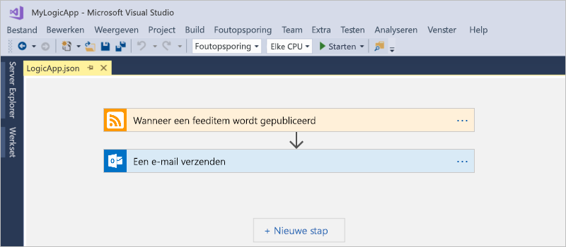

Zorg ervoor dat u deze items hebt voordat u begint:

* Als u nog geen abonnement op Azure hebt, <a href="https://azure.microsoft.com/free/" target="_blank">registreer u dan nu voor een gratis Azure-account</a>.

* Download en installeer deze hulpprogramma's als u ze nog niet hebt: 

  * <a href="https://www.visualstudio.com/downloads" target="_blank">Visual Studio 2017 of Visual Studio 2015 - Community edition of hoger</a>. 
  Deze snelstart maakt gebruik van Visual Studio Community 2017, dit is gratis.

  * <a href="https://azure.microsoft.com/downloads/" target="_blank">Microsoft Azure SDK voor .NET (2.9.1 of hoger)</a> en <a href="https://github.com/Azure/azure-powershell#installation" target="_blank">Azure PowerShell</a>. 
  Meer informatie over <a href="https://docs.microsoft.com/dotnet/azure/dotnet-tools?view=azure-dotnet">Azure SDK voor .NET</a>.

  * <a href="https://marketplace.visualstudio.com/items?itemName=VinaySinghMSFT.AzureLogicAppsToolsforVisualStudio-18551" target="_blank">Azure Logic Apps-hulpprogramma's voor Visual Studio 2017</a> of de <a href="https://marketplace.visualstudio.com/items?itemName=VinaySinghMSFT.AzureLogicAppsToolsforVisualStudio" target="_blank">versie van Visual Studio 2015</a>
  
    U kunt hulpprogramma's van Azure Logic Apps ofwel rechtstreeks vanuit Visual Studio Marketplace downloaden en installeren, of leer <a href="https://docs.microsoft.com/visualstudio/ide/finding-and-using-visual-studio-extensions" target="_blank">deze extensie te installeren vanuit Visual Studio</a>. 
    Zorg ervoor dat u Visual Studio opnieuw opstart na de installatie.

* Een e-mailaccount dat door Logic Apps wordt ondersteund, bijvoorbeeld Office 365 Outlook, Outlook.com of Gmail. Voor andere providers <a href="https://docs.microsoft.com/connectors/" target="_blank">kunt u hier de lijst met connectors bekijken</a>. Deze logische app maakt gebruik van een Office 365 Outlook-account. Als u een ander e-mailaccount gebruikt, zijn de algemene stappen hetzelfde, maar ziet de gebruikersinterface er misschien iets anders uit.

* Toegang tot het web tijdens het gebruik van de ingebouwde ontwerpfunctie van Logic App

  De ontwerpfunctie moet over een internetverbinding beschikken om resources te maken in Azure en de eigenschappen en gegevens van connectoren in uw logische app te lezen. 
  Als u bijvoorbeeld de Dynamics CRM Online-connector gebruikt, controleert de ontwerpfunctie uw CRM-exemplaar voor de beschikbare standaardregels en aangepaste eigenschappen.

## Een Azure-resourcegroepproject maken

Om te beginnen, maakt u een [Azure-resourcegroepproject](../azure-resource-manager/vs-azure-tools-resource-groups-deployment-projects-create-deploy.md). Meer informatie over [Azure-resourcegroepen en resources](../azure-resource-manager/resource-group-overview.md).

1. Start Visual Studio en meld u aan met uw Azure-account.

2. In het menu **File** selecteert u **New** > **Project**. (toetsenbord: Ctrl+Shift+N)

   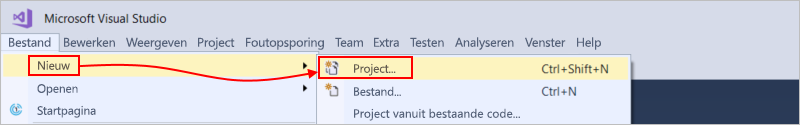

3. Onder **Installed**, selecteert u **Visual C#** of **Visual Basic**. Selecteer **Cloud** > **Azure Resource Group**. Geef uw project een naam, bijvoorbeeld:

   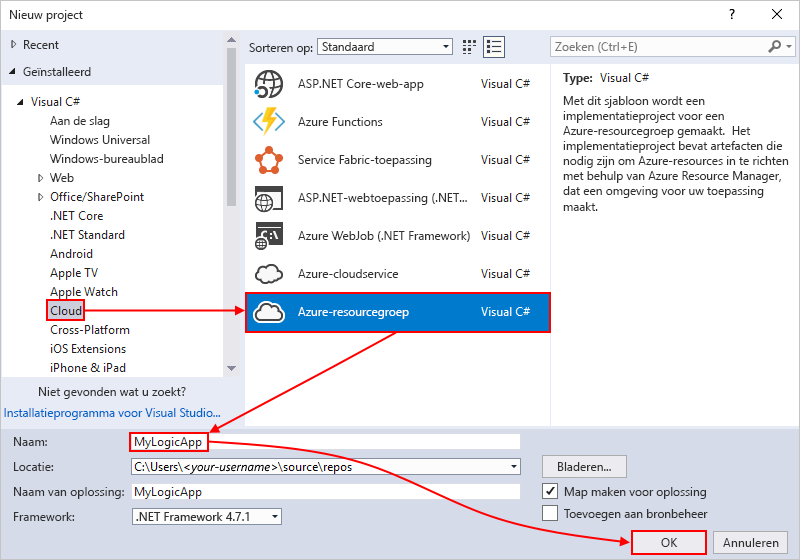

4. Kies een sjabloon voor **Logic App**. 

   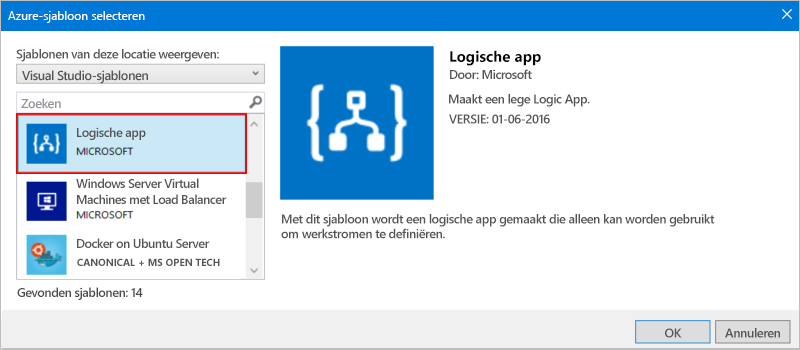

   Nadat Visual Studio het project maakt, wordt Solution Explorer geopend en ziet u uw oplossing. 

   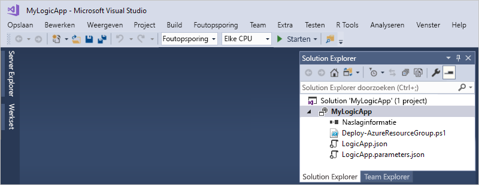

   In uw oplossing slaat het bestand **LogicApp.json** niet alleen de definitie op voor uw logische app, maar is het ook een Azure Resource Manager-sjabloon die u voor de implementatie kunt instellen.

## Een lege, logische app maken

Nadat u uw Azure-resourcegroep-project hebt gemaakt, maakt en compileert u uw logische app vanaf het **Lege logische app**-sjabloon.

1. Open in Solution Explorer het snelmenu voor het bestand **LogicApp.json**. Selecteer **Openen met Logic App-ontwerpfunctie**. (toetsenbord: Ctrl+L)

   

2. Selecteer bij **Abonnement** het Azure-abonnement dat u wilt gebruiken. Voor **Resourcegroep**, selecteert u **Nieuwe maken...**, waarbij automatisch een nieuwe Azure-resourcegroep wordt gemaakt. 

   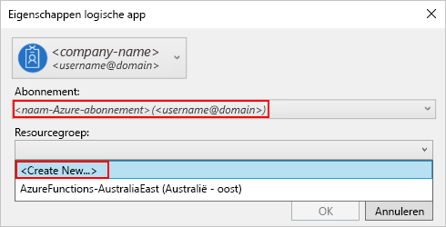

   Visual Studio heeft uw Azure-abonnement en een resourcegroep nodig voor het maken en implementeren van resources die zijn gekoppeld aan uw logische app en verbindingen. 

   | Instelling | Voorbeeldwaarde | Beschrijving | 
   | ------- | ------------- | ----------- | 
   | Lijst met gebruikersprofielen | Contoso   jamalhartnett@contoso.com | Standaard het account dat u gebruikt voor aanmelden | 
   | **Abonnement** | Betalen per gebruik   (jamalhartnett@contoso.com) | De naam voor uw Azure-abonnement en het bijbehorende account |
   | **Resourcegroep** | MyLogicApp-RG   (US - west) | De Azure-resourcegroep en locatie voor het opslaan en implementeren van resources voor uw logische app | 
   | **Locatie** | MyLogicApp-RG2   (US - west) | Een andere locatie als u de locatie van de resourcegroep niet wilt gebruiken |
   ||||

3. De Logic Apps-ontwerpfunctie wordt geopend en u ziet een pagina met een inleidende video en veelgebruikte triggers. Scrol voorbij de video en triggers. Kies onder **Sjablonen** de optie **Lege logische app**.

   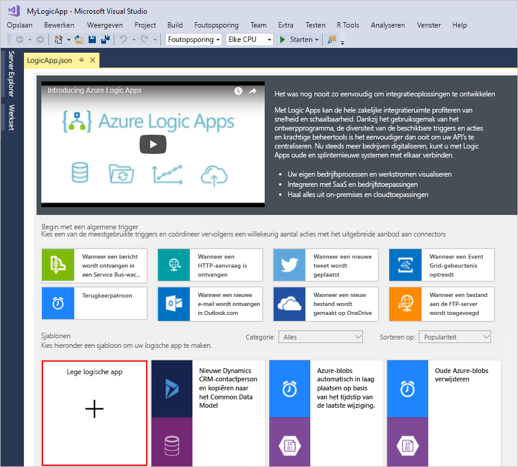

## Een werkstroom voor uw logische app compileren

Vervolgens voegt u een [trigger](../logic-apps/logic-apps-overview.md#logic-app-concepts) toe die wordt geactiveerd zodra er een nieuw RSS-feeditem wordt weergegeven. Elke logische app moet beginnen met een trigger, die wordt geactiveerd wanneer aan specifieke criteria wordt voldaan. Telkens wanneer de trigger wordt geactiveerd, maakt de Logic Apps-engine een instantie van een logische app die de werkstroom uitvoert.

1. Typ 'rss' in het zoekvak van de Logic App-ontwerpfunctie. Selecteer de volgende trigger: **Wanneer een feeditem wordt gepubliceerd**

   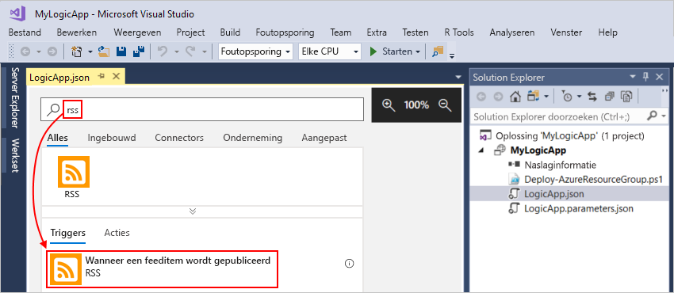

   De trigger wordt nu weergegeven in de ontwerpfunctie:

   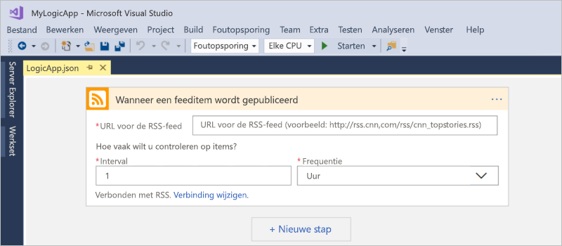

2. Voor het voltooien van het compileren van de logische app, volgt u de werkstroomstappen in de [Azure Portal-snelstartgids](../logic-apps/quickstart-create-first-logic-app-workflow.md#add-rss-trigger). Keer daarna terug naar dit artikel.

   Wanneer u klaar bent, ziet uw logische app eruit zoals in dit voorbeeld: 

   

3. Sla uw Visual Studio-oplossing op om uw logische app op te slaan. (toetsenbord: Ctrl + S)

Implementeer uw app nu in Azure, zodat u uw logische app kunt testen.

## Logische app implementeren in Azure

Voordat u uw logische app kunt uitvoeren, moet u de app implementeren vanuit Visual Studio in Azure. Dit zijn maar enkele stappen.

1. Selecteer in Solution Explorer in het snelmenu van uw project **Implementeren** > **Nieuw**. Meld u aan met uw Azure-account als u daarom wordt gevraagd.

   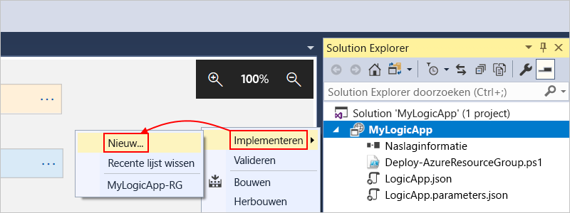

2. Houd het Azure-abonnement, de resourcegroep en andere standaardinstellingen aan voor deze implementatie. Als u klaar bent, kiest u **Implementeren**. 

   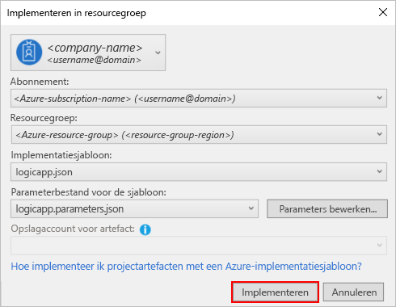

3. Als het vakje **Parameters bewerken** verschijnt, geeft u de naam op van de resource voor de logische app die u bij de implementatie wilt gebruiken. Sla vervolgens uw instellingen op, bijvoorbeeld:

   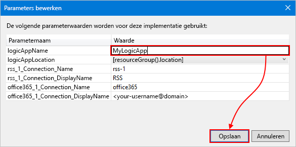

   Wanneer de implementatie wordt gestart, wordt de status van de implementatie van uw app weergegeven in het **Uitvoer**-venster van Visual Studio. 
   Als de status niet wordt weergegeven, opent u de lijst **Uitvoer tonen van** en selecteert u uw Azure-resourcegroep.

   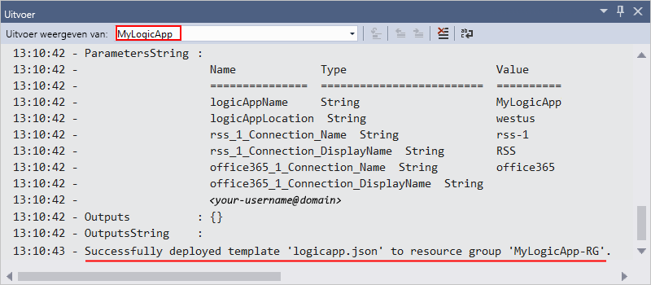

   Nadat de implementatie is voltooid, gaat uw logische app live in Azure Portal en controleert deze de RSS-feed op basis van de opgegeven planning (elke minuut). 
   Als de RSS-feed nieuwe items heeft, verzendt uw logische app een e-mailbericht voor elk nieuw item. 
   Anders wacht de logische app tot het volgende interval voordat opnieuw een controle wordt uitgevoerd. 

   Dit zijn voorbeelden van e-mailberichten die deze logische app verzendt. 
   Als u geen een e-mailberichten ontvangt, controleert u de map Ongewenste e-mail. 

   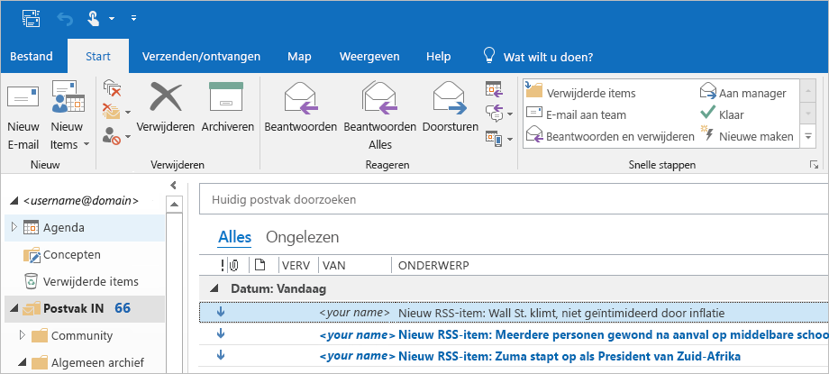

   Technisch gezien wordt, als bij controle van de RSS-feed nieuwe items worden aangetroffen, de trigger geactiveerd en maakt de Logic Apps-engine een exemplaar van de werkstroom van uw logische app die de acties in de werkstroom uitvoert.
   Als de trigger geen nieuwe items vindt, wordt deze niet geactiveerd en wordt het instantiëren van de werkstroom overgeslagen.

Gefeliciteerd, u hebt nu uw logische app met Visual Studio gemaakt en geïmplementeerd! Zie [Logische apps beheren met Visual Studio](../logic-apps/manage-logic-apps-with-visual-studio.md) om uw logische app te beheren en de uitvoeringsgeschiedenis te inspecteren.

## Resources opschonen

Als u die niet meer nodig hebt, verwijdert u de resourcegroep die uw logische app en alle gerelateerde resources bevat.

1. Meld u aan bij <a href="https://portal.azure.com" target="_blank">Azure Portal</a> met hetzelfde account dat is gebruikt voor het maken van uw logische app. 

2. Selecteer **Resourcegroepen** in het hoofdmenu van Azure.
Selecteer de resourcegroep voor uw logische app en selecteer vervolgens **Overzicht**.

3. Kies op de pagina **Overzicht** de optie **Resourcegroep verwijderen**. Voer ter bevestiging de naam van de resourcegroep in en kies **Verwijderen**.

   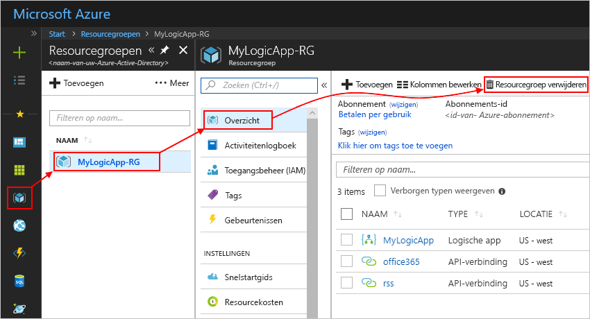

4. Verwijder de Visual Studio-oplossing van uw lokale computer.

## Ondersteuning krijgen

* Ga naar het <a href="https://social.msdn.microsoft.com/Forums/en-US/home?forum=azurelogicapps" target="_blank">Azure Logic Apps forum</a> (Forum voor Azure Logic Apps) als u vragen hebt.
* Als u ideeën voor functies wilt indienen of erop wilt stemmen, gaat u naar de <a href="http://aka.ms/logicapps-wish" target="_blank">website voor feedback van Logic Apps-gebruikers</a>.

## Volgende stappen

In dit artikel hebt u uw logische app met Visual Studio gebouwd, geïmplementeerd en uitgevoerd. Voor meer informatie over het beheren en uitvoeren van de geavanceerde implementatie voor logische apps met Visual Studio, raadpleegt u de volgende artikelen:

> [!div class="nextstepaction"]
> * [Logische apps beheren met Visual Studio](../logic-apps/manage-logic-apps-with-visual-studio.md)
> * [Implementatiesjablonen maken voor logische apps met Visual Studio](../logic-apps/logic-apps-create-deploy-template.md)
