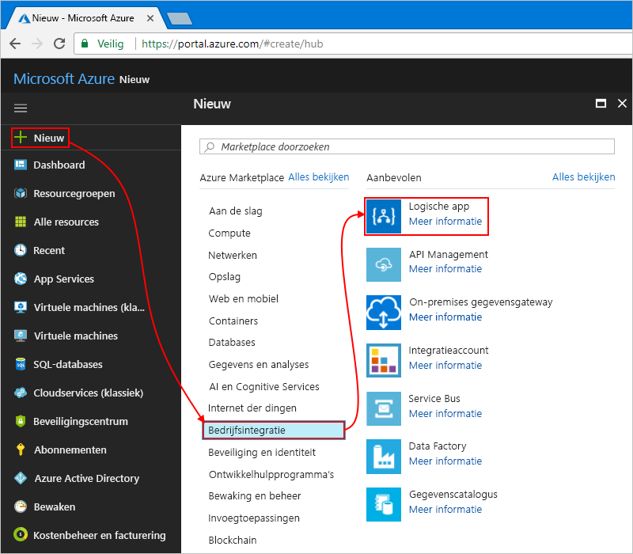
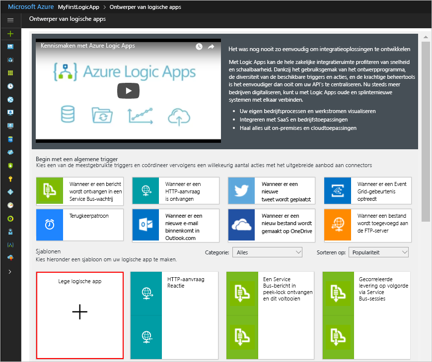

# <a name="check-traffic-with-a-scheduler-based-logic-app"></a>Verkeer met een scheduler op basis van een logische app controleren

Logische Apps van Azure kunt u werkstromen die worden uitgevoerd op een planning te automatiseren. Deze zelfstudie laat zien hoe u kunt samenstellen een [logische app](../logic-apps/logic-apps-overview.md) met een scheduler-trigger die elk etmaal werkdag wordt uitgevoerd en controleert de tijd reizen, inclusief het netwerkverkeer, tussen twee plaatst. Als de tijd een specifieke limiet overschrijdt, verzendt de logische app e-mail met de tijd reizen en de extra tijd nodig voor het doelbestand.

In deze zelfstudie leert u het volgende:

> [!div class="checklist"]
> * Een lege, logische app maken. 
> * Voeg een trigger die geschikt is als een scheduler voor uw logische app.
> * Een actie die de reizen tijd voor een route krijgt toevoegen.
> * Een actie die een variabele maakt, converteert de reizen tijd in seconden naar minuten en slaat die resulteren in de variabele toevoegen.
> * Toevoegen van een voorwaarde waarmee de tijd reizen ten opzichte van een opgegeven limiet wordt vergeleken.
> * Toevoegen van een actie die e-mailbericht wordt verzonden als de tijd reizen de limiet overschrijdt.

Wanneer u bent klaar, ziet uw logische app deze werkstroom op hoog niveau:


Als u nog geen abonnement op Azure hebt, <a href="https://azure.microsoft.com/free/" target="_blank">meld u dan aan voor een gratis Azure-account</a> voordat u begint.

## <a name="prerequisites"></a>Vereisten

* Een e-mailaccount van een e-provider wordt ondersteund door logische Apps zoals Outlook van Office 365, Outlook.com of Gmail. Voor andere providers [controleren de connectors hier lijst](https://docs.microsoft.com/connectors/). Deze snelstartgids gebruikt een Outlook.com-account. Als u een ander e-mailaccount gebruikt, wordt de algemene stappen hetzelfde blijven, maar uw gebruikersinterface iets anders uitzien.

* Als u de tijd reizen voor een route, moet u een toegangssleutel voor het Bing kaarten-API. Als u deze sleutel, volg de stappen voor <a href="https://msdn.microsoft.com/library/ff428642.aspx" target="_blank">hoe u een Bing Maps-sleutel</a>. 

## <a name="sign-in-to-the-azure-portal"></a>Aanmelden bij Azure Portal

Aanmelden bij de <a href="https://portal.azure.com" target="_blank">Azure-portal</a> met de referenties van uw Azure-account.

## <a name="create-your-logic-app"></a>Uw logische app maken

1. Kies in het Azure-menu de optie **Nieuw** > **Enterprise Integration** > **Logische app**.

   

2. Onder **maken logische app**, bevatten deze informatie over uw logische app weergegeven en beschreven. Als u klaar bent, kiest u **Vastmaken aan dashboard** > **Maken**.

   

   | Instelling | Waarde | Beschrijving | 
   | ------- | ----- | ----------- | 
   | **Naam** | LA-TravelTime | De naam voor uw logische app | 
   | **Abonnement** | <*your-Azure-subscription-name*> | De naam voor uw Azure-abonnement | 
   | **Resourcegroep** | LA-TravelTime-RG | De naam voor de [Azure-resourcegroep](../azure-resource-manager/resource-group-overview.md) gebruikt om verwante resources te organiseren | 
   | **Locatie** | VS - oost 2 | De regio waar informatie over uw logische app wordt opgeslagen | 
   | **Log Analytics** | Uit | Houd de **uit** instellen voor het vastleggen van diagnostische gegevens. | 
   |||| 

3. Nadat u uw app wordt geïmplementeerd in Azure, wordt de ontwerpfunctie van Logic Apps wordt geopend en ziet u een pagina met een video inleiding en sjablonen voor algemene logic app patronen. Kies onder **Sjablonen** de optie **Lege logische app**.

   

Vervolgens voegt u het terugkeerpatroon [trigger](../logic-apps/logic-apps-overview.md#logic-app-concepts), welke deze gebeurtenis wordt gestart op basis van een opgegeven planning. Elke logische app moet beginnen met een trigger, die wordt geactiveerd wanneer een bepaalde gebeurtenis wordt uitgevoerd of wanneer een bepaalde voorwaarde voldoet aan de nieuwe gegevens. Zie voor meer informatie [uw eerste logische app maken](../logic-apps/quickstart-create-first-logic-app-workflow.md).

## <a name="add-scheduler-trigger"></a>Scheduler-trigger toevoegen

1. Voer op de designer "recurrence" in het zoekvak. Selecteer deze trigger: **schema - terugkeerpatroon**

   

2. Op de **terugkeerpatroon** vorm, kiest u de **weglatingstekens** (**...** ) knop en kies **naam**. Wijzig de naam van de regel met deze beschrijving:```Check travel time every weekday morning```

   

3. Kies in de trigger **geavanceerde opties weergeven**.

4. Geef de planning en het terugkeerpatroon details voor de trigger als weergegeven en beschreven:

   

   | Instelling | Waarde | Beschrijving | 
   | ------- | ----- | ----------- | 
   | **Interval** | 1 | Het aantal intervallen moet worden gewacht tussen controles | 
   | **Frequentie** | Week | Tijdseenheid moet worden gebruikt voor het terugkeerpatroon | 
   | **Tijdzone** | None | Geldt alleen als u een begin-tijdstip opgeven. Dit is handig voor het opgeven van een niet-lokale tijdzone. | 
   | **Begintijd** | Geen | De Terugkeerperiode tot een specifieke datum en tijd uit te stellen. Zie voor meer informatie [plannen van taken en werkstromen die regelmatig wordt uitgevoerd](../connectors/connectors-native-recurrence.md). | 
   | **Op deze dagen** | Maandag, dinsdag, woensdag, donderdag en vrijdag | Alleen beschikbaar wanneer **frequentie** is ingesteld op 'Week' | 
   | **Op deze uren** | 7,8,9 | Alleen beschikbaar wanneer **frequentie** is ingesteld op 'Week' of 'Day'. Selecteer de uren van de dag dit terugkeerpatroon uitvoeren. In dit voorbeeld wordt uitgevoerd op de 7, 8 en 9 uur aanhalingstekens. | 
   | **Op deze minuten** | 0,15,30,45 | Alleen beschikbaar wanneer **frequentie** is ingesteld op 'Week' of 'Day'. Selecteer de minuten van de dag dit terugkeerpatroon uitvoeren. In dit voorbeeld wordt elke 15 minuten beginnen bij nul uur uitgevoerd. | 
   ||||

   Deze trigger wordt geactiveerd voor elke weekdag, elke 15 minuten om 7:00 AM begint en eindigt bij 9:45 uur. 
   De **Preview** vak geeft de terugkerende planning. 
   Zie voor meer informatie [plannen van taken en werkstromen](../connectors/connectors-native-recurrence.md) en [werkstroomacties en triggers](../logic-apps/logic-apps-workflow-actions-triggers.md#recurrence-trigger).

5. Voor het verbergen van de trigger gegevens nu, klikt u in de titelbalk van de vorm.

   

6. Sla uw logische app. Kies **Opslaan** op de werkbalk van de ontwerper. 

Uw logische app is nu live maar geen reactie andere herhalen. Een actie die reageert wanneer de trigger wordt geactiveerd, dus toevoegen.

## <a name="get-the-travel-time-for-a-route"></a>De tijd reizen voor een route ophalen

Nadat u hebt een trigger, voegt u toe een [actie](../logic-apps/logic-apps-overview.md#logic-app-concepts) die de tijd reizen tussen twee locaties opgehaald. Logic Apps biedt een connector voor het Bing kaarten-API zodat u eenvoudig deze informatie kunt vinden. Voordat u deze taak, zorg ervoor dat u een Bing kaarten-API-sleutel hebt, zoals beschreven in deze zelfstudie vereisten.

1. Kies in de ontwerpfunctie Logic App, onder de trigger **+ een nieuwe stap** > **een actie toevoegen**.

2. Zoek naar 'maps' en selecteert u deze actie: **Bing Maps - Get-route**

3. Als u een verbinding met Bing Maps geen hebt, wordt u gevraagd om een verbinding te maken. Geef de details voor deze verbinding en kies **maken**.

   

   | Instelling | Waarde | Beschrijving |
   | ------- | ----- | ----------- |
   | **Verbindingsnaam** | BingMapsConnection | Geef een naam voor de verbinding. | 
   | **API-sleutel** | <*your-Bing-Maps-key*> | Voer de Bing Maps-sleutel die u eerder hebt ontvangen. Als u een Bing Maps-sleutel niet hebt, ontdek <a href="https://msdn.microsoft.com/library/ff428642.aspx" target="_blank">het ophalen van een sleutel</a>. | 
   | | | |  

4. Wijzig de naam van de actie met deze beschrijving:```Get route and travel time with traffic```

5. Geef details op voor de **Get route** actie, zoals wordt weergegeven en hier wordt beschreven, bijvoorbeeld:

    

   | Instelling | Waarde | Beschrijving |
   | ------- | ----- | ----------- |
   | **Waypoint 1** | <*start-location*> | De route oorsprong | 
   | **Waypoint 2** | <*end-locatie*> | De route bestemming | 
   | **Avoid** | Geen | Items om te voorkomen dat op uw route, zoals wegen en tolgelden | 
   | **Optimize** | timeWithTraffic | Een parameter voor het optimaliseren van uw route toe, zoals afstand reizen tijd met huidige verkeer, enzovoort. Selecteer deze parameter: 'timeWithTraffic' | 
   | **Afstandseenheid** | <*uw voorkeur*> | De eenheid van afstand voor de route. Dit artikel wordt gebruikt voor deze eenheid: 'Mijl'  | 
   | **Reizen modus** | Besturen | De modus reizen voor de route. Selecteer deze modus: 'Groot' | 
   | **Datum / tijd-doorvoer** | None | Van toepassing op alleen de modus voor de doorvoer | 
   | **Doorvoer datumtype Type** | None | Van toepassing op alleen de modus voor de doorvoer | 
   |||| 

   Zie voor meer informatie over deze parameters [berekenen een route](https://msdn.microsoft.com/library/ff701717.aspx).

6. Sla uw logische app.

Maak vervolgens een variabele, zodat u kunt converteren en opslaan van de huidige tijd van de reizen als minuten in plaats van seconden. Op die manier kunt u herhaling van de conversie en gemakkelijker de waarde in latere stappen gebruiken. 

## <a name="create-variable-to-store-travel-time"></a>Maak de variabele voor het opslaan van reizen

Soms wilt u mogelijk bewerkingen uitvoeren op gegevens in uw werkstroom en gebruik van de resultaten in latere acties. Als u wilt deze resultaten opslaan zodat u eenvoudig kunt hergebruiken of ernaar te verwijzen, kunt u variabelen voor het opslaan van de resultaten nadat ze zijn verwerkt. U kunt variabelen alleen op het hoogste niveau in uw logische app maken.

Standaard de vorige **Get route** actie retourneert de huidige tijd reizen met verkeer in seconden tot en met de **reizen duur verkeer** veld. Door omzetten en opslaan van deze waarde als het aantal minuten in plaats daarvan, kunt u de waarde gemakkelijker later opnieuw gebruiken zonder opnieuw te converteren.

1. Onder de **Get route** actie, kies **+ een nieuwe stap** > **een actie toevoegen**.

2. Zoek naar 'variabelen' en selecteert u deze actie: **variabelen - variabele initialiseren**

   

3. Wijzig de naam van deze actie met deze beschrijving:```Create variable to store travel time```

4. Geef details voor de variabele, zoals hier wordt beschreven:

   | Instelling | Waarde | Beschrijving | 
   | ------- | ----- | ----------- | 
   | **Naam** | travelTime | De naam voor de variabele | 
   | **Type** | Geheel getal | Het gegevenstype voor de variabele | 
   | **Waarde** | Een expressie die de huidige reistijd van seconden naar minuten converteert (Zie de stappen onder deze tabel). | De beginwaarde voor de variabele | 
   |||| 

   1. Maken van de expressie voor de **waarde** veld, klik in het veld, zodat de lijst met dynamische inhoud wordt weergegeven. 
   Indien nodig, verbreden uw browser totdat de lijst wordt weergegeven. 
   Kies in de lijst voor de dynamische inhoud **expressie**. 

      

      Wanneer u in sommige invoervakken klikt, wordt een lijst met dynamische inhoud of een lijst van de parameter inline weergegeven. Deze lijst bevat alle parameters vanaf vorige acties die u als invoer in uw werkstroom gebruiken kunt. 
      De lijst met dynamische inhoud bevat een expressie-editor waarin u de functies voor het uitvoeren van bewerkingen kunt selecteren. 
      Deze expressie-editor wordt alleen weergegeven in de lijst met dynamische inhoud.

      De breedte van uw browser bepaalt welke lijst wordt weergegeven. 
      Als uw browser breed is, wordt de lijst met dynamische inhoud weergegeven. 
      Als uw browser smal is, verschijnt een lijst met parameters inline onder het invoervak die momenteel de focus heeft.

   2. Voer in de expressie-editor in deze expressie:```div(,60)```

      

   3. Plaats de cursor in de expressie tussen het haakje openen (**(**) en de komma (**,**). 
   Kies **dynamische inhoud**.

      

   4. Selecteer in de lijst voor de dynamische inhoud **reizen duur verkeer**.

      

   5. Nadat u het veld wordt omgezet in de expressie, kiest u **OK**.

      

      De **waarde** veld verschijnt nu als volgt te werk:

      

5. Sla uw logische app.

Vervolgens voegt u een voorwaarde waarmee wordt gecontroleerd of de huidige tijd van de reizen groter is dan een specifieke limiet is.

## <a name="compare-travel-time-with-limit"></a>Reizen tijd met limiet vergelijken

1. Kies onder de vorige actie **+ een nieuwe stap** > **een voorwaarde toevoegen**. 

2. Wijzig de naam van de voorwaarde van deze beschrijving:```If travel time exceeds limit```

3. Maken van een voorwaarde waarmee wordt gecontroleerd of **travelTime** hier groter is dan de opgegeven limiet als beschreven en wordt het weergegeven:

   1. Klik in de voorwaarde in de **kiest u een waarde** vak die aan de linkerkant (wide browserweergave) of op de voorgrond (browserweergave smalle).

   2. Selecteer in de lijst met dynamische inhoud of de lijst met parameters, de **travelTime** veld onder **variabelen**.

   3. Selecteer in het vak vergelijking deze operator: **is groter dan**

   4. In de **kiest u een waarde** vak op de rechter (wide weergave)- of onderkant (smalle weergave), voert u deze limiet:```15```

   Bijvoorbeeld, als u in smalle weergave werkt, is dit hoe u dit probleem maken:

   

4. Sla uw logische app.

Voeg vervolgens de bewerking uit te voeren wanneer de tijd reizen de limiet overschrijdt.

## <a name="send-email-when-limit-exceeded"></a>E-mail verzenden wanneer de limiet overschreden

Voeg nu een actie die u e-mailberichten wanneer de tijd reizen de limiet overschrijdt. Dit e-mailbericht bevat de huidige reizen tijd en de extra tijd die nodig zijn voor de opgegeven route reizen. 

1. In de toestand **als de waarde true** vertakking, kiest u **een actie toevoegen**.

2. Zoek naar 'e-mailbericht verzenden' en selecteer de e-connector en de ' e actie verzenden' die u wilt gebruiken.

   

   * Selecteer voor persoonlijke Microsoft-accounts, **Outlook.com**. 
   * Voor Azure werkt of schoolaccounts, selecteert **Outlook van Office 365**.

3. Als u nog een verbinding hebt, wordt u gevraagd aan te melden bij uw e-mailaccount.

   Logic Apps maakt een verbinding met uw e-mailaccount.

4. Wijzig de naam van de actie met deze beschrijving:```Send email with travel time```

5. Voer het e-mailadres van de ontvanger in het vak **Aan** in. Gebruik uw e-mailadres voor testdoeleinden.

6. In de **onderwerp** vak, geef het e-mailadres onderwerp en omvatten de **travelTime** variabele.

   1. Voer de tekst ```Current travel time (minutes): ``` met een spatie. 
   
   2. Selecteer in de lijst met parameters of in de lijst met dynamische inhoud **travelTime** onder **variabelen**. 
   
      Bijvoorbeeld, als uw browser in smalle weergave:

      

7. In de **hoofdtekst** geeft u de inhoud voor het e-mailbericht. 

   1. Voer de tekst ```Add extra travel time (minutes): ``` met een spatie. 
   
   2. Indien nodig, verbreden uw browser totdat de lijst met dynamische inhoud wordt weergegeven. 
   Kies in de lijst voor de dynamische inhoud **expressie**.

      

   3. Voer in de expressie-editor in deze expressie zodat u kunt het aantal minuten die groter is dan de limiet voor het berekenen:```sub(,15)```

      

   4. Plaats de cursor in de expressie tussen het haakje openen (**(**) en de komma (**,**). Kies **dynamische inhoud**.

      

   5. Onder **variabelen**, selecteer **travelTime**.

      

   6. Nadat u het veld wordt omgezet in de expressie, kiest u **OK**.

      

      De **hoofdtekst** veld verschijnt nu als volgt te werk:

      

8. Sla uw logische app.

Test vervolgens uw logische app, nu er ongeveer als in dit voorbeeld volgt:


## <a name="run-your-logic-app"></a>Voer uw logische app

Kies **Uitvoeren** op de werkbalk in de ontwerper als u de logische app handmatig wilt uitvoeren. Als de huidige tijd blijft onder uw limiet reizen, wordt uw logische app, gebeurt er niets anders en wordt gewacht op het volgende interval voordat u opnieuw controleert.
Maar als de huidige tijd van de reizen de limiet overschrijdt, krijgt u een e-mailbericht met de huidige tijd van reizen en het aantal minuten boven de limiet. Hier volgt een voorbeeld e-mailbericht uw logische app verzendt:


Als u een e-mailberichten geen krijgt, controleert u uw e-mailadres ongewenste map. Uw ongewenste e-mail mogelijk dit soort e-mails omleiden. Als u niet zeker weet of uw logische app correct wordt uitgevoerd, kunt u [Problemen met uw logische app oplossen](../logic-apps/logic-apps-diagnosing-failures.md) raadplegen.

Gefeliciteerd, u hebt nu gemaakt en voer een geplande terugkerende logische app. 

Maken van andere logic apps die gebruikmaken van de **schema - terugkeerpatroon** activeren, bekijk deze sjablonen, die beschikbaar is nadat u een logische app maken:

* Dagelijkse herinnerd naar u verzonden.
* Oudere Azure blobs verwijderen.
* Een bericht toevoegen aan een Azure Storage-wachtrij.

## <a name="clean-up-resources"></a>Resources opschonen

Wanneer deze niet langer nodig is, verwijdert u de resourcegroep die uw logische app en de bijbehorende resources bevat. Op het Azure hoofdmenu, gaat u naar **resourcegroepen**, en selecteert u de resourcegroep voor uw logische app. Kies **resourcegroep verwijderen**. Voer de naam van de resourcegroep als bevestiging en kies **verwijderen**.


## <a name="get-support"></a>Ondersteuning krijgen

* Ga naar het [Azure Logic Apps forum](https://social.msdn.microsoft.com/Forums/en-US/home?forum=azurelogicapps) (Forum voor Azure Logic Apps) als u vragen hebt.
* Als u ideeën voor functies wilt indienen of erop wilt stemmen, gaat u naar de [website voor feedback van Logic Apps-gebruikers](http://aka.ms/logicapps-wish).

## <a name="next-steps"></a>Volgende stappen

In deze zelfstudie hebt gemaakt van een logische app waarmee wordt gecontroleerd of verkeer op basis van een opgegeven schema (op werkdag uitvoeren) en vergt actie (verzendt e) wanneer de reizen langer duurt dan een opgegeven limiet. Nu informatie over het bouwen van een logische app waarmee mailinglijst aanvragen voor goedkeuring verzonden door de integratie van Azure-services, Microsoft-services en andere SaaS-apps.

> [!div class="nextstepaction"]
> [Mailinglijst aanvragen beheren](../logic-apps/tutorial-process-mailing-list-subscriptions-workflow.md)