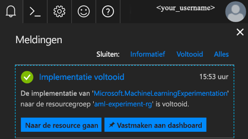
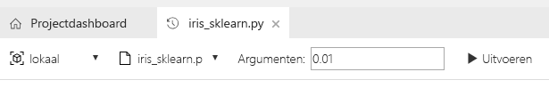
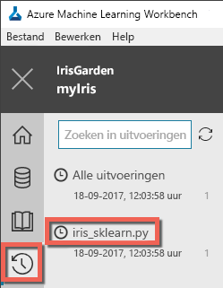
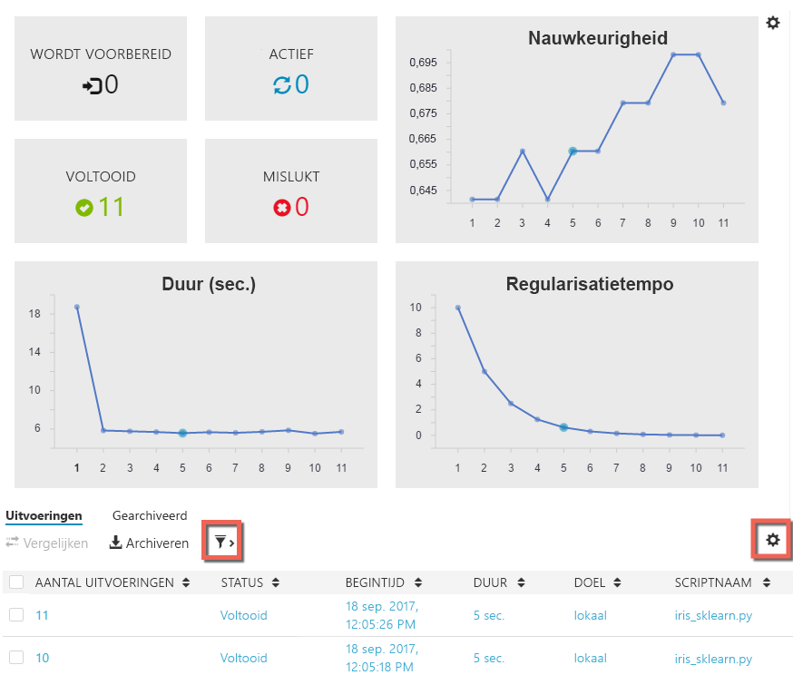

# Preview-accounts maken voor Azure Machine Learning en Azure Machine Learning Workbench installeren
Azure Machine Learning-services (preview) is een geïntegreerde, end-to-end oplossing voor gegevenswetenschap en geavanceerde analyse. Het helpt professionele gegevenswetenschappers om gegevens voor te bereiden, experimenten te ontwikkelen en modellen te implementeren op cloudschaal.

In deze snelstartgids wordt beschreven hoe u accounts voor experimenten en modelbeheer kunt maken in de preview-versie van Azure Machine Learning. Ook ziet u hoe u de Azure Machine Learning Workbench-bureaubladtoepassing en CLI-hulpprogramma's kunt installeren. Daarna volgt u een korte rondleiding door de preview-functies van Azure Machine Learning met behulp van de [Iris-dataset](https://en.wikipedia.org/wiki/iris_flower_data_set) om een model op te bouwen voor het bepalen van de soort iris, op basis van een aantal fysieke kenmerken.  

Als u nog geen abonnement op Azure hebt, maak dan een [gratis account](https://azure.microsoft.com/free/?WT.mc_id=A261C142F) aan voordat u begint.

## Vereisten

Momenteel kunt u de desktop-app Azure Machine Learning Workbench alleen installeren op de volgende besturingssystemen: 
- Windows 10
- Windows Server 2016
- macOS Sierra
- macOS High Sierra

## Aanmelden bij Azure Portal
Meld u aan bij [Azure Portal](https://portal.azure.com/).

## Accounts maken voor Azure Machine Learning
Gebruik Azure Portal om accounts in te richten voor Azure Machine Learning: 
1. Selecteer de knop **Nieuw** (+) in de linkerbovenhoek van de portal.

2. Voer **Machine Learning** in de zoekbalk in. Selecteer het zoekresultaat met de naam **Machine Learning Experimenten (preview)**.  Klik op het sterpictogram om van deze selectie een favoriet te maken in Azure Portal.

   

3. Selecteer **+ Toevoegen** om een nieuw account te configureren voor Machine Learning Experimenten. Het gedetailleerde formulier wordt geopend.

   

4. Vul het formulier Machine Learning Experimenten in met de volgende gegevens:

   Instelling|Voorgestelde waarde|Beschrijving
   ---|---|---
   Naam experimenteeraccount | _Unieke naam_ |Kies een unieke naam die uw account identificeert. U kunt uw eigen naam gebruiken, maar ook de naam van een afdeling of project waarmee het experiment is verbonden. De naam moet minimaal 2 en maximaal 32 tekens lang zijn. De naam mag alleen alfanumerieke tekens en streepjes (-) bevatten. 
   Abonnement | _Uw abonnement_ |Kies het Azure-abonnement dat u wilt gebruiken voor het experiment. Als u meerdere abonnementen hebt, kiest u het juiste abonnement waarin de resource wordt gefactureerd.
   Resourcegroep | _Uw resourcegroep_ | U kunt een nieuwe resourcegroepnaam maken of een bestaande naam uit uw abonnement gebruiken.
   Locatie | _De regio het dichtst bij uw gebruikers_ | Kies de locatie die zich het dichtst bij uw gebruikers en de gegevensresources bevindt.
   Aantal seats | 2 | Voer het aantal seats in. Deze selectie beïnvloedt de [prijzen](https://azure.microsoft.com/pricing/details/machine-learning/). De eerste twee seats zijn gratis. Gebruik twee seats voor deze snelstartgids. U kunt het aantal seats later naar behoefte bijwerken in de Azure-portal.
   Storage-account | _Unieke naam_ | Selecteer **Nieuwe maken** en geef een naam op om een Azure-opslagaccount te maken. Of selecteer **Bestaande gebruiken** en kies een bestaand opslagaccount in de vervolgkeuzelijst. Het opslagaccount is vereist en wordt gebruikt voor het bewaren van projectartefacten en uitvoeringsgeschiedenisgegevens. 
   Werkruimte voor Experimenten-account | _Unieke naam_ | Geef een naam op voor de nieuwe werkruimte. De naam moet minimaal 2 en maximaal 32 tekens lang zijn. De naam mag alleen alfanumerieke tekens en streepjes (-) bevatten.
   Eigenaar van de werkruimte toewijzen | _Uw account_ | Selecteer uw eigen account als de eigenaar van de werkruimte.
   Modelbeheer-account maken | *controleren* | Als onderdeel van het maken van een Experimenten-account, hebt u de optie om ook het Machine Learning Modelbeheer-account te maken. Deze bron wordt gebruikt wanneer u klaar bent om uw modellen te implementeren en te beheren als realtime webservices. Wij raden aan het Modelbeheer-account tegelijk met het Experimenten-account te maken.
   Accountnaam | _Unieke naam_ | Kies een unieke naam die uw Modelbeheer-account identificeert. U kunt uw eigen naam gebruiken, maar ook de naam van een afdeling of project waarmee het experiment is verbonden. De naam moet minimaal 2 en maximaal 32 tekens lang zijn. De naam mag alleen alfanumerieke tekens en streepjes (-) bevatten. 
   Prijscategorie voor Modelbeheer | **DEVTEST** | Selecteer **Geen prijscategorie geselecteerd** om de prijscategorie voor uw nieuwe Modelbeheer-account op te geven. Selecteer om kosten te besparen de prijscategorie **DEVTEST** als deze beschikbaar is voor uw abonnement (beperkte beschikbaarheid). Anders selecteert u de prijscategorie S1 om kosten te besparen. Klik op **Selecteren** om de geselecteerde prijscategorie op te slaan. 
   Vastmaken aan dashboard | _controleren_ | Selecteer de optie **Vastmaken aan dashboard** om het Azure Machine Learning Experimenten-account gemakkelijk te kunnen bijhouden op de dashboardpagina van Azure Portal.

5. Selecteer **Maken** om te beginnen met het aanmaakproces.

6. Klik in de Azure Portal-werkbalk op **Meldingen** (belpictogram) om het implementatieproces te bewaken. 

   U ziet nu de melding **Implementatie wordt uitgevoerd**. De status wordt gewijzigd in **Implementatie is voltooid** wanneer de implementatie is uitgevoerd. De pagina Machine Learning Experimenten-account wordt geopend als de implementatie is geslaagd.
   
   

Afhankelijk van het besturingssysteem dat u op de lokale computer gebruikt, volgt u de aanwijzingen in een van de volgende twee secties om Azure Machine Learning Workbench te installeren. 

## Azure Machine Learning Workbench installeren op Windows
Installeer Azure Machine Learning Workbench op een computer met Windows 10, Windows Server 2016 of later.

1. Download het nieuwste installatieprogramma van Azure Machine Learning Workbench: [AmlWorkbenchSetup.msi](https://aka.ms/azureml-wb-msi).

2. Dubbelklik in de Verkenner op het gedownloade installatieprogramma **AmlWorkbenchSetup.msi**.

   >[!IMPORTANT]
   >Download het installatieprogramma volledig op schijf en voer het daarvandaan uit. Voer het niet rechtstreeks vanuit de downloadwidget van de browser uit.

3. Voltooi de installatie door de instructies op het scherm te volgen.

   Met het installatieprogramma worden alle vereiste afhankelijke onderdelen gedownload, zoals Python, Miniconda en andere gerelateerde bibliotheken. Het kan ongeveer een halfuur duren voordat het installeren van alle onderdelen is voltooid. 

4. Azure Machine Learning Workbench is nu geïnstalleerd in de volgende map:
   
   `C:\Users\<user>\AppData\Local\AmlWorkbench`

## Azure Machine Learning Workbench installeren op macOS
Installeer Azure Machine Learning Workbench op een computer met macOS Sierra of hoger.

1. Download het nieuwste installatieprogramma van Azure Machine Learning Workbench: [AmlWorkbenchSetup.dmg](https://aka.ms/azureml-wb-dmg).

   >[!IMPORTANT]
   >Download het installatieprogramma volledig op schijf en voer het daarvandaan uit. Voer het niet rechtstreeks vanuit de downloadwidget van de browser uit.

2. Dubbelklik op het gedownloade installatieprogramma **AmlWorkbench.dmg** vanuit de Finder.

3. Voltooi de installatie door de instructies op het scherm te volgen.

   Met het installatieprogramma worden alle vereiste afhankelijke onderdelen gedownload, zoals Python, Miniconda en andere gerelateerde bibliotheken. Het kan ongeveer een halfuur duren voordat het installeren van alle onderdelen is voltooid. 

4. Azure Machine Learning Workbench is nu geïnstalleerd in de volgende map: 

   `/Applications/Azure ML Workbench.app`

## Voer Azure Machine Learning Workbench uit om u de eerste keer aan te melden
1. Wanneer het installatieproces is voltooid, klikt u op het laatste scherm van het installatieprogramma op de knop **Workbench starten**. Als u het installatieprogramma hebt gesloten, klikt u op het bureaublad op de snelkoppeling naar Machine Learning Workbench of in het menu **Start** op de naam **Azure Machine Learning Workbench** om de app te starten.

2. Meld u aan bij Workbench met hetzelfde account dat u eerder hebt gebruikt voor het inrichten van de Azure-resources. 

3. Wanneer de aanmelding is geslaagd, worden de Machine Learning Experimenten-accounts gezocht die u eerder hebt gemaakt. Alle Azure-abonnementen waartoe u toegang hebt met uw referenties, worden doorzocht. Wanneer er minstens één Experimenten-account is gevonden, wordt Workbench met dit account geopend. Vervolgens worden de werkruimten en projecten in het account vermeld. 

   >[!TIP]
   > Als u toegang hebt tot meer dan één Experimenten-account, kunt u overschakelen naar een ander account door in de linkerbenedenhoek van de Workbench-app op het avatarpictogram te klikken.

Zie [Deployment Environment Setup](deployment-setup-configuration.md) (Implementatieomgeving instellen) voor informatie over het maken van een omgeving voor het implementeren van webservices.

## Een nieuw project maken
1. Start de Azure Machine Learning Workbench-app en meld u aan. 

2. Selecteer **Bestand** > **Nieuw project** (of klik op het **+**-teken in het deelvenster **PROJECTEN**). 

3. Vul de velden **Projectnaam** en **Projectmap** in. Het veld **Projectbeschrijving** is optioneel, maar wel nuttig. Laat het vak **Visualstudio.com GIT Repository URL** (URL voor Visualstudio.com-Git-repo) voorlopig leeg. Kies een werkruimte en selecteer **Classifying Iris** (Iris classificeren) als de projectsjabloon.

   >[!TIP]
   >U kunt het tekstvak voor de Git-repo desgewenst ook invullen met de URL van een Git-repo die wordt gehost in een [Visual Studio Team Service-project](https://www.visualstudio.com). Deze Git-repo moet al bestaan en moet leeg zijn, zonder master branch. U moet ook schrijftoegang hebben tot de repo. Door nu een Git-repo toe te voegen, kunt u later Roaming and Sharing-scenario's inschakelen. [Meer informatie](using-git-ml-project.md).

4. Klik op de knop **Maken** om het project te maken. Er wordt een nieuw project voor u gemaakt en geopend. U kunt nu de introductiepagina, gegevensbronnen, notitieblokken en broncodebestanden van het project verkennen. 

    >[!TIP]
    >U kunt het project ook openen in Visual Studio Code of een andere editor door een koppeling naar een IDE (Integrated Development Environment) te configureren en hierin vervolgens de projectmap te openen. [Meer informatie](how-to-configure-your-IDE.md). 

## Een Python-script uitvoeren
U gaat nu een script uitvoeren op de lokale computer. 

1. Elk project wordt geopend in een eigen **Projectdashboard**-pagina. Selecteer in de opdrachtbalk boven in de toepassing de optie **lokaal** als doel voor de uitvoering en selecteer **iris_sklearn.py** als het uit te voeren script. Er zijn andere bestanden opgenomen in het voorbeeld. Deze kunt u later bekijken. 

   

2. Voer in het tekstvak **Argumenten** **0.01** in. Dit nummer wordt gebruikt in de code om de regularisatiesnelheid in te stellen. Deze waarde wordt gebruikt om te configureren hoe het lineaire regressiemodel wordt getraind. 

3. Klik op de knop **Uitvoeren** om **iris_sklearn.py** op de computer uit te voeren. 

   Deze code gebruikt het [logistic regression](https://en.wikipedia.org/wiki/logistic_regression)-algoritme van de populaire Python [scikit learn](http://scikit-learn.org/stable/index.html)-bibliotheek om het model op te bouwen.

4. Het deelvenster **Taken** schuift van rechts naar buiten als het nog niet zichtbaar is en er wordt aan het deelvenster een **iris_sklearn**-taak toegevoegd. De status verandert van **Indienen** in **Uitvoeren** als de taak wordt gestart en vervolgens binnen een paar seconden in **Voltooid**. 

   Gefeliciteerd! U hebt een Python-script uitgevoerd in Azure Machine Learning Workbench.

6. Herhaal stap 2 tot en met 4 een aantal keer. Gebruik elke keer verschillende argumentwaarden tussen**10** en **0.001**.

## Uitvoeringsgeschiedenis weergeven
1. Ga naar de weergave **Uitvoeringen** en selecteer **iris_sklearn.py** in de lijst met uitvoeringen. Het uitvoeringsgeschiedenisdashboard voor **iris_sklearn.py** wordt geopend. Alle uitvoeringen op **iris_sklearn.py** worden hier weergegeven. 

   

2. In het uitvoeringsgeschiedenisdashboard worden ook de belangrijkste metrische gegevens, een set standaardgrafieken en een lijst met metrische gegevens voor elke uitvoering weergegeven. U kunt deze weergave aanpassen door de configuraties te sorteren, te filteren en bij te stellen. Klik hiervoor op het configuratiepictogram of het filterpictogram.

   

3. Selecteer een voltooide uitvoering. U ziet nu een gedetailleerde weergave voor deze specifieke uitvoering. Details omvatten aanvullende metrische gegevens, de geproduceerde bestanden en andere mogelijk handige logboeken.

## Volgende stappen
U hebt nu een Azure Machine Learning Experimenten-account en een Azure Machine Learning Modelbeheer-account gemaakt. U hebt de bureaublad-app en de opdrachtregelinterface van Azure Machine Learning Workbench geïnstalleerd. U hebt een nieuw project gemaakt, een model gemaakt door een script uit te voeren en de uitvoeringsgeschiedenis van het script verkend.

Voor een uitgebreidere ervaring met deze werkstroom, inclusief het implementeren van een Iris-model als webservice, volgt u de volledige zelfstudie *Iris classificeren*. De zelfstudie bevat gedetailleerde stappen voor [gegevensvoorbereiding](tutorial-classifying-iris-part-1.md), [experimenten](tutorial-classifying-iris-part-2.md) en [modelbeheer](tutorial-classifying-iris-part-3.md). 

> [!div class="nextstepaction"]
> [Zelfstudie Iris classificeren](tutorial-classifying-iris-part-1.md)
