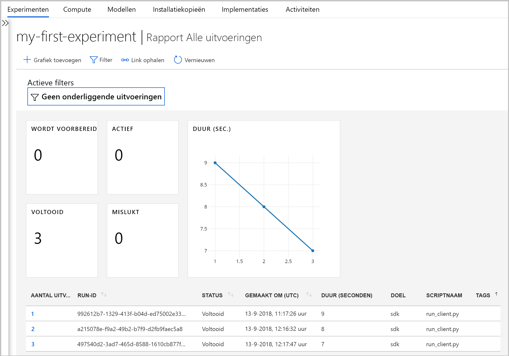
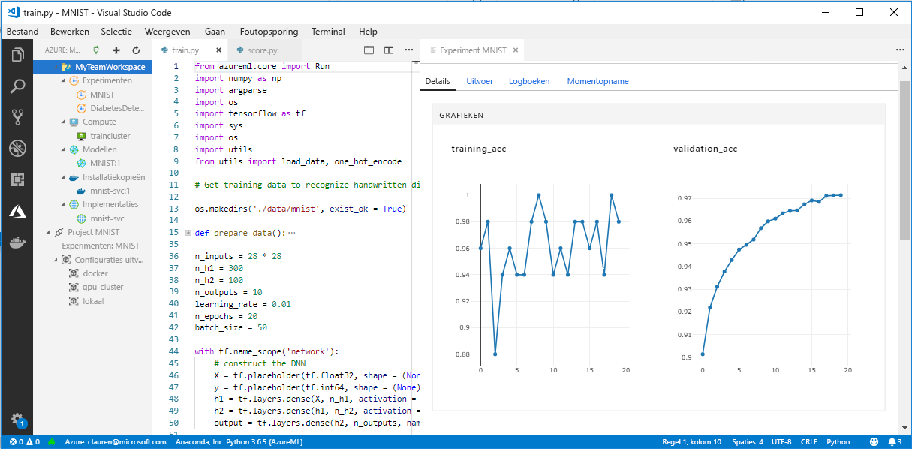

# Wat is er gebeurd met Workbench in Azure Machine Learning (preview)?

De Workbench-toepassing en een aantal andere vroege functies zijn afgeschaft in de versie van september 2018 om plaats te maken voor een verbeterde [architectuur](concept-azure-machine-learning-architecture.md). De nieuwe versie bevat veel belangrijke updates op basis van feedback van klanten om uw ervaring te verbeteren. De kernfunctionaliteit voor experimentele uitvoeringen tot modelimplementatie is niet gewijzigd, maar nu kunt u de robuuste <a href="http://aka.ms/aml-sdk" target="_blank">SDK</a> en [CLI](reference-azure-machine-learning-cli.md) gebruiken om uw machine learning-taken en -pijplijnen uit te voeren.  

In dit artikel ontdek u wat er is veranderd en hoe dit van invloed is op uw bestaande werk met de Azure Machine Learning service.

## Wat is er veranderd?

De meest recente versie van Azure Machine Learning bevat:
+ Een [vereenvoudigd model voor Azure-resources](concept-azure-machine-learning-architecture.md)
+ [Een nieuwe gebruikersinterface in de portal](how-to-track-experiments.md) voor het beheren van uw experimenten en compute-doelen
+ Een nieuwe, uitgebreidere Python <a href="http://aka.ms/aml-sdk" target="_blank">SDK</a>
+ Een nieuwe, uitgebreide [Azure CLI-extensie](reference-azure-machine-learning-cli.md) voor machine learning

De [architectuur](concept-azure-machine-learning-architecture.md) is vernieuwd voor meer gebruiksgemak. In plaats van meerdere Azure-resources en -accounts, hebt u alleen een [Azure Machine Learning-werkruimte](concept-azure-machine-learning-architecture.md#workspace) nodig.  U kunt snel werkruimten maken in de [Azure-portal](quickstart-get-started.md).  Een werkruimte kan door meerdere gebruikers worden gebruikt voor het opslaan van compute-doelen voor training en implementatie, modelexperimenten, Docker-installatiekopieën, geïmplementeerde modellen enzovoort.

De huidige versie bevat nieuwe en verbeterde CLI- en SDK-clients, maar de Workbench-desktoptoepassing zelf is afgeschaft. U kunt uw experimenten nu controleren in het [werkruimtedashboard in de Azure-webportaal](how-to-track-experiments.md#view-the-experiment-in-the-azure-portal). Gebruik het dashboard om uw experimentgeschiedenis op te halen, de compute-doelen die zijn gekoppeld aan uw werkruimte te beheren, uw modellen en Docker-installatiekopieën te beheren en zelfs om webservices te implementeren.

## Hoe migreer ik?

De meeste artefacten die in de eerdere versie van de Azure Machine Learning service zijn gemaakt, worden opgeslagen in uw eigen lokale of cloudopslag. Deze artefacten worden nooit verwijderd. Als u wilt migreren, moet u de artefacten opnieuw registreren bij de bijgewerkte Azure Machine Learning service. Lees dit [artikel over migreren](how-to-migrate.md) voor informatie over wat u kunt migreren en hoe u dat doet.

## Ondersteuningstijdlijn

U kunt uw accounts voor experimenten en modelbeheer nog een tijdje na september 2018 blijven gebruiken, evenals de Workbench-toepassing. Ondersteuning voor de volgende resources wordt in de drie tot vier maanden na de release stapsgewijs opgeheven. U kunt de documentatie voor de oude functies nog vinden in het [gedeelte Resources](../desktop-workbench/tutorial-classifying-iris-part-1.md) onderaan de inhoudsopgave.

|Fase|Ondersteuningsdetails voor vroegere functies|
|:---:|----------------|
|1|De mogelijkheid om een _Azure Machine Learning Experimenten-account_ en een _Modelbeheer-account_ te maken in de Azure-portal en vanaf de CLI. De mogelijkheid om ML Compute-omgevingen te maken vanaf de CLI wordt ook beëindigd. Als u nog een account hebt, blijven de CLI en de bureaublad-Workbench tijdens deze fase werken.|
|2|De onderliggende API's voor het maken van oude werkruimten en projecten in de bureaublad-Workbench en met de CLI worden beëindigd. U kunt tijdens deze fase nog steeds bestaande projecten openen en aanvullende scripts eraan toevoegen, scripts uitvoeren in bestaande projecten en webservices implementeren in bestaande ML Compute-omgevingen.|
|3|Ondersteuning voor de rest, waaronder de resterende API's en de bureaublad-Workbench, worden tijdens deze fase beëindigd.|

[Migreer vandaag nog](how-to-migrate.md). Al de nieuwste mogelijkheden zijn beschikbaar met de nieuwe <a href="http://aka.ms/aml-sdk" target="_blank">SDK</a>, [CLI](reference-azure-machine-learning-cli.md) en [portal](quickstart-get-started.md).

## Hoe zit het met uitvoeringsgeschiedenissen?

Uitvoeringsgeschiedenissen blijven nog een tijdje toegankelijk. Wanneer u klaar bent om naar de bijgewerkte versie van Azure Machine Learning service over te stappen, kunt u deze uitvoeringsgeschiedenissen exporteren als u een kopie wilt bewaren.

Uitvoeringsgeschiedenissen heten voortaan _experimenten_ in de huidige versie. U kunt de experimenten van uw model verzamelen en ze verkennen met behulp van de SDK, CLI of webportaal.

Het werkruimtedashboard van de portaal wordt alleen ondersteund in Edge, Chrome en Firefox.

[  ] (./media/overview-what-happened-to-workbench/image001.png#lightbox)

## Kan ik nog steeds gegevens voorbereiden?

Uw bestaande gegevensvoorbereidingsbestanden zijn niet overdraagbaar naar de nieuwste versie omdat Workbench niet meer bestaat. U kunt uw gegevens echter nog steeds voorbereiden voor modellering.  

Met kleinere gegevenssets kunt u de <a href="http://aka.ms/aml-sdk" target="_blank">Azure Machine Learning Data Prep SDK</a> gebruiken om uw gegevens snel voor te bereiden voorafgaand aan het modelleren. 

U kunt dezelfde <a href="http://aka.ms/aml-sdk" target="_blank">SDK</a> gebruiken voor grotere gegevenssets of Azure Databricks gebruiken om grotere gegevenssets voor te bereiden. 

## Blijven projecten behouden?

U verliest geen code of werk. Projecten zijn in de oudere versie cloudentiteiten met een lokale map. In de nieuwste versie kunt u lokale mappen koppelen aan de Azure Machine Learning-werkruimte met behulp van een lokaal configuratiebestand. [Bekijk een diagram van de meest recente architectuur](concept-azure-machine-learning-architecture.md).

Aangezien veel van de projectinhoud al op uw lokale computer staat, hoeft u alleen een configuratiebestand in die map te maken en ernaar te verwijzen in uw code om het aan uw werkruimte te koppelen. [Informatie over het migreren van uw bestaande projecten.](how-to-migrate.md#projects)

Ontdek hoe u aan de slag kunt gaan [in Python met de belangrijkste SDK](quickstart-get-started.md).

## Hoe zit het met mijn registermodellen en -installatiekopieën?
 
De modellen die u in uw oude modelregister hebt geregistreerd, moeten worden gemigreerd naar uw nieuwe werkruimte als u ze wilt blijven gebruiken. U kunt dit doen door [de modellen te downloaden en ze opnieuw te registreren](how-to-migrate.md) in uw nieuwe werkruimte. 

De installatiekopieën die u in uw oude installatiekopieregister hebt gemaakt, moeten opnieuw worden gemaakt in de nieuwe werkruimte om ze te blijven gebruiken. U kunt dit doen door het gedeelte [create docker image](how-to-deploy-to-aci.md#configure-an-image) (Docker-installatiekopie maken) te volgen. 

## Hoe zit het met geïmplementeerde webservices?

De modellen die u als webservices hebt geïmplementeerd met behulp van uw Modelbeheer-account blijven werken zolang Azure Container Service (ACS) wordt ondersteund. Deze webservices blijven zelfs werken nadat de ondersteuning voor Modelbeheer-accounts is beëindigd. Wanneer de ondersteuning voor de oude CLI echter wordt beëindigd, geldt dat ook voor de mogelijkheid om deze webservices te beheren.

In de nieuwere versie worden modellen als webservices geïmplementeerd naar ACI-clusters ([Azure Container Instances](how-to-deploy-to-aci.md)) of AKS-clusters ([Azure Kubernetes Service](how-to-deploy-to-aks.md)). U kunt ook [naar FPGA's en IoT Edge implementeren](how-to-deploy-and-where.md). U kunt uw modellen opnieuw implementeren met de nieuwe SDK of CLI, zonder dat u uw scoring-bestanden, afhankelijkheden of schema's hoeft te wijzigen. 

## Hoe zit het met de oude SDK en CLI?

Deze blijven nog een tijdje werken (zie de [tijdlijn](#timeline) hierboven). Het is raadzaam om uw nieuwe experimenten en modellen met de meest recente SDK en/of CLI te maken.

In de nieuwste versie kunt u met de nieuwe Python SDK in elke Python-omgeving communiceren met de Azure Machine Learning service. Informatie over het installeren van de meest recente <a href="http://aka.ms/aml-sdk" target="_blank">SDK</a>.  U kunt ook de [bijgewerkte machine learning-extensie van Azure CLI](reference-azure-machine-learning-cli.md) gebruiken met de uitgebreide set `az ml`-opdrachten om in elke opdrachtregelomgeving met de service te communiceren, met inbegrip van de cloud shell van de Azure-portal.

## Hoe zit het met Visual Studio Code Tools for AI?

In deze nieuwste release is de extensie Visual Studio Code Tools for AI uitgebreid en verbeterd voor gebruik met de bovenstaande nieuwe functies.

[  ] (./media/overview-what-happened-to-workbench/vscode-big.png#lightbox)

## Hoe zit het met domeinpakketten?

De domeinpakketten voor [Computer Vision, Text Analytics en prognose](../desktop-workbench/reference-python-package-overview.md) kunnen niet worden gebruikt met de meest recente versie van Azure Machine Learning. U kunt echter nog steeds Computer Vision-, tekst- en prognosemodellen bouwen en trainen met de meest recente Azure Machine Learning <a href="http://aka.ms/aml-sdk" target="_blank">SDK</a> voor Python. Voor informatie over het migreren van bestaande modellen die zijn gebouwd met Computer Vision-, Text Analytics- en prognosepakketten, kunt u contact met ons opnemen via [ AML-Packages@microsoft.com ](mailto:AML-Packages@microsoft.com).

## Volgende stappen

Krijg meer informatie over [de meest recente architectuur voor de Azure Machine Learning service](concept-azure-machine-learning-architecture.md) en probeer een van de snelstarts of zelfstudies uit:

* [Wat is de Azure Machine Learning service](overview-what-is-azure-ml.md)
* [Snelstart: een werkruimte maken met Python](quickstart-get-started.md)
* [Zelfstudie: een model trainen](tutorial-train-models-with-aml.md)
