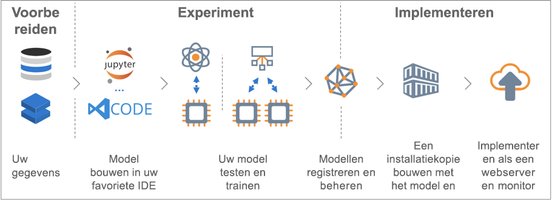

# Wat is de Azure Machine Learning-service?

Azure Machine Learning Service is een cloudservice waarmee u Machine Learning-modellen kunt trainen, implementeren, automatiseren en beheren, en dit allemaal op de grote schaal van de cloud.

## Wat is machine learning?

Machine learning is een techniek van gegevenswetenschap die computers in staat stelt om op basis van bestaande gegevens, toekomstig gedrag, resultaten en trends te voorspellen. Met behulp van machine learning kunnen computers leren zonder dat ze expliciet worden geprogrammeerd.

Prognoses of voorspellingen op basis van machine learning kunnen apps en apparaten slimmer maken. Wanneer u bijvoorbeeld online winkelt, helpt machine learning op basis van wat u eerder hebt gekocht, bij het aanraden van andere producten waarvoor u mogelijk belangstelling hebt. Of wanneer uw creditcard wordt gebruikt, vergelijkt machine learning de transactie met een database van transacties om fraude te detecteren. En wanneer uw robotstofzuiger een kamer stofzuigt, helpt machine learning bij het besluiten wanneer de taak klaar is.

## Wat is de Azure Machine Learning-service?

Azure Machine Learning Service biedt een omgeving in de cloud die u kunt gebruiken om machine learning-modellen te trainen, testen, implementeren, beheren en volgen en er gegevens voor voor te bereiden.

[] (./media/overview-what-is-azure-ml/aml.png#lightbox)

Azure Machine Learning Service biedt volledige ondersteuning voor open-sourcetechnologieën. U kunt tienduizenden open source Python-pakketten met elementen van machine learning gebruiken. Voorbeelden zijn PyTorch, TensorFlow en scikit-learn.
Dankzij de ondersteuning voor uitgebreide programma’s kunt u eenvoudig interactief gegevens verkennen en voorbereiden en vervolgens modellen ontwikkelen en testen. Voorbeelden zijn [Jupyter-notebooks](http://jupyter.org) of de extensie [Azure Machine Learning voor Visual Studio Code](https://marketplace.visualstudio.com/items?itemName=ms-toolsai.vscode-ai#overview).
Azure Machine Learning-service omvat ook functies die [modelgeneratie automatiseren en afstemmen](tutorial-auto-train-models.md)om u te helpen met gemak, efficiënt en nauwkeurig modellen te maken.

Met Azure Machine Learning Service kunt u op uw lokale machine beginnen met trainen en dan opschalen naar de cloud. Dankzij de vele beschikbare [rekendoelen](how-to-set-up-training-targets.md) zoals Azure Machine Learning Compute en [Azure Databricks](/azure/azure-databricks/what-is-azure-databricks), en [geavanceerde afstemmingsservices van hyperparameters](how-to-tune-hyperparameters.md), kunt u sneller betere modellen bouwen, met de kracht van de cloud.

Al u het juiste model hebt, kunt u het eenvoudig implementeren in een container zoals Docker. U kunt dus eenvoudig implementeren naar Azure Container Instances of Azure Kubernetes Service. Of gebruik de container in uw eigen implementaties, ofwel on-premises of in de cloud. Zie het artikel [Hoe implementeren en waar](how-to-deploy-and-where.md) voor meer informatie.

U kunt de geïmplementeerde modellen beheren en meerdere uitvoeringen volgen terwijl u experimenteert om de beste oplossing te vinden.
Zodra uw model is geïmplementeerd, kunnen hiermee in [realtime](how-to-consume-web-service.md) of [asynchroon](how-to-run-batch-predictions.md) voorspellingen worden geretourneerd voor grote hoeveelheden gegevens.

En met geavanceerde [machine learning-pijplijnen](concept-ml-pipelines.md) kunt u samenwerken aan alle stappen van de gegevensvoorbereiding, modeltraining en -evaluatie, en implementatie.

## Wat kan ik doen met de Azure Machine Learning-service?

Met de <a href="https://aka.ms/aml-sdk" target="_blank">voornaamste SDK voor Python</a> en de <a href="https://aka.ms/data-prep-sdk" target="_blank">Data Prep SDK</a> voor Azure Machine Learning kunt u samen met open source Python-pakketten uiterst nauwkeurige machine learning- en deep learning-modellen bouwen en trainen in een Azure Machine Learning Service-werkruimte.
U kunt kiezen uit veel machine learning-onderdelen die beschikbaar zijn in open-source Python-pakketten, zoals de volgende voorbeelden:

- <a href="https://scikit-learn.org/stable/" target="_blank">Scikit-learn</a>
- <a href="https://www.tensorflow.org" target="_blank">Tensorflow</a>
- <a href="https://pytorch.org" target="_blank">PyTorch</a>
- <a href="https://www.microsoft.com/en-us/cognitive-toolkit/" target="_blank">CNTK</a>
- <a href="http://mxnet.io" target="_blank">MXNet</a>

Met Azure Machine Learning Service kunt u ook een model automatisch trainen en op uw behoeften laten afstemmen.
Zie bijvoorbeeld [Een regressiemodel trainen met geautomatiseerde machine learning](tutorial-auto-train-models.md).

Zodra u een model hebt, kunt u het gebruiken om een container (zoals Docker) te maken die lokaal kan worden geïmplementeerd voor testdoeleinden. Zodra het testen is voltooid, kunt u het model als een productiewebservice implementeren in Azure Container Instances of Azure Kubernetes Service. Zie het artikel [Hoe implementeren en waar](how-to-deploy-and-where.md) voor meer informatie.

Daarna kunt u uw geïmplementeerde modellen beheren met de [Azure Machine Learning SDK voor Python](https://aka.ms/aml-sdk) of [Azure Portal](https://portal.azure.com/).
U kunt de metrische gegevens van een model evalueren, nieuwe versies van het model opnieuw trainen en implementeren en dat allemaal terwijl u de experimenten van het model volgt.

Bekijk [Volgende stappen](#next-steps) om te beginnen met de Azure Machine Learning-service.

## Waarin verschilt Azure Machine Learning Service van Machine Learning Studio?

[Azure Machine Learning Studio](../studio/what-is-ml-studio.md) is een visuele werkruimte voor samenwerking met slepen en neerzetten waar u machine learning-oplossingen kunt bouwen, testen en implementeren zonder dat u code hoeft te programmeren. Er wordt gebruikgemaakt van vooraf gebouwde en geconfigureerde machine learning-algoritmen en modules voor gegevensverwerking.

Gebruik Machine Learning Studio wanneer u snel en eenvoudig wilt experimenteren met machine learning-modellen en de ingebouwde machine learning-algoritmen voldoende zijn voor uw oplossingen.

Gebruik Machine Learning-service als u werkt in een Python-omgeving, u meer controle wenst over uw machine learning-algoritmen of als u open-source machine learning-bibliotheken wilt gebruiken.

> [!NOTE]
> Modellen die zijn gemaakt in Azure Machine Learning Studio kunnen niet worden geïmplementeerd of beheerd door Azure Machine Learning Service.

## Gratis proefversie

Als u nog geen Azure-abonnement hebt, maakt u een gratis account voordat u begint. Probeer nog vandaag de [gratis of betaalde versie van de Azure Machine Learning-service](http://aka.ms/AMLFree).

U ontvangt tegoed wat u kunt uitgeven aan Azure-services. Als uw tegoed op is, kunt u het account behouden en de [gratis Azure-services](https://azure.microsoft.com/free/) gebruiken. Er worden nooit kosten in rekening gebracht bij uw creditcard tenzij u de instellingen expliciet wijzigt en aangeeft dat u wilt betalen. U kunt ook [de voordelen voor MSDN-abonnees activeren](https://azure.microsoft.com/pricing/member-offers/msdn-benefits-details/?WT.mc_id=A261C142F), waardoor u maandelijks tegoeden krijgt die u kunt gebruiken voor betaalde Azure-services.

## Volgende stappen

- Maak een werkruimte voor Machine Learning service om aan de slag te gaan [met de Azure-portal](quickstart-get-started.md) (zonder installatie) of [in Python](quickstart-create-workspace-with-python.md) (met installatie van de SDK).

- Volg de volledige zelfstudies: 
  + [Een model voor de classificatie van afbeeldingen trainen met de Azure Machine Learning Service](tutorial-train-models-with-aml.md) 
  + [Gegevens voorbereiden en geautomatiseerde machine learning gebruiken om een regressiemodel automatisch te trainen](tutorial-data-prep.md)
  
- Gebruik de [Azure Machine Learning Data Prep SDK](https://aka.ms/data-prep-sdk) om uw gegevens voor te bereiden.

- Leer meer over [Machine Learning-pijplijnen](/azure/machine-learning/service/concept-ml-pipelines) om uw Machine Learning-scenario’s te bouwen, te optimaliseren en te beheren.

- Lees het gedetailleerde artikel [Azure Machine Learning service architecture and concepts](concept-azure-machine-learning-architecture.md) (Architectuur en begrippen van de Azure Machine Learning-service).

- Raadpleeg [andere machine learning-producten van Microsoft](./overview-more-machine-learning.md) voor meer informatie.
