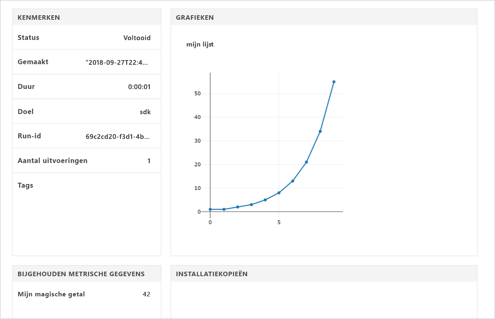

# <a name="quickstart-use-the-python-sdk-to-get-started-with-azure-machine-learning"></a>Quickstart: de Python-SDK gebruiken om aan de slag te gaan met Azure Machine Learning

In dit artikel gebruikt u de Azure Machine Learning SDK voor Python 3 om een [werkruimte](concept-azure-machine-learning-architecture.md) voor de Azure Machine Learning Service te maken en te gebruiken. De werkruimte is het basisblok in de cloud dat u gebruikt voor het experimenteren met en trainen en implementeren van machine learning-modellen met Machine Learning.

U begint met het configureren van uw eigen Python-omgeving en Jupyter Notebook-server. Als u zonder installatie aan de slag wilt, ziet u [Snelstart: Azure Portal gebruiken om aan de slag te gaan met Azure Machine Learning](quickstart-get-started.md). 

Een videoversie van deze quickstart bekijken:

> [!VIDEO https://www.microsoft.com/en-us/videoplayer/embed/RE2G9N6]

In deze snelstart, gaat u het volgende doen:

* De Python-SDK installeren.
* Een werkruimte maken in uw Azure-abonnement.
* Een configuratiebestand voor die werkruimte maken voor later gebruik in andere notitieblokken en scripts.
* Code schrijven om waarden te schrijven in de werkruimte
* De vastgelegde waarden in uw werkruimte weergeven.

U maakt een werkruimte en een configuratiebestand om te gebruiken als vereisten voor andere Azure Machine Learning-zelfstudies en artikelen met procedures. Net als bij andere Azure-services gelden er bepaalde limieten en quota voor Machine Learning. [Meer informatie over quota's en hoe u meer kunt aanvragen.](how-to-manage-quotas.md)

De volgende Azure-resources worden automatisch toegevoegd aan uw werkruimte wanneer deze regionaal beschikbaar zijn:
 
- [Azure Container Registry](https://azure.microsoft.com/services/container-registry/)
- [Azure Storage](https://azure.microsoft.com/services/storage/)
- [Azure Application Insights](https://azure.microsoft.com/services/application-insights/) 
- [Azure Key Vault](https://azure.microsoft.com/services/key-vault/)

>[!NOTE]
> Voor de code in dit artikel is Azure Machine Learning SDK-versie 1.0.2 of hoger vereist. De code is getest met versie 1.0.8.


Als u nog geen Azure-abonnement hebt, maakt u een gratis account voordat u begint. Probeer nog vandaag de [gratis of betaalde versie van de Azure Machine Learning Service](http://aka.ms/AMLFree).

## <a name="install-the-sdk"></a>De SDK installeren

> [!IMPORTANT]
> Sla deze sectie over als u Azure Data Science Virtual Machine of Azure Databricks gebruikt.
> * Op Data Science Virtual Machines die zijn gemaakt na 27 september 2018 is de Python SDK al geïnstalleerd.
> * Gebruik in de Azure Databricks-omgeving in plaats daarvan de [Databricks-installatiestappen](how-to-configure-environment.md#azure-databricks).

Voordat u de SDK installeert, raden we u aan om een geïsoleerde omgeving voor Python te maken. In dit artikel wordt [Miniconda](https://docs.conda.io/en/latest/miniconda.html) gebruikt, maar u kunt ook gebruikmaken van volledig geïnstalleerde [Anaconda](https://www.anaconda.com/) of [Python virtualenv](https://virtualenv.pypa.io/en/stable/).

### <a name="install-miniconda"></a>Miniconda installeren

[Download en installeer Miniconda](https://docs.conda.io/en/latest/miniconda.html). Selecteer Python versie 3.7 of een latere versie om te installeren. Selecteer niet Python 2.x.  

### <a name="create-an-isolated-python-environment"></a>Een geïsoleerde omgeving voor Python maken

1. Open een opdrachtregelvenster, maak een nieuwe conda-omgeving met de naam *myenv* en installeer Python 3.6. Azure Machine Learning SDK werkt met Python 3.5.2 of hoger, maar de geautomatiseerde Machine Learning-onderdelen zijn niet volledig functioneel in Python 3.7.

    ```shell
    conda create -n myenv -y Python=3.6
    ```

1. Activeer de omgeving.

    ```shell
    conda activate myenv
    ```

### <a name="install-the-sdk"></a>De SDK installeren

1. Installeer de kernonderdelen van de Machine Learning SDK met Jupyter-notebookmogelijkheden in de geactiveerde conda-omgeving.  Afhankelijk van de configuratie van de computer duurt het enkele minuten voordat de installatie is voltooid.

  ```shell
    pip install --upgrade azureml-sdk[notebooks]
    ```

1. Installeer een Jupyter Notebook-server in de conda-omgeving.

  ```shell
    conda install -y nb_conda
    ```

1. Installeer deze pakketten als u deze omgeving wilt gebruiken voor de zelfstudies van Azure Machine Learning.

    ```shell
    conda install -y cython matplotlib pandas
    ```

1. Installeer de geautomatiseerde Machine Learning-onderdelen als u deze omgeving wilt gebruiken voor de zelfstudies van Azure Machine Learning.

    ```shell
    pip install --upgrade azureml-sdk[automl]
    ```

## <a name="create-a-workspace"></a>Een werkruimte maken

Maak uw werkruimte in een Jupyter Notebook met behulp van de Python SDK.

1. Maak en/of schakel naar de map die u wilt gebruiken voor de quickstart en zelfstudies.

1. Als u Jupyter Notebook wilt starten, voert u de volgende opdracht in:

    ```shell
    jupyter notebook
    ```

1. Maak een nieuw notitieblok met behulp van de standaard-`Python 3`-kernel in het browservenster. 

1. Geef de SDK-versie weer door de volgende Python-code in een notitieblokcel te typen en uit te voeren:

   [!code-python[](~/aml-sdk-samples/ignore/doc-qa/quickstart-create-workspace-with-python/quickstart.py?name=import)]

1. Zoek een waarde voor de `<azure-subscription-id>`-parameter in de [-abonnementenlijst in Azure Portal](https://ms.portal.azure.com/#blade/Microsoft_Azure_Billing/SubscriptionsBlade). U kunt elk abonnement gebruiken waarvoor u de rol eigenaar of bijdrager hebt.

   ```python
   from azureml.core import Workspace
   ws = Workspace.create(name='myworkspace',
                         subscription_id='<azure-subscription-id>', 
                         resource_group='myresourcegroup',
                         create_resource_group=True,
                         location='eastus2' 
                        )
   ```

   Als u de code uitvoert, wordt u mogelijk gevraagd u aan te melden bij uw Azure-account. Nadat u zich hebt aangemeld, wordt het verificatietoken opgeslagen in de lokale cache.

1. U kunt de details van de werkruimte, zoals de bijbehorende opslag, containerregister en sleutelkluis, weergeven door de volgende code in te voeren:

    [!code-python[](~/aml-sdk-samples/ignore/doc-qa/quickstart-create-workspace-with-python/quickstart.py?name=getDetails)]


## <a name="write-a-configuration-file"></a>Een configuratiebestand schrijven

Sla de details van uw werkruimte in een configuratiebestand op in de huidige map. Dit bestand heet *aml_config\config.json*.  

Dit configuratiebestand van de werkruimte maakt het eenvoudig om dezelfde werkruimte later te laden. U kunt het samen met andere notitieblokken en scripts in dezelfde map of submap laden.  

[!code-python[](~/aml-sdk-samples/ignore/doc-qa/quickstart-create-workspace-with-python/quickstart.py?name=writeConfig)]

Door deze `write_config()`-API aan te roepen, wordt het configuratiebestand in de huidige map gemaakt. Het bestand *config.json* bevat het volgende:

```json
{
    "subscription_id": "<azure-subscription-id>",
    "resource_group": "myresourcegroup",
    "workspace_name": "myworkspace"
}
```

## <a name="use-the-workspace"></a>De werkruimte gebruiken

Voer code uit die gebruikmaakt van de basis-API's van de SDK om experimentele uitvoeringen te volgen:

1. Maak een experiment in de werkruimte.
1. Leg één waarde vast in het experiment.
1. Leg een lijst met waarden vast in het experiment.

[!code-python[](~/aml-sdk-samples/ignore/doc-qa/quickstart-create-workspace-with-python/quickstart.py?name=useWs)]

## <a name="view-logged-results"></a>Vastgelegde resultaten weergeven
Wanneer de uitvoering is voltooid, kunt u de experimentele uitvoering weergeven in de Azure-portal. Gebruik de volgende code om een URL naar de resultaten van de laatste uitvoering af te drukken:

```python
print(run.get_portal_url())
```

Gebruik de koppeling om de vastgelegde waarden in Azure Portal weer te geven in uw browser.



## <a name="clean-up-resources"></a>Resources opschonen 
>[!IMPORTANT]
>De resources die u hier hebt gemaakt, kunnen worden gebruikt als basisvereisten voor andere Machine Learning-zelfstudies en artikelen met procedures.

Als u niet van plan bent om de resources te gebruiken die u in dit artikel hebt gemaakt, verwijdert u deze om te voorkomen dat er kosten in rekening worden gebracht.

[!code-python[](~/aml-sdk-samples/ignore/doc-qa/quickstart-create-workspace-with-python/quickstart.py?name=delete)]

## <a name="next-steps"></a>Volgende stappen

In dit artikel hebt u de resources gemaakt die u nodig hebt om mee te experimenteren en om modellen te implementeren. U hebt code in een notebook uitgevoerd en de uitvoeringsgeschiedenis voor de code in uw werkruimte in de cloud onderzocht.

> [!div class="nextstepaction"]
> [Zelfstudie: Een model trainen voor de classificatie van afbeeldingen](tutorial-train-models-with-aml.md)

U kunt ook [meer geavanceerde voorbeelden op GitHub](https://aka.ms/aml-notebooks) verkennen.
