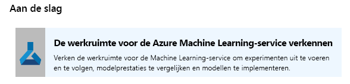
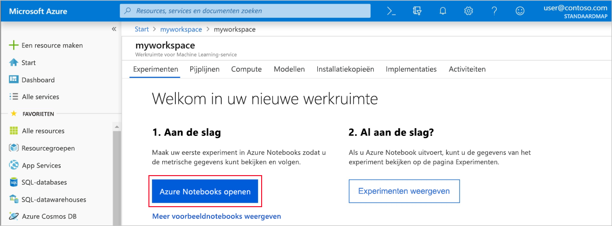
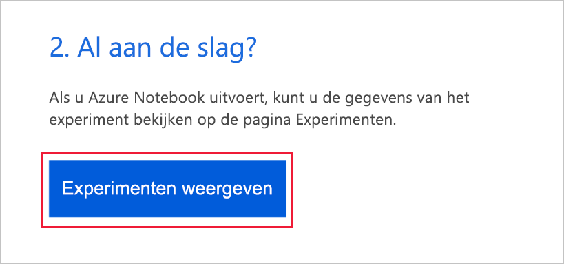
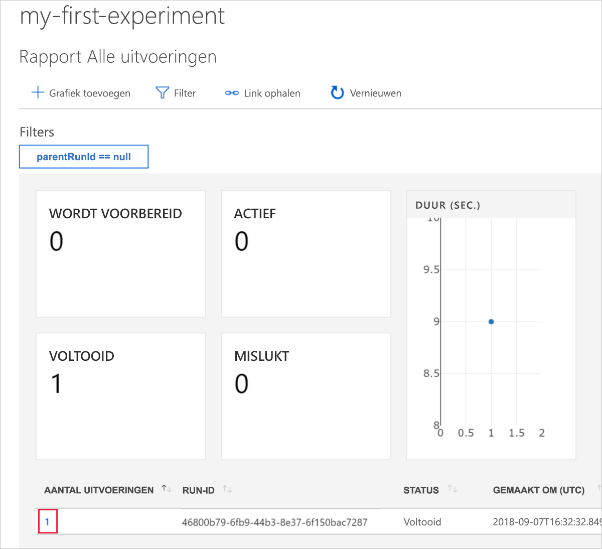
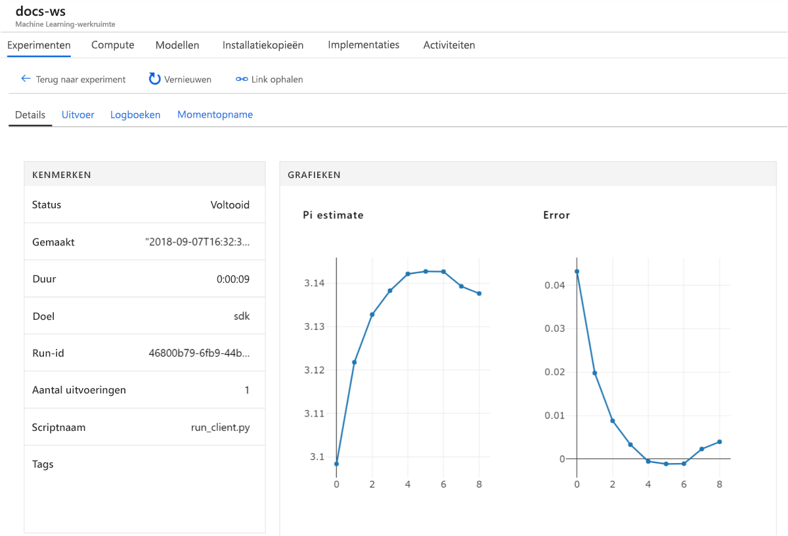

# Snelstart: de Azure-portal gebruiken om aan de slag te gaan met Azure Machine Learning

In deze snelstart leert u de Azure-portal te gebruiken om een Azure Machine Learning-werkruimte te maken. Deze werkruimte is het basisblok in de cloud dat u gebruikt voor het experimenteren met en trainen en implementeren van machine learning-modellen met Machine Learning. In deze snelstart wordt gebruikgemaakt van cloudresources en er is geen installatie vereist. Zie [Snelstart: Python gebruiken om aan de slag te gaan met Azure Machine Learning](quickstart-create-workspace-with-python.md) voor informatie over het configureren van uw eigen Jupyter-notebook-server in plaats daarvan.

> [!VIDEO https://www.microsoft.com/en-us/videoplayer/embed/RE2F9Ad]

In deze snelstart, gaat u het volgende doen:

* Een werkruimte maken in uw Azure-abonnement.
* Deze uitproberen met Python in een Azure Notebook en waarden vastleggen voor meerdere iteraties.
* De vastgelegde waarden in uw werkruimte weergeven.

De volgende Azure-resources worden automatisch toegevoegd aan uw werkruimte wanneer deze regionaal beschikbaar zijn:

  - [Azure Container Registry](https://azure.microsoft.com/services/container-registry/)
  - [Azure Storage](https://azure.microsoft.com/services/storage/)
  - [Azure Application Insights](https://azure.microsoft.com/services/application-insights/) 
  - [Azure Key Vault](https://azure.microsoft.com/services/key-vault/)

De resources die u hebt gemaakt, kunnen worden gebruikt als vereisten voor andere zelfstudies en artikelen met procedures voor de Machine Learning-service. Net als bij andere Azure-services gelden er limieten voor bepaalde resources die zijn gekoppeld aan Machine Learning. Een voorbeeld is de Azure Batch AI-clustergrootte. Zie [dit artikel](how-to-manage-quotas.md) voor meer informatie over standaardlimieten en hoe u de quota kunt verhogen.

Als u nog geen abonnement op Azure hebt, maakt u een [gratis account](https://aka.ms/AMLfree) aan voordat u begint.

## Een werkruimte maken 

[!INCLUDE [aml-create-portal](../../../includes/aml-create-in-portal.md)]

Klik op de pagina van de werkruimte op `Explore your Azure Machine Learning service workspace`.

 

## De werkruimte gebruiken

Nu ziet u hoe u een werkruimte u helpt uw machine learning-scripts te beheren. In deze sectie doet u het volgende:

* Een notitieblok openen in Azure Notebooks.
* Code uitvoeren die enkele vastgelegde waarden maakt.
* De vastgelegde waarden in uw werkruimte weergeven.

Dit is een voorbeeld van hoe de werkruimte u kan helpen bij het bijhouden van informatie die in een script wordt gegenereerd. 

### Een notitieblok openen 

Azure Notebooks biedt een gratis cloudplatform voor Jupyter-notebooks, vooraf geconfigureerd met alles wat u nodig hebt om de Machine Learning uit te voeren.  

Selecteer `Open Azure Notebooks` om uw eerste experiment uit te voeren.

 

Mogelijk moet in uw organisatie [beheerderstoestemming](https://notebooks.azure.com/help/signing-up/work-or-school-account/admin-consent) worden verkregen voordat u zich kunt aanmelden.

Nadat u zich hebt aangemeld, wordt er een nieuw tabblad geopend en wordt er een `Clone Library`-prompt weergegeven. Selecteer `Clone`

### Het notitieblok uitvoeren

U ziet twee notitieblokken en een `config.json`-bestand. Dit configuratiebestand bevat informatie over de werkruimte die u hebt gemaakt.  

Klik op `01.run-experiment.ipynb` om het notitieblok te openen.

U kunt de cellen één voor één uitvoeren met `Shift`+`Enter`. U kunt ook `Cells` > `Run All` selecteren om het hele notitieblok uit te voeren. Als er een sterretje [*] naast een cel staat, wordt deze uitgevoerd. Wanneer de code voor die cel is voltooid, verschijnt er een getal. 

Nadat u de uitvoering van alle cellen in de notebook hebt voltooid, kunt u de vastgelegde waarden weergeven in uw werkruimte.

## Logboekwaarden weergeven

Nadat alle cellen in het notitieblok zijn uitgevoerd, gaat u terug naar de portalpagina.  

Selecteer `View Experiments`.

Sluit het pop-upvenster `Reports`.

Selecteer `my-first-experiment`.

Bekijk de informatie over de uitvoering die u zojuist hebt uitgevoerd. Schuif omlaag op de pagina om de tabel met uitvoeringen te zoeken. Selecteer de koppeling bij het uitvoeringsnummer.

 

U ziet plots die automatisch zijn gemaakt van de vastgelegde waarden. Wanneer u meerdere waarden met dezelfde naamparameter vastlegt, wordt automatisch een grafiek voor u gegenereerd.

   

Omdat er in de code om pi te schatten gebruik wordt gemaakt van willekeurige waarden, worden er in uw plots andere waarden weergegeven.  

## Resources opschonen 

[!INCLUDE [aml-delete-resource-group](../../../includes/aml-delete-resource-group.md)]

U kunt de resourcegroep ook bewaren en slechts één werkruimte verwijderen. Bekijk de eigenschappen van de werkruimte en selecteer **Verwijderen**.

## Volgende stappen

U hebt de resources gemaakt die u nodig hebt om mee te experimenteren en om modellen te implementeren. U hebt ook code uitgevoerd in een notitieblok. U hebt ook de uitvoeringsgeschiedenis van die code in uw werkruimte in de cloud onderzocht.

Voor een diepgaande werkstroomervaring volgt u de zelfstudies over Machine Learning om een ​​model te trainen en te implementeren.  

> [!div class="nextstepaction"]
> [Zelfstudie: een model voor de classificatie van afbeeldingen trainen](tutorial-train-models-with-aml.md)
