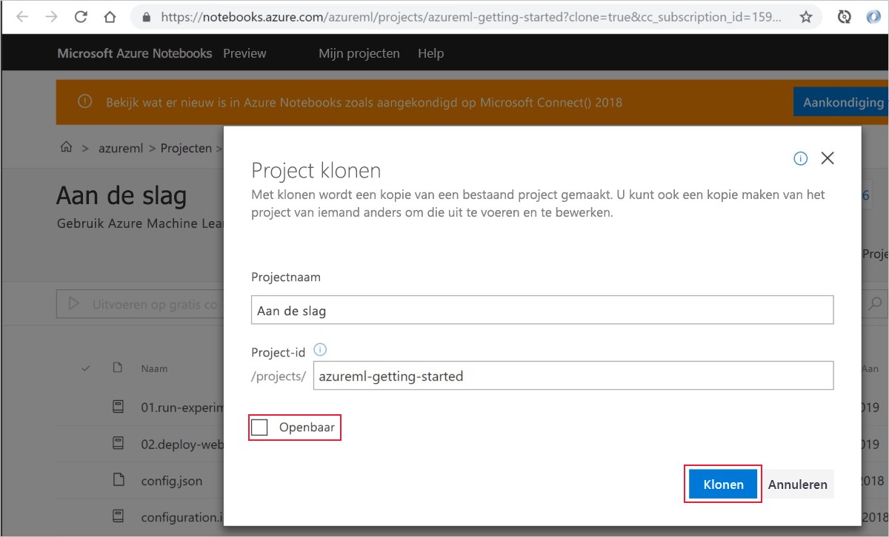
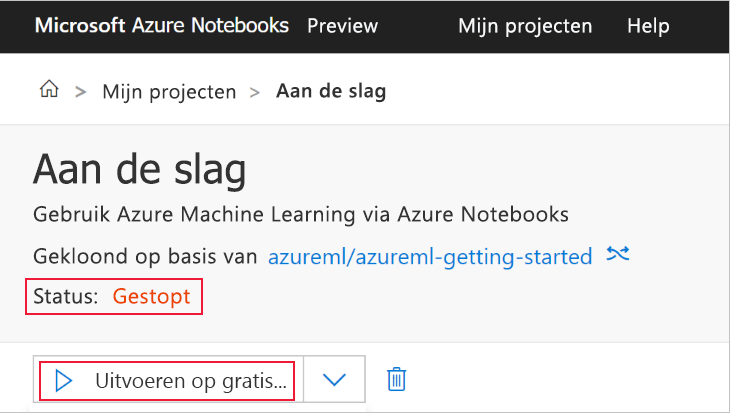
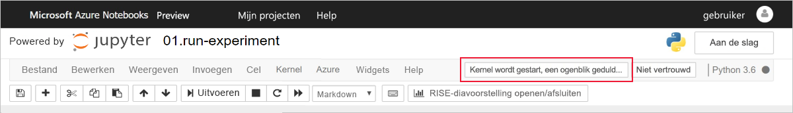
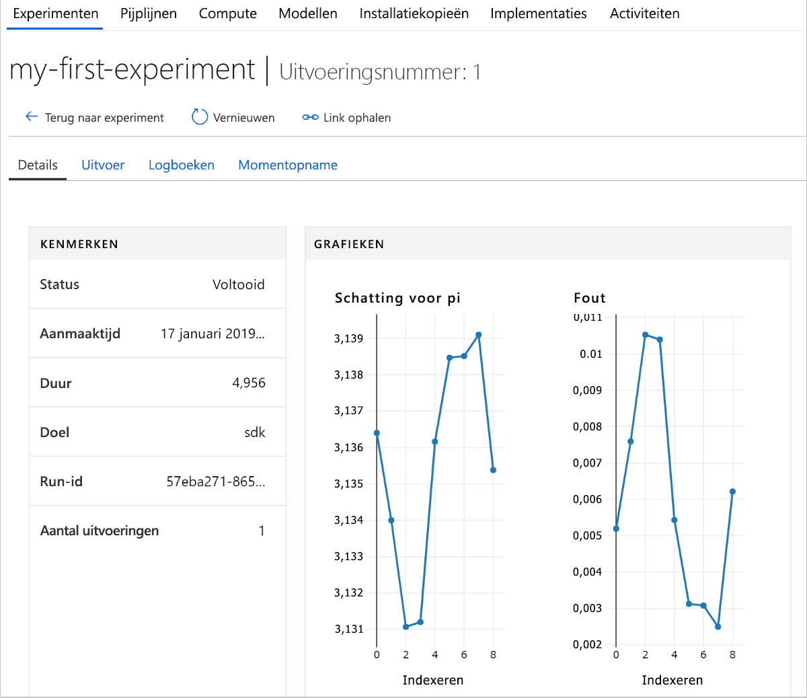

# Snelstart: Azure Portal gebruiken om aan de slag te gaan met Azure Machine Learning

Gebruik de Azure-portal om een Azure Machine Learning-werkruimte te maken. Deze werkruimte is het basisblok in de cloud dat u gebruikt voor het experimenteren met en trainen en implementeren van machine learning-modellen met Machine Learning. In deze snelstart wordt gebruikgemaakt van cloudresources en er is geen installatie vereist. Als u in plaats daarvan uw eigen Jupyter Notebook-server wilt configureren, ziet u [Snelstart: Python gebruiken om aan de slag te gaan met Azure Machine Learning](quickstart-create-workspace-with-python.md).  
 
In deze snelstart voert u de volgende acties uit:

* Een werkruimte maken in uw Azure-abonnement.
* Deze proberen met Python in een Jupyter-notebook en waarden vastleggen voor meerdere iteraties.
* De vastgelegde waarden in uw werkruimte weergeven.

De volgende Azure-resources worden automatisch toegevoegd aan uw werkruimte wanneer deze regionaal beschikbaar zijn:

  - [Azure Container Registry](https://azure.microsoft.com/services/container-registry/)
  - [Azure Storage](https://azure.microsoft.com/services/storage/)
  - [Azure Application Insights](https://azure.microsoft.com/services/application-insights/) 
  - [Azure Key Vault](https://azure.microsoft.com/services/key-vault/)

De resources die u hebt gemaakt, kunnen worden gebruikt als vereisten voor andere zelfstudies en artikelen met procedures voor de Machine Learning-service. Net als bij andere Azure-services gelden er limieten voor bepaalde resources die zijn gekoppeld aan Machine Learning. Een voorbeeld is de grootte van het rekencluster. Lees meer over [de standaardlimieten en hoe u uw quotum kunt vergroten](how-to-manage-quotas.md).

Als u nog geen Azure-abonnement hebt, maakt u een gratis account voordat u begint. Probeer nog vandaag de [gratis of betaalde versie van de Azure Machine Learning Service](http://aka.ms/AMLFree).

## Een werkruimte maken 

[!INCLUDE [aml-create-portal](../../../includes/aml-create-in-portal.md)]

## De werkruimte gebruiken

> [!VIDEO https://www.microsoft.com/en-us/videoplayer/embed/RE2F9Ad]

U gaat nu leren hoe een werkruimte u helpt uw machine learning-scripts te beheren. In deze sectie voert u de volgende stappen uit:

* Een notitieblok openen in Azure Notebooks.
* Code uitvoeren die enkele vastgelegde waarden maakt.
* De vastgelegde waarden in uw werkruimte weergeven.

Dit is een voorbeeld van hoe de werkruimte u kan helpen bij het bijhouden van informatie die in een script wordt gegenereerd. 

### Een notitieblok openen 

[Azure Notebooks](https://notebooks.azure.com) biedt een gratis cloudplatform voor Jupyter-notebooks dat vooraf is geconfigureerd met alles wat u nodig hebt om Machine Learning uit te voeren. U kunt dit platform vanuit uw werkruimte starten om aan de slag te gaan met uw werkruimte voor Azure Machine Learning Service.

1. Selecteer **De werkruimte voor de Azure Machine Learning Service verkennen** op de pagina met de werkruimte.

 

1. Selecteer **Azure Notebooks openen** om uw eerste experiment in Azure Notebooks uit te voeren.  Azure Notebooks is een afzonderlijke service waarmee u Jupyter-notebooks gratis kunt uitvoeren in de cloud.  Wanneer u deze koppeling naar de service gebruikt, wordt informatie over hoe u verbinding maakt met uw werkruimte toegevoegd aan de bibliotheek die u in Azure Notebooks maakt.

 

1. Meld u aan bij Azure Notebooks.  Meld u aan met hetzelfde account dat u hebt gebruikt om u aan te melden bij de Microsoft Azure-portal. Mogelijk moet in uw organisatie [beheerderstoestemming](https://notebooks.azure.com/help/signing-up/work-or-school-account/admin-consent) worden verkregen voordat u zich kunt aanmelden.

1. Nadat u zich hebt aangemeld, wordt er een nieuw tabblad geopend en wordt er een `Clone Library`-prompt weergegeven. Wanneer u deze bibliotheek kloont, wordt een verzameling notebooks en andere bestanden in uw Azure Notebooks-account geladen.  Met deze bestanden kunt u de mogelijkheden van Azure Machine Learning verkennen.

1. Schakel het selectievakje **Openbaar** uit zodat u uw werkruimtegegevens niet met anderen deelt.

1. Selecteer **Klonen**.

 

1. Als u ziet dat de projectstatus is gestopt, klikt u op **Uitvoeren op gratis Compute** om de gratis notebookserver te gebruiken.

    

### Het notitieblok uitvoeren

In de lijst met bestanden voor dit project, ziet u het bestand `config.json`. Dit configuratiebestand bevat informatie over de werkruimte die u hebt gemaakt in de Microsoft Azure-portal.  Met dit bestand kan uw code verbinding maken met en gegevens toevoegen aan uw werkruimte.

1. Selecteer **01.run experiment.ipynb** om het notebook te openen.

1. In het statusgebied ziet u een melding dat u moet wachten tot de kernel is gestart.  Zodra de kernel gereed is, verdwijnt het bericht.

    

1. Nadat de kernel is gestart, voert u de cellen één voor één uit met behulp van **Shift + Enter**. U kunt ook **Cellen** > **Alles uitvoeren** selecteren om het hele notebook uit te voeren. Als er een sterretje, __*__, naast een cel staat, wordt de cel nog uitgevoerd. Wanneer de code voor die cel is voltooid, verschijnt er een getal. 

1. Volg de instructies in het notebook om uw Azure-abonnement te verifiëren.

Nadat u de uitvoering van alle cellen in de notebook hebt voltooid, kunt u de vastgelegde waarden weergeven in uw werkruimte.

## Logboekwaarden weergeven

1. De uitvoer van de cel `run` bevat een koppeling terug naar de Microsoft Azure-portal om de resultaten van het experiment in uw werkruimte weer te geven. 

    

1. Klik op de **Koppeling naar Azure-portal** om informatie over de uitvoering in uw werkruimte weer te geven.  Met deze koppeling wordt uw werkruimte in de Microsoft Azure-portal geopend.

1. De grafieken van vastgelegde waarden die u ziet, zijn automatisch in de werkruimte gemaakt. Wanneer u meerdere waarden met dezelfde naamparameter vastlegt, wordt automatisch een grafiek voor u gegenereerd.

   

Omdat er in de code om pi te schatten gebruik wordt gemaakt van willekeurige waarden, worden er in uw plots andere waarden weergegeven.  

## Resources opschonen 

[!INCLUDE [aml-delete-resource-group](../../../includes/aml-delete-resource-group.md)]

U kunt de resourcegroep ook bewaren en slechts één werkruimte verwijderen. Bekijk de eigenschappen van de werkruimte en selecteer **Verwijderen**.

## Volgende stappen

U hebt de resources gemaakt die u nodig hebt om mee te experimenteren en om modellen te implementeren. U hebt ook code uitgevoerd in een notitieblok. U hebt ook de uitvoeringsgeschiedenis van die code in uw werkruimte in de cloud onderzocht.

Voor een diepgaande werkstroomervaring volgt u de zelfstudies over Machine Learning om een ​​model te trainen en te implementeren:  

> [!div class="nextstepaction"]
> [Zelfstudie: Een model trainen voor de classificatie van afbeeldingen](tutorial-train-models-with-aml.md)
