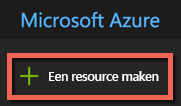
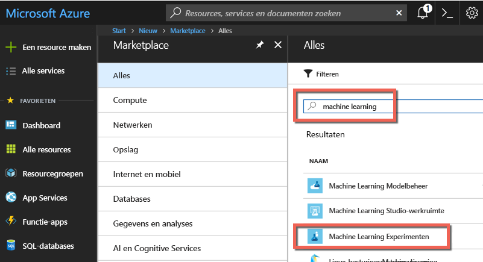
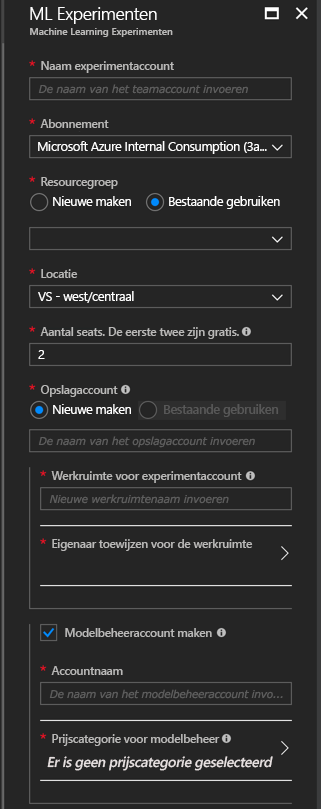
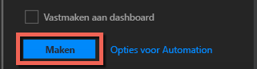
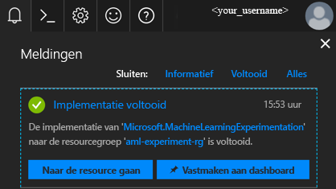
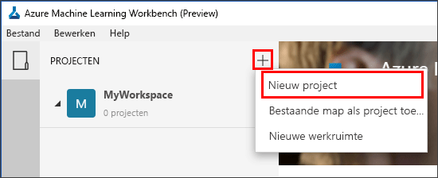
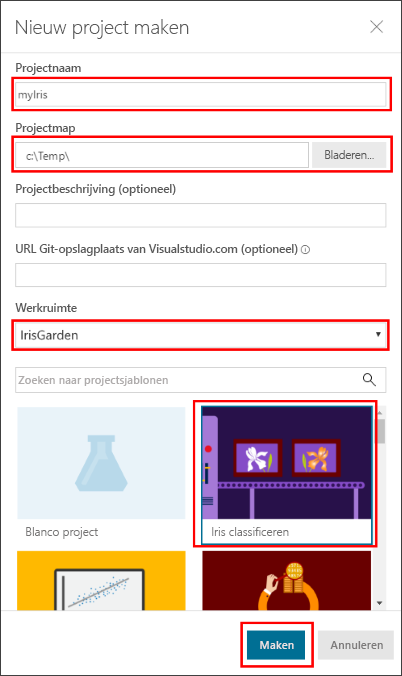
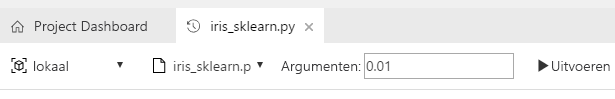
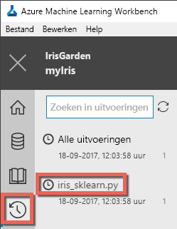
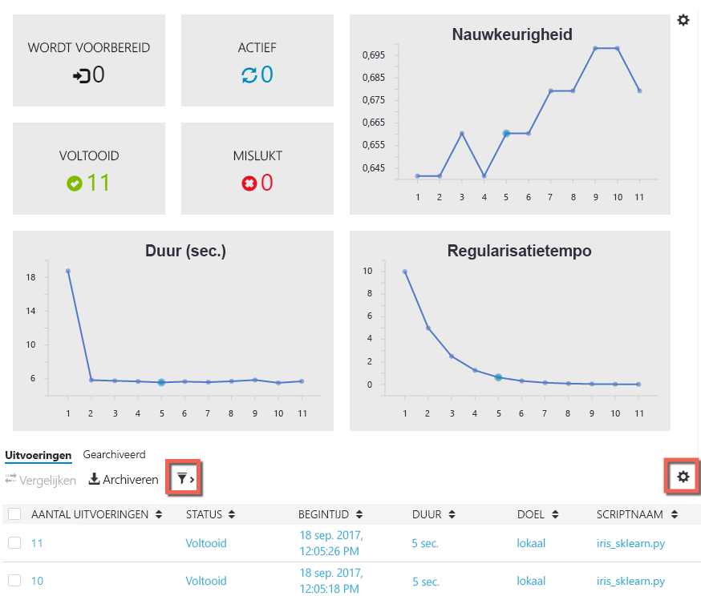

# <a name="quickstart-install-and-get-started-with-azure-machine-learning-services"></a>Snelstart: Azure Machine Learning-services installeren en starten
Azure Machine Learning-services (preview) zijn een geïntegreerde, end-to-end oplossing voor gegevenswetenschap en geavanceerde analyse. Het helpt professionele gegevenswetenschappers gegevens voor te bereiden, experimenten te ontwikkelen en modellen te implementeren op cloudschaal.

In deze snelstartgids leert u het volgende:

* Serviceaccounts maken voor Azure Machine Learning-services
* Azure Machine Learning Workbench installeren en erbij aanmelden.
* Een project maken in Workbench
* Een script in dat project uitvoeren  
* De CLI (opdrachtregelinterface) openen


Azure Machine Learning-services maken deel uit van het portfolio van Microsoft Azure en vereisen een Azure-abonnement. Als u nog geen abonnement op Azure hebt, maak dan een [gratis account](https://azure.microsoft.com/free/?WT.mc_id=A261C142F) aan voordat u begint.

Bovendien moet u voldoende machtigingen hebben om activa zoals resourcegroepen en virtuele machines te maken. 

<a name="prerequisites"></a>U kunt de Azure Machine Learning Workbench-toepassing op de volgende besturingssystemen installeren:
- Windows 10 of Windows Server 2016
- macOS Sierra of High Sierra

## <a name="create-azure-machine-learning-services-accounts"></a>Serviceaccounts maken voor Azure Machine Learning
Gebruik Azure Portal om uw accounts voor Azure Machine Learning in te richten: 
1. Meld u aan bij [Azure portal](https://portal.azure.com/) met de gegevens van het Azure-abonnement dat u gaat gebruiken. Als u nog geen abonnement op Azure hebt, maak dan nu een [gratis account](https://azure.microsoft.com/free/?WT.mc_id=A261C142F). 

   

1. Selecteer de knop **Een resource maken** (+) in de linkerbovenhoek van de portal.

   

1. Voer **Machine Learning** in de zoekbalk in. Selecteer het zoekresultaat met de naam **Machine Learning Experimenten**. 

   

1. Schuif omlaag in het venster **Machine Learning Experimenten** en selecteer **Maken** om te beginnen met het definiëren van uw Experimenten-account.  

   

1. Configureer in het venster **ML Experimenten** uw Machine Learning Experimenten-account. 

   Instelling|Aanbevolen waarde voor zelfstudie|Beschrijving
   ---|---|---
   Naam experimenteeraccount | _Unieke naam_ |Voer een unieke naam in die uw account aanduidt. U kunt uw eigen naam gebruiken, maar ook de naam van een afdeling of project waarmee het experiment is verbonden. De naam moet minimaal 2 en maximaal 32 tekens lang zijn. De naam mag alleen alfanumerieke tekens en streepjes (-) bevatten. 
   Abonnement | _Uw abonnement_ |Kies het Azure-abonnement dat u wilt gebruiken voor het experiment. Als u meerdere abonnementen hebt, kiest u het juiste abonnement waarin de resource wordt gefactureerd.
   Resourcegroep | _Uw resourcegroep_ | Gebruik een bestaande resourcegroep in uw abonnement of voer een naam in om een nieuwe resourcegroep te maken voor dit Experimenten-account. 
   Locatie | _De regio het dichtst bij uw gebruikers_ | Kies de locatie die zich het dichtst bij uw gebruikers en de gegevensresources bevindt.
   Aantal seats | 2 | Voer het aantal seats in. Meer informatie over [de invloed van seats op prijzen](https://azure.microsoft.com/pricing/details/machine-learning/).<br/><br/>Voor deze snelstart hebt u maar twee seats nodig. Seats kunnen naar behoefte worden toegevoegd of verwijderd in Azure Portal.
   Storage-account | _Unieke naam_ | Selecteer **Nieuwe maken** en geef een naam op om een [Azure-opslagaccount](https://docs.microsoft.com/azure/storage/common/storage-quickstart-create-account?tabs=portal) te maken. De naam mag alleen 3 tot 24 alfanumerieke tekens en bevatten. U kunt ook **Bestaande gebruiken** selecteren en een bestaand opslagaccount in de vervolgkeuzelijst kiezen. Het opslagaccount is vereist en wordt gebruikt voor het bewaren van projectartefacten en uitvoeringsgeschiedenisgegevens. 
   Werkruimte voor Experimenten-account | IrisGarden<br/>(naam gebruikt in zelfstudies) | Geef een naam op voor een werkruimte voor dit account. De naam moet minimaal 2 en maximaal 32 tekens lang zijn. De naam mag alleen alfanumerieke tekens en streepjes (-) bevatten. Deze werkruimte bevat de hulpprogramma's die u nodig hebt om experimenten te maken, beheren en publiceren.
   Eigenaar van de werkruimte toewijzen | _Uw account_ | Selecteer uw eigen account als de eigenaar van de werkruimte.
   Modelbeheer-account maken | **controleren** |Maak nu een Modelbeheer-account, zodat deze resource beschikbaar is wanneer u uw modellen als realtime webservices gaat implementeren en beheren. <br/><br/>Hoewel dit optioneel is, raden we aan het Modelbeheer-account tegelijk met het Experimenten-account te maken.
   Accountnaam | _Unieke naam_ | Kies een unieke naam die uw Modelbeheer-account identificeert. U kunt uw eigen naam gebruiken, maar ook de naam van een afdeling of project waarmee het experiment is verbonden. De naam moet minimaal 2 en maximaal 32 tekens lang zijn. De naam mag alleen alfanumerieke tekens en streepjes (-) bevatten. 
   Prijscategorie voor Modelbeheer | **DEVTEST** | Selecteer **Geen prijscategorie geselecteerd** om de prijscategorie voor uw nieuwe Modelbeheer-account op te geven. Selecteer om kosten te besparen de prijscategorie **DEVTEST** als deze beschikbaar is voor uw abonnement (beperkte beschikbaarheid). U kunt ook de prijscategorie S1 selecteren. Klik op **Selecteren** om de geselecteerde prijscategorie op te slaan. 
   Vastmaken aan dashboard | _controleren_ | Selecteer de optie **Vastmaken aan dashboard** om het Azure Machine Learning Experimenten-account gemakkelijk te kunnen bijhouden op de dashboardpagina van Azure Portal.

   

5. Selecteer **Maken** om te beginnen met het proces voor het maken van het Experimenten-account en het Modelbeheer-account.

   

   Het maken van een account kan even duren. U kunt de status van het implementatieproces controleren door op het meldingspictogram (de klok) in de werkbalk van Azure Portal te klikken.
   
   


## <a name="install-and-log-in-to-workbench"></a>Workbench installeren en erbij aanmelden

Azure Machine Learning Workbench is beschikbaar voor Windows of macOS. Overzicht van [ondersteunde platforms](#prerequisites).

>[!WARNING]
>Het installeren kan ongeveer 30 minuten duren. 

1. Download het meest recente Workbench-installatieprogramma en start het. 
   >[!IMPORTANT]
   >Download het installatieprogramma volledig op schijf en voer het daarvandaan uit. Voer het niet rechtstreeks vanuit de downloadwidget van de browser uit.

   **In Windows:** 

   &nbsp;&nbsp;&nbsp;&nbsp;A. Download [AmlWorkbenchSetup.msi](https://aka.ms/azureml-wb-msi).  <br/>
   &nbsp;&nbsp;&nbsp;&nbsp;B. Dubbelklik op het gedownloade installatieprogramma in Verkenner.

   **In macOS:** 

   &nbsp;&nbsp;&nbsp;&nbsp;A. Download [AmlWorkbench.dmg](https://aka.ms/azureml-wb-dmg). <br/>
   &nbsp;&nbsp;&nbsp;&nbsp;B. Dubbelklik op het gedownloade installatieprogramma in de Finder.<br/><br/>

1. Volg de aanwijzingen van het installatieprogramma op het scherm tot de installatie is voltooid. 

   **Het installeren kan ongeveer 30 minuten duren.**  
   
   | |Installatiepad naar Azure Machine Learning Workbench|
   |--------|------------------------------------------------|
   |Windows|C:\Users\\<user\>\AppData\Local\AmlWorkbench|
   |macOS|/Applications/Azure ML Workbench.app|

   Met het installatieprogramma worden alle vereiste afhankelijke onderdelen gedownload en ingesteld, zoals Python, Miniconda en andere gerelateerde bibliotheken. Deze installatie omvat ook het platformoverschrijdende opdrachtregelprogramma van Azure, te weten Azure CLI.

1. Start Workbench door de knop **Workbench starten** in het laatste scherm van het installatieprogramma te selecteren. 

   Als u het installatieprogramma hebt gesloten:
   + In Windows kunt u de Workbench starten met de snelkoppeling **Machine Learning Workbench** op het bureaublad. 
   + Selecteer in macOS **Azure ML Workbench** in Launchpad.

1. Selecteer in het eerste scherm **Aanmelden met Microsoft** voor verificatie bij de Azure Machine Learning Workbench. Gebruik de dezelfde referenties die u in Azure Portal hebt gebruikt om de Experimenten- en Modelbeheer-accounts te maken. 

   Nadat u bent aangemeld, maakt Workbench gebruik van het eerste Experimenten-account dat in uw Azure-abonnementen wordt gevonden en worden alle werkruimten en projecten weergegeven die aan dat account zijn gekoppeld. 

   >[!TIP]
   > U kunt overschakelen naar een ander Experimenten-account met behulp van het pictogram in de linkerbenedenhoek van het toepassingsvenster van Workbench.

## <a name="create-a-project-in-workbench"></a>Een project maken in Workbench

In Azure Machine Learning is een project een logische container voor al het werk dat wordt gedaan om een probleem op te lossen. Het wordt toegewezen aan één map op uw lokale schijf, en u kunt er alle bestanden of submappen aan toevoegen die u wilt. 

Hier maken we een nieuw Workbench-project met behulp van een sjabloon die de [Iris-gegevensset](https://en.wikipedia.org/wiki/Iris_flower_data_set)bevat. De zelfstudies na deze snelstart zijn afhankelijk van deze gegevens om een model te bouwen dat het type iris voorspelt op basis van enkele fysieke kenmerken.  

1. Open Azure Machine Learning Workbench, selecteer het plusteken (+) in het deelvenster **PROJECTEN** en kies **Nieuw project**.  

   

1. Vul de formuliervelden in en selecteer de knop **Maken** om een nieuw project te maken in Workbench.

   Veld|Aanbevolen waarde voor zelfstudie|Beschrijving
   ---|---|---
   Projectnaam | myIris |Voer een unieke naam in die uw account aanduidt. U kunt uw eigen naam gebruiken, maar ook de naam van een afdeling of project waarmee het experiment is verbonden. De naam moet minimaal 2 en maximaal 32 tekens lang zijn. De naam mag alleen alfanumerieke tekens en streepjes (-) bevatten. 
   Projectmap | c:\Temp\ | Selecteer de map waarin het project moet worden gemaakt.
   Projectbeschrijving | _leeg laten_ | Optioneel veld, nuttig voor het beschrijven van de projecten.
   URL van GIT-opslagplaats Visualstudio.com |_leeg laten_ | Optioneel veld. Een project kan eventueel worden gekoppeld aan een Git-opslagplaats in Visual Studio Team Services voor broncodebeheer en samenwerking. [Informatie over het instellen daarvan](../desktop-workbench/using-git-ml-project.md#step-3-set-up-a-machine-learning-project-and-git-repo). 
   Geselecteerde werkruimte | IrisGarden (indien aanwezig) | Kies een werkruimte die u hebt gemaakt voor uw Experimenten-account in Azure Portal. <br/>Als u de snelstart hebt gevolgd, hebt u een werkruimte met de naam IrisGarden. Selecteer anders de werkruimte die u hebt gemaakt bij het maken van uw Experimenten-account, of een andere werkruimte die u wilt gebruiken.
   Projectsjabloon | Iris classificeren | Sjablonen bevatten scripts en gegevens die u kunt gebruiken om het product te verkennen. Deze sjabloon bevat de scripts en gegevens die u nodig hebt voor deze snelstart en andere zelfstudies op deze documentatiesite. 

   
 
 Er wordt een nieuw project gemaakt en het projectdashboard wordt geopend met dat project. U kunt nu de introductiepagina, gegevensbronnen, notitieblokken en broncodebestanden van het project verkennen. 

>[!TIP]
>U kunt Workbench zo configureren dat u met een Python IDE werkt voor een soepele ervaring op het gebied van datawetenschapsontwikkeling. Vervolgens kunt u de IDE gebruiken om met uw project te werken. [Meer informatie](../desktop-workbench/how-to-configure-your-ide.md). 

## <a name="run-a-python-script"></a>Een Python-script uitvoeren

Nu kunt u het script **iris_sklearn.py** op uw lokale computer uitvoeren. Dit script wordt standaard bij de projectsjabloon **Iris classificeren** geleverd. In het script wordt een [logistic regression](https://en.wikipedia.org/wiki/Logistic_regression)-model gemaakt met behulp van de populaire Python [scikit learn](http://scikit-learn.org/stable/index.html)-bibliotheek.

1. In de werkbalk bovenaan de pagina **Projectdashboard** selecteert u **local** als uit te voeren doel en **iris_sklearn.py** als het uit te voeren script. Deze waarden zijn standaard geselecteerd. 

   Het voorbeeld bevat ook andere bestanden die u later kunt bekijken, maar voor deze snelstart zijn we alleen geïnteresseerd in **iris_sklearn.py**. 

   

1. Voer in het tekstvak **Argumenten** **0.01** in. Dit nummer komt overeen met de regularisatiesnelheid en wordt in het script gebruikt om het logistieke regressiemodel te configureren. 

1. Selecteer **Uitvoeren** om de uitvoering van het script op uw computer te starten. De taak **iris_sklearn.py** verschijnt onmiddellijk in het deelvenster **Taken** aan de rechterkant, zodat u de uitvoering van het script kunt volgen.

   Gefeliciteerd. U hebt een Python-script uitgevoerd in Azure Machine Learning Workbench.

1. Herhaal stap 2 en 3 enkele keren met verschillende argumentwaarden van **0,001** tot **10** (bijvoorbeeld tot de tiende macht). Elke uitvoering wordt weergegeven in het deelvenster **Taken**.

1. Controleer de uitvoeringsgeschiedenis door eerst de weergave **Uitvoeringen** te selecteren en vervolgens **iris_sklearn.py** te selecteren in de lijst Uitvoeringen. 

   

   Alle uitvoeringen op **iris_sklearn.py** worden hier weergegeven. In het uitvoeringsgeschiedenisdashboard worden ook de belangrijkste metrische gegevens, een set standaardgrafieken en een lijst met metrische gegevens voor elke uitvoering weergegeven. 

1. U kunt deze weergave aanpassen door de configuraties te sorteren, te filteren en aan te passen met behulp van de tandwiel- en filterpictogrammen.

   

3. Selecteer een voltooide uitvoering in het deelvenster Taken als u een gedetailleerde weergave voor die specifieke uitvoering wilt zien. Details omvatten aanvullende metrische gegevens, de geproduceerde bestanden en andere mogelijk handige logboeken.

## <a name="start-the-cli"></a>De CLI starten

De Azure Machine Learning-opdrachtregelinterface (CLI) is ook geïnstalleerd. Met de CLI-interface kunt u werken met uw Azure Machine Learning-services met behulp van `az`-opdrachten om alle taken uit te voeren die nodig zijn voor een end-to-end gegevenswetenschapwerkstroom. [Meer informatie.](../desktop-workbench/tutorial-iris-azure-cli.md)

U kunt de Azure Machine Learning CLI starten vanaf de werkbalk van de Workbench via **Bestand -> Opdrachtprompt openen**.

U kunt hulp krijgen bij opdrachten in de Azure Machine Learning CLI met het argument --help.

```az ml --help```

## <a name="clean-up-resources"></a>Resources opschonen

[!INCLUDE [aml-delete-resource-group](../../../includes/aml-delete-resource-group.md)]

## <a name="next-steps"></a>Volgende stappen
U hebt nu de nodige Azure Machine Learning-accounts gemaakt en de Azure Machine Learning Workbench-toepassing geïnstalleerd. U hebt ook een project gemaakt, een script uitgevoerd en de uitvoeringsgeschiedenis van het script bekeken.

Voor een uitgebreidere ervaring met deze werkstroom, inclusief het implementeren van een Iris-model als webservice, volgt u de volledige zelfstudie *Iris classificeren*. De zelfstudie bevat gedetailleerde stappen voor [gegevensvoorbereiding](../desktop-workbench/tutorial-classifying-iris-part-1.md), [experimenten](../desktop-workbench/tutorial-classifying-iris-part-2.md) en [modelbeheer](../desktop-workbench/tutorial-classifying-iris-part-3.md). 

> [!div class="nextstepaction"]
> [Zelfstudie: Iris classificeren (deel 1)](../desktop-workbench/tutorial-classifying-iris-part-1.md)

>[!NOTE]
> Hoewel u nu uw modelbeheeraccount hebt gemaakt, is uw omgeving nog niet ingesteld voor het implementeren van webservices. Meer informatie over het instellen van uw [implementatieomgeving](../desktop-workbench/deployment-setup-configuration.md).
