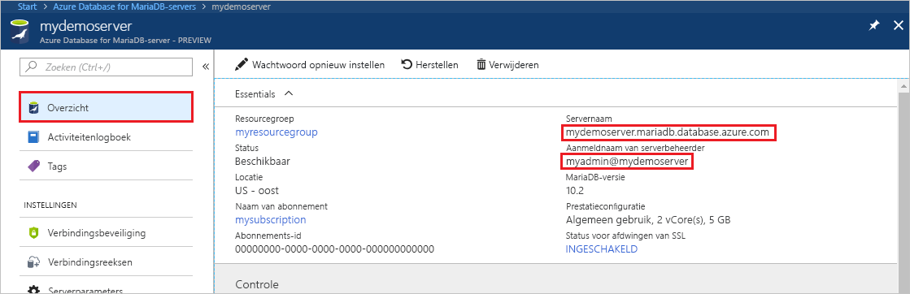
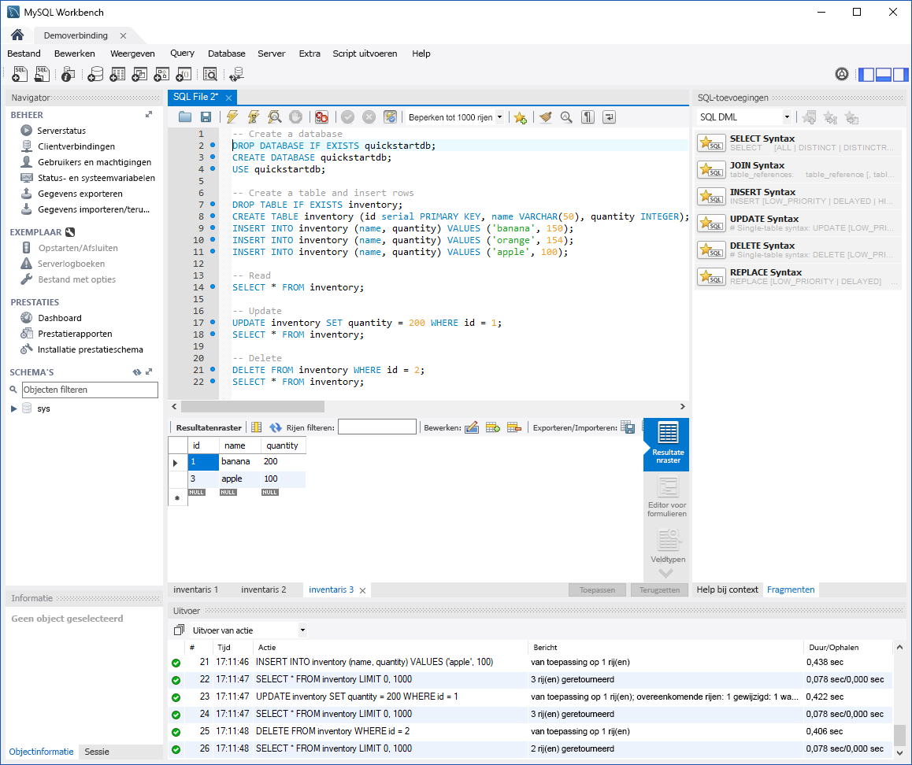

# <a name="azure-database-for-mariadb-use-mysql-workbench-to-connect-and-query-data"></a>Azure Database for MariaDB: MySQL Workbench gebruiken om verbinding te maken met gegevens en er query's op uit te voeren

In deze snelstart ziet u hoe u met behulp van MySQL Workbench verbinding maakt met een Azure Database for MariaDB-instantie. 

## <a name="prerequisites"></a>Vereisten

In deze snelstart worden de resources die in een van de volgende handleidingen zijn gemaakt, als uitgangspunt gebruikt:

- [Een Azure Database for MariaDB-server maken met behulp van de Azure-portal](./quickstart-create-mariadb-server-database-using-azure-portal.md)
- [Een Azure Database for MariaDB-server maken met behulp van de Azure CLI](./quickstart-create-mariadb-server-database-using-azure-cli.md)

## <a name="install-mysql-workbench"></a>MySQL Workbench installeren

[Download MySQL Workbench](https://dev.mysql.com/downloads/workbench/) en installeer deze op uw computer.

## <a name="get-connection-information"></a>Verbindingsgegevens ophalen

Haal de verbindingsgegevens op die nodig zijn om verbinding te maken met de Azure Database for MariaDB-instantie. U hebt de volledig gekwalificeerde servernaam en aanmeldingsreferenties nodig.

1. Meld u aan bij [Azure Portal](https://portal.azure.com/).

2. Selecteer in het linkse menu van de Azure-portal de optie **Alle resources**. Zoek naar de server die u hebt gemaakt (bijvoorbeeld **mydemoserver**).

3. Selecteer de servernaam.

4. Op de pagina **Overzicht** van de server bekijkt u de waarden bij **Servernaam** en **Aanmeldingsnaam van de serverbeheerder** en noteert u deze. Als u uw wachtwoord vergeet, kunt u het wachtwoord op deze pagina opnieuw instellen.

 

## <a name="connect-to-the-server-by-using-mysql-workbench"></a>Verbinding maken met de server met MySQL Workbench

Verbinding maken met een Azure Database for MariaDB-server met behulp van MySQL Workbench:

1.  Open MySQL Workbench op uw computer. 

2.  Voer in het dialoogvenster **Nieuwe verbinding instellen** de volgende gegevens in op het tabblad **Parameters**:

    | Instelling | Voorgestelde waarde | Beschrijving van veld |
    |---|---|---|
    |   Verbindingsnaam | **Demoverbinding** | Geef een label op voor deze verbinding. |
    | Verbindingsmethode | **Standard (TCP/IP)** | Standard (TCP/IP) is voldoende. |
    | Hostnaam | *servernaam* | Geef de servernaamwaarde op die u hebt gebruikt toen u de Azure Database for MariaDB-instantie maakte. De server in ons voorbeeld is **mydemoserver.mariadb.database.azure.com**. Gebruik de FQDN (Fully Qualified Domain Name) (\*.mariadb.database.azure.com) zoals weergegeven in het voorbeeld. Als u de servernaam niet meer weet, volgt u de stappen in de vorige sectie om de verbindingsgegevens op te halen.  |
    | Poort | **3306** | Gebruik altijd poort 3306 bij het verbinden met Azure Database for MariaDB. |
    | Gebruikersnaam |  *aanmeldnaam van serverbeheerder* | Geef de aanmeldnaam van de serverbeheerder op die u hebt gebruikt toen u de Azure Database for MariaDB-instantie maakte. De gebruikersnaam in ons voorbeeld is **myadmin@mydemoserver**. Als u de aanmeldnaam van de serverbeheerder niet meer weet, volgt u de stappen in de vorige sectie om de verbindingsgegevens op te halen. De indeling is *username@servername*.
    | Wachtwoord | *Uw wachtwoord* | Selecteer **Opslaan in de kluis** om het wachtwoord op te slaan. |

    

3.   Selecteer **Verbinding testen** om te controleren of alle parameters juist zijn geconfigureerd. 

4.   Selecteer **OK** om de verbinding op te slaan. 

5.   Bij **MySQL-verbindingen** selecteert u de tegel die bij uw server hoort. Wacht tot er verbinding is gemaakt.

    Er wordt een nieuw SQL-tabblad geopend met een lege editor waar u uw query's kunt typen.
    
    > [!NOTE]
    > Standaard wordt SSL-verbindingsbeveiliging vereist. Deze wordt afgedwongen op uw Azure Database for MariaDB-server. Hoewel er gewoonlijk geen aanvullende configuratie met SSL-certificaten is vereist om MySQL Workbench verbinding met de server te laten maken, verdient het aanbeveling de SSL CA-certificering te binden aan MySQL Workbench. Als u SSL wilt uitschakelen, gaat u op de serveroverzichtspagina in de Azure-portal naar **Verbindingsbeveiliging** in het menu. Bij **SSL-verbinding afdwingen** selecteert u **Uitgeschakeld**.

## <a name="create-table-and-insert-read-update-and-delete-data"></a>Een tabel maken en gegevens invoegen, lezen, bijwerken en verwijderen

1. Kopieer de volgende SQL-voorbeeldcode en plak deze op de pagina van een leeg SQL-tabblad om enkele voorbeeldgegevens te illustreren.

    Met deze code wordt een lege database gemaakt met de naam **quickstartdb**. Vervolgens wordt er een voorbeeldtabel met de naam **inventory** gemaakt. Met de code worden er een paar rijen ingevoegd, die vervolgens worden gelezen. De gegevens worden gewijzigd met een bijwerkinstructie, waarna de rijen opnieuw worden gelezen. Ten slotte wordt met de code een rij verwijderd, en worden de rijen opnieuw gelezen.
    
    ```sql
    -- Create a database
    -- DROP DATABASE IF EXISTS quickstartdb;
    CREATE DATABASE quickstartdb;
    USE quickstartdb;
    
    -- Create a table and insert rows
    DROP TABLE IF EXISTS inventory;
    CREATE TABLE inventory (id serial PRIMARY KEY, name VARCHAR(50), quantity INTEGER);
    INSERT INTO inventory (name, quantity) VALUES ('banana', 150);
    INSERT INTO inventory (name, quantity) VALUES ('orange', 154);
    INSERT INTO inventory (name, quantity) VALUES ('apple', 100);
    
    -- Read
    SELECT * FROM inventory;
    
    -- Update
    UPDATE inventory SET quantity = 200 WHERE id = 1;
    SELECT * FROM inventory;
    
    -- Delete
    DELETE FROM inventory WHERE id = 2;
    SELECT * FROM inventory;
    ```

    In de schermopname wordt een voorbeeld getoond van de SQL-code in MySQL Workbench, alsmede de uitvoer nadat de code is uitgevoerd:
    
    

2. Als u de SQL-voorbeeldcode wilt uitvoeren, klikt u op het tabblad **SQL-bestand** en selecteert u het bliksemstraalpictogram op de werkbalk.
3. Let op de drie tabbladen met resultaten in de sectie **Resultaatraster** in het midden van de pagina. 
4. Let ook op de lijst **Uitvoer** onder aan de pagina. De status van elke opdracht wordt weergegeven. 

In deze snelstart hebt u verbinding gemaakt met Azure Database for MariaDB met behulp van MySQL Workbench en hebt u query's uitgevoerd op gegevens met behulp van de taal SQL.

<!--
## Next steps
> [!div class="nextstepaction"]
> [Migrate your database using Export and Import](./concepts-migrate-import-export.md)
-->
