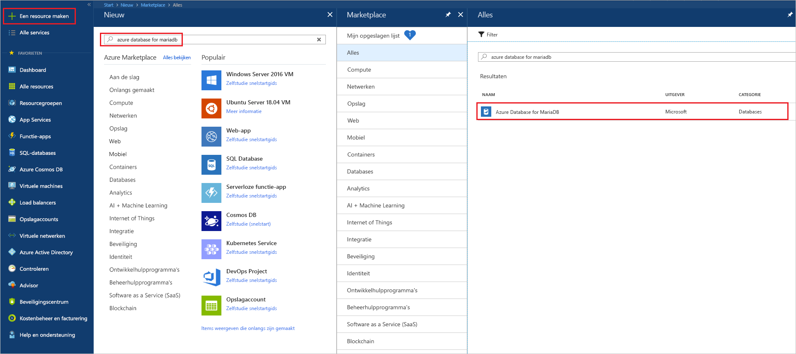
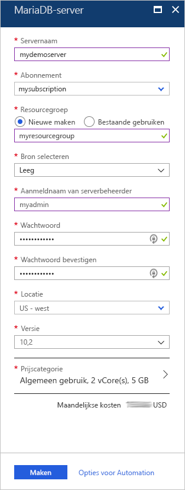
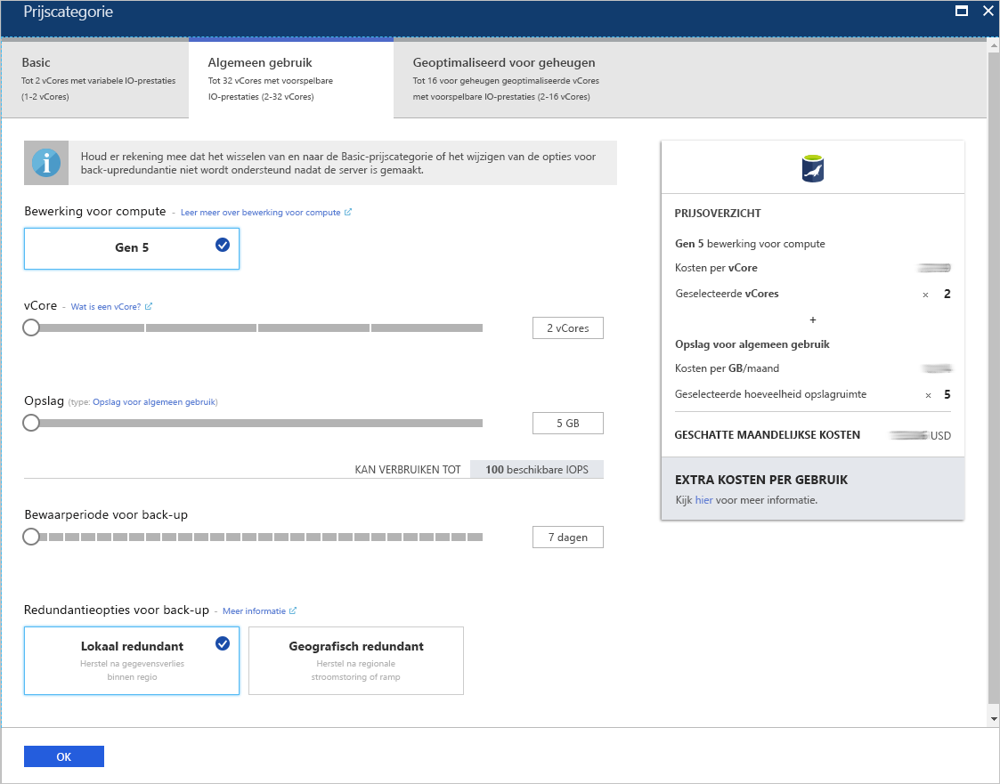
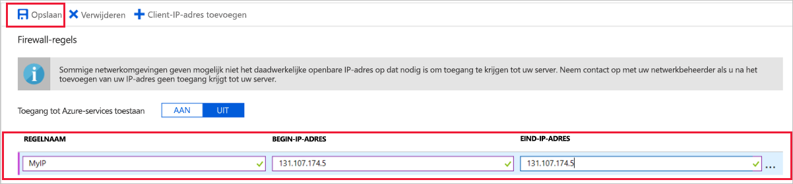
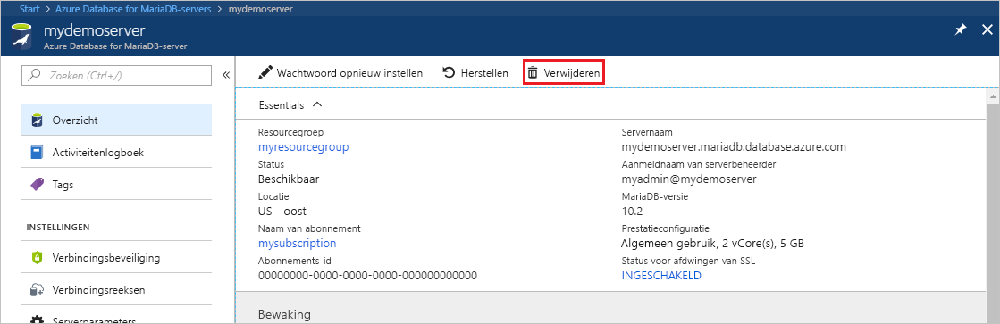

# <a name="create-an-azure-database-for-mariadb-server-by-using-the-azure-portal"></a>Een Azure Database for MariaDB-server maken met behulp van Azure Portal

Azure Database for MariaDB is een beheerde service waarmee u MariaDB-databases met hoge beschikbaarheid in de cloud kunt uitvoeren, beheren en schalen. In deze snelstart ontdekt u hoe u in ongeveer vijf minuten een Azure Database for MariaDB-server maakt in de Azure-portal.  

Als u nog geen abonnement op Azure hebt, maak dan een [gratis Azure-account](https://azure.microsoft.com/free/) aan voordat u begint.

## <a name="sign-in-to-the-azure-portal"></a>Aanmelden bij Azure Portal

Ga in uw webbrowser naar de [Azure-portal](https://portal.azure.com/). Voer uw referenties in om u aan te melden bij de portal. De standaardweergave is uw service-dashboard.

## <a name="create-an-azure-database-for-mariadb-server"></a>Een Azure Database for MariaDB-server maken

U maakt een Azure Database for MariaDB-server met een gedefinieerde set [reken- en opslagresources](concepts-pricing-tiers.md). De server wordt gemaakt binnen een [Azure-resourcegroep](../azure-resource-manager/resource-group-overview.md).

Een Azure Database for MariaDB-server maken:

1. Selecteer de knop **Een resource maken** (+) in de linkerbovenhoek van de portal.

2. Typ **Azure Database for MariaDB** in het zoekvak om de service te vinden.

   

3. Voer de volgende serverdetails in of selecteer deze:
   
   

    Instelling | Voorgestelde waarde | Beschrijving
    ---|---|---
    Servernaam | *een unieke servernaam* | Kies een unieke naam ter identificatie van de Azure Database for MariaDB-server. Bijvoorbeeld **mydemoserver**. De domeinnaam *.mariadb.database.azure.com* wordt toegevoegd aan de servernaam die u opgeeft. De servernaam mag alleen kleine letters, cijfers en het koppelteken (-) bevatten. Dit wachtwoord moet tussen 3 en 63 tekens bevatten.
    Abonnement | *uw abonnement* | Selecteer het Azure-abonnement dat u wilt gebruiken voor uw server. Als u meerdere abonnementen hebt, kiest u het abonnement waarin u wordt gefactureerd voor de resource.
    Resourcegroep | **myresourcegroup** | Voer een naam voor de nieuwe resourcegroep in of selecteer een bestaande resourcegroep. 
    Bron selecteren | **Leeg** | Selecteer **Leeg** om een nieuwe server te maken. (Selecteer **Back-up** als u een server maakt op basis van een geo-back-up van een bestaande Azure Database for MariaDB-server.)
    Aanmeldgegevens van serverbeheerder | **myadmin** | Een aanmeldingsaccount die moet worden gebruikt om verbinding te maken met de server. De aanmeldingsnaam voor de beheerder kan niet **azure_superuser**, **admin**, **administrator**, **root**, **guest** of **public** zijn.
    Wachtwoord | *uw keuze* | Voer een nieuw wachtwoord in voor het beheerdersaccount voor de server. Dit wachtwoord moet tussen 8 en 128 tekens bevatten. Uw wachtwoord moet tekens bevatten uit drie van de volgende categorieën: Nederlandse hoofdletters, Nederlandse kleine letters, cijfers (0-9) en niet-alfanumerieke tekens (!, $, #, %, enzovoort).
    Wachtwoord bevestigen | *uw keuze*| Bevestig het wachtwoord voor het beheerdersaccount.
    Locatie | *de regio het dichtst bij uw gebruikers*| Kies de locatie die zich het dichtst bij uw gebruikers of uw andere Azure-toepassingen bevindt.
    Versie | *de nieuwste versie*| De nieuwste versie (tenzij u specifieke vereisten hebt voor het gebruik van een andere versie).
    Prijscategorie | Zie de beschrijving. | De reken-, opslag- en back-upconfiguraties voor de nieuwe server. Selecteer **Prijscategorie** > **Algemeen gebruik**. Behoud de standaardwaarden voor de volgende instellingen:<br><ul><li>**Bewerking voor compute** (Gen 5)</li><li>**vCore** (2 vCores)</li><li>**Opslag** (5 GB)</li><li>**Bewaarperiode voor back-ups** (7 dagen)</li></ul><br>Als u serverback-ups in geografisch redundante opslag wilt inschakelen, selecteert u **Geografisch redundant** in het gedeelte **Redundantieopties voor back-up**. <br><br>Selecteer **OK** om deze geselecteerde prijscategorie op te slaan. Deze selecties worden afgebeeld in de volgende schermopname.
  
    > [!IMPORTANT]
    > De beheerdersaanmelding bij de server en het wachtwoord die u hier opgeeft, zijn vereist voor aanmelding bij de server en de bijbehorende databases verderop in deze snelstart. Onthoud of noteer deze informatie voor later gebruik.
    > 

   

4.  Selecteer **Maken** om de server in te richten. Dit kan maximaal 20 minuten duren.
   
5.  Selecteer **Meldingen** op de werkbalk (pictogram van een klok) om het implementatieproces te bewaken.
   
Standaard worden de volgende databases gemaakt voor de server: **information_schema**, **mysql**, **performance_schema** en **sys**.


## <a name="configure-firewall-rule"></a>Een serverfirewallregel configureren

De service Azure Database for MariaDB maakt een firewall op serverniveau. De firewall voorkomt dat externe toepassingen en hulpprogramma's verbinding maken met de server of databases op de server, tenzij er een firewallregel wordt gemaakt om de firewall te openen voor specifieke IP-adressen. 

Een serverfirewallregel maken:

1.   Ga naar de server zodra deze is geïmplementeerd. U kunt indien nodig naar de server zoeken. Selecteer bijvoorbeeld **Alle resources** in het menu aan de linkerkant. Voer vervolgens de naam van de server in. Voer bijvoorbeeld **mydemoserver** in om te zoeken naar de zojuist gemaakte server. Selecteer de naam van de server in de lijst met zoekresultaten. De pagina **Overzicht** voor uw server wordt geopend. Op deze pagina kunt u aanvullende instellingen wijzigen.

2. Selecteer **Verbindingsbeveiliging** op de serveroverzichtspagina.

3.  Selecteer onder **Firewallregels** het lege tekstvak in de kolom **Regelnaam** om te beginnen met het maken van de firewallregel. Geef het precieze IP-adresbereik op van de clients die verbinding met deze server maken.
   
   

4. Selecteer **Opslaan** op de bovenste werkbalk van de pagina **Verbindingsbeveiliging**. Ga pas verder als u de melding ziet dat de update is voltooid. 

   > [!NOTE]
   > Verbindingen met Azure Database for MariaDB communiceren via poort 3306. Als u verbinding probeert te maken vanuit een bedrijfsnetwerk, wordt uitgaand verkeer via poort 3306 mogelijk niet toegestaan. In dat geval kunt u geen verbinding maken met de server, tenzij de IT-afdeling poort 3306 openstelt.
   > 

## <a name="get-connection-information"></a>Verbindingsgegevens ophalen

Voor verbinding met uw databaseserver moet u beschikken over de volledige servernaam en aanmeldingsreferenties van de beheerder. U hebt deze waarden mogelijk al eerder in dit artikel genoteerd. Als u dat niet hebt gedaan, kunt u de servernaam en aanmeldingsgegevens eenvoudig terugvinden op de pagina **Overzicht** of op de pagina  **Eigenschappen** van de server in de Azure-portal:

1. Ga naar de pagina **Overzicht** van de server. Noteer de waarden van **Servernaam** en de **Gebruikersnaam van de serverbeheerder**. 

2. Als u de waarden wilt kopiëren, plaats de cursor over het veld dat u wilt kopiëren. Het kopieerpictogram wordt rechts van de tekst weergegeven. Selecteer het kopieerpictogram indien nodig om de waarden te kopiëren.

In dit voorbeeld is de servernaam **mydemoserver.mariadb.database.azure.com**. De aanmeldingsnaam van de serverbeheerder is **myadmin@mydemoserver**.

## <a name="connect-to-azure-database-for-mariadb-by-using-the-mysql-command-line"></a>Verbinding maken met Azure Database for MariaDB met behulp van de mysql-opdrachtregel

U kunt verschillende toepassingen gebruiken om verbinding te maken met uw Azure Database for MariaDB-server.

We gebruiken eerst het opdrachtregelprogramma [mysql](https://dev.mysql.com/doc/refman/5.7/en/mysql.html) om te laten zien hoe u verbinding maakt met de server. U kunt ook een webbrowser en Azure Cloud Shell gebruiken zonder dat u extra software hoeft te installeren. Als het hulpprogramma mysql lokaal is geïnstalleerd, kunt u dit ook gebruiken om verbinding te maken.

1. Open Azure Cloud Shell via het terminalpictogram (**>_**) op de werkbalk rechtsboven in de Azure-portal.


2.  Azure Cloud Shell wordt geopend in uw browser. In Cloud Shell kunt u bash-shellopdrachten gebruiken.

   

3. Maak vanaf de Cloud Shell-prompt verbinding met uw Azure Database for MariaDB-server door de mysql-opdrachtregel in te voeren.

    Gebruik de volgende indeling om verbinding te maken met een Azure Database for MariaDB-server met behulp van het hulpprogramma mysql:

    ```bash
    mysql --host <fully qualified server name> --user <server admin login name>@<server name> -p
    ```

    Met de volgende opdracht maakt u bijvoorbeeld verbinding met onze voorbeeldserver:

    ```azurecli-interactive
    mysql --host mydemoserver.mariadb.database.azure.com --user myadmin@mydemoserver -p
    ```

    mysql-parameter |Voorgestelde waarde|Beschrijving
    ---|---|---
    --host | *servernaam* | De servernaamwaarde die u hebt gebruikt bij het maken van de Azure Database for MariaDB-server. De server in ons voorbeeld is **mydemoserver.mariadb.database.azure.com**. Gebruik de FQDN (Fully Qualified Domain Name) (**\*.mariadb.database.azure.com**) zoals weergegeven in het voorbeeld. Als u de servernaam niet meer weet, volgt u de stappen in de vorige sectie om de verbindingsgegevens op te halen.
    --user | *aanmeldnaam van serverbeheerder* |De gebruikersnaam van de serverbeheerder die u hebt gebruikt bij het maken van de Azure Database for MariaDB-server. Als u de gebruikersnaam niet meer weet, volgt u de stappen in de vorige sectie om de verbindingsgegevens op te halen. De indeling is *username@servername*.
    -p | *Uw wachtwoord*<br>(wacht totdat u hierom wordt gevraagd) |Voer desgevraagd het wachtwoord in dat u hebt gebruikt voor het maken van de server. De ingevoerde wachtwoordtekens worden niet weergegeven bij de bash-prompt terwijl u de tekens typt. Nadat u het wachtwoord hebt ingevoerd, drukt u op Enter.

   Wanneer het hulpprogramma mysql is verbonden, wordt de prompt `mysql>` weergegeven. U kunt opdrachten bij de prompt invoeren. 

   Hier ziet u een voorbeeld van mysql-uitvoer:

    ```bash
    Welcome to the MySQL monitor.  Commands end with ; or \g.
    Your MySQL connection id is 65505
    Server version: 5.6.39.0 MariaDB Server
    
    Copyright (c) 2000, 2017, Oracle and/or its affiliates. All rights reserved.
    
    Oracle is a registered trademark of Oracle Corporation and/or its
    affiliates. Other names may be trademarks of their respective
    owners.

    Type 'help;' or '\h' for help. Type '\c' to clear the current input statement.
    
    mysql>
    ```
    
    > [!TIP]
    > Als de firewall niet is geconfigureerd voor het toestaan van het IP-adres van Azure Cloud Shell, wordt het volgende foutbericht weergegeven:
    >
    >   ERROR 2003 (28000): Client with IP address 123.456.789.0 is not allowed to access the server.
    >
    > U kunt deze fout oplossen door ervoor te zorgen dat de serverconfiguratie overeenkomt met de stappen die worden beschreven in [Een serverfirewallregel configureren](#configure-firewall-rule).

4. Om de verbinding te controleren, voert u **status** in bij de prompt `mysql>` om de status van de server te controleren.

    ```sql
    status
    ```

   > [!TIP]
   > Zie [hoofdstuk 4.5.1 in de Engelstalige naslaghandleiding van MySQL 5.7](https://dev.mysql.com/doc/refman/5.7/en/mysql.html) voor aanvullende opdrachten.

5.  Maak een lege database door bij de prompt `mysql>` de volgende opdracht in te voeren:

    ```sql
    CREATE DATABASE quickstartdb;
    ```
    Het uitvoeren van de opdracht kan enkele minuten duren. 

    Op een Azure Database for MariaDB-server kunt u een of meer databases maken. U kunt één database per server maken om gebruik te maken van alle resources, of meerdere databases om de resources te delen. Er geldt geen limiet voor het aantal databases dat u kunt maken, maar meerdere databases delen wel dezelfde serverresources. 

6. Vraag de databases op bij de prompt `mysql>` door de volgende opdracht in te voeren:

    ```sql
    SHOW DATABASES;
    ```

7.  Voer **\q** in en druk op Enter om het hulpprogramma mysql af te sluiten. Vervolgens kunt u Azure Cloud Shell sluiten.

U hebt verbinding gemaakt met de Azure Database for MariaDB-server en een lege gebruikersdatabase gemaakt. In de volgende oefening maakt u verbinding met dezelfde server met behulp van een ander veelgebruikt hulpprogramma, MySQL Workbench.

## <a name="connect-to-the-server-by-using-mysql-workbench"></a>Verbinding maken met de server met MySQL Workbench

Verbinding maken met de server met MySQL Workbench:

1. Open MySQL Workbench op uw clientcomputer. Als u MySQL Workbench wilt downloaden en installeren, gaat u naar [deze website](https://dev.mysql.com/downloads/workbench/).

2. Als u een nieuwe verbinding wilt maken, selecteert u het plusteken (**+**) naast de kop **MySQL-verbindingen**.

3. Voer in het dialoogvenster **Nieuwe verbinding instellen**, op het tabblad **Parameters**, de verbindingsgegevens voor uw server in. Als voorbeeld worden tijdelijke waarden weergegeven. Vervang de **hostnaam**, de **gebruikersnaam** en het **wachtwoord** door uw eigen waarden.

   

    |Instelling |Voorgestelde waarde|Beschrijving van veld|
    |---|---|---|
     Verbindingsnaam | **Demoverbinding** | Een label voor deze verbinding. |
    Verbindingsmethode | **Standard (TCP/IP)** | Standard (TCP/IP) is voldoende. |
    Hostnaam | *servernaam* | De servernaamwaarde die u hebt gebruikt bij het maken van de Azure Database for MariaDB-server. De server in ons voorbeeld is **mydemoserver.mariadb.database.azure.com**. Gebruik de FQDN (Fully Qualified Domain Name) (**\*.mariadb.database.azure.com**) zoals weergegeven in het voorbeeld. Als u de servernaam niet meer weet, volgt u de eerder beschreven stappen in dit artikel om de verbindingsgegevens op te halen.|
     Poort | 3306 | De poort die u gebruikt om verbinding te maken met uw Azure Database for MariaDB-server. |
    Gebruikersnaam |  *aanmeldnaam van serverbeheerder* | De aanmeldingsgegevens van de serverbeheerder die u hebt gebruikt bij het maken van de Azure Database for MariaDB-server. De gebruikersnaam in ons voorbeeld is **myadmin@mydemoserver**. Als u de gebruikersnaam niet meer weet, volgt u de eerder beschreven stappen in dit artikel om de verbindingsgegevens op te halen. De indeling is *username@servername*.
    Wachtwoord | *Uw wachtwoord* | Selecteer **Opslaan in de kluis** om het wachtwoord op te slaan. |

4. Selecteer **Verbinding testen** om te controleren of alle parameters juist zijn geconfigureerd. Selecteer ten slotte **OK** om de verbinding op te slaan. 

    > [!NOTE]
    > SSL wordt standaard afgedwongen op de server. Er zijn aanvullende configuratie-instellingen vereist om verbinding te kunnen maken. Zie [Configure SSL connectivity in your application to securely connect to Azure Database for MariaDB](./howto-configure-ssl.md) (SSL-connectiviteit in uw toepassing configureren om veilig verbinding te maken met Azure Database for MariaDB) voor meer informatie. Als u SSL wilt uitschakelen voor deze snelstart, gaat u op de serveroverzichtspagina in de Azure-portal naar **Verbindingsbeveiliging** in het menu. Bij **SSL-verbinding afdwingen** selecteert u **Uitgeschakeld**.
    >

## <a name="clean-up-resources"></a>Resources opschonen

De resources die u hebt gemaakt in de snelstart kunt u op twee manieren opschonen. U kunt de [Azure-resourcegroep](../azure-resource-manager/resource-group-overview.md) verwijderen. Met deze optie verwijdert u alle resources in de resourcegroep. Als u de andere resources intact wilt houden, verwijdert u alleen de ene server-resource.

> [!TIP]
> Andere snelstarts in deze verzameling zijn op deze snelstart gebaseerd. Als u van plan bent om ook andere Azure Database for MariaDB-snelstarts te volgen, moet u geen resources opschonen die u in deze snelstart hebt gemaakt. Als u niet wilt doorgaan, gebruikt u de volgende stappen om alle resources te verwijderen die tijdens deze snelstart zijn gemaakt.
>

De hele resourcegroep verwijderen, met inbegrip van de nieuwe server:

1.  Zoek de resourcegroep in de Azure-portal. Selecteer **Resourcegroepen** in het menu aan de linkerkant en selecteer vervolgens de naam van uw resourcegroep (zoals **myresourcegroup** in ons voorbeeld).

2.  Selecteer **Verwijderen** op de pagina van de resourcegroep. Voer vervolgens de naam van de resourcegroep in (zoals **myresourcegroup** in ons voorbeeld) in het tekstvak om het verwijderen te bevestigen. Selecteer **Verwijderen**.

Alleen de zojuist gemaakte server verwijderen:

1.  Zoek de server in de Azure-portal als deze nog niet is geopend. Selecteer **Alle resources** in het menu aan de linkerkant. Zoek vervolgens naar de server die u hebt gemaakt.

2.  Selecteer **Verwijderen** op de pagina **Overzicht**. 

   

3.  Controleer de naam van de server die u wilt verwijderen. Bekijk de databases op de server die worden beïnvloed door het verwijderen. Voer de naam van de server in (in ons voorbeeld **mydemoserver**) om het verwijderen te bevestigen. Selecteer **Verwijderen**.

## <a name="next-steps"></a>Volgende stappen

- [Uw eerste Azure Database for MariaDB-database ontwerpen](./tutorial-design-database-using-portal.md)
