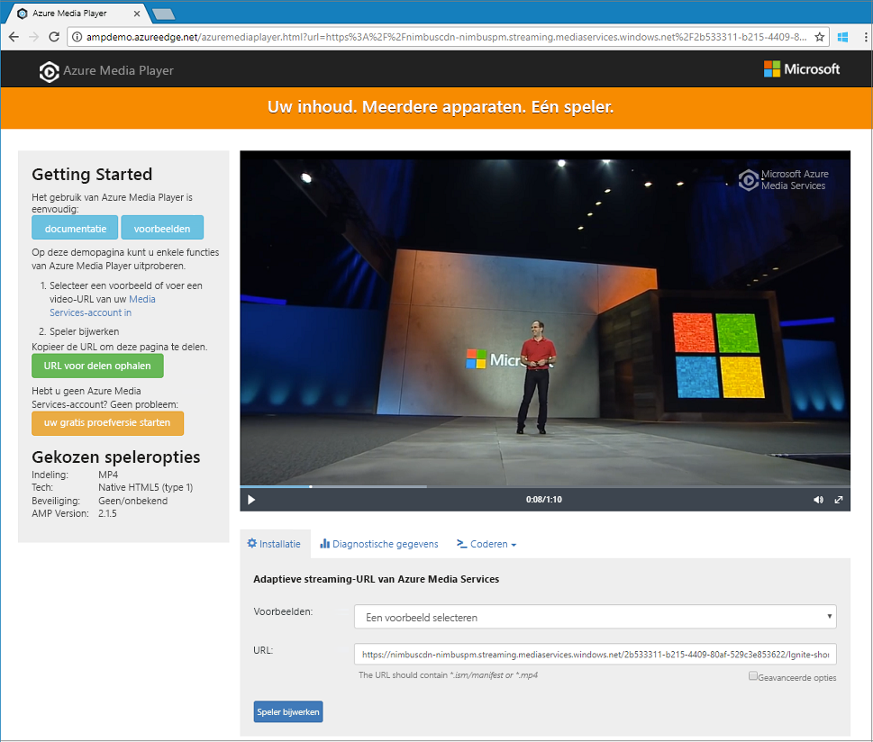

# <a name="quickstart-stream-video-files---cli"></a>Quickstart: Videobestanden streamen - CLI

Deze snelstartgids laat zien hoe u met Azure Media Services eenvoudig video's kunt coderen en streamen naar allerlei verschillende browsers en apparaten. De invoerinhoud kan worden opgegeven met HTTPS-URL's, SAS-URL's of paden naar bestanden in Azure Blob-opslag.
Met het voorbeeld in dit onderwerp wordt inhoud gecodeerd die u toegankelijk maakt via een HTTPS-URL. Op dit moment biedt AMS v3 geen ondersteuning voor gesegmenteerde overdrachtscodering via HTTPS-URL's.

Als u deze snelstartgids hebt voltooid, weet u hoe u een video kunt streamen.  



[!INCLUDE [quickstarts-free-trial-note](../../../includes/quickstarts-free-trial-note.md)]

## <a name="create-a-media-services-account"></a>Een Media Services-account kunt maken

Als u wilt beginnen met het versleutelen, coderen, analyseren, beheren en streamen van media-inhoud in Azure, moet u een Media Services-account maken. Het Media Services-account moet worden gekoppeld aan een of meer opslagaccounts.

Het Media Services-account en alle gekoppelde opslagaccounts moeten zich in hetzelfde Azure-abonnement bevinden. Het wordt sterk aangeraden opslagaccounts te gebruiken op dezelfde locatie als het Media Services-account om aanvullende kosten voor latentie en uitgaande data te vermijden.

### <a name="create-a-resource-group"></a>Een resourcegroep maken

```azurecli
az group create -n amsResourceGroup -l westus2
```

### <a name="create-an-azure-storage-account"></a>Een Azure Storage-account maken

In dit voorbeeld maakt u een Standard LRS-account voor algemeen gebruik (v2).

Als u wilt experimenteren met opslagaccounts, gebruikt u `--sku Standard_LRS`. Als u echter een SKU voor productie selecteert, kunt u overwegen om `--sku Standard_RAGRS` te gebruiken. Deze biedt geografische replicatie voor bedrijfscontinuïteit. Zie [Opslagaccounts](https://docs.microsoft.com/cli/azure/storage/account?view=azure-cli-latest) voor meer informatie.
 
```azurecli
az storage account create -n amsstorageaccount --kind StorageV2 --sku Standard_LRS -l westus2 -g amsResourceGroup
```

### <a name="create-an-azure-media-service-account"></a>Een Azure Media Services-account maken

```azurecli
az ams account create --n amsaccount -g amsResourceGroup --storage-account amsstorageaccount -l westus2
```

U krijgt ongeveer de volgende reactie:

```
{
  "id": "/subscriptions/<id>/resourceGroups/amsResourceGroup/providers/Microsoft.Media/mediaservices/amsaccount",
  "location": "West US 2",
  "mediaServiceId": "8b569c2e-d648-4fcb-9035-c7fcc3aa7ddf",
  "name": "amsaccount",
  "resourceGroup": "amsResourceGroupTest",
  "storageAccounts": [
    {
      "id": "/subscriptions/<id>/resourceGroups/amsResourceGroup/providers/Microsoft.Storage/storageAccounts/amsstorageaccount",
      "resourceGroup": "amsResourceGroupTest",
      "type": "Primary"
    }
  ],
  "tags": null,
  "type": "Microsoft.Media/mediaservices"
}
```

## <a name="start-streaming-endpoint"></a>Streaming-eindpunt starten

Met de volgende CLI wordt het standaard-**streaming-eindpunt** gestart.

```azurecli
az ams streaming-endpoint start  -n default -a amsaccount -g amsResourceGroup
```

Zodra deze is gestart, krijgt u ongeveer de volgende reactie:

```
az ams streaming-endpoint start  -n default -a amsaccount -g amsResourceGroup
{
  "accessControl": null,
  "availabilitySetName": null,
  "cdnEnabled": true,
  "cdnProfile": "AzureMediaStreamingPlatformCdnProfile-StandardVerizon",
  "cdnProvider": "StandardVerizon",
  "created": "2019-02-06T21:58:03.604954+00:00",
  "crossSiteAccessPolicies": null,
  "customHostNames": [],
  "description": "",
  "freeTrialEndTime": "2019-02-21T22:05:31.277936+00:00",
  "hostName": "amsaccount-usw22.streaming.media.azure.net",
  "id": "/subscriptions/<id>/resourceGroups/amsResourceGroup/providers/Microsoft.Media/mediaservices/amsaccount/streamingendpoints/default",
  "lastModified": "2019-02-06T21:58:03.604954+00:00",
  "location": "West US 2",
  "maxCacheAge": null,
  "name": "default",
  "provisioningState": "Succeeded",
  "resourceGroup": "amsResourceGroup",
  "resourceState": "Running",
  "scaleUnits": 0,
  "tags": {},
  "type": "Microsoft.Media/mediaservices/streamingEndpoints"
}
```

Als het streaming-eindpunt al wordt uitgevoerd, ziet u

```
(InvalidOperation) The server cannot execute the operation in its current state.
```

## <a name="create-a-transform-for-adaptive-bitrate-encoding"></a>Een transformatie maken voor adaptieve bitratecodering

Maak een **Transformatie** om veelvoorkomende taken voor het coderen of analyseren van video's te configureren. In dit voorbeeld gaat u een adaptieve bitratecodering uitvoeren. Vervolgens verzendt u een **taak** onder de transformatie die u hebt gemaakt. De taak is de eigenlijke aanvraag aan Media Services om de transformatie toe te passen op de inhoud van een gegeven invoervideo of -audio.

```azurecli
az ams transform create --name testEncodingTransform --preset AdaptiveStreaming --description 'a simple Transform for Adaptive Bitrate Encoding' -g amsResourceGroup -a amsaccount
```

U krijgt ongeveer de volgende reactie:

```
{
  "created": "2019-02-15T00:11:18.506019+00:00",
  "description": "a simple Transform for Adaptive Bitrate Encoding",
  "id": "/subscriptions/<id>/resourceGroups/amsResourceGroup/providers/Microsoft.Media/mediaservices/amsaccount/transforms/testEncodingTransform",
  "lastModified": "2019-02-15T00:11:18.506019+00:00",
  "name": "testEncodingTransform",
  "outputs": [
    {
      "onError": "StopProcessingJob",
      "preset": {
        "odatatype": "#Microsoft.Media.BuiltInStandardEncoderPreset",
        "presetName": "AdaptiveStreaming"
      },
      "relativePriority": "Normal"
    }
  ],
  "resourceGroup": "amsResourceGroup",
  "type": "Microsoft.Media/mediaservices/transforms"
}
```

## <a name="create-an-output-asset"></a>Een uitvoeractivum maken

Er wordt een uitvoer**asset** gemaakt die wordt gebruikt als uitvoer van de coderingstaak.

```azurecli
az ams asset create -n testOutputAssetName -a amsaccount -g amsResourceGroup
```

U krijgt ongeveer de volgende reactie:

```
{
  "alternateId": null,
  "assetId": "96427438-bbce-4a74-ba91-e38179b72f36",
  "container": null,
  "created": "2019-02-14T23:58:19.127000+00:00",
  "description": null,
  "id": "/subscriptions/<id>/resourceGroups/amsResourceGroup/providers/Microsoft.Media/mediaservices/amsaccount/assets/testOutputAssetName",
  "lastModified": "2019-02-14T23:58:19.127000+00:00",
  "name": "testOutputAssetName",
  "resourceGroup": "amsResourceGroup",
  "storageAccountName": "amsstorageaccount",
  "storageEncryptionFormat": "None",
  "type": "Microsoft.Media/mediaservices/assets"
}
```

## <a name="start-job-with-https-input"></a>Taak starten met HTTPS-invoer

Wanneer u in Media Services v3 taken verzendt voor het verwerken van uw video's, moet u aan Media Services de locatie van de invoervideo doorgeven. Een van de opties is dat u een HTTPS-URL als taakinvoer opgeeft (zoals in dit voorbeeld). 

Wanneer u `az ams job start` uitvoert, kunt u een label instellen op de uitvoer van de taak. Het label kan later worden gebruikt om te bepalen waarvoor deze uitvoerasset is bedoeld. 

- Als u een waarde aan het label toewijst, stelt u '--output-assets' in op 'assetname=label'
- Als u geen waarde aan het label toewijst, stelt u '--output-assets' in op 'assetname='.
  Let erop dat u '=' toevoegt aan `output-assets`. 

```azurecli
az ams job start --name testJob001 --transform-name testEncodingTransform --base-uri 'https://nimbuscdn-nimbuspm.streaming.mediaservices.windows.net/2b533311-b215-4409-80af-529c3e853622/' --files 'Ignite-short.mp4' --output-assets testOutputAssetName= -a amsaccount -g amsResourceGroup 
```

U krijgt ongeveer de volgende reactie:

```
{
  "correlationData": {},
  "created": "2019-02-15T05:08:26.266104+00:00",
  "description": null,
  "id": "/subscriptions/<id>/resourceGroups/amsResourceGroup/providers/Microsoft.Media/mediaservices/amsaccount/transforms/testEncodingTransform/jobs/testJob001",
  "input": {
    "baseUri": "https://nimbuscdn-nimbuspm.streaming.mediaservices.windows.net/2b533311-b215-4409-80af-529c3e853622/",
    "files": [
      "Ignite-short.mp4"
    ],
    "label": null,
    "odatatype": "#Microsoft.Media.JobInputHttp"
  },
  "lastModified": "2019-02-15T05:08:26.266104+00:00",
  "name": "testJob001",
  "outputs": [
    {
      "assetName": "testOutputAssetName",
      "error": null,
      "label": "",
      "odatatype": "#Microsoft.Media.JobOutputAsset",
      "progress": 0,
      "state": "Queued"
    }
  ],
  "priority": "Normal",
  "resourceGroup": "amsResourceGroup",
  "state": "Queued",
  "type": "Microsoft.Media/mediaservices/transforms/jobs"
}
```

### <a name="check-status"></a>Status controleren

Controleer na ongeveer 5 minuten de status van de taak. Deze moet 'Voltooid' zijn. Als dat niet zo is, controleer dit dan na enkele minuten nog eens. Als deze 'Voltooid' is, gaat u naar de volgende stap en maakt u een **streaming-locator**.

```azurecli
az ams job show -a amsaccount -g amsResourceGroup -t testEncodingTransform -n testJob001
```

## <a name="create-streaming-locator-and-get-path"></a>Streaming-locator maken en pad opvragen

Wanneer de codering is voltooid, bestaat de volgende stap eruit om de video in de uitvoerasset beschikbaar te maken voor weergave door clients. U kunt dit doen in twee stappen: maak eerst een **streaming-locator** en bouw vervolgens de streaming-URL's die clients kunnen gebruiken.

### <a name="create-a-streaming-locator"></a>Een streaming-locator maken

```azurecli
az ams streaming-locator create -n testStreamingLocator --asset-name testOutputAssetName --streaming-policy-name Predefined_ClearStreamingOnly  -g amsResourceGroup -a amsaccount 
```

U krijgt ongeveer de volgende reactie:

```
{
  "alternativeMediaId": null,
  "assetName": "output-3b6d7b1dffe9419fa104b952f7f6ab76",
  "contentKeys": [],
  "created": "2019-02-15T04:35:46.270750+00:00",
  "defaultContentKeyPolicyName": null,
  "endTime": "9999-12-31T23:59:59.999999+00:00",
  "id": "/subscriptions/<id>/resourceGroups/amsResourceGroup/providers/Microsoft.Media/mediaservices/amsaccount/streamingLocators/testStreamingLocator",
  "name": "testStreamingLocator",
  "resourceGroup": "amsResourceGroup",
  "startTime": null,
  "streamingLocatorId": "e01b2be1-5ea4-42ca-ae5d-7fe704a5962f",
  "streamingPolicyName": "Predefined_ClearStreamingOnly",
  "type": "Microsoft.Media/mediaservices/streamingLocators"
}
```

### <a name="get-streaming-locator-paths"></a>Streaming-locatorpaden verkrijgen

```azurecli
az ams streaming-locator get-paths -a amsaccount -g amsResourceGroup -n testStreamingLocator
```

U krijgt ongeveer de volgende reactie:

```
{
  "downloadPaths": [],
  "streamingPaths": [
    {
      "encryptionScheme": "NoEncryption",
      "paths": [
        "/e01b2be1-5ea4-42ca-ae5d-7fe704a5962f/ignite.ism/manifest(format=m3u8-aapl)"
      ],
      "streamingProtocol": "Hls"
    },
    {
      "encryptionScheme": "NoEncryption",
      "paths": [
        "/e01b2be1-5ea4-42ca-ae5d-7fe704a5962f/ignite.ism/manifest(format=mpd-time-csf)"
      ],
      "streamingProtocol": "Dash"
    },
    {
      "encryptionScheme": "NoEncryption",
      "paths": [
        "/e01b2be1-5ea4-42ca-ae5d-7fe704a5962f/ignite.ism/manifest"
      ],
      "streamingProtocol": "SmoothStreaming"
    }
  ]
}
```

Kopieer het Hls-pad. In dit geval: `/e01b2be1-5ea4-42ca-ae5d-7fe704a5962f/ignite.ism/manifest(format=m3u8-aapl)`.

## <a name="build-url"></a>URL maken 

### <a name="get-streaming-endpoint-host-name"></a>Hostnaam van streaming-eindpunt ophalen

```azurecli
az ams streaming-endpoint list -a amsaccount -g amsResourceGroup -n default
```

Kopieer de waarde van `hostName`. In dit geval: `amsaccount-usw22.streaming.media.azure.net`.

### <a name="assemble-url"></a>URL samenstellen

'https://' + &lt;waarde van hostnaam&gt; + &lt;padwaarde Hls&gt;

#### <a name="example"></a>Voorbeeld

`https://amsaccount-usw22.streaming.media.azure.net/7f19e783-927b-4e0a-a1c0-8a140c49856c/ignite.ism/manifest(format=m3u8-aapl)`

## <a name="test-playback-with-azure-media-player"></a>Afspelen testen met Azure Media Player

In dit artikel gebruiken we Azure Media Player om de stream te testen. 

> [!NOTE]
> Als een speler wordt gehost op een https-site, moet u de URL bijwerken naar 'https'.

1. Open een browser en ga naar [https://aka.ms/azuremediaplayer/](https://aka.ms/azuremediaplayer/).
2. Plak in het vak **URL:** de URL die u in de vorige sectie hebt gemaakt. 

  U kunt de URL plakken in de HLS-, Dash-, of Smooth-indeling. Azure Media Player schakelt over op naar een geschikt streaming-protocol zodat de stream automatisch op uw apparaat wordt afgespeeld.
3. Klik op **Update Player**.

Azure Media Player kan worden gebruikt voor testdoeleinden, maar mag niet worden gebruikt in een productieomgeving. 

## <a name="clean-up-resources"></a>Resources opschonen

Als u de resources in de resourcegroep niet meer nodig hebt, met inbegrip van het Media Services-account en de opslagaccounts die u hebt gemaakt voor deze snelstartgids, verwijdert u de resourcegroep.

Voer de volgende CLI-opdracht uit:

```azurecli
az group delete --name amsResourceGroup
```

## <a name="see-also"></a>Zie ook

Zie [Foutcodes in taak](https://docs.microsoft.com/rest/api/media/jobs/get#joberrorcode).

## <a name="next-steps"></a>Volgende stappen

> [!div class="nextstepaction"]
> [CLI-voorbeelden](cli-samples.md)
