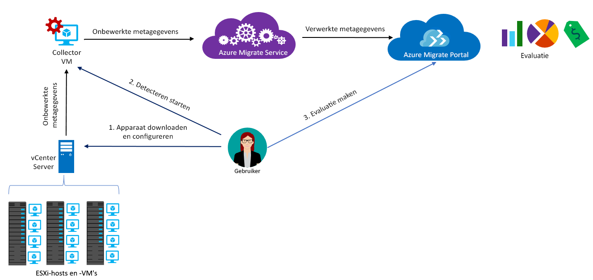

# Over Azure Migrate

De service Azure Migrate beoordeelt on-premises workloads voor migratie naar Azure. De service beoordeelt de geschiktheid voor migratie van on-premises machines en stelt de grootte in op basis van prestaties. Daarnaast geeft de service kostenschattingen voor het uitvoeren van uw on-premises machines in Azure. Als u lift-and-shift-migraties overweegt of zich nog in de beginfase van de evaluatie van de migratie bevindt, is deze service geschikt voor u. Na de evaluatie kunt u services zoals [Azure Site Recovery](https://docs.microsoft.com/azure/site-recovery/site-recovery-overview) en [Azure Database Migration Service](https://docs.microsoft.com/azure/dms/dms-overview) gebruiken om de machines te migreren naar Azure.

## Waarom Azure Migrate gebruiken?

Azure Migrate helpt u bij het volgende:

- **Azure-gereedheid beoordelen**: Bepaal of uw on-premises machines geschikt zijn om te worden uitgevoerd in Azure.
- **Aanbevelingen voor grootte krijgen**: Krijg aanbevolen groottes voor virtuele Azure-machines na de migratie, op basis van de prestatiegeschiedenis van de on-premises virtuele machines.
- **Schatting van maandelijkse kosten**: Krijg de geschatte kosten voor het uitvoeren van on-premises machines in Azure.  
- **Migreren met hoge betrouwbaarheid**: Visualiseer afhankelijkheden van lokale computers om groepen computers te maken die u samen wilt beoordelen en migreren.

## Huidige beperkingen

- U kunt alleen on-premises VMware-VM’s (virtuele machines) beoordelen voor migratie naar Azure-VM’s. De VMware-VM's moeten worden beheerd door een vCenter Server (versie 5.5, 6.0 of 6.5).
- Als u Hyper-VM's en fysieke servers wilt beoordelen, gebruikt u de [Azure Site Recovery Deployment Planner](https://aka.ms/asr-dp-hyperv-doc) voor Hyper-V, en onze [hulpprogramma's van partners](https://azure.microsoft.com/migration/partners/) voor fysieke computers.
- U kunt maximaal 1500 VM's detecteren in een enkele detectieronde en maximaal 1500 VM's in een enkel project. Bovendien kunt u maximaal 1500 VM's beoordelen in een enkele beoordeling.
- Als u een grotere omgeving wilt detecteren, kunt u de detectie splitsen en meerdere projecten maken. [Meer informatie](how-to-scale-assessment.md). Azure Migrate ondersteunt maximaal 20 projecten per abonnement.
- Azure Migrate biedt voor migratiebeoordeling alleen ondersteuning voor beheerde schijven.
-  U kunt een Azure Migrate-project alleen in de volgende geografische gebieden maken. Dit beperkt echter niet de mogelijkheid voor het maken van beoordelingen voor andere Azure-doellocaties.
    **Geografie** | **Opslaglocatie**
    --- | ---
    Azure Government | VS (overheid) - Virginia
    Europa | Europa - noord of Europa - west
    Verenigde Staten | US - oost of US - west-centraal

    De geografie die bij het migratieproject hoort, wordt gebruikt om de gedetecteerde metagegevens uit de on-premises omgeving op te slaan. Metagegevens worden opgeslagen in een van de regio's op basis van de geografische locatie die voor het migratieproject is opgegeven. Als u visualisatie van afhankelijkheden gebruikt door een nieuwe Log Analytics-werkruimte te maken, wordt deze gemaakt in dezelfde als het project.
- De functie voor visualisatie van afhankelijkheden is niet beschikbaar in Azure Government.

## Waar moet ik voor betalen?

Meer informatie over prijzen voor Azure Migrate vindt u [hier](https://azure.microsoft.com/pricing/details/azure-migrate/).

## Waaruit bestaat een evaluatie?

Instellingen voor evaluatie kunnen worden aangepast op basis van uw behoeften. Evaluatie-eigenschappen worden samengevat in de volgende tabel.

**Eigenschap** | **Details**
--- | ---
**Doellocatie** | De Azure-locatie waarnaar u wilt migreren.  Azure Migrate biedt momenteel ondersteuning voor 33 regio’s als doellocaties voor migratie. [Regio's controleren](https://azure.microsoft.com/global-infrastructure/services/). De doellocatie is standaard ingesteld op US - west 2.
**Opslagtype** | Het type beheerde schijven dat u wilt toewijzen aan alle VM’s die onderdeel uitmaken van de evaluatie. Als het groottecriterium *aanpassen van de grootte op basis van on-premises* is, kunt u het type doelschijf opgeven als Premium-schijven (standaard), standaard-SSD-schijven of standaard-HDD-schijven. Voor *aanpassen van de grootte op basis van prestaties* hebt u, naast de bovenstaande opties, ook de optie om Automatisch te selecteren. Dit zorgt ervoor dat de aanbeveling voor het aanpassen van de schijfgrootte automatisch gebeurd op basis van de prestatiegegevens van de VM’s. Als u bijvoorbeeld een [enkel exemplaar VM SLA van 99.9%](https://azure.microsoft.com/support/legal/sla/virtual-machines/v1_8/) wilt bereiken, moet u het opslagtype opgeven als beheerde Premium-schijven. Dit zorgt ervoor dat alle schijven in de evaluatie worden aanbevolen als beheerde Premium-schijven. Houd er rekening mee dat Azure Migrate voor migratiebeoordeling alleen ondersteuning voor beheerde schijven biedt.
**Gereserveerde instanties** |  Of u [gereserveerde instanties](https://azure.microsoft.com/pricing/reserved-vm-instances/) in Azure hebt. Azure Migrate maakt dienovereenkomstig een schatting van de kosten.
**Criterium voor het aanpassen van de grootte** | U kunt de grootte aanpassen op basis van de **prestatiegeschiedenis** van de on-premises VM's (standaard) of **als on-premises** zonder rekening te houden met de prestatiegeschiedenis.
**Prestatiegeschiedenis** | Azure Migrate evalueert de prestaties van on-premises machines standaard aan de hand van de prestatiegeschiedenis van de afgelopen dag, met een percentielwaarde van 95%.
**Comfortfactor** | Tijdens de evaluatie houdt Azure Migrate rekening met een buffer (comfortfactor). Deze buffer wordt toegepast boven op de gegevens over machinegebruik voor VM's (CPU, geheugen, schijf en netwerk). De comfortfactor houdt rekening met factoren zoals seizoensgebonden gebruik, een korte prestatiegeschiedenis en een mogelijke gebruikstoename in de toekomst.   Een VM met 10 kernen en een gebruik van 20% komt bijvoorbeeld gewoonlijk overeen met een VM met 2 kernen. Met een comfortfactor van 2,0x is het resultaat echter een VM met 4 kernen. De standaardinstelling voor comfort is 1,3x.
**VM-reeks** | De VM-reeks die voor schattingen van grootte wordt gebruikt. Als u bijvoorbeeld een productieomgeving hebt die u niet gaat migreren naar de A-serie van virtuele machines in Azure, kunt u de A-serie uitsluiten van de lijst of reeks. Grootte is alleen gebaseerd op de geselecteerde reeks.   
**Valuta** | Factureringsvaluta. De standaardinstelling is Amerikaanse dollars.
**Korting (%)** | Een abonnement-specifieke korting die u bovenop de Azure-aanbieding ontvangt. De standaardinstelling is 0%.
**VM tijd actief** | Als uw VM's niet 24 x 7 worden uitgevoerd in Azure, kunt u de duur (aantal dagen per maand en aantal uur per dag) opgeven waarin ze worden uitgevoerd. De kostenschattingen worden dan overeenkomstig berekend. De standaardwaarde is 31 dagen per maand en 24 uur per dag.
**Azure-aanbieding** | De [Azure-aanbieding](https://azure.microsoft.com/support/legal/offer-details/) waarop u bent geregistreerd. Azure Migrate maakt dienovereenkomstig een schatting van de kosten.
**Azure Hybrid Benefit** | Geef op of u Software Assurance hebt en in aanmerking komt voor [Azure Hybrid Benefit](https://azure.microsoft.com/pricing/hybrid-use-benefit/) voor de korting op de kosten.

## Hoe werkt Azure Migrate?

1.  U maakt een Azure Migrate-project.
2.  Azure Migrate gebruikt een on-premises VM, het collectorapparaat genoemd, om informatie over uw on-premises machines te detecteren. U maakt dit apparaat door het installatiebestand in de Open Virtualization Appliance-indeling (.ova) te downloaden en als virtuele machine te importeren in uw on-premises VMware vCenter Server.
3. U maakt verbinding met de virtuele machine van vCenter Server en geeft hiervoor een nieuw wachtwoord op tijdens het verbinden.
4. U kunt de collector uitvoeren op de virtuele machine om detectie op te starten.
5. De collector verzamelt metagegevens van de VM's met behulp van PowerCLI-cmdlets van VMware. Detectie vindt plaats zonder agent en er wordt niets op de VMware-hosts of VM's geïnstalleerd. De verzamelde metagegevens bevatten informatie over de VM's (kernen, geheugen, schijven, schijfgroottes en netwerkadapters). Er worden ook prestatiegegevens van de VM's verzameld, met inbegrip van CPU- en geheugengebruik, schijf-IOPS, schijfdoorvoer (MBps) en netwerkuitvoer (MBps).
5.  De metagegevens worden doorgegeven aan het Azure Migrate-project. U kunt ze bekijken in Azure Portal.
6.  Voor evaluatiedoeleinden deelt u de gedetecteerde virtuele machines in groepen in. U kunt bijvoorbeeld virtuele machines groeperen waarin dezelfde applicatie wordt uitgevoerd. Voor een nauwkeurigere groepering kunt u afhankelijkheidsvisualisatie gebruiken om afhankelijkheden te bekijken van een specifieke computer, of voor alle computers in een groep, en de groep verfijnen.
7.  Nadat een groep is gedefinieerd, kunt u hiervoor een evaluatie maken.
8.  Nadat de evaluatie is voltooid, kunt u deze weergeven in de portal of downloaden in Excel-indeling.

  

## Wat zijn de poortvereisten?

De tabel geeft een overzicht van de poorten die nodig zijn voor communicatie met Azure Migrate.

Onderdeel | Communiceert met |  Details
--- | --- |---
Collector  | Azure Migrate-service | De collector maakt verbinding met de service via SSL-poort 443.
Collector | vCenter Server | Standaard maakt de collector verbinding met de VMware vCenter Server op poort 443. Als de server op een andere poort luistert, moet deze worden geconfigureerd als uitgaande poort in de collector-VM.
On-premises VM | Log Analytics-werkruimte | [TCP 443] | [De Microsoft Monitoring Agent (MMA)](../log-analytics/log-analytics-windows-agent.md) gebruikt TCP-poort 443 om verbinding te maken met Log Analytics. U hebt deze poort alleen nodig als u de functie voor visualisatie van afhankelijkheden gebruikt, die de MMA-agent vereist.

## Wat gebeurt er na de evaluatie?

Nadat u de on-premises machines hebt beoordeeld, kunt u een aantal hulpprogramma's gebruiken om de migratie uit te voeren:

- **Azure Site Recovery**: U kunt Azure Site Recovery gebruiken om te migreren naar Azure. Hiervoor moet u [de Azure-onderdelen voorbereiden](../site-recovery/tutorial-prepare-azure.md) die u nodig hebt, met inbegrip van een opslagaccount en een virtueel netwerk. On-premises moet u [uw VMware-omgeving voorbereiden](../site-recovery/vmware-azure-tutorial-prepare-on-premises.md). Als alles voorbereid is, stelt en schakelt u replicatie naar Azure in en migreert u de virtuele machines. [Meer informatie](../site-recovery/vmware-azure-tutorial.md).
- **Databasemigratie in Azure**: Als op uw on-premises machines een database zoals SQL Server, MySQL of Oracle wordt uitgevoerd, kunt u de [Azure Database Migration Service](../dms/dms-overview.md) gebruiken om ze te migreren naar Azure.

## Volgende stappen

- [Volg de zelfstudie](tutorial-assessment-vmware.md) om een evaluatie uit te voeren voor een on-premises VM met VMware.
- [Bekijk de veelgestelde vragen](resources-faq.md) over Azure Migrate.
