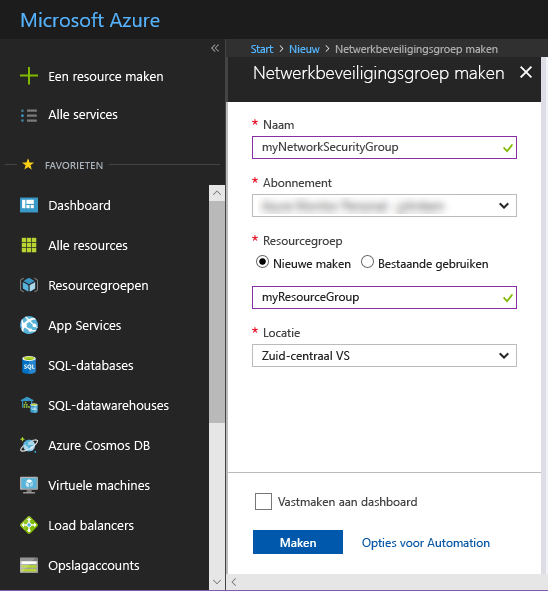
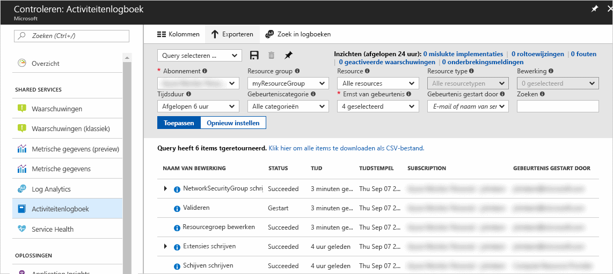
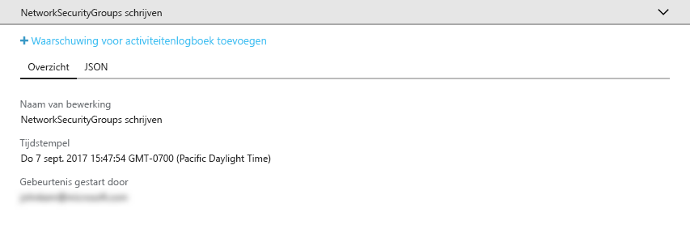
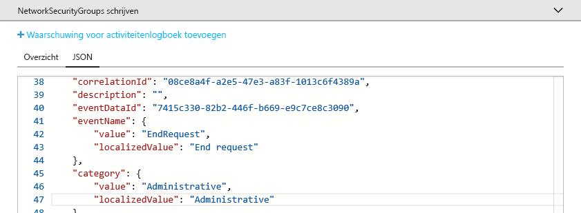
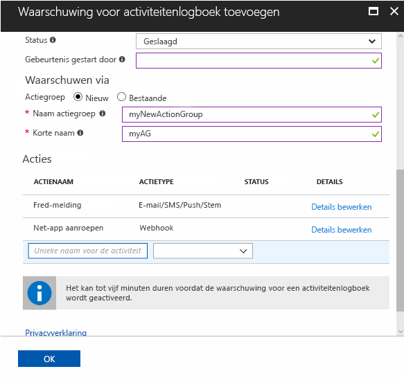

# Controleren en meldingen ontvangen over belangrijke acties in uw Azure-abonnement

Het **Azure-activiteitenlogboek** biedt een compleet overzicht van alle gebeurtenissen op abonnementsniveau in Azure. Het biedt informatie over *wie* *welke* resources heeft gemaakt, bijgewerkt of verwijderd, en *wanneer* ze dit hebben gedaan. U kunt een **waarschuwing voor activiteitenlogboek** maken, als u een e-mailbericht, sms-bericht of webhookmelding wilt ontvangen wanneer activiteiten plaatsvinden die voldoen aan de voorwaarden voor de waarschuwing. In deze quickstart wordt stapsgewijs uitgelegd hoe u een eenvoudige netwerkbeveiligingsgroep maakt, door het activiteitenlogboek bladert voor inzicht in de gebeurtenis die heeft plaatsgevonden, en vervolgens een waarschuwing voor activiteitenlogboek maakt om een melding te ontvangen wanneer hierna een netwerkbeveiligingsgroep wordt gemaakt.

Als u nog geen Azure-abonnement hebt, maakt u een [gratis account](https://azure.microsoft.com/free/) voordat u begint.

## Aanmelden bij Azure Portal

Meld u aan bij [Azure Portal](https://portal.azure.com/).

## Een netwerkbeveiligingsgroep maken

1. Klik op de knop **Nieuw** in de linkerbovenhoek van Azure Portal.

2. Selecteer **Netwerken**, en selecteer vervolgens **Netwerkbeveiligingsgroep**.

3. Voer myNetworkSG in bij **Naam** en maak een nieuwe resourcegroep met de naam **myResourceGroup**. Klik op de knop **Maken**.

    

## Blader naar het activiteitenlogboek in de portal

Er is nu een gebeurtenis toegevoegd aan het activiteitenlogboek waarin het maken van de netwerkbeveiligingsgroep wordt beschreven. Gebruik de volgende instructies om deze gebeurtenis te identificeren.

1. Klik in de navigatielijst aan de linkerkant op de knop **Controleren**. Hiermee wordt de sectie Activiteitenlogboek geopend. Deze sectie bevat een compleet overzicht van alle acties die gebruikers hebben uitgevoerd voor resources in uw abonnement. U kunt deze acties filteren op **Resourcegroep**, **Duur** en **Categorie**.

2. Klik in de sectie **Activiteitenlogboek** op de vervolgkeuzelijst **Resourcegroep** en selecteer **myResourceGroup**. Wijzig de vervolgkeuzelijst **Duur** in **Afgelopen uur**. Klik op **Toepassen**.

    

3. Klik op de gebeurtenis **Netwerkbeveiligingsgroep schrijven** in de tabel met gebeurtenissen die wordt weergegeven.

## Blader naar een gebeurtenis in het activiteitenlogboek

De sectie die wordt weergegeven, bevat algemene informatie over de bewerking die is uitgevoerd, zoals de naam, de tijdstempel en de gebruiker of toepassing die de bewerking heeft uitgevoerd.

Klik op het tabblad **JSON** om de volledige gebeurtenisdetails weer te geven. Dit is inclusief details over hoe de gebruiker of toepassing is geautoriseerd om de bewerking uit te voeren, het niveau en de categorie van de gebeurtenis, en de status van de bewerking.

## Een waarschuwing voor activiteitenlogboek maken

1. Klik op het tabblad **Samenvatting** om terug te keren naar de samenvatting van de gebeurtenis.

2. Klik in de samenvatting die wordt weergegeven, op **Waarschuwing voor activiteitenlogboek toevoegen**.

    

3. Geef in de sectie die wordt weergegeven, een naam en beschrijving op voor de waarschuwing voor activiteitenlogboek.

4. Controleer of onder **Criteria** de optie **Gebeurteniscategorie** is ingesteld op **Administratief**, **Resourcetype** is ingesteld op **Netwerkbeveiligingsgroep**, **Naam van bewerking** is ingesteld op **Netwerkbeveiligingsgroep maken of bijwerken** en **Status** is ingesteld op **Voltooid**, en of alle andere criteriavelden leeg zijn of ingesteld op **Alle**. Deze criteria definiëren de regels die worden gebruikt om te bepalen of de waarschuwing moet worden geactiveerd wanneer een nieuwe gebeurtenis verschijnt in het activiteitenlogboek.

    

5. Selecteer onder **Waarschuwing via** de optie **Nieuwe** actiegroep en geef een **naam** en **korte naam** op voor de actiegroep. De actiegroep definieert de set acties die wordt uitgevoerd wanneer de waarschuwing is geactiveerd (als de criteria overeenkomen met een nieuwe gebeurtenis).

6. Voeg onder **Acties** een of meer acties toe door het volgende op te geven: een **Naam** voor de actie, het **Actietype** (bijvoorbeeld, e-mail- of sms-bericht) en de **Details** voor dit specifieke actietype (bijvoorbeeld, een webhook-URL, e-mailadres of SMS-nummer).

    

7. Klik op **OK** om de waarschuwing voor activiteitenlogboek op te slaan.

## De waarschuwing voor activiteitenlogboek testen

> [!NOTE]
> Het duurt ongeveer 10 minuten voordat een waarschuwing voor activiteitenlogboek volledig is ingeschakeld. Nieuwe gebeurtenissen die plaatsvinden voordat de waarschuwing voor activiteitenlogboek volledig is ingeschakeld, genereren geen meldingen.
>
>

Als u de waarschuwing wilt testen, herhaalt u de vorige sectie **Een netwerkbeveiligingsgroep maken**, maar geeft u deze netwerkbeveiligingsgroep een andere naam en gebruikt u de bestaande resourcegroep opnieuw. Binnen enkele minuten ontvangt u een melding dat de netwerkbeveiligingsgroep is gemaakt.

## Resources opschonen

Verwijder de resourcegroep en de netwerkbeveiligingsgroep wanneer u deze niet meer nodig hebt. Typ hiervoor in het tekstvak boven aan de portal de naam van de resourcegroep die u hebt gemaakt, en klik op de naam van de resourcegroep. Klik in de sectie die wordt weergegeven, op de knop **Resourcegroep verwijderen**, typ de naam van de resourcegroep en klik op **Verwijderen**.

## Volgende stappen

In deze quickstart hebt u een bewerking uitgevoerd voor het genereren van een gebeurtenis in een activiteitenlogboek, en hebt u vervolgens een waarschuwing voor activiteitenlogboek gemaakt zodat u een melding ontvangt wanneer deze bewerking in de toekomst opnieuw wordt uitgevoerd. Vervolgens hebt u de waarschuwing getest door deze bewerking opnieuw uit te voeren. In Azure zijn gebeurtenissen in activiteitenlogboeken van de afgelopen 90 dagen beschikbaar. Als u gebeurtenissen langer dan 90 dagen wilt behouden, archiveert u ook de gegevens uit uw activiteitenlogboek naast de andere controlegegevens.

> [!div class="nextstepaction"]
> [Bewakingsgegevens archiveren](./monitor-tutorial-archive-monitoring-data.md)
