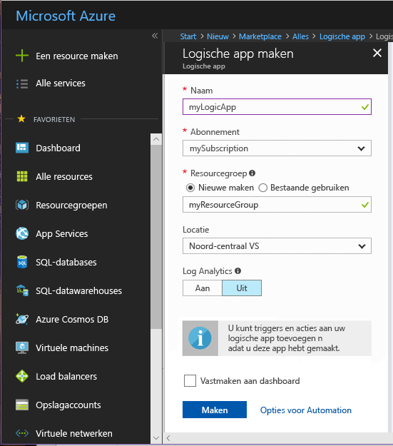
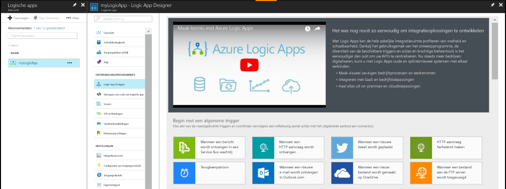
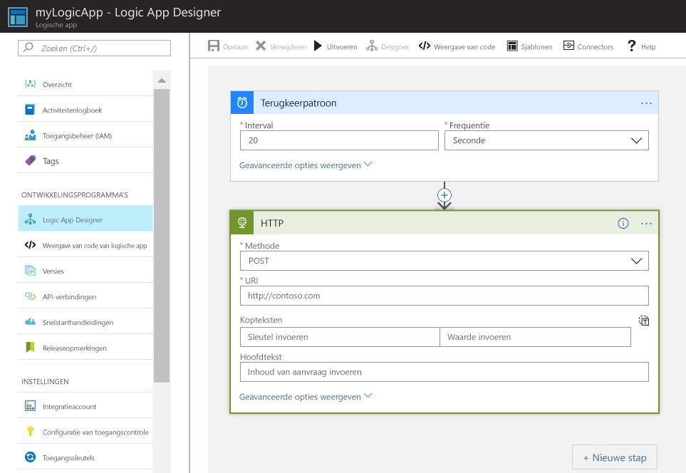
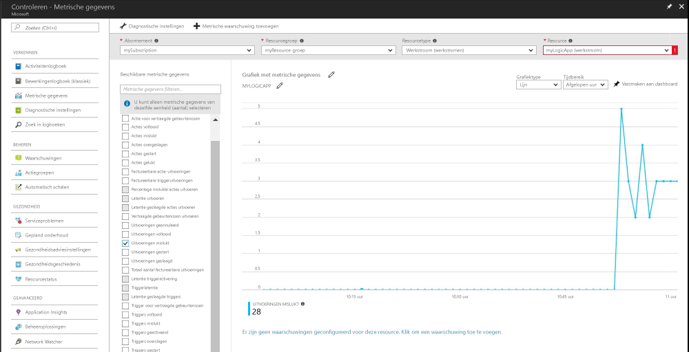

# Een melding ontvangen wanneer een metrische waarde voldoet aan een voorwaarde

Met Azure Monitor worden metrische gegevens beschikbaar gemaakt voor veel Azure-resources. Deze metrische gegevens geven inzicht in de prestaties en de status van deze resources. In veel gevallen wijzen metrische gegevens erop dat er iets mis is met een resource. U kunt waarschuwingen voor metrische gegevens instellen om te controleren op abnormaal gedrag. Wanneer er iets voorvalt, ontvangt u een melding. In deze quickstart wordt stapsgewijs uitgelegd hoe u een logische app en een taak maakt, en hoe u de metrische gegevens voor de logische app visueel kunt weergegeven. Vervolgens wordt beschreven hoe u een waarschuwing instelt en meldingen voor metrische gegevens ontvangt voor de logische app.

Zie [Azure Monitor metrics overview](./monitoring-overview-metrics.md) (Overzicht van metrische gegevens in Azure Monitor) en [Azure Monitor alerts overview](./monitoring-overview-alerts.md) (Overzicht van Azure Monitor-waarschuwingen) voor meer informatie over metrische gegevens en waarschuwingen voor metrische gegevens. 

Als u nog geen Azure-abonnement hebt, maakt u een [gratis account](https://azure.microsoft.com/free/) voordat u begint.

## Aanmelden bij Azure Portal

Meld u aan bij [Azure Portal](https://portal.azure.com/).

## Een logische app maken

1. Klik op de knop **Nieuw** in de linkerbovenhoek van Azure Portal.

2. Zoek en selecteer **Logische app**. Maak een nieuwe resourcegroep met de naam **myResourceGroup**. Gebruik hiervoor de standaardlocatie. Klik op de knop **Maken**.

3. Voer de gegevens voor de logisch app in en selecteer de optie **Vastmaken aan dashboard**. Klik op **Maken** wanneer u klaar bent.

      

4. De logische app moet worden vastgemaakt aan het dashboard. Navigeer naar de logische app door erop te klikken.

5. Selecteer in het paneel Logische app de functie **Ontwerper van logische app**

       

6. Stel de waarden in zoals weergegeven in het volgende diagram.

    . 

7. Selecteer in de ontwerpfunctie de trigger **Terugkeerpatroon**.

8. Stel een interval in van 20 en een frequentie van een seconde om ervoor te zorgen dat de logische app elke 20 seconden wordt geactiveerd.

9. Klik op de knop **Nieuwe stap** en selecteer **Een actie toevoegen**.

10. Kies de optie **HTTP** en selecteer **HTTP-HTTP**.

11. Stel **Methode** in op POST en stel de **URI** in op een webadres van uw keuze.

12. Klik op **Opslaan**.

## Metrische gegevens voor uw logische app weergeven

1. Klik op de optie **Controleren** in het navigatiedeelvenster aan de linkerkant.

2. Selecteer het tabblad **Metrische gegevens** en vul de logische app-gegevens in bij **Abonnement**, **Resourcegroep**, **Resourcetype** en **Resource**.

3. Kies **Gestarte uitvoeringen** in de lijst met metrische gegevens.

4. Wijzig het **Tijdsbereik** van de grafiek zodat de gegevens voor het afgelopen uur worden weergegeven.

5. U ziet nu een grafiek met het totale aantal uitvoeringen die het afgelopen uur zijn gestart met de logische app.

    

## Een waarschuwing voor metrische gegevens maken voor uw logische app

1.  Klik rechtsboven in het paneel met metrische gegevens op de knop **Waarschuwing voor metrische gegevens toevoegen**.

2. Geef de waarschuwing voor metrische gegevens de naam myLogicAppAlert en geef een korte beschrijving voor de waarschuwing.

3. Stel de **Voorwaarde** voor de waarschuwing voor metrische gegevens in op Groter dan, stel de **Drempelwaarde** in op 10, en stel de **Periode** in op In de afgelopen 5 minuten.

4. Voer ten slotte uw e-mailadres in bij **Aanvullende e-mailadressen voor beheerder**. Als u deze waarschuwing hebt ingesteld, ontvangt u een e-mailbericht als uw logische app binnen een periode van 5 minuten meer dan 10 mislukte uitvoeringen heeft.

    

## Waarschuwingen voor metrische gegevens ontvangen voor de logische app
1. Als het goed is, ontvangt u binnen enkele ogenblikken een e-mailbericht van Microsoft Azure-waarschuwingen waarin staat dat de waarschuwing is geactiveerd.

2. Ga terug naar de logische app en wijzig de trigger Terugkeerpatroon in een interval van 1 en wijzig de frequentie in uren.

3. Als het goed is, ontvangt u binnen enkele minuten een e-mailbericht van Microsoft Azure-waarschuwingen waarin staat dat de waarschuwing is opgelost.

## Resources opschonen

Andere quickstarts in deze verzameling zijn gebaseerd op deze quickstart. Als u wilt doorgaan met andere quickstarts of met de zelfstudies, verwijdert u de resources die u in deze quickstart hebt gemaakt, niet. Als u niet wilt doorgaan, gebruikt u de volgende stappen om alle resources te verwijderen die tijdens deze Quick Start in Azure Portal zijn gemaakt.

1. Klik in het menu aan de linkerkant in Azure Portal op **Controleren**.

2. Selecteer het tabblad **Waarschuwingen**, ga naar de waarschuwing die u in deze quickstart hebt gemaakt, en klik erop.

3. Klik in het paneel voor de waarschuwing voor metrische gegevens op **Verwijderen**.

4. Zoek in het menu aan de linkerkant in Azure Portal naar **Logische app** en klik vervolgens op **Logische apps**.

5. Klik in het paneel op de logische app die u in deze quickstart hebt gemaakt in het tekstvak, en klik op **Verwijderen**.

## Volgende stappen

In deze quickstart hebt u geleerd hoe een waarschuwing voor metrische gegevens kunt maken voor uw resources. Klik verder naar het overzicht over waarschuwingen voor meer informatie over waarschuwingen voor metrische gegevens.

> [!div class="nextstepaction"]
> [Actiewaarschuwingen voor Azure Monitor-abonnementen](./monitor-quick-audit-notify-action-in-subscription.md )
