# Aan de slag met Azure Monitor
Azure Monitor is de platformservice die één bron biedt voor het bewaken van Azure-resources. Met Azure-Monitor kunt u visualiseren, query, routeren, archiveren en anders maatregelen nemen op de metrische gegevens en de logboeken die afkomstig zijn van bronnen in Azure. U kunt werken met het gebruik van deze gegevens met behulp van de Azure-portal [Monitor PowerShell-Cmdlets](insights-powershell-samples.md), [platformoverschrijdende CLI](insights-cli-samples.md), of [Monitor REST-API's van Azure](https://msdn.microsoft.com/library/dn931943.aspx). In dit artikel gebruiken we de demonstratieportal om enkele belangrijke onderdelen van Azure Monitor te belichten.

## Walkthrough
1. Navigeer in de portal naar **alle services** en zoek de **Monitor** optie. Klik op het sterpictogram om deze optie toe te voegen aan uw lijst met favorieten, zodat deze altijd eenvoudig toegankelijk is vanaf de navigatiebalk aan de linkerkant.

    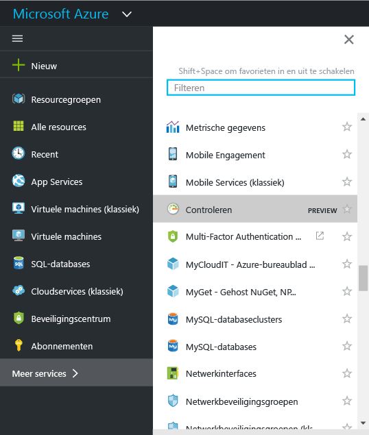
2. Klik op de **Monitor** optie voor het openen van de **Monitor** pagina. Deze pagina samenbrengt uw controle-instellingen en gegevens in één geconsolideerde weergave. Het eerst wordt geopend op de **overzicht** sectie. Het overzicht ziet u een updatepakket van alle waarschuwingen voor toepassingsbewaking, fouten en service health aanbevelingen die gerelateerd zijn aan resources in uw abonnement.  

    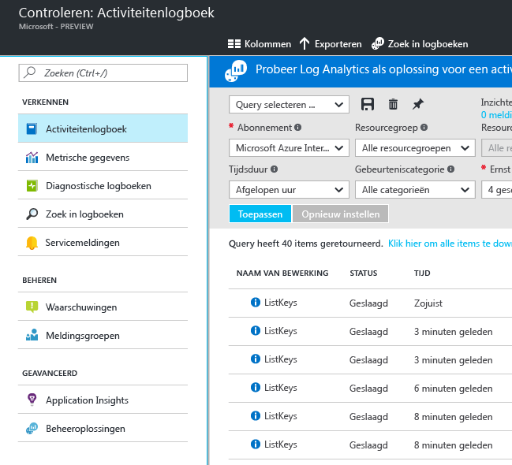

    Azure Monitor omvat drie basiscategorieën controlegegevens: het **activiteitenlogboek**, **metrische gegevens** en **diagnoselogboeken**.
3. Klik op **Activiteitenlogboek** om de sectie Activiteitenlogboek weer te geven.

    In [**Activiteitenlogboek**](monitoring-overview-activity-logs.md) worden alle bewerkingen beschreven die worden uitgevoerd voor resources binnen uw abonnement. Met behulp van het activiteitenlogboek kunt u nagaan wie resources heeft toegevoegd, bijgewerkt of verwijderd binnen uw abonnement, en wanneer dat is gebeurd en wat er is veranderd. In het activiteitenlogboek ziet u bijvoorbeeld wanneer een web-app is gestopt en wie deze heeft gestopt. Gebeurtenissen in het activiteitenlogboek worden opgeslagen op het platform en kunnen gedurende 90 dagen worden doorzocht.

    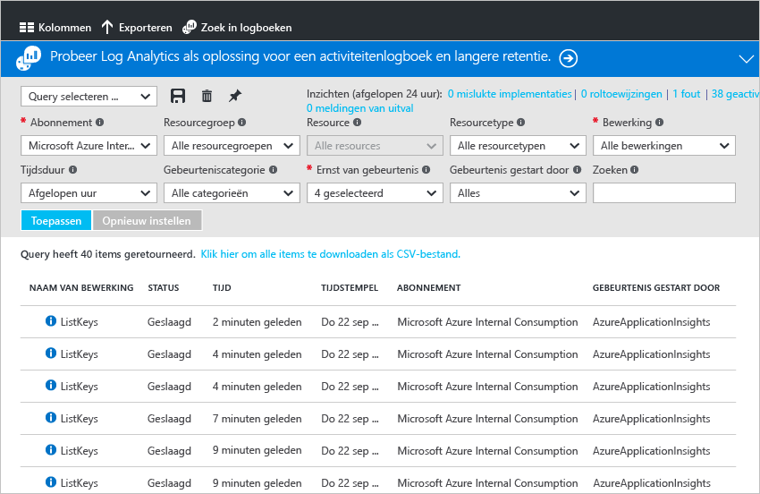
    
    U kunt query's voor algemene filters maken en opslaan en de belangrijkste query's vervolgens vastmaken aan een portal dashboard, zodat u altijd op de hoogte bent als er zich gebeurtenissen voordoen die voldoen aan uw criteria.
4. Filter de weergave voor een bepaalde resourcegroep in de afgelopen week en klik vervolgens op de knop **Opslaan**. De query een naam geven. 

    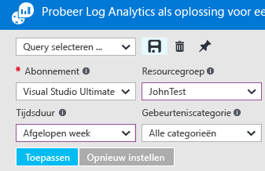
5. Klik vervolgens op de knop **Vastmaken**.

    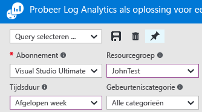

    De meeste weergaven in dit scenario kunnen worden vastgemaakt aan een dashboard. Hierdoor beschikt u over een enkele bron van informatie voor operationele gegevens over uw services.
6. Ga terug naar uw dashboard. Nu kunt u zien of de query (en het aantal resultaten) wordt weergegeven in het dashboard. Dit is handig als u snel zien hoogwaardig acties die onlangs zijn opgetreden in uw abonnement wilt, bijvoorbeeld een nieuwe rol is toegewezen of een virtuele machine is verwijderd.

    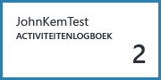
7. Ga terug naar de tegel **Monitor** en klik op de sectie **Metrische gegevens**. U moet eerst een resource selecteren door het filteren en te selecteren met behulp van de opties van de vervolgkeuzelijst aan de bovenkant van de pagina.

    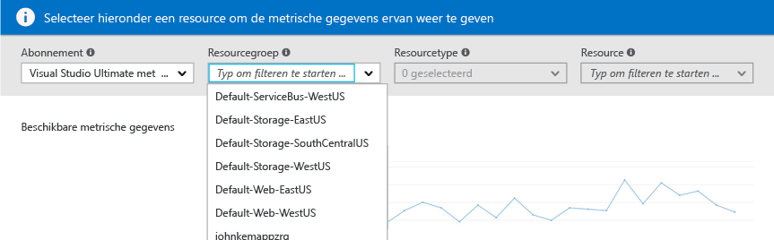

    [**Metrische gegevens**](monitoring-overview-metrics.md) zijn beschikbaar voor alle Azure-resources. In deze weergave ziet u alle metrische gegevens bij elkaar, zodat u gemakkelijk inzicht krijgt in de prestaties van uw resources. Bekijk ook onze merk [nieuwe metrische gegevens voor grafieken ervaring](https://aka.ms/azuremonitor/new-metrics-charts) door te klikken op de **metrische gegevens (preview)** tabblad.
8. Wanneer u een resource hebt geselecteerd, worden alle beschikbare metrische gegevens weergegeven aan de linkerkant van de pagina. U kunt meerdere metrische gegevens tegelijk in grafiekvorm weergeven door de metrische gegevens te selecteren en het grafiektype en tijdsbereik aan te passen. U kunt ook alle metrische waarschuwingen weergeven die zijn ingesteld voor deze resource.

    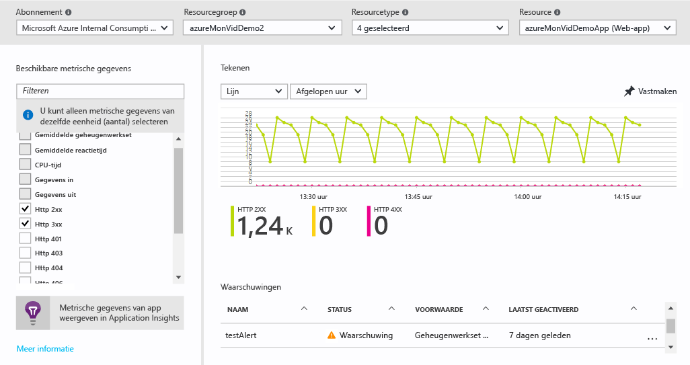

   > [!NOTE]
   > Sommige metrische gegevens zijn alleen beschikbaar door in te schakelen [Application Insights](../application-insights/app-insights-overview.md) en/of een Windows- of Linux Azure Diagnostics-extensie van uw resources.
   >
   >
9. Wanneer u tevreden bent met de grafiek, kunt u deze vastmaken aan het dashboard met de knop **Vastmaken**.
10. Ga terug naar **Monitor** en klik op **diagnostische logboeken**.

    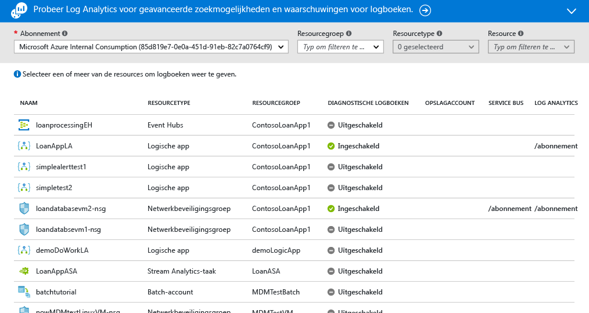

    [**Diagnostische logboeken**](monitoring-overview-of-diagnostic-logs.md) zijn logboeken *van* een resource met gegevens over de werking van die resource. Tellers van regels voor netwerkbeveiligingsgroepen en werkstroomlogboeken van logische apps zijn bijvoorbeeld allebei een type diagnostisch logboek. Deze logboeken kunnen worden opgeslagen in een opslagaccount, worden gestreamd naar een Event Hub, en/of worden verzonden naar [Log Analytics](../log-analytics/log-analytics-overview.md). Log Analytics is het operationele intelligence product van Microsoft voor geavanceerde zoekopdrachten en waarschuwingen.

    In de portal kunt u een lijst met alle resources binnen uw abonnement weergeven en filteren om te bepalen of diagnostische logboeken zijn ingeschakeld voor die resources.
11. Klik op een bron op de pagina Diagnostische logboeken. Als diagnostische logboeken worden opgeslagen in een opslagaccount, ziet u een lijst met uurlogboeken die u rechtstreeks kunt downloaden.

    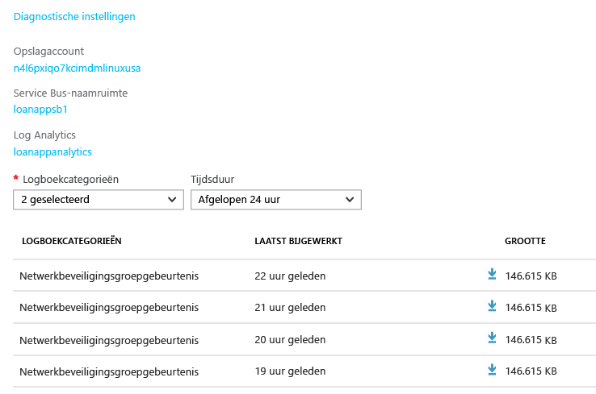

    U kunt ook klikken op **Diagnostische instellingen** om uw instellingen te configureren of wijzigen. U kunt hier opgeven of u logboeken wilt archiveren in een opslagaccount, streamen naar Event Hubs of verzenden naar een Log Analytics-werkruimte.

    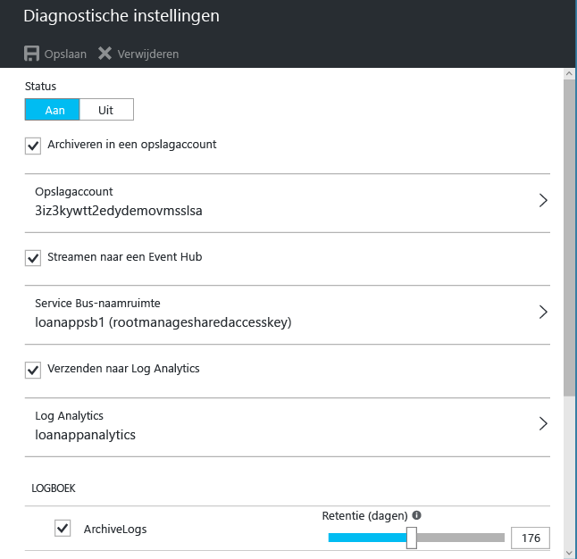

    Als u diagnostische logboeken hebt ingesteld op Log Analytics, dan kunt u de logboeken doorzoeken in de sectie **Zoeken in logboeken** op de portal.
12. Navigeer naar de **waarschuwingen (klassiek)** sectie van de Monitor-pagina.

    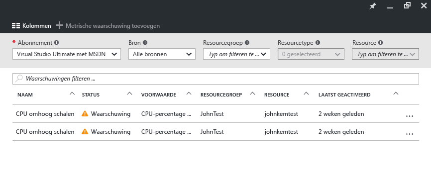

    Hier kunt u alle beheren [ **klassieke waarschuwingen** ](monitoring-overview-alerts.md) op uw Azure-resources. Dit omvat waarschuwingen op de metrische gegevens, logboekgebeurtenissen activiteit, Application Insights-webtests (locaties) en Application Insights proactieve diagnostische gegevens. Waarschuwingen verbinding met de Actiegroepen. [Actiegroepen](monitoring-action-groups.md) bieden een manier om de gebruiker waarschuwen of bepaalde acties uitvoeren wanneer een waarschuwing wordt geactiveerd. 
    
13. Klik op **Metrische waarschuwing toevoegen** om een waarschuwing te maken.

    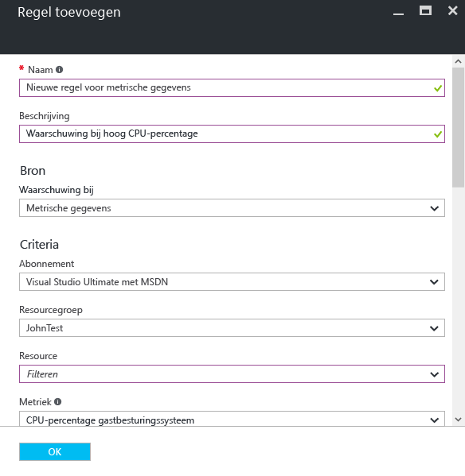

    Vervolgens kunt u een waarschuwing vastmaken aan uw dashboard om gemakkelijk de status te kunnen zien op elk gewenst moment.

    Azure Monitor nu ook heeft [ **nieuwere waarschuwingen** ](https://aka.ms/azuremonitor/near-real-time-alerts) die met een frequentie van elke minuut zo laag kan worden geëvalueerd.
    
14. De sectie Monitor bevat ook koppelingen naar [Application Insights](../application-insights/app-insights-overview.md)-toepassingen en [Log Analytics](../log-analytics/log-analytics-overview.md)-beheeroplossingen. Deze andere Microsoft-producten zijn vergaand geïntegreerd met Azure Monitor.
15. Als u Application Insights of Log Analytics niet gebruikt, dan werkt Azure Monitor mogelijk samen met de producten van derden die u gebruikt voor controle, logboekregistratie en waarschuwingen. Zie onze [partnerpagina](monitoring-partners.md) voor een volledige lijst en instructies voor de integratie van de betreffende producten.

Als u deze stappen volgt en alle relevante tegels vastmaakt aan een dashboard, dan kunt u uitgebreide overzichten van uw toepassing en -infrastructuur maken, zoals deze:

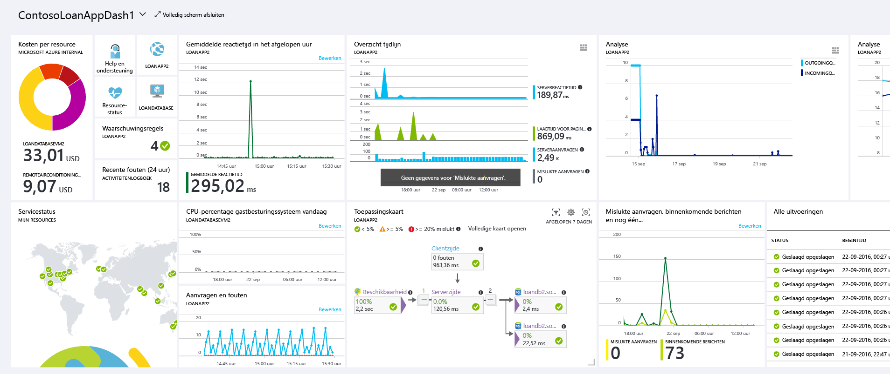

## Volgende stappen
* Lees de [overzicht van alle Azure controlehulpprogramma's](monitoring-overview.md) om te begrijpen hoe Azure-Monitor met hen werkt. 

