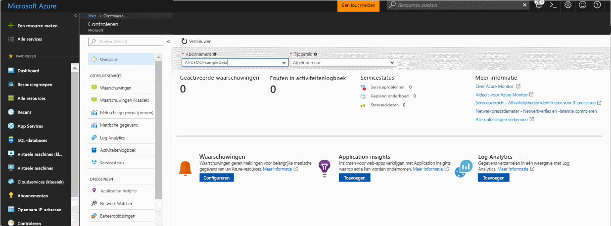
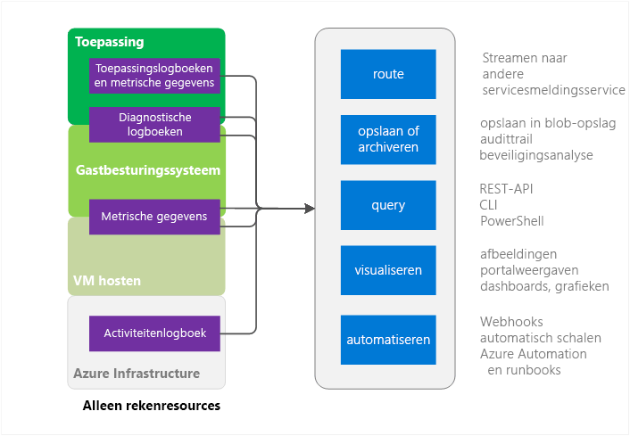
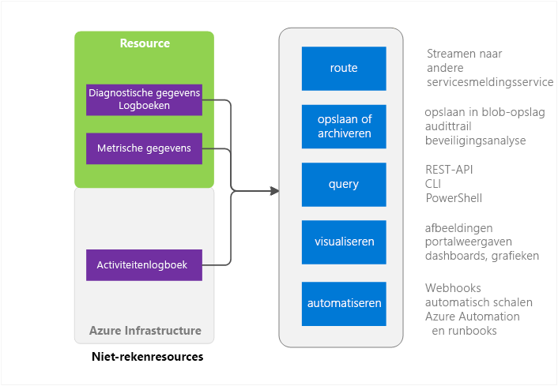

# Overzicht van Azure Monitor
Dit artikel bevat een overzicht van de Monitor van de Azure-service in Microsoft Azure. Monitor voor Azure biedt en bevat koppelingen naar aanvullende informatie over het gebruik van Azure-Monitor wordt besproken.  Als u liever een video-inleiding, Zie de volgende stappen koppelingen onder aan dit artikel. 

## Monitor voor Azure en Microsoft's andere bewaking producten
Azure biedt een infrastructuur basisondersteuning metrische gegevens en logboeken voor de meeste services in Microsoft Azure. Azure-services die nog plaats niet hun gegevens naar Azure-Monitor wordt deze geplaatst er in de toekomst.

Microsoft geleverd aanvullende producten en services die extra bewakingsmogelijkheden bieden voor ontwikkelaars, DevOps of IT-Ops waarvoor ook on-premises installaties. Zie voor een overzicht van en kennis van hoe deze verschillende producten en services samenwerken [bewaken in Microsoft Azure](monitoring-overview.md).

## Van de portal-overzichtspagina

Azure Monitor heeft een startpagina waarmee gebruikers: 
- De mogelijkheden voor bewaking door Azure begrijpen.
- Detecteren, configureren, en ingebouwde Azure-platform- en premium bewakingsmogelijkheden.

Terwijl de Monitor van de Azure-service wordt uitgebracht, is de overzichtspagina van landingspagina preview. 

De pagina is een startpunt voor navigatie, met inbegrip van op twee locaties. Curated problemen die aandacht vereisen van andere services worden weergegeven en kan de gebruiker Navigeer in de context.
 

Wanneer u de pagina opent, kunt u kiezen uit de abonnementen leestoegang tot. Voor een geselecteerde abonnement, kunt u het volgende zien:

- **Waarschuwingen en meldingen bronnen geactiveerd** - deze tabel wordt het aantal samenvatting weergegeven, waarschuwing bronnen, en hoe vaak waarschuwingen die zijn gestart voor de geselecteerde duur. Dit geldt voor zowel de metrische gegevens en de activiteit logboek waarschuwingen. *< bewerken: waarschuwingen (Preview) met uniforme wijze van werken ook weergegeven voor alle waarschuwingen - gebeurtenissen, metrische gegevens en Logboeken >*
- **Fouten in het logboek activiteit** -als een van uw Azure-resources om foutniveau prioriteit logboekgebeurtenissen, kunt u een aantal op hoog niveau weergeven en klik verder naar de pagina activiteitenlogboek voor het onderzoeken van elke gebeurtenis.
- **Status van de Azure-Service** -ziet u een aantal problemen met de service, gebeurtenissen voor gepland onderhoud en health aanbevelingen servicestatus. Status van de Azure-Service biedt persoonlijke informatie wanneer problemen in de Azure-infrastructuur invloed zijn op uw services.  Zie [Azure-servicestatus](../service-health/service-health-overview.md) voor meer informatie.  
- **Application Insights** -Zie KPI's voor elke resource AppInsights in het huidige abonnement. De KPI's zijn geoptimaliseerd voor servertoepassing bewaking buiten de ASP.NET-web-apps, Java, knooppunt en algemene toepassingstypen. De KPI's zijn metrische gegevens voor de frequentie van aanvragen, reactieduur Faalpercentage en beschikbaarheid %. 

Als u hebt geen geïntegreerde logboekanalyse of Application Insights, of als u geen Azure-waarschuwingen in het huidige abonnement niet hebt geconfigureerd, wordt de pagina bevat koppelingen om te beginnen met uw op twee locaties.

## Bronnen in Azure Monitor - Compute subset

De Compute-services bevatten 
- Cloud Services 
- Virtuele machines 
- Virtuele-machineschaalsets 
- Service Fabric

### Toepassing - Logboeken met diagnostische gegevens, logboeken en metrische gegevens
Toepassingen kunnen worden uitgevoerd in het Gastbesturingssysteem in het compute-model. Ze verzenden hun eigen set logboeken en metrische gegevens. Azure Monitor afhankelijk van de Azure extensie voor diagnostische gegevens (Windows of Linux) om de meeste niveau metrische gegevens voor een toepassing en logboeken te verzamelen. De volgende typen

* Prestatiemeteritems
* Toepassingslogboeken
* Windows-gebeurtenislogboeken
* De gebeurtenisbron .NET
* IIS-logboeken
* ETW op basis van het manifest
* Crashdumps
* Klant-foutenlogboeken

Zonder de extensie voor diagnostische gegevens zijn slechts enkele metrische gegevens zoals CPU-gebruik beschikbaar. 

### Host en de Gast-VM metrische gegevens
De eerder vermelde rekenresources hebben een toegewezen VM-host en het gastbesturingssysteem ze met communiceren. De VM-host en de Gast OS komen overeen met de basis-VM en Gast-VM in het model van de hypervisor Hyper-V. U kunt metrische gegevens verzamelen op beide. U kunt ook diagnostische logboeken verzamelen op het gastbesturingssysteem.   

### Activiteitenlogboek
U kunt het activiteitenlogboek (eerder operationele of controlelogboeken genoemd) voor meer informatie zoeken over uw resource, zoals weergegeven door de Azure-infrastructuur. Het logboek bevat informatie zoals de tijden waarop resources worden gemaakt of vernietigd.  Zie voor meer informatie [overzicht activiteitenlogboek](monitoring-overview-activity-logs.md). 

## Azure Monitor bronnen - rest

### Resource - diagnostische logboeken en metrische gegevens
Verzamelbaar metrische gegevens en diagnostische logboeken variëren, afhankelijk van het brontype. Web-Apps biedt bijvoorbeeld statistieken op de schijf-i/o en het percentage CPU. Deze metrische gegevens bestaan voor een Service Bus-wachtrij die in plaats daarvan metrische gegevens zoals de grootte en het bericht doorvoer wachtrij biedt niet. Een lijst met verzamelbaar metrische gegevens voor elke resource is beschikbaar op [ondersteund metrische gegevens](monitoring-supported-metrics.md). 

### Host en de Gast-VM metrische gegevens
Er is niet noodzakelijkerwijs een 1:1-toewijzing tussen de bron en een bepaalde Host of Gast-VM zodat metrische gegevens niet beschikbaar zijn.

### Activiteitenlogboek
Het activiteitenlogboek is hetzelfde als voor de compute-bronnen.  

## Gebruikt voor het bewaken van gegevens
Nadat u uw gegevens verzamelt, kunt u ermee in Azure Monitor het volgende kunt doen.

### Route
Monitoringgegevens naar andere locaties kan worden gestreamd. 

Voorbeelden zijn:

- Verzenden naar Application Insights zodat u de bijbehorende uitgebreidere visualisatie en analyse hulpprogramma's kunt gebruiken.
- Verzenden naar Event Hubs, zodat u naar hulpprogramma's van derden doorsturen kunt. 

### Store en archiveren
Sommige bewakingsgegevens is al opgeslagen en beschikbaar zijn in de Azure-Monitor voor een bepaalde tijdsduur. 
- Metrische gegevens worden opgeslagen voor 30 dagen. 
- Logboekvermeldingen activiteit worden gedurende 90 dagen opgeslagen. 
- Diagnostische logboeken worden niet op alle opgeslagen. 

Als u wilt voor het opslaan van gegevens die langer zijn dan de perioden die hierboven worden genoemd, kunt u een Azure-opslag. Het bewaken van gegevens wordt opgeslagen in uw opslagaccount op basis van een bewaarbeleid instellen. U hoeft te betalen voor de ruimte die de gegevens in Azure-opslag in beslag. 

Een aantal manieren om deze gegevens te gebruiken:

- U kunt andere hulpprogramma's binnen of buiten Azure worden gelezen en verwerkt hebben eenmaal geschreven.
- U downloaden van de gegevens voor een lokale archief lokaal of uw bewaarbeleid in de cloud om gegevens te behouden voor langere tijd wijzigen.  
- U kunt de gegevens laten in Azure-opslag voor onbepaalde tijd voor archief doeleinden. 

### Query’s uitvoeren
U kunt de Azure Monitor REST API, cross-platform-opdrachtregelinterface (CLI)-opdrachten, PowerShell-cmdlets of de .NET SDK gebruiken voor toegang tot de gegevens in het systeem of de Azure-opslag

Voorbeelden zijn:

* Ophalen van gegevens voor een aangepaste bewaking toepassing die u hebt geschreven
* Maken van aangepaste query's en die gegevens verzenden naar een toepassing van derden.

### Visualiseren
De controlegegevens in de afbeeldingen en grafieken visualiseren, kunt u trends sneller dan het opzoeken van de gegevens zelf te vinden.  

Een aantal visualisatie methoden zijn:

* Azure Portal gebruiken
* Gegevens routeren naar Azure Application Insights
* Gegevens routeren naar Microsoft PowerBI
* De gegevens routeren naar een derde partij visualisatie hulpprogramma met behulp van live streamen of doordat het hulpprogramma lezen uit een archief dat in Azure-opslag

### Automatiseren
> [!NOTE]
> Als onderdeel van de lopende evolutie van waarschuwingen op Microsoft Azure wordt nu een uniforme ervaring voor waarschuwingen is voorbeeld wordt weergegeven. Meer informatie over [Azure waarschuwingen (Preview)](monitoring-overview-unified-alerts.md)

In de standaard Azure-waarschuwingen kunt u bewakingsgegevens trigger waarschuwingen of zelfs hele processen. Voorbeelden zijn:

* Gebruik gegevens naar de compute-exemplaren voor automatisch schalen omhoog of omlaag op basis van het laden van toepassingen.
* Verzend een e-mailberichten wanneer een metriek een vooraf ingestelde drempelwaarde overschrijdt.
* Een URL (webhook) voor het uitvoeren van een actie in een systeem buiten Azure aanroepen
* Starten van een runbook in Azure automation, zodat een waaier aan taken uitvoeren

## Methoden van de toegang tot Azure-Monitor
In het algemeen kunt u gegevens bijhouden, Routering en ophalen via een van de volgende methoden bewerken. Niet alle methoden zijn beschikbaar voor alle acties of gegevenstypen.

* [Azure Portal](https://portal.azure.com)
* [PowerShell](insights-powershell-samples.md)  
* [Platformoverschrijdende opdrachtregelinterface (CLI)](insights-cli-samples.md)
* [REST API](https://docs.microsoft.com/rest/api/monitor/)
* [.NET SDK](http://www.nuget.org/packages/Microsoft.Azure.Management.Monitor)

## Volgende stappen
Meer informatie over
- Een video-overzicht van alleen Azure-Monitor is beschikbaar op  
[Aan de slag met Azure Monitor](https://channel9.msdn.com/Blogs/Azure-Monitoring/Get-Started-with-Azure-Monitor). 
- Een video waarin wordt uitgelegd een scenario waarin u Azure-Monitor kunt is beschikbaar op [verkennen Microsoft Azure-bewaking en diagnostische gegevens](https://channel9.msdn.com/events/Ignite/2016/BRK2234) en [Azure Monitor in een video Ignite 2016](https://myignite.microsoft.com/videos/4977).
- Uitvoeren via de Azure-Monitor-interface in [aan de slag met Azure-Monitor](monitoring-get-started.md)
- Instellen van de [Azure Diagnostics Extensions](../azure-diagnostics.md) als u probeert te analyseren van problemen in uw Cloud-Service, de virtuele Machine virtuele machine instellen of Service Fabric-toepassing schalen.
- [Application Insights](https://azure.microsoft.com/documentation/services/application-insights/) als u te diagnostische problemen in uw App Service-Web-app probeert.
- [Het oplossen van Azure Storage](../storage/common/storage-e2e-troubleshooting.md) bij gebruik van Storage-Blobs, tabellen of wachtrijen
- [Meld u Analytics](https://azure.microsoft.com/documentation/services/log-analytics/) en de [Operations Management Suite](https://www.microsoft.com/oms/)
