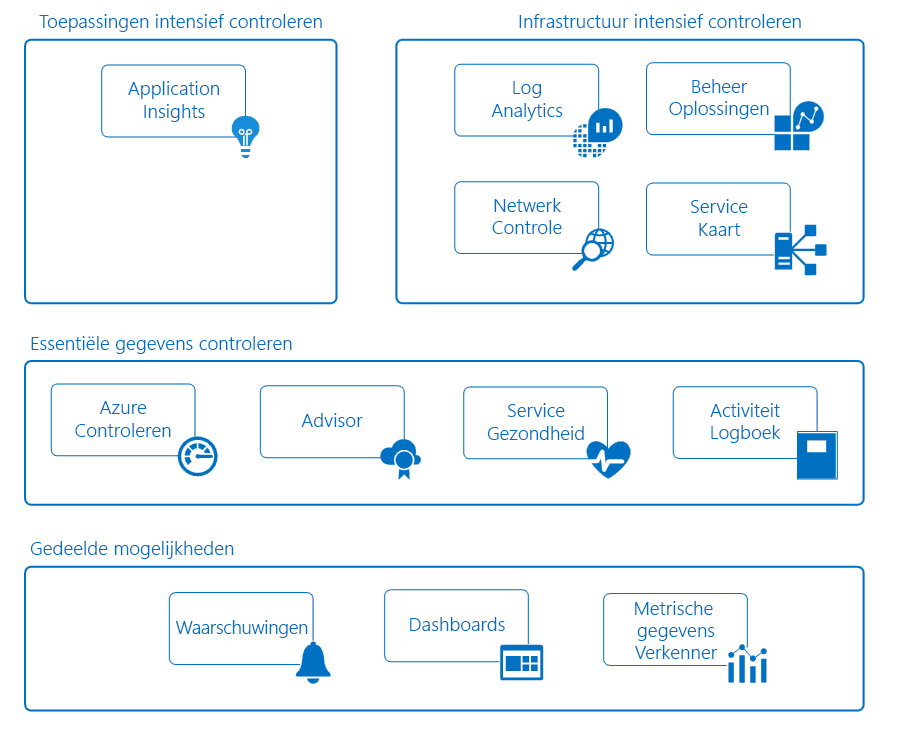

# Bewaking van de Azure-toepassingen en bronnen

Bewaking wordt het verzamelen en analyseren van gegevens om te bepalen van de prestaties, status en beschikbaarheid van uw zakelijke toepassingen en de resources die deze afhankelijk is. Een strategie voor een effectieve bewaking helpt u de gedetailleerde werking van de onderdelen van uw toepassing te begrijpen. Hiermee kunt u ook uw bedrijfstijd verbeteren door het verwittigen van kritieke problemen proactief zodat u deze oplossen kunt voordat ze problemen.

Azure bevat meerdere services die afzonderlijk uitvoeren van een bepaalde rol of de taak in de ruimte bewaking. Deze services leveren samen een uitgebreide oplossing voor het verzamelen, analyseren en fungeert voor telemetrie van uw toepassing en de Azure-resources die deze ondersteunen. Ze kunnen ook worden gebruikt voor het bewaken van kritieke lokale bronnen om te voorzien van een hybride omgeving bewaken. Kennis van de hulpprogramma's en gegevens die beschikbaar zijn, is de eerste stap bij het ontwikkelen van een strategie voor een volledige controle voor uw toepassing. 

Het volgende diagram toont een conceptueel overzicht van de onderdelen die samenwerken om te voorzien in bewaking van Azure-resources. De volgende secties beschrijven van deze onderdelen en bevatten koppelingen naar gedetailleerde technische informatie.

## Gedeelde mogelijkheden
De core en diepe bewaking service delen-functionaliteit die de volgende mogelijkheden biedt. 

### Waarschuwingen
[Waarschuwingen van Azure](../monitoring-and-diagnostics/monitoring-overview-alerts.md) proactief waarschuwen u essentiële voorwaarden en mogelijk corrigerende maatregelen te nemen. Waarschuwingsregels kunnen gegevens uit meerdere bronnen, met inbegrip van metrische gegevens en Logboeken gebruiken. Ze gebruiken [actiegroepen](../monitoring-and-diagnostics/monitoring-action-groups.md), die de unieke sets van ontvangers en bewerkingen in reactie op een waarschuwing bevat. U kunt waarschuwingen externe acties te starten via webhooks en integreren met uw ITSM hulpprogramma's op basis van uw vereisten, hebben.

### Dashboards
U kunt [Azure dashboards](../azure-portal/azure-portal-dashboards.md) verschillende soorten gegevens combineren tot één venster in de [Azure-portal](https://portal.azure.com). Vervolgens kunt u het dashboard delen met andere Azure-gebruikers. 

U kunt bijvoorbeeld een dashboard dat combineert maken:
- Tegels die een grafiek met metrische gegevens weergeven
- Een tabel met activiteitenlogboeken
- Een gebruiksgrafiek met informatie over het van Application Insights
- De uitvoer van een zoekopdracht logboek in Log Analytics

U kunt ook logboekanalyse gegevens exporteren naar [Power BI](https://docs.microsoft.com/power-bi/). Daar kunt u profiteren van extra visualisaties. Kunt u de gegevens beschikbaar voor anderen binnen en buiten uw organisatie.

### Metrics Explorer
[Metrische gegevens](../monitoring-and-diagnostics/monitoring-overview-metrics.md) zijn numerieke waarden die worden gegenereerd door een Azure-resource u informatie over de werking en prestaties van de resource. Met behulp van Metrics Explorer, kunt u verzenden metrische gegevens met Log Analytics voor analyse met gegevens uit andere bronnen.

## Kernbewaking
Kernbewaking biedt fundamentele, vereiste bewaking over Azure-resources. Deze services minimale configuratie vereisen en core telemetrie die gebruikmaken van de bewaking premium-services verzamelen.    

### Azure Monitor
[Monitor voor Azure](../monitoring-and-diagnostics/monitoring-overview-azure-monitor.md) kunt kernbewaking voor Azure-services doordat de verzameling van [metrische gegevens](../monitoring-and-diagnostics/monitoring-overview-metrics.md), [activiteitenlogboeken](../monitoring-and-diagnostics/monitoring-overview-activity-logs.md), en [diagnostische logboeken](../monitoring-and-diagnostics/monitoring-overview-of-diagnostic-logs.md). Bijvoorbeeld, het activiteitenlogboek geeft aan wanneer nieuwe resources zijn gemaakt of gewijzigd. 

Metrische gegevens beschikbaar zijn die prestatiestatistieken bieden voor verschillende bronnen en ook het besturingssysteem in een virtuele machine. U kunt deze gegevens bekijken met een van de explorers in de Azure portal en waarschuwingen op basis van deze metrische gegevens te maken. Azure biedt een pipeline-de snelste metrische gegevens (5 minuten naar beneden op 1 minuut), dus u deze voor tijd kritieke waarschuwingen en meldingen gebruiken moet. 

U kunt ook deze metrische gegevens en de logboeken Azure Log Analytics voor trends en gedetailleerde analyse verzenden of maken van aanvullende waarschuwingsregels proactief om u te waarschuwen van kritieke problemen als gevolg van deze analyse.  

### Azure Advisor
[Azure Advisor](../advisor/advisor-overview.md) voortdurend bewaakt uw resource configuratie en gebruik telemetrie. Vervolgens geeft u persoonlijke aanbevelingen op basis van best practices. Deze aanbevelingen, kunt u de prestaties, beveiliging en beschikbaarheid van de resources die ondersteuning bieden voor uw toepassingen verbeteren.

### Service Health
De status van uw toepassing, is afhankelijk van de Azure-services die afhankelijk zijn van. [Status van de Azure-Service](../service-health/service-health-overview.md) identificeert eventuele problemen met Azure-services die invloed kunnen zijn op uw toepassing. Status van de service helpt u bij het plannen voor gepland onderhoud.

### Activiteitenlogboek
[Activiteitenlogboek](../monitoring-and-diagnostics/monitoring-overview-activity-logs.md) biedt gegevens over de werking van een Azure-resource. Deze informatie omvat:
- Configuratiewijzigingen aan de resource.
- Service health incidenten.
- Aanbevelingen voor beter gebruik van de resource.
- Informatie met betrekking tot bewerkingen voor automatisch schalen. 

U kunt de logboeken voor een bepaalde bron weergeven op de pagina in de Azure-portal. Of u kunt de logboeken van meerdere resources in activiteit logboek Explorer weergeven. 

U kunt ook de logboekvermeldingen activiteit verzenden met logboekanalyse. Daar kunt u de logboeken analyseren met behulp van de gegevens die worden verzameld door oplossingen voor het beheer, agents op virtuele machines en andere bronnen.

## Services voor diepe bewaking
De volgende Azure-services bieden uitgebreide mogelijkheden voor het verzamelen en analyseren van controlegegevens op een dieper niveau. Deze services bouwen op kernbewaking en te profiteren van algemene functionaliteit in Azure. Ze bieden krachtige analytics verzamelde gegevens om u te bieden unieke inzichten in uw toepassingen en infrastructuur. Deze gegevens in de context van scenario's die bedoeld zijn voor verschillende doelgroepen.

## Diepe bewaking
### Application Insights
U kunt [Azure Application Insights](http://azure.microsoft.com/documentation/services/application-insights) voor het bewaken van de beschikbaarheid, prestaties en gebruik van uw toepassing of deze in de cloud of on-premises wordt gehost. 

Door het instrumenteren van uw toepassing met Application Insights werkt, kunt u veel inzicht bereiken en implementeren van DevOps-scenario's. U kunt snel zien en fouten opsporen zonder te wachten op om een gebruiker te rapporteren. Met de informatie die u hebt verzameld, kunt u geïnformeerd over opties voor het onderhoud en verbeteringen van uw toepassing. 

Application Insights bevat uitgebreide hulpprogramma's voor interactie met de gegevens die worden verzameld. Application Insights slaat gegevens op in een algemene opslagplaats. Deze kan profiteren van gedeelde functionaliteit, zoals waarschuwingen, dashboards en grondige analyse met de Log Analytics query language.

## Infrastructuur voor diepe bewaking
### Log Analytics
[Meld u Analytics](http://azure.microsoft.com/documentation/services/log-analytics) speelt een centrale rol in de Azure-bewaking door het verzamelen van gegevens uit diverse bronnen (met inbegrip van niet-Microsoft-hulpprogramma's) op één opslagplaats. Daar kunt u de gegevens analyseren met behulp van een krachtige querytaal. 

Application Insights en Azure Security Center kunt u hun gegevens opslaan in de logboekanalyse gegevens opslaan en gebruiken van de analyse-engine. Gegevens worden ook verzameld van de Azure-Monitor-, oplossingen voor het beheer- en agents zijn geïnstalleerd op virtuele machines in de cloud of on-premises. Deze gedeelde functionaliteit kunt u een volledig overzicht van uw omgeving vormen.

### Beheeroplossingen
[Oplossingen voor](../log-analytics/log-analytics-add-solutions.md) verpakte sets van logica die inzicht voor een bepaalde toepassing of service bieden. Ze afhankelijk van logboekanalyse opslaan en analyseren van de bewakingsgegevens die ze verzamelen. 

Oplossingen voor het beheer zijn van Microsoft en partners bewakingsfuncties voor verschillende Azure en services van derden beschikbaar. Voorbeelden van de bewaking van oplossingen zijn:
* [Bewaking van de container](../log-analytics/log-analytics-containers.md), waarmee u weergeven en beheren van de container-hosts.
* [Azure SQL-Analytics](../log-analytics/log-analytics-azure-sql.md), die worden verzameld en visualiseren maatstaven voor prestaties voor Azure SQL-databases.

U kunt alle beschikbare beheeroplossingen weergeven in de Azure-Portal onder de *Monitor* scherm. 

### Netwerkbewaking
Er zijn verschillende hulpprogramma's die samenwerken, zodat verschillende aspecten van uw netwerk te bewaken in Azure of on-premises.  

[Netwerk-Watcher](../network-watcher/network-watcher-monitoring-overview.md) biedt scenario's gebaseerde controle en diagnostische gegevens voor scenario's met verschillende netwerken in Azure. Gegevens worden opgeslagen in Azure metrische gegevens en diagnostische gegevens voor verdere analyse. Dit proces werkt met de volgende oplossingen voor het bewaken van verschillende aspecten van uw netwerk. 

[Performance Monitor (NPM) netwerk](https://blogs.msdn.microsoft.com/azuregov/2017/09/05/network-performance-monitor-general-availability/) een netwerk met een cloud-gebaseerde bewakingsoplossing, die wordt bewaakt connectiviteit tussen openbare clouds, datacenters en on-premises omgevingen.

[ExpressRoute-Monitor](https://azure.microsoft.com/en-in/blog/monitoring-of-azure-expressroute-in-preview/) is een NPM-functie die de end-to-end-connectiviteit en prestaties via Azure ExpressRoute-circuits bewaakt.

[DNS-Analytics](../log-analytics/log-analytics-dns.md) is een oplossing die biedt beveiliging, prestaties en bewerkingen gerelateerd insights, op basis van uw DNS-servers.

[Monitor voor service-eindpunt](../networking/network-monitoring-overview.md) test de bereikbaarheid van toepassingen en knelpunten in on-premises, carrier netwerken en datacenters voor cloud/persoonlijk detecteert.

### Serviceoverzicht
[Serviceoverzicht](../operations-management-suite/operations-management-suite-service-map.md) verschaft inzicht in uw omgeving IaaS door virtuele machines met hun verschillende processen en afhankelijkheden van andere computers en externe processen analyseren. Het is geïntegreerd in gebeurtenissen, prestatiegegevens en oplossingen in logboekanalyse. U kunt vervolgens deze gegevens weergeven in de context van elke computer en de relatie ervan met de rest van uw omgeving. 

Serviceoverzicht is vergelijkbaar met [toepassingstoewijzing in Application Insights](../application-insights/app-insights-app-map.md). Dit artikel gaat over de onderdelen van de infrastructuur die ondersteuning bieden voor uw toepassingen.

## Voorbeeldscenario 's
Hieronder vindt u voorbeelden die laten zien hoe u kunt andere controleprogramma's in Azure voor verschillende scenario's.

### Bewaking van een webtoepassing
U kunt een webtoepassing die is geïmplementeerd in Azure met Azure App Service, Azure Storage en een SQL-database. U begint met het openen van [metrische gegevens](../monitoring-and-diagnostics/monitoring-overview-metrics.md) en [activiteitenlogboeken](../monitoring-and-diagnostics/monitoring-overview-activity-logs.md) voor deze bronnen op de pagina's in de Azure-portal. U zoeken essentiële informatie, zoals het aantal aanvragen voor de toepassing en de gemiddelde reactietijd. U identificeert ook configuratiewijzigingen.

Vervolgens gaat u naar Monitor in de portal om metrische gegevens en logboeken voor de verschillende bronnen samen weergeven. Standaard parameters voor de metrische gegevens en vast te stellen u [waarschuwingsregels maken](../monitoring-and-diagnostics/monitoring-overview-unified-alerts.md). Deze regels proactief u wordt gewaarschuwd wanneer, bijvoorbeeld: gemiddelde reactietijd is hoger dan de drempelwaarde. Als u een overzicht van de dagelijkse prestaties van uw toepassing, moet u een Azure-dashboard om weer te geven van grafieken met metrische gegevens voor kritieke KPI's maken.

Om uit te voeren diepe bewaking van uw toepassing u [configureren voor Application Insights](../application-insights/quick-monitor-portal.md). U kunt nu aanvullende gegevens die meer inzicht in de werking en prestaties van uw toepassing biedt verzamelen. Application Insights detecteert de onderliggende relaties tussen onderdelen van uw app. Kunt u voor een visuele representatie via [toepassingstoewijzing](../application-insights/app-insights-app-map.md) samen met [end-to-end tracering](../application-insights/app-insights-transaction-diagnostics.md) voor het vaststellen van de exacte onderdeel, afhankelijkheid of uitzondering waar een probleem opgetreden. 

U maakt [beschikbaarheidstests](../application-insights/app-insights-monitor-web-app-availability.md) proactief de toepassing te testen uit verschillende regio's. Om uw ontwikkelaars te helpen u [inschakelen van de Profiler](../application-insights/enable-profiler-compute.md) zodat u kunt aanvragen en eventuele uitzonderingen naar beneden op een specifieke coderegel bijhouden. Als u wilt nog meer inzicht verkrijgen in services die worden gebruikt in uw toepassing, die u toevoegt de [SQL Analytics-oplossing](../log-analytics/log-analytics-azure-sql.md) voor het verzamelen van aanvullende gegevens in logboekanalyse. 

U besluit na enige tijd voor het onderzoeken van de hoofdoorzaak voor perioden wanneer op de prestaties van de site onder de drempelwaarde ligt. U kunt een query schrijven met behulp van logboekanalyse. Het helpt u bij het gebruik en prestaties gegevens verzameld door Application Insights met configuratie- en prestatiegegevens via de Azure-resources die ondersteuning bieden voor uw toepassing correleren.

### Bewaking van virtuele machines
U hebt een combinatie van Windows en Linux virtuele machines in Azure wordt uitgevoerd. U Azure Monitor weergeven [activiteitenlogboeken](../monitoring-and-diagnostics/monitoring-overview-activity-logs.md) en [hostniveau metrische gegevens](../monitoring-and-diagnostics/monitoring-overview-metrics.md). U toevoegen de [extensie voor diagnostische gegevens van Azure](../virtual-machines/linux/tutorial-monitoring.md#install-diagnostics-extension) aan de virtuele machines om te kunnen verzamelen van meetgegevens over van het gastbesturingssysteem. Vervolgens maakt u [waarschuwing regels](../monitoring-and-diagnostics/monitoring-overview-unified-alerts.md) proactief om u te waarschuwen wanneer basismetrieken zoals het gebruik van processors en geheugen drempelwaarden ervan.

Meer informatie over virtuele machines met een bedrijfstoepassing verzamelen u [maken van een werkruimte voor logboekanalyse en de VM-extensie inschakelen](../log-analytics/log-analytics-quick-collect-azurevm.md) op elke machine. U configureert de [verzameling van verschillende gegevensbronnen](../log-analytics/log-analytics-data-sources.md) voor uw toepassing en [weergaven maken](../log-analytics/log-analytics-view-designer.md) voor het rapporteren van de dagelijkse werking en prestaties. U vervolgens [waarschuwingsregels maken](../monitoring-and-diagnostics/monitoring-overview-unified-alerts.md) om u te waarschuwen wanneer bepaalde foutgebeurtenissen worden ontvangen. 

Als u wilt bewaken voortdurend de status van de geïnstalleerde agent, die u toevoegt de [Health Agent-beheeroplossing](../operations-management-suite/oms-solution-agenthealth.md). Verder om inzicht te krijgen in de toepassing u [toevoegen van de agent voor afhankelijkheden](../operations-management-suite/operations-management-suite-service-map-configure.md) aan de virtuele machines om te kunnen toevoegen aan [Serviceoverzicht](../operations-management-suite/operations-management-suite-service-map.md). Serviceoverzicht kritieke processen gedetecteerd en verbindingen tussen machines met andere services identificeert. 

Na een storing gemelde u Serviceoverzicht gebruiken om uit te voeren forensische om te identificeren van de specifieke machines die het probleem optrad. Vervolgens maakt u een [query op de gegevens logboekanalyse](../log-analytics/log-analytics-log-search-new.md) voor het vaststellen van het probleem in de toekomst. En u maakt een waarschuwingsregel proactief om u te waarschuwen wanneer de voorwaarde wordt gedetecteerd.

## Volgende stappen
Meer informatie over:

* [Monitor voor Azure](https://azure.microsoft.com/en-us/services/monitor/) aan de slag met kernbewaking metrische gegevens en waarschuwingen.
* [Application Insights](https://azure.microsoft.com/documentation/services/application-insights/) als u probeert te analyseren van problemen in uw App Service-web-app.
* [Meld u Analytics](https://azure.microsoft.com/documentation/services/log-analytics/) voor het analyseren van verzamelde bewakingsgegevens en Logboeken.
