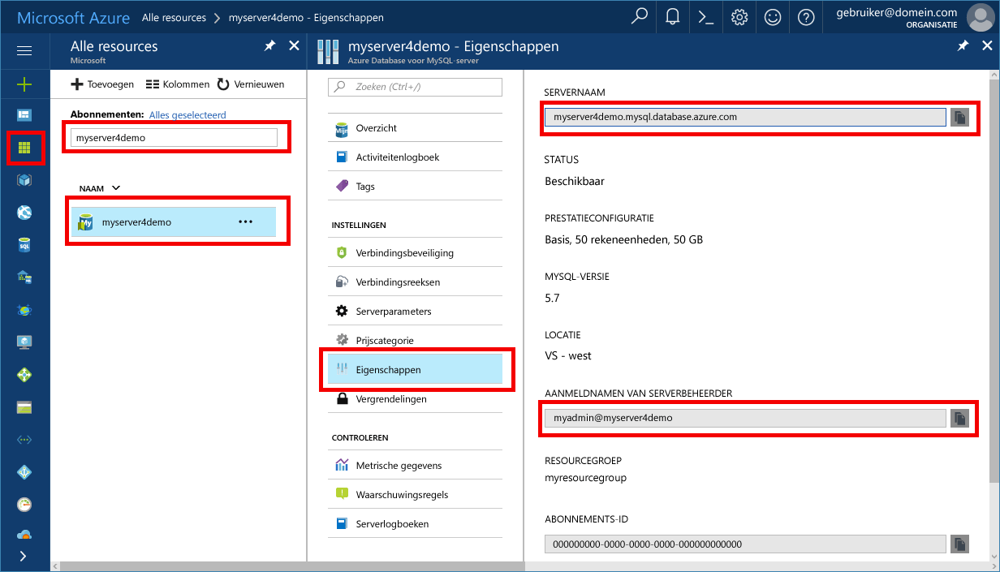

# <a name="migrate-your-mysql-database-by-using-import-and-export"></a>Uw MySQL-database migreren met behulp van importeren en exporteren
Dit artikel wordt uitgelegd twee algemene manieren om te importeren en exporteren van gegevens naar een Azure-Database voor de MySQL-server met behulp van MySQL-Workbench. 

## <a name="before-you-begin"></a>Voordat u begint
Stap in deze handleiding instructies, wilt u het volgende nodig:
- Een Azure-Database voor de MySQL-server door het volgende [maken van een Azure-Database voor de MySQL-server met Azure portal](quickstart-create-mysql-server-database-using-azure-portal.md).
- MySQL-Workbench [gedownload](https://dev.mysql.com/downloads/workbench/), of een ander MySQL-hulpprogramma om te importeren en exporteren.

## <a name="use-common-tools"></a>Algemene hulpprogramma's gebruiken
Algemene hulpprogramma's zoals MySQL Workbench, Toad of Navicat op afstand verbinding maken en importeren of exporteren van gegevens naar Azure-Database voor MySQL gebruiken. 

Gebruik deze hulpprogramma's op de clientcomputer met een internetverbinding verbinding maken met Azure-Database voor MySQL. Een met SSL versleutelde verbinding gebruiken voor aanbevolen procedures voor beveiliging, zoals beschreven in [configureren van SSL-verbindingen in Azure-Database voor MySQL](concepts-ssl-connection-security.md).

U hoeft niet te verplaatsen uw importeren en exporteren van bestanden op een willekeurige locatie speciale cloud wanneer migreren naar Azure Database voor MySQL. 

## <a name="create-a-database-on-the-azure-database-for-mysql-server"></a>Een database maken op de Azure-Database voor de MySQL-server
Een lege database maken op de Azure-Database voor de MySQL-server waarop u wilt migreren van de gegevens. Gebruik een hulpprogramma zoals MySQL Workbench, Toad of Navicat om de database te maken. De database kan dezelfde naam als de database die de gedumpte gegevens bevat, of u kunt een database maken met een andere naam.

Om verbinding te maken, zoekt u de verbindingsgegevens op de **eigenschappen** deelvenster in Azure voor MySQL-Database.



De verbindingsinformatie toevoegen aan MySQL-Workbench.


## <a name="determine-when-to-use-import-and-export-techniques-instead-of-a-dump-and-restore"></a>Bepalen wanneer te gebruiken importeren en exporteren van technieken in plaats van een dump en herstellen
MySQL-hulpprogramma's gebruiken om te importeren en exporteren van de databases naar Azure MySQL-Database in de volgende scenario's. In andere scenario's, kunt u profiteren van de [dump maken en terugzetten](concepts-migrate-dump-restore.md) in plaats daarvan benaderen. 

- Wanneer u een keuze maken uit een paar tabellen importeren uit een bestaande MySQL-database in Azure MySQL-Database, is het raadzaam te importeren en exporteren van techniek.  Op deze manier kunt u eventuele overbodige tabellen van de migratie naar bespaart tijd en bronnen weglaten. Gebruik bijvoorbeeld de `--include-tables` of `--exclude-tables` overschakelen met [mysqlpump](https://dev.mysql.com/doc/refman/5.7/en/mysqlpump.html#option_mysqlpump_include-tables) en de `--tables` overschakelen met [mysqldump](https://dev.mysql.com/doc/refman/5.7/en/mysqldump.html#option_mysqldump_tables).
- Wanneer u de database-objecten dan tabellen wilt verplaatsen, die expliciet te maken. Omvatten beperkingen (primaire sleutel, refererende sleutel, indexen), weergaven, functies, procedures, triggers en andere databaseobjecten die u wilt migreren.
- Uit externe gegevensbronnen dan een MySQL-database waarnaar u gegevens migreert, platte bestanden te maken en deze importeren met behulp van [mysqlimport](https://dev.mysql.com/doc/refman/5.7/en/mysqlimport.html).

Zorg ervoor dat alle tabellen in de database de InnoDB opslag-engine gebruiken wanneer u gegevens in Azure-Database voor MySQL laadt. Azure MySQL-Database ondersteunt alleen de InnoDB opslag-engine, zodat deze biedt geen ondersteuning voor alternatieve opslag-engines. Als uw tabellen engines alternatieve opslag is vereist, moet u deze voor de indeling van de engine InnoDB vóór de migratie naar Azure Database voor MySQL converteren. 

Bijvoorbeeld, als u een WordPress- of web-app die gebruikmaakt van de engine voor het MyISAM hebt, converteert u eerst de tabellen door te migreren van de gegevens in InnoDB tabellen. Herstellen naar Azure Database voor MySQL. Gebruik de component `ENGINE=INNODB` in te stellen de engine voor het maken van een tabel, draagt u de gegevens in de tabel compatibel vóór de migratie. 

   ```sql
   INSERT INTO innodb_table SELECT * FROM myisam_table ORDER BY primary_key_columns
   ```

## <a name="performance-recommendations-for-import-and-export"></a>Prestaties aanbevelingen voor het importeren en exporteren
-   Geclusterde indexen en primaire sleutels maken voordat gegevens worden geladen. Laden van gegevens in de primaire sleutel volgorde. 
-   Maken van secundaire indexen pas na gegevens vertraging is geladen. Alle secundaire indexen maken na het laden. 
-   Schakel de referentiële-sleutelbeperkingen voordat deze worden geladen. Refererende sleutel controles uit te schakelen biedt aanzienlijke prestatieverbeteringen. Schakel de beperkingen en controleer de gegevens na de belasting om ervoor te zorgen referentiële integriteit.
-   Gegevens parallel worden geladen. Vermijd te veel parallelle uitvoering die zou u een resource-limiet bereikt en resources bewaken met behulp van de metrische gegevens beschikbaar zijn in de Azure-portal. 
-   Gepartitioneerde tabellen, indien van toepassing gebruiken.

## <a name="import-and-export-by-using-mysql-workbench"></a>Importeren en exporteren met behulp van MySQL Workbench
Er zijn twee manieren om te exporteren en importeren van gegevens in de MySQL-Workbench. Elk fungeert een ander doel. 

### <a name="table-data-export-and-import-wizards-from-the-object-browsers-context-menu"></a>Gegevens in een tabel exporteren en importeren van wizards in het contextmenu van de object-browser


De wizards voor tabelgegevens ondersteuning voor importeren en exporteren van bewerkingen met behulp van CSV en JSON-bestanden. Ze omvatten diverse configuratieopties, zoals scheidingstekens, kolomselectie en codering selecteren. U kunt elke wizard lokaal of extern verbonden MySQL-servers uitvoeren. De importactie bevat een tabel-, kolom- en toewijzing van het type. 

U kunt deze wizards in het contextmenu van de object-browser openen met de rechtermuisknop op een tabel. Kies een **Wizard tabel gegevens exporteren** of **Wizard tabel importeren**. 

#### <a name="table-data-export-wizard"></a>Wizard tabel gegevens exporteren
Het volgende voorbeeld wordt de tabel geëxporteerd naar een CSV-bestand: 
1. Met de rechtermuisknop op de tabel van de database moet worden geëxporteerd. 
2. Selecteer **Wizard gegevens exporteren tabel**. Selecteer de kolommen worden geëxporteerd, rij offset (indien aanwezig) en tellen (indien aanwezig). 
3. Op de **Selecteer gegevens voor het exporteren van** pagina, klikt u op **volgende**. Selecteer het bestandspad, CSV of JSON-bestandstype. Ook de regelscheiding methode van insluitende tekenreeksen en veldscheidingsteken selecteren. 
4. Op de **Selecteer uitvoer bestandslocatie** pagina, klikt u op **volgende**. 
5. Op de **gegevens exporteren** pagina, klikt u op **volgende**.

#### <a name="table-data-import-wizard"></a>Wizard tabel importeren
Het volgende voorbeeld wordt de tabel geïmporteerd uit een CSV-bestand:
1. Met de rechtermuisknop op de tabel van de database moet worden geïmporteerd. 
2. Blader naar en selecteer het CSV-bestand worden geïmporteerd en klik vervolgens op **volgende**. 
3. Selecteer de doeltabel (nieuw of bestaand), en selecteer of wis de **Truncate tabel voor de import** selectievakje. Klik op **Volgende**.
4. Selecteer coderen en de kolommen moeten worden geïmporteerd en klik vervolgens op **volgende**. 
5. Op de **gegevens importeren** pagina, klikt u op **volgende**. De gegevens worden dienovereenkomstig geïmporteerd in de wizard.

### <a name="sql-data-export-and-import-wizards-from-the-navigator-pane"></a>SQL-gegevens exporteren en importeren van wizards in het deelvenster Navigator
Gebruik een wizard SQL gegenereerd op basis van MySQL Workbench of gegenereerd op basis van de opdracht mysqldump importeren of te exporteren. Toegang tot deze wizards van de **Navigator** deelvenster of door te selecteren **Server** vanuit het hoofdmenu. Selecteer vervolgens **gegevens exporteren** of **gegevensimport**. 

#### <a name="data-export"></a>Gegevens exporteren


U kunt de **gegevens exporteren** tabblad om uw MySQL-gegevens te exporteren. 
1. Selecteer elk schema dat u wilt exporteren, eventueel Kies specifieke schema objecten/tabellen uit elke schema en de export te genereren. Configuratie-opties zijn exporteren naar een zelfstandige SQL-bestand of projectmap, dump opgeslagen routines en gebeurtenissen of tabelgegevens overslaan. 
 
   In plaats daarvan gebruiken **exporteren resultaatset** exporteren van een specifieke resultaatset in de SQL-editor naar een andere indeling, zoals CSV, JSON, HTML en XML. 
3. Selecteer de databaseobjecten voor exporteren en de verwante opties configureren.
4. Klik op **vernieuwen** laden van de huidige objecten.
5. Open desgewenst de **geavanceerde opties** tabblad om de exportbewerking te verfijnen. Bijvoorbeeld toevoegen tabel vergrendelingen, vervangen voor gebruik in plaats van insert-instructies en prijsopgave-id's met backtick tekens.
6. Klik op **Start exporteren** om te beginnen met het exportproces.


#### <a name="data-import"></a>Gegevens importeren


U kunt de **gegevens importeren** tab om te importeren of terugzetten geëxporteerde gegevens van de exportbewerking gegevens of van de opdracht mysqldump. 
1. Kies de projectmap of zelfstandige SQL-bestand, kiest u het schema dat u wilt importeren in of kies **nieuw** om een nieuw schema te definiëren. 
2. Klik op **Start importeren** om te beginnen met het importproces.

## <a name="next-steps"></a>Volgende stappen
Als een andere migratie benadering lezen [migreren uw MySQL-database met dump en MySQL in Azure-Database herstellen](concepts-migrate-dump-restore.md). 
